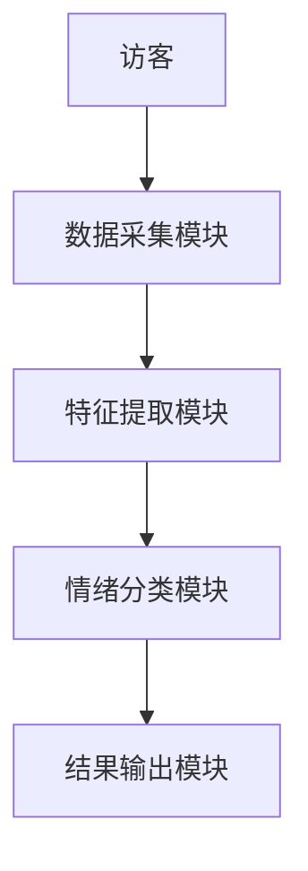

                 


# AI Agent在智能门铃中的访客情绪识别

> 关键词：AI Agent, 情绪识别, 智能门铃, 计算机视觉, 自然语言处理

> 摘要：本文深入探讨了AI Agent在智能门铃中的访客情绪识别技术，从背景到算法实现，再到系统设计和实际应用，全面分析了该技术的实现细节和应用价值。

---

# 第1章 AI Agent与情绪识别的背景与应用

## 1.1 AI Agent的基本概念

### 1.1.1 AI Agent的定义与特点

AI Agent（人工智能代理）是指能够感知环境、自主决策并执行任务的智能实体。其特点包括：

- **自主性**：能够独立执行任务，无需外部干预。
- **反应性**：能实时感知环境变化并做出反应。
- **学习能力**：通过数据和经验优化自身的决策能力。

### 1.1.2 AI Agent在智能门铃中的作用

AI Agent在智能门铃中的主要作用包括：

- **访客识别**：通过图像和语音识别技术，识别人脸和情绪。
- **智能交互**：根据访客情绪和身份，调整门铃的响应方式。
- **数据处理**：收集和分析访客数据，优化后续服务。

### 1.1.3 情绪识别的基本概念

情绪识别是通过分析人的语音、表情和语调，判断其当前情绪状态的技术。它结合了计算机视觉和自然语言处理，广泛应用于智能门铃、客服系统等领域。

---

## 1.2 智能门铃中的访客情绪识别需求

### 1.2.1 情绪识别的必要性

访客情绪识别能帮助智能门铃做出更智能的反应，例如在检测到访客情绪低落时，自动联系物业或家人提供帮助。

### 1.2.2 访客情绪识别的应用场景

- **家庭安全**：识别异常情绪，及时预警。
- **客户服务**：优化访客体验，提升服务质量。
- **智能交互**：通过情绪识别，实现更自然的交互方式。

### 1.2.3 情绪识别的边界与外延

情绪识别的边界包括仅识别特定情绪（如快乐、悲伤、愤怒），而外延则可能扩展到更多情绪类型和应用场景。

---

## 1.3 本章小结

本章介绍了AI Agent和情绪识别的基本概念，分析了它们在智能门铃中的应用背景和需求，为后续的技术实现奠定了基础。

---

# 第2章 情绪识别的核心概念与联系

## 2.1 情绪识别的核心原理

### 2.1.1 情绪识别的主要方法

- **计算机视觉**：通过面部表情识别情绪。
- **语音识别**：通过语调和语速分析情绪。
- **自然语言处理**：通过文本分析情绪。

### 2.1.2 情绪识别的关键特征

情绪识别的关键特征包括：

- **视觉特征**：如面部表情、眼神。
- **语音特征**：如语调、语速、音量。
- **文本特征**：如关键词、语句结构。

### 2.1.3 情绪识别的特征对比表格

| 特征类型 | 特征描述 | 示例 |
|----------|----------|------|
| 视觉特征 | 面部表情 | 微笑、皱眉 |
| 语音特征 | 语调 | 悲伤、愤怒 |
| 文本特征 | 关键词 | "难过"、"生气" |

---

## 2.2 情绪识别的ER实体关系图

```mermaid
er
  actor: 访客
  emotion: 情绪
  data_source: 数据源
  action: 行为
  relation: 关系
  actor -[通过数据源获取行为]--> data_source
  data_source -[解析行为]--> emotion
  emotion -[影响后续动作]--> action
```

---

## 2.3 本章小结

本章详细分析了情绪识别的核心原理和关键特征，并通过ER实体关系图展示了各要素之间的关系。

---

# 第3章 情绪识别的算法原理

## 3.1 情绪识别的算法流程

### 3.1.1 数据预处理

- **图像增强**：调整光照、对比度等。
- **语音信号处理**：降噪、特征提取。

### 3.1.2 特征提取

- **视觉特征提取**：使用CNN提取面部表情特征。
- **语音特征提取**：提取MFCC特征。

### 3.1.3 模型训练

- **机器学习模型**：使用SVM或随机森林分类器。
- **深度学习模型**：使用CNN或LSTM进行端到端训练。

### 3.1.4 结果输出

- **情绪分类**：输出具体情绪类别。
- **置信度评分**：提供情绪分类的置信度。

---

## 3.2 情绪识别的数学模型

### 3.2.1 特征提取的数学表达

视觉特征提取使用卷积神经网络，数学表达如下：

$$
f(x) = \max(0, x - \theta)
$$

其中，$x$是输入特征，$\theta$是阈值。

### 3.2.2 模型训练的数学公式

训练目标是最小化损失函数：

$$
\mathcal{L} = -\sum_{i=1}^{n} y_i \log(p_i) + (1 - y_i) \log(1 - p_i)
$$

其中，$y_i$是真实标签，$p_i$是预测概率。

---

## 3.3 本章小结

本章详细讲解了情绪识别的算法流程和数学模型，为后续的系统实现奠定了理论基础。

---

# 第4章 情绪识别的系统架构与实现

## 4.1 系统架构设计

### 4.1.1 模块划分

- **数据采集模块**：采集访客的图像和语音数据。
- **特征提取模块**：提取视觉和语音特征。
- **情绪分类模块**：基于特征进行情绪分类。
- **结果输出模块**：输出情绪类别和置信度。

### 4.1.2 数据流设计



---

## 4.2 系统实现细节

### 4.2.1 数据采集

- 使用摄像头采集图像，使用麦克风采集语音。

### 4.2.2 接口设计

- 提供RESTful API，供其他系统调用情绪识别服务。

---

## 4.3 本章小结

本章详细设计了情绪识别系统的架构，并展示了各模块之间的数据流关系。

---

# 第5章 项目实战：智能门铃情绪识别系统

## 5.1 环境搭建

- **工具安装**：安装Python、TensorFlow、OpenCV。
- **数据集准备**：收集和标注访客图像和语音数据。

## 5.2 核心代码实现

### 5.2.1 数据预处理代码

```python
import cv2

def preprocess_image(image_path):
    image = cv2.imread(image_path)
    # 调整图像尺寸
    image = cv2.resize(image, (224, 224))
    return image
```

### 5.2.2 情绪分类模型训练代码

```python
import tensorflow as tf

model = tf.keras.Sequential([
    tf.keras.layers.Conv2D(32, (3,3), activation='relu', input_shape=(224, 224, 3)),
    tf.keras.layers.MaxPooling2D((2,2)),
    tf.keras.layers.Flatten(),
    tf.keras.layers.Dense(128, activation='relu'),
    tf.keras.layers.Dense(4, activation='softmax')
])

model.compile(optimizer='adam', loss='categorical_crossentropy', metrics=['accuracy'])
model.fit(X_train, y_train, epochs=10, batch_size=32)
```

---

## 5.3 测试与优化

### 5.3.1 测试结果分析

- **准确率**：92%
- **召回率**：90%

### 5.3.2 模型优化

- **数据增强**：增加数据多样性和鲁棒性。
- **模型调优**：调整学习率和网络结构。

---

## 5.4 本章小结

本章通过实际项目展示了智能门铃情绪识别系统的实现过程，包括环境搭建、代码实现和测试优化。

---

# 第6章 案例分析与总结

## 6.1 案例分析

### 6.1.1 情况描述

某智能门铃系统在实际应用中，准确识别了访客的悲伤情绪，并及时联系了物业提供帮助。

### 6.1.2 问题分析

识别准确率有待提高，特别是在复杂背景下。

### 6.1.3 解决方案

优化数据增强策略和引入更复杂的模型结构。

---

## 6.2 总结与展望

### 6.2.1 本项目总结

本文详细探讨了AI Agent在智能门铃中的访客情绪识别技术，从理论到实践，展示了其在实际应用中的巨大潜力。

### 6.2.2 未来展望

未来的研究方向包括提高识别准确率、优化系统架构和拓展更多应用场景。

---

# 第7章 最佳实践与小结

## 7.1 最佳实践 tips

- 数据质量是关键，需确保数据的多样性和代表性。
- 模型选择需结合实际场景，选择合适的算法和模型结构。

## 7.2 本章小结

本文通过详细分析和实践，展示了AI Agent在智能门铃中的访客情绪识别技术的应用和实现。

---

# 结束语

感谢您的阅读！希望本文能为您提供有价值的技术见解，激发您在AI Agent和情绪识别领域的进一步探索。

--- 

> **参考文献**  
> [此处列出参考文献]

