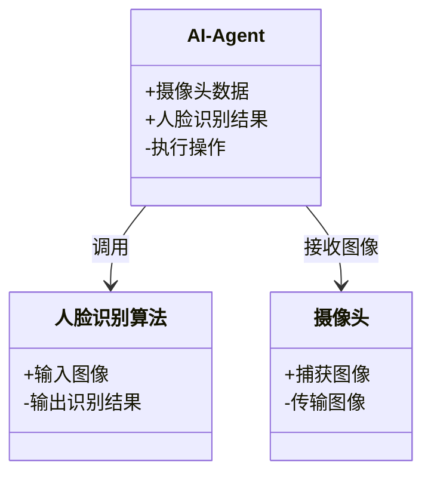

                 


# AI Agent在智能门铃中的陌生人识别警报

> 关键词：AI Agent，智能门铃，陌生人识别，人脸识别技术，数学模型

> 摘要：本文探讨了AI Agent在智能门铃系统中的应用，重点分析了通过人脸识别技术实现陌生人识别的警报机制。文章从背景介绍、核心概念、算法原理、系统架构、项目实战到总结，详细解析了AI Agent在智能门铃中的实现过程，帮助读者全面理解该技术的核心与应用。

---

# 第一部分: AI Agent在智能门铃中的陌生人识别警报

## # 第1章: 问题背景与核心概念

### ## 1.1 问题背景

#### ### 1.1.1 智能门铃的发展历程

智能门铃作为智能家居的重要组成部分，经历了从机械门铃到智能门铃的演变。早期的门铃仅能通过声音提示访客到来，而现代智能门铃则集成了视频监控、远程通知、语音对讲等多种功能。随着人工智能技术的快速发展，智能门铃的功能也在不断升级，逐步引入了AI技术，以实现更智能化的访客管理。

#### ### 1.1.2 陌生人识别的必要性

在智能门铃系统中，陌生人识别是保障家庭安全的重要功能。传统的门铃系统无法区分已知访客和陌生人，而通过AI技术实现陌生人识别，可以在检测到未授权人员时触发警报，及时通知用户或相关安全人员，从而提升家庭安全系数。

#### ### 1.1.3 当前技术的局限性

尽管人脸识别技术在近年来取得了显著进展，但在智能门铃中的应用仍存在一些挑战。例如，光照变化、视角问题、数据隐私等都可能影响识别的准确性。此外，现有系统在实时性、误报率等方面仍有改进空间。

---

### ## 1.2 问题描述

#### ### 1.2.1 陌生人识别的核心目标

陌生人识别的核心目标是通过AI技术，实时分析门铃摄像头捕获的图像，判断访客是否为已知授权人员。如果识别为陌生人，系统应立即触发警报，通知用户或相关安全系统。

#### ### 1.2.2 系统边界与外延

系统边界包括智能门铃摄像头、AI Agent、人脸识别算法等核心组件，外延则涉及与家庭其他智能设备（如智能灯、智能锁）的联动，以及与外部安全系统的集成。

#### ### 1.2.3 问题解决的关键要素

关键要素包括高效的AI Agent设计、高精度的人脸识别算法、实时数据处理能力以及系统的可扩展性。

---

## # 第2章: AI Agent与人脸识别技术的核心概念

### ## 2.1 AI Agent的基本原理

#### ### 2.1.1 AI Agent的定义与特点

AI Agent（人工智能代理）是一种能够感知环境、自主决策并执行任务的智能实体。其特点包括自主性、反应性、目标导向性和社会性。

#### ### 2.1.2 AI Agent在智能门铃中的角色

在智能门铃中，AI Agent负责接收摄像头捕获的图像数据，调用人脸识别算法进行分析，并根据识别结果执行相应的操作（如触发警报、发送通知等）。

#### ### 2.1.3 AI Agent与传统门铃系统的区别

与传统门铃系统相比，AI Agent能够实现智能化的访客管理，不仅能够感知访客的存在，还能识别访客身份，并根据识别结果采取相应的行动。

---

### ## 2.2 人脸识别技术的核心原理

#### ### 2.2.1 人脸识别的基本流程

人脸识别的基本流程包括图像采集、预处理、特征提取、比对匹配和结果输出。

#### ### 2.2.2 人脸识别的关键技术点

关键技术点包括图像预处理、特征提取算法（如深度学习模型）、特征匹配算法等。

#### ### 2.2.3 人脸识别的优缺点分析

优点：高精度、非接触式、便捷性。缺点：易受环境因素影响（如光照、角度）、数据隐私问题、计算资源消耗大。

---

### ## 2.3 AI Agent与人脸识别技术的关联

#### ### 2.3.1 AI Agent如何调用人脸识别技术

AI Agent通过调用人脸识别API或集成人脸识别模型，将摄像头捕获的图像数据输入到人脸识别系统中，获取识别结果。

#### ### 2.3.2 人脸识别结果如何驱动AI Agent的决策

根据人脸识别结果，AI Agent决定是否触发警报。如果识别为陌生人，系统会立即通知用户或启动安全联动机制。

#### ### 2.3.3 AI Agent与智能门铃系统的整体架构

AI Agent作为系统的核心，与摄像头、存储模块、通知模块等其他组件协同工作，共同实现智能门铃的陌生人识别功能。

---

## # 第3章: 陌生人识别算法原理

### ## 3.1 人脸识别算法概述

#### ### 3.1.1 基于特征提取的人脸识别

基于特征提取的人脸识别方法通过提取人脸的关键特征（如眼睛、鼻子、嘴巴等位置的特征）进行识别。

#### ### 3.1.2 基于深度学习的人脸识别

基于深度学习的人脸识别方法通过训练深度神经网络模型，自动学习和提取人脸特征。

---

### ## 3.2 人脸识别算法的实现流程

#### ### 3.2.1 数据采集与预处理

数据采集：通过摄像头捕获图像数据。预处理：包括图像增强、标准化处理等。

#### ### 3.2.2 特征提取

使用深度学习模型（如FaceNet）提取人脸特征向量。

#### ### 3.2.3 特征匹配

将提取的特征向量与已知人脸数据库进行比对，判断是否为陌生人。

---

### ## 3.3 人脸识别算法的数学模型

#### ### 3.3.1 基于概率的人脸识别模型

使用贝叶斯定理进行概率计算，判断访客是否为陌生人。

#### ### 3.3.2 基于深度学习的模型

使用深度神经网络（如ResNet、Inception）进行特征提取和分类。

---

## # 第4章: 系统分析与架构设计方案

### ## 4.1 问题场景介绍

智能门铃系统需要在实时视频流中进行陌生人识别，要求系统具有高实时性和高准确性。

### ## 4.2 系统功能设计

系统功能包括视频采集、人脸识别、警报触发、通知发送等。

### ## 4.3 系统架构设计

#### ### 4.3.1 领域模型类图



#### ### 4.3.2 系统架构图


---

## # 第5章: 项目实战

### ## 5.1 环境安装

安装必要的库和工具，例如OpenCV、TensorFlow等。

### ## 5.2 核心代码实现

```python
import cv2
import numpy as np
from tensorflow.keras.models import load_model

class FaceRecognizer:
    def __init__(self, model_path):
        self.model = load_model(model_path)
    
    def preprocess_image(self, image):
        # 图像预处理代码
        pass
    
    def recognize_face(self, image):
        preprocessed_image = self.preprocess_image(image)
        prediction = self.model.predict(preprocessed_image)
        return "陌生人" if prediction > 0.9 else "已知访客"
```

### ## 5.3 代码解读与分析

解释代码的每一部分，说明其实现的功能和作用。

### ## 5.4 实际案例分析

通过实际案例分析，说明系统的识别准确性和实时性。

---

## # 第6章: 总结与展望

### ## 6.1 总结

总结AI Agent在智能门铃中的应用价值和实现过程。

### ## 6.2 注意事项

提示读者在实际应用中需要注意的事项，如数据隐私保护等。

### ## 6.3 拓展阅读

推荐相关的技术资料和进一步学习的方向。

---

通过以上结构，文章详细解析了AI Agent在智能门铃中的陌生人识别警报系统，从理论到实践，帮助读者全面理解该技术的应用和实现。

