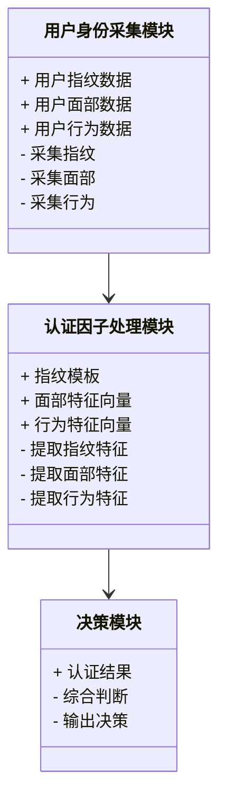
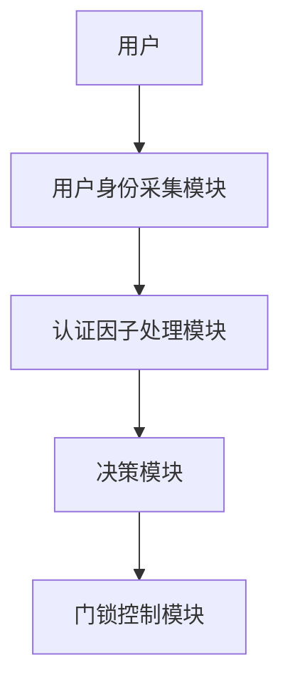
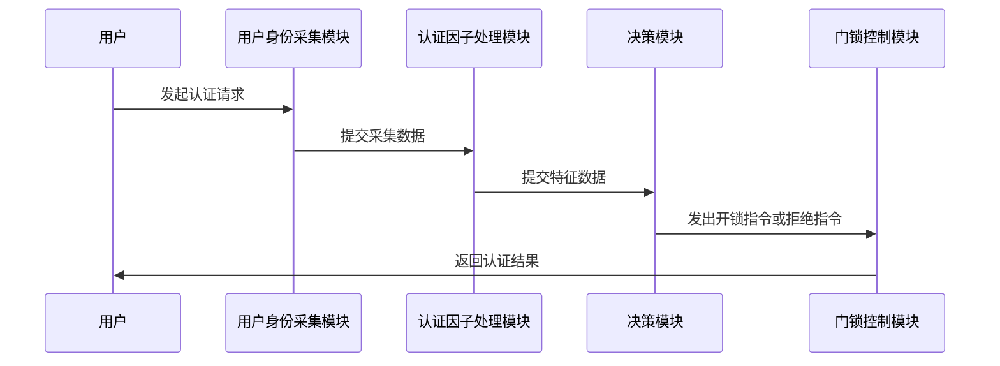

                 


# AI Agent在智能门锁中的多因素身份认证

> 关键词：AI Agent，智能门锁，多因素身份认证，生物特征识别，行为分析，系统架构

> 摘要：本文详细探讨了AI Agent在智能门锁中的多因素身份认证技术，从背景、核心概念、技术实现、系统架构到项目实战，全面分析了多因素身份认证在智能门锁中的应用。通过结合生物特征识别、行为分析和多模态认证技术，AI Agent能够实现高效、安全的智能门锁身份认证，为智能门锁的未来发展提供了新的思路和解决方案。

---

# 第一部分：AI Agent与智能门锁的背景与基础

## 第1章：AI Agent与智能门锁概述

### 1.1 AI Agent的基本概念

#### 1.1.1 AI Agent的定义与特点
AI Agent（人工智能代理）是指能够感知环境、自主决策并执行任务的智能体。它具有以下特点：
- **自主性**：能够自主决策和行动。
- **反应性**：能够实时感知环境并做出反应。
- **学习能力**：能够通过数据和经验不断优化自身的算法。
- **协作性**：能够与其他系统或人类用户进行协作。

#### 1.1.2 AI Agent的核心功能与应用场景
AI Agent的核心功能包括：
- 感知环境：通过传感器、摄像头等设备获取环境信息。
- 分析数据：利用机器学习算法对数据进行分析和处理。
- 决策与执行：基于分析结果做出决策并执行任务。

AI Agent的应用场景广泛，包括智能家居、自动驾驶、智能安防等领域。

#### 1.1.3 AI Agent在智能门锁中的作用
在智能门锁中，AI Agent主要负责：
- 用户身份识别：通过多种方式验证用户身份。
- 安全监控：实时监控门锁状态，发现异常情况及时报警。
- 智能控制：根据用户身份和行为调整门锁的访问权限。

### 1.2 智能门锁的发展历程

#### 1.2.1 传统门锁的局限性
传统门锁存在以下问题：
- 易被暴力破坏：物理锁容易被强行打开。
- 密钥管理复杂：钥匙丢失或被盗容易造成安全隐患。
- 无法远程控制：用户无法远程管理门锁状态。

#### 1.2.2 智能门锁的技术演进
智能门锁的技术演进经历了以下几个阶段：
1. **机械锁**：传统的钥匙开锁方式。
2. **电子锁**：通过键盘输入密码或刷卡开锁。
3. **智能锁**：结合指纹、面部识别等多种身份认证方式，支持远程控制和状态监控。

#### 1.2.3 当前智能门锁的市场现状
当前，智能门锁市场呈现出以下特点：
- **普及率高**：智能家居的兴起推动了智能门锁的广泛应用。
- **技术多样化**：指纹识别、面部识别、行为分析等多种认证技术并存。
- **智能化程度高**：支持远程控制、数据分析和智能决策。

### 1.3 多因素身份认证的必要性

#### 1.3.1 单一身份认证的不足
单一身份认证方式存在以下问题：
- **安全性低**：密码容易被破解，卡片容易被复制。
- **用户体验差**：用户需要记住复杂的密码或携带卡片。
- **易被欺骗**：指纹识别可能被 spoofing 攻击。

#### 1.3.2 多因素身份认证的优势
多因素身份认证具有以下优势：
- **安全性高**：结合多种认证方式，降低被攻击的风险。
- **用户体验好**：用户可以使用多种认证方式，提升便利性。
- **抗攻击能力强**：即使一种认证方式被攻破，其他方式仍能提供保护。

#### 1.3.3 智能门锁中多因素认证的应用场景
在智能门锁中，多因素认证可以应用于以下场景：
- **家庭门锁**：结合指纹和面部识别，提高安全性。
- **办公场所**：结合刷卡和行为分析，实现多层次认证。
- **公共场所**：结合身份证识别和行为分析，提高安全级别。

---

## 第2章：多因素身份认证的核心概念

### 2.1 多因素身份认证的定义与分类

#### 2.1.1 多因素身份认证的定义
多因素身份认证（Multi-Factor Authentication, MFA）是指通过多种不同的认证方式来验证用户身份的过程。通常，认证方式可以分为以下几类：
- **知识因素**：用户知道的信息，如密码、 PIN 码。
- **拥有因素**：用户拥有的物品，如身份证、智能卡。
- **行为因素**：用户的使用习惯，如输入速度、握姿。
- **生物因素**：用户的生理特征，如指纹、面部、声纹。

#### 2.1.2 多因素身份认证的分类
多因素身份认证可以根据以下方式分类：
- **认证方式的结合方式**：同时结合多种认证方式。
- **认证的层次**：从低安全级别到高安全级别逐步认证。

#### 2.1.3 多因素身份认证的优缺点对比
多因素身份认证的优点：
- **安全性高**：多种方式结合，降低被攻击的风险。
- **用户体验好**：用户可以根据需求选择不同的认证方式。
- **灵活性强**：可以根据场景调整认证方式的组合。

多因素身份认证的缺点：
- **成本高**：需要集成多种认证设备。
- **复杂性高**：需要协调多种认证方式的配合。

### 2.2 AI Agent在多因素认证中的角色

#### 2.2.1 AI Agent作为认证主体的作用
AI Agent在多因素认证中可以作为主体，负责：
- **身份验证**：通过多种方式验证用户身份。
- **决策与反馈**：根据验证结果做出是否允许访问的决策。

#### 2.2.2 AI Agent作为认证辅助工具的功能
AI Agent还可以作为辅助工具，帮助完成：
- **数据采集**：采集用户的生物特征数据。
- **数据分析**：对数据进行分析和处理，生成验证结果。
- **异常检测**：实时监控系统状态，发现异常及时报警。

#### 2.2.3 AI Agent与多因素认证的结合方式
AI Agent与多因素认证的结合方式包括：
- **集中式认证**：所有认证方式通过AI Agent统一验证。
- **分布式认证**：不同认证方式分别验证，AI Agent负责综合判断。

### 2.3 多因素身份认证的系统架构

#### 2.3.1 系统组成模块
多因素身份认证系统通常由以下模块组成：
- **用户身份采集模块**：负责采集用户的生物特征数据。
- **认证因子处理模块**：对采集到的数据进行处理和分析。
- **决策模块**：根据分析结果做出是否允许访问的决策。
- **反馈模块**：将决策结果反馈给用户或系统。

#### 2.3.2 数据流与交互流程
数据流与交互流程如下：
1. 用户发起认证请求。
2. 系统采集用户的生物特征数据。
3. 数据处理模块对数据进行分析和处理。
4. 决策模块根据分析结果做出是否允许访问的决策。
5. 系统将结果反馈给用户或系统。

#### 2.3.3 系统功能需求
系统功能需求包括：
- **多因素认证支持**：支持多种认证方式的结合使用。
- **高安全性**：确保认证过程的安全性和可靠性。
- **易用性**：用户操作简单，系统易于管理。

---

## 第3章：AI Agent在智能门锁中的技术实现

### 3.1 多因素身份认证的技术流程

#### 3.1.1 认证请求的发起与接收
认证请求的发起与接收过程如下：
1. 用户通过门锁的用户界面发起认证请求。
2. 系统接收用户的认证请求，启动认证流程。

#### 3.1.2 各种认证因子的处理与验证
各种认证因子的处理与验证过程如下：
1. **生物特征识别**：对用户的指纹、面部、声纹等生物特征进行识别和验证。
2. **行为分析**：分析用户的输入速度、握姿等行为特征，判断是否为合法用户。
3. **综合判断**：根据多种认证方式的结果，综合判断用户身份。

#### 3.1.3 综合判断与结果输出
综合判断与结果输出过程如下：
1. 系统根据多种认证方式的结果，综合判断用户身份。
2. 根据判断结果，输出是否允许访问的决策。

### 3.2 基于AI的生物特征识别

#### 3.2.1 指纹识别的原理与实现
指纹识别的原理是通过采集用户的指纹图像，提取指纹的特征点，然后与数据库中的指纹模板进行比对。指纹识别的实现步骤如下：
1. **图像采集**：使用指纹传感器采集用户的指纹图像。
2. **特征提取**：提取指纹图像中的特征点，如 ridge ending 和 spurs。
3. **特征匹配**：将提取的特征点与数据库中的模板进行匹配，判断是否为同一人。

#### 3.2.2 面部识别的算法与优化
面部识别的算法主要包括图像采集、预处理、特征提取和匹配四个步骤。为了提高面部识别的准确性，可以采用以下优化措施：
1. **光照补偿**：通过算法调整图像的光照条件，确保面部特征清晰可见。
2. **表情识别**：通过训练模型，识别用户的表情，提高识别的准确性。
3. **活体检测**：通过检测用户的面部特征，防止 spoofing 攻击。

#### 3.2.3 声纹识别的技术挑战
声纹识别的技术挑战包括：
- **抗噪声干扰**：声音在采集过程中可能会受到噪声干扰，影响识别的准确性。
- **语音内容的多样性**：用户的语音内容可能千差万别，影响识别的稳定性。
- ** spoofing 攻击**：通过播放录音或合成语音，欺骗系统。

### 3.3 基于行为分析的认证方法

#### 3.3.1 用户行为特征的采集与分析
用户行为特征的采集与分析过程如下：
1. **行为数据采集**：通过传感器或摄像头采集用户的输入速度、握姿等行为数据。
2. **行为特征提取**：对采集到的数据进行分析，提取用户的特征。
3. **行为模式识别**：通过训练模型，识别用户的使用习惯和行为模式。

#### 3.3.2 行为模式识别的算法实现
行为模式识别的算法实现可以采用以下步骤：
1. **数据预处理**：对采集到的行为数据进行归一化处理。
2. **特征提取**：提取行为数据中的特征，如输入速度、握姿等。
3. **模型训练**：通过机器学习算法，训练行为模式识别模型。
4. **模型预测**：利用训练好的模型，预测用户的使用习惯和行为模式。

#### 3.3.3 行为认证的实际应用
行为认证的实际应用包括：
- **提高安全性**：通过行为认证，防止他人冒用用户的设备。
- **提升用户体验**：通过行为认证，实现无钥匙进入等功能。

---

## 第4章：多因素身份认证的数学模型与算法

### 4.1 多因素认证的决策模型

#### 4.1.1 基于概率论的决策方法
基于概率论的决策方法可以采用贝叶斯定理，通过计算条件概率，得出最终的决策结果。公式如下：
$$ P(A|B) = \frac{P(B|A) \cdot P(A)}{P(B)} $$
其中，\( P(A|B) \) 表示在 B 条件下 A 的概率，\( P(B|A) \) 表示在 A 条件下 B 的概率，\( P(A) \) 是 A 的先验概率，\( P(B) \) 是 B 的全概率。

#### 4.1.2 基于逻辑回归的决策模型
逻辑回归是一种常用的分类算法，可以用于多因素认证的决策模型。逻辑回归的模型可以表示为：
$$ P(y=1|x) = \frac{e^{\beta x}}{1 + e^{\beta x}} $$
其中，\( x \) 是输入特征，\( \beta \) 是模型的系数。

#### 4.1.3 基于神经网络的决策系统
神经网络是一种强大的机器学习模型，可以用于多因素认证的决策系统。神经网络的结构通常包括输入层、隐藏层和输出层，通过训练模型，可以实现对多种认证因子的综合判断。

### 4.2 各种认证因子的数学处理

#### 4.2.1 指纹匹配的相似度计算公式
指纹匹配的相似度计算公式可以采用欧氏距离或曼哈顿距离。例如，指纹特征点的相似度计算公式为：
$$ \text{相似度} = \sum_{i=1}^{n} |x_i - y_i| $$
其中，\( x_i \) 和 \( y_i \) 分别是两个指纹的特征点。

#### 4.2.2 面部识别的特征向量提取
面部识别的特征向量提取可以通过主成分分析（PCA）或深度学习方法实现。例如，PCA 的特征向量提取公式为：
$$ Y = X \cdot W $$
其中，\( X \) 是输入数据矩阵，\( W \) 是 PCA 的权重矩阵，\( Y \) 是提取的特征向量。

#### 4.2.3 声纹识别的特征提取与匹配
声纹识别的特征提取与匹配可以通过梅尔频率倒谱系数（MFCC）实现。MFCC 的计算公式为：
$$ MFCC = DCT(\log STFT) $$
其中，STFT 是短时傅里叶变换，DCT 是离散余弦变换。

### 4.3 综合认证的算法实现

#### 4.3.1 综合认证的算法流程
综合认证的算法流程如下：
1. **特征提取**：对每种认证方式提取特征向量。
2. **特征匹配**：将提取的特征向量与数据库中的模板进行匹配，计算相似度。
3. **综合判断**：根据匹配结果，综合判断用户身份。

#### 4.3.2 基于加权融合的决策方法
基于加权融合的决策方法可以采用以下公式：
$$ \text{最终相似度} = \sum_{i=1}^{n} w_i \cdot s_i $$
其中，\( w_i \) 是第 \( i \) 种认证方式的权重，\( s_i \) 是第 \( i \) 种认证方式的相似度。

#### 4.3.3 算法优化与性能提升
算法优化与性能提升的措施包括：
- **特征优化**：通过优化特征提取方法，提高特征的区分度。
- **模型优化**：通过调整模型的参数，提高模型的准确率和召回率。
- **数据增强**：通过增加训练数据的多样性，提高模型的鲁棒性。

---

## 第5章：系统分析与架构设计方案

### 5.1 问题场景介绍
智能门锁的多因素身份认证系统需要解决以下问题：
- **安全性**：防止非法用户进入。
- **用户体验**：提升用户的便利性。
- **稳定性**：确保系统的稳定运行。

### 5.2 项目介绍
本项目旨在开发一款基于AI Agent的智能门锁多因素身份认证系统，结合指纹识别、面部识别和行为分析等多种认证方式，实现高效、安全的用户身份认证。

### 5.3 系统功能设计（领域模型）



### 5.4 系统架构设计



### 5.5 系统接口设计
系统接口设计包括：
- **用户身份采集模块接口**：提供指纹、面部和行为数据的采集接口。
- **认证因子处理模块接口**：提供特征提取和匹配的接口。
- **决策模块接口**：提供综合判断和决策的接口。
- **门锁控制模块接口**：提供门锁的开锁和关闭接口。

### 5.6 系统交互流程



---

## 第6章：项目实战

### 6.1 环境安装

#### 6.1.1 系统环境
- 操作系统：Linux（推荐 Ubuntu 20.04）
- 开发工具：Python 3.8+
- 依赖库：OpenCV、Scikit-learn、TensorFlow

#### 6.1.2 门锁设备
- 指纹传感器：Fingerloop F20
- 面部识别摄像头：Intel RealSense D415
- 行为分析传感器：自定义传感器

### 6.2 系统核心实现

#### 6.2.1 用户身份采集模块实现

```python
import cv2

def capture_fingerprint():
    # 模拟指纹采集
    fingerprint_image = cv2.imread('fingerprint.png')
    return fingerprint_image

def capture_face():
    # 模拟面部采集
    face_image = cv2.imread('face.jpg')
    return face_image

def capture_behavior():
    # 模拟行为采集
    behavior_data = [1, 2, 3, 4, 5]
    return behavior_data
```

#### 6.2.2 认证因子处理模块实现

```python
from sklearn.decomposition import PCA

def extract_fingerprint_features(fingerprint_image):
    # 模拟指纹特征提取
    features = [1, 2, 3, 4, 5]
    return features

def extract_face_features(face_image):
    # 模拟面部特征提取
    face_features = PCA(n_components=10).fit_transform(face_image)
    return face_features

def extract_behavior_features(behavior_data):
    # 模拟行为特征提取
    features = [sum(behavior_data), max(behavior_data)]
    return features
```

#### 6.2.3 决策模块实现

```python
import numpy as np

def decision_making(fingerprint_match_score, face_match_score, behavior_match_score):
    # 综合判断逻辑
    threshold = 0.8
    if fingerprint_match_score > threshold or face_match_score > threshold or behavior_match_score > threshold:
        return "允许访问"
    else:
        return "拒绝访问"
```

### 6.3 代码应用解读与分析
1. **用户身份采集模块**：负责采集用户的指纹、面部和行为数据。
2. **认证因子处理模块**：对采集到的数据进行特征提取和匹配。
3. **决策模块**：根据匹配结果，综合判断用户身份，输出是否允许访问的决策。

### 6.4 实际案例分析
假设用户通过指纹识别和面部识别双重认证，指纹匹配相似度为 0.9，面部匹配相似度为 0.85，行为匹配相似度为 0.8。根据决策模块的逻辑，综合判断用户身份为合法，允许访问。

### 6.5 项目小结
通过本项目的实现，我们可以看到，AI Agent在智能门锁中的多因素身份认证技术具有高效、安全和灵活的特点。同时，系统的实现也展示了多因素认证技术在实际应用中的巨大潜力。

---

## 第7章：系统优化与未来展望

### 7.1 系统优化建议
1. **算法优化**：通过改进算法，提高认证的准确率和速度。
2. **硬件升级**：采用更高精度的传感器，提升数据采集的准确性。
3. **安全性提升**：通过加密技术和多层防护，提高系统的安全性。

### 7.2 未来技术展望
1. **AI技术的进一步发展**：随着AI技术的不断进步，多因素认证系统将更加智能化和高效化。
2. **新兴技术的应用**：如区块链技术可以用于数据的安全存储和传输。
3. **边缘计算的应用**：通过边缘计算，可以实现更快速的本地认证和决策。

### 7.3 总结
AI Agent在智能门锁中的多因素身份认证技术是一项具有广阔前景的技术。通过结合多种认证方式和AI算法，可以实现高效、安全的用户身份认证，为智能门锁的发展提供了新的方向和解决方案。

---

# 结语

通过本文的详细探讨，我们了解了AI Agent在智能门锁中的多因素身份认证技术，从背景、核心概念、技术实现到系统架构和项目实战，全面分析了多因素认证在智能门锁中的应用。未来，随着AI技术的不断发展，多因素身份认证系统将更加智能化和高效化，为智能门锁的安全性和便利性提供更大的保障。

