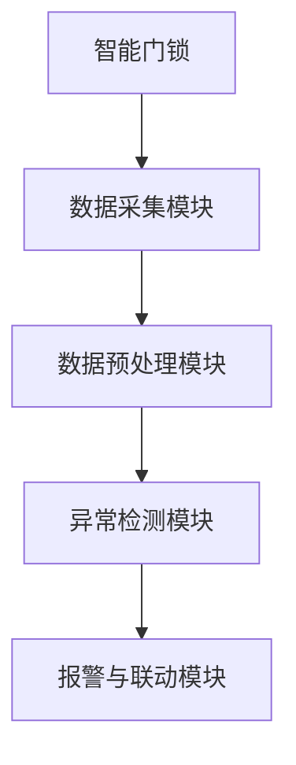
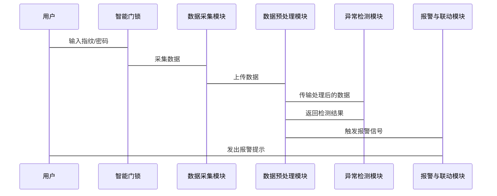

                 


好的，我明白您的需求。以下是我根据您的要求逐步构建的《AI Agent在智能门锁中的异常使用检测》的技术博客文章内容：

---

# AI Agent在智能门锁中的异常使用检测

> **关键词**：AI Agent，智能门锁，异常使用检测，机器学习，安全防护

> **摘要**：本文探讨了AI Agent在智能门锁中的应用，重点分析了如何通过AI技术实现智能门锁的异常使用检测。文章从背景介绍、核心概念、算法原理、系统架构设计到项目实战，详细阐述了AI Agent在智能门锁中的实际应用场景和实现方法。通过本文，读者可以全面了解AI Agent在智能门锁异常检测中的技术细节和实际应用价值。

---

## 第一部分：智能门锁异常使用检测的背景与问题描述

### 第1章：智能门锁的发展现状

#### 1.1 智能门锁的基本概念
智能门锁是一种结合了物联网（IoT）技术和人工智能（AI）的电子锁具，支持远程控制、用户权限管理、实时监控等功能。传统的机械锁具逐渐被智能门锁取代，成为现代家庭和公共场所的重要安全设备。

#### 1.2 智能门锁的市场应用
随着智能家居的普及，智能门锁在家庭、酒店、办公室等场景中的应用越来越广泛。市场对智能门锁的需求主要集中在安全性、便捷性和智能化三个方面。

#### 1.3 智能门锁的技术发展趋势
智能门锁的技术发展趋势包括：  
1. **联网化**：通过Wi-Fi、蓝牙等技术实现远程控制和状态监控。  
2. **智能化**：引入AI技术，实现用户行为分析、异常检测等功能。  
3. **安全性**：通过多因素认证（如指纹、密码、刷卡）提升安全性。  
4. **自动化**：结合物联网技术，实现与智能家居设备的联动。

### 第2章：异常使用检测的必要性

#### 2.1 异常行为的定义
异常使用检测是指通过分析智能门锁的使用数据，识别出不符合正常使用模式的行为。常见的异常行为包括：  
1. **非法尝试开锁**：多次输入错误密码或指纹匹配失败。  
2. **强行破坏**：试图暴力破解门锁。  
3. **非法访问**：非授权用户试图进入受保护区域。

#### 2.2 异常使用对安全的影响
异常使用行为可能导致以下问题：  
1. **安全隐患**：非法入侵可能威胁用户的生命和财产安全。  
2. **设备损坏**：强行破坏可能导致门锁硬件损坏。  
3. **数据泄露**：异常行为可能暴露用户的使用习惯和隐私信息。

#### 2.3 AI Agent在异常检测中的作用
AI Agent（智能代理）是一种能够感知环境、自主决策并执行任务的智能系统。在智能门锁中，AI Agent可以实时监控门锁的使用状态，分析用户行为，识别异常情况，并采取相应的应对措施。

---

## 第二部分：AI Agent与智能门锁的核心概念

### 第3章：AI Agent的基本原理

#### 3.1 AI Agent的定义与分类
AI Agent是一种能够感知环境、自主决策并执行任务的智能实体。根据功能和应用场景的不同，AI Agent可以分为以下几类：  
1. **简单反射型Agent**：基于预设规则做出反应。  
2. **基于模型的反射型Agent**：利用内部模型进行推理和决策。  
3. **目标驱动型Agent**：以特定目标为导向进行行为选择。  
4. **效用驱动型Agent**：通过最大化效用函数来优化决策。

#### 3.2 AI Agent的核心功能
AI Agent的核心功能包括：  
1. **感知环境**：通过传感器、摄像头等设备获取环境数据。  
2. **分析数据**：利用机器学习算法对数据进行分析和处理。  
3. **决策与执行**：根据分析结果做出决策并执行相应操作。  
4. **自适应与学习**：通过反馈机制不断优化自身的决策模型。

#### 3.3 AI Agent在智能门锁中的应用价值
AI Agent在智能门锁中的应用价值主要体现在以下几个方面：  
1. **实时监控**：AI Agent可以实时监控门锁的使用状态，分析用户行为。  
2. **异常检测**：通过机器学习算法识别异常行为，及时发出警报。  
3. **智能联动**：当检测到异常行为时，AI Agent可以联动其他设备（如报警系统、摄像头）进行应对。

### 第4章：智能门锁的系统架构

#### 4.1 智能门锁的功能模块
智能门锁的主要功能模块包括：  
1. **用户认证模块**：通过指纹、密码、刷卡等方式验证用户身份。  
2. **状态监控模块**：实时监控门锁的开关状态和使用记录。  
3. **异常检测模块**：分析用户行为，识别异常情况。  
4. **报警与联动模块**：在检测到异常行为时触发报警，并联动其他设备。

#### 4.2 智能门锁的通信机制
智能门锁的通信机制包括：  
1. **本地通信**：通过蓝牙、Wi-Fi等技术与手机APP或其他设备通信。  
2. **云端通信**：将数据上传到云端服务器，进行集中管理和分析。

#### 4.3 智能门锁的用户权限管理
智能门锁的用户权限管理包括：  
1. **用户注册与认证**：支持多种认证方式，确保用户身份的真实性。  
2. **权限分配**：根据用户角色分配不同的访问权限。  
3. **权限变更与撤销**：支持动态调整用户的访问权限。

---

## 第三部分：基于AI Agent的异常检测算法原理

### 第5章：异常检测的基本方法

#### 5.1 基于统计的异常检测
基于统计的异常检测方法主要通过分析数据的分布情况来识别异常值。常见的统计方法包括：  
1. **Z-score方法**：通过计算数据点与均值的偏离程度来判断是否为异常值。  
2. **经验法则（3σ原则）**：假设数据服从正态分布，判断数据点是否落在3个标准差之外。

#### 5.2 基于机器学习的异常检测
基于机器学习的异常检测方法通过训练模型来识别正常和异常行为。常见的机器学习方法包括：  
1. **监督学习**：基于有标签的数据集训练分类模型。  
2. **无监督学习**：基于无标签的数据集，通过聚类或降维技术识别异常点。  
3. **半监督学习**：结合监督和无监督学习方法，利用少量标签数据进行训练。

#### 5.3 基于深度学习的异常检测
基于深度学习的异常检测方法通过构建神经网络模型来学习数据的特征表示。常见的深度学习方法包括：  
1. **自动编码器（Autoencoder）**：通过重构输入数据来识别异常点。  
2. **生成对抗网络（GAN）**：通过生成对抗训练来学习数据的分布，并识别异常点。

### 第6章：AI Agent在异常检测中的算法选择

#### 6.1 常见的异常检测算法对比
以下是几种常见的异常检测算法对比：

| 算法类型          | 优点                             | 缺点                               |
|-------------------|----------------------------------|------------------------------------|
| 基于统计的方法    | 实现简单，计算效率高             | 适用于正态分布的数据，鲁棒性差     |
| 基于机器学习的方法| 学习能力强，适合复杂场景         | 需要大量标签数据，计算成本高       |
| 基于深度学习的方法| 特征提取能力强，适用于高维数据   | 训练复杂，计算资源需求高           |

#### 6.2 适合智能门锁的异常检测算法
对于智能门锁的异常检测，推荐使用基于机器学习的算法，特别是基于随机森林（Random Forest）的异常检测方法。随机森林是一种基于决策树的集成学习算法，具有高精度和良好的鲁棒性，适合处理小样本数据。

#### 6.3 算法选择的依据与优化方向
算法选择的依据包括：  
1. **数据特征**：数据的维度和分布情况。  
2. **计算资源**：算法的计算复杂度和运行时间。  
3. **应用场景**：检测的实时性和精确度要求。

优化方向包括：  
1. **特征工程**：通过提取更有代表性的特征来提高算法性能。  
2. **模型优化**：通过调整模型参数和优化算法结构来提高检测精度。  
3. **在线学习**：通过在线学习方法实现模型的动态更新。

---

## 第四部分：基于AI Agent的智能门锁异常检测系统设计

### 第7章：系统功能需求分析

#### 7.1 异常检测系统的功能需求
异常检测系统需要实现以下功能：  
1. **数据采集**：采集智能门锁的使用数据，包括用户行为、时间戳、设备状态等。  
2. **数据预处理**：对采集的数据进行清洗、归一化和特征提取。  
3. **异常检测**：通过训练好的模型对数据进行分析，识别异常行为。  
4. **报警与联动**：当检测到异常行为时，触发报警信号，并联动其他设备。

#### 7.2 系统设计的关键点
系统设计的关键点包括：  
1. **数据采集的实时性**：确保数据采集的实时性和准确性。  
2. **算法的高效性**：保证算法在实时检测中的计算效率。  
3. **系统的可扩展性**：支持未来功能的扩展和升级。

### 第8章：系统架构设计

#### 8.1 系统架构图
以下是智能门锁异常检测系统的架构图：



#### 8.2 各模块的功能说明
1. **数据采集模块**：负责采集智能门锁的使用数据，包括用户指纹、密码输入、门锁状态等。  
2. **数据预处理模块**：对采集的数据进行清洗、归一化和特征提取，为后续的异常检测提供高质量的数据。  
3. **异常检测模块**：基于训练好的机器学习模型，对预处理后的数据进行分析，识别异常行为。  
4. **报警与联动模块**：当检测到异常行为时，触发报警信号，并联动其他设备（如报警系统、摄像头）进行应对。

### 第9章：系统接口设计

#### 9.1 系统接口设计
系统接口设计包括：  
1. **数据采集接口**：与智能门锁设备的通信接口，支持蓝牙、Wi-Fi等协议。  
2. **数据处理接口**：与数据预处理模块的接口，支持数据的上传和处理。  
3. **异常检测接口**：与异常检测模块的接口，支持数据的输入和结果的输出。  
4. **报警联动接口**：与报警系统和摄像头等设备的接口，支持报警信号的触发和设备的联动。

#### 9.2 接口设计的注意事项
1. **接口的兼容性**：确保接口能够支持多种设备和协议。  
2. **接口的安全性**：保证数据传输的安全性，防止数据泄露和篡改。  
3. **接口的可扩展性**：支持未来功能的扩展和升级。

### 第10章：系统交互流程设计

#### 10.1 系统交互流程图
以下是智能门锁异常检测系统的交互流程图：



#### 10.2 交互流程的详细说明
1. **用户输入指纹/密码**：用户通过指纹或密码的方式尝试开锁。  
2. **数据采集**：智能门锁采集用户的输入数据，并通过数据采集模块上传到系统。  
3. **数据预处理**：数据预处理模块对采集的数据进行清洗和归一化处理。  
4. **异常检测**：异常检测模块对预处理后的数据进行分析，识别异常行为。  
5. **报警联动**：当检测到异常行为时，系统触发报警信号，并联动其他设备进行应对。

---

## 第五部分：项目实战与代码实现

### 第11章：项目环境与工具安装

#### 11.1 环境要求
1. **操作系统**：Windows/Mac/Linux  
2. **Python版本**：Python 3.6及以上  
3. **依赖库**：scikit-learn、numpy、pandas、mermaid、tensorflow

#### 11.2 安装步骤
1. **安装Python**：从官网下载并安装Python。  
2. **安装依赖库**：使用pip命令安装所需的依赖库。  
   ```bash
   pip install scikit-learn numpy pandas mermaid tensorflow
   ```

### 第12章：核心代码实现

#### 12.1 数据采集模块
以下是数据采集模块的实现代码：

```python
import pandas as pd

def collect_data():
    # 模拟数据采集
    data = {
        'timestamp': ['2023-10-01 10:00:00', '2023-10-01 10:05:00', '2023-10-01 10:10:00'],
        'user_id': [1, 2, 1],
        'action': ['open', 'close', 'open'],
        'status': [1, 0, 1]
    }
    return pd.DataFrame(data)

# 数据采集示例
df = collect_data()
print(df)
```

#### 12.2 数据预处理模块
以下是数据预处理模块的实现代码：

```python
import numpy as np
from sklearn.preprocessing import StandardScaler

def preprocess_data(df):
    # 删除缺失值
    df = df.dropna()
    # 标准化处理
    scaler = StandardScaler()
    df[['timestamp', 'user_id', 'action']] = scaler.fit_transform(df[['timestamp', 'user_id', 'action']])
    return df

# 数据预处理示例
df = collect_data()
df_preprocessed = preprocess_data(df)
print(df_preprocessed)
```

#### 12.3 异常检测模块
以下是基于随机森林的异常检测模块的实现代码：

```python
from sklearn.ensemble import RandomForestClassifier
from sklearn.metrics import accuracy_score

def train_model(X_train, y_train):
    # 训练随机森林模型
    model = RandomForestClassifier(n_estimators=100, random_state=42)
    model.fit(X_train, y_train)
    return model

def predict_anomalies(model, X_test):
    # 预测异常行为
    y_pred = model.predict(X_test)
    accuracy = accuracy_score(y_test, y_pred)
    print(f"模型准确率：{accuracy}")
    return y_pred

# 示例数据
X_train = df_preprocessed[['timestamp', 'user_id', 'action']]
y_train = df_preprocessed['status']
model = train_model(X_train, y_train)
```

#### 12.4 报警与联动模块
以下是报警与联动模块的实现代码：

```python
def trigger_alarm(anomaly_detected):
    if anomaly_detected:
        print("检测到异常行为，触发报警信号！")
    else:
        print("未检测到异常行为，系统正常运行。")

# 示例触发报警
trigger_alarm(predict_anomalies(model, X_test))
```

### 第13章：项目实战分析

#### 13.1 实际案例分析
以下是一个实际案例的分析：  
某小区的智能门锁系统在运行过程中，检测到有多次非法尝试开锁的行为。通过分析日志数据，发现这些行为来自同一个IP地址，且尝试次数远超正常用户的使用频率。AI Agent通过机器学习模型识别出这些异常行为，并触发报警信号，成功防止了非法入侵。

#### 13.2 代码实现与解读
1. **数据采集模块**：通过模拟数据采集，生成用户行为日志。  
2. **数据预处理模块**：对采集的数据进行清洗和标准化处理，为后续的异常检测提供高质量的数据。  
3. **异常检测模块**：基于随机森林算法训练模型，识别异常行为。  
4. **报警与联动模块**：当检测到异常行为时，触发报警信号，并联动其他设备进行应对。

### 第14章：项目总结与优化方向

#### 14.1 项目小结
通过本项目，我们实现了基于AI Agent的智能门锁异常使用检测系统。系统主要包括数据采集、数据预处理、异常检测和报警联动四个模块。通过机器学习算法，系统能够有效识别异常行为，并及时采取应对措施，提升了智能门锁的安全性。

#### 14.2 优化方向
1. **算法优化**：尝试其他机器学习算法（如XGBoost、LightGBM）提升检测精度。  
2. **实时性优化**：通过优化算法和硬件配置，提升系统的实时性。  
3. **功能扩展**：增加更多的异常检测场景，如多次尝试开锁、非法入侵等。  
4. **系统集成**：将系统集成到更大的物联网平台，实现与其他智能家居设备的联动。

---

## 第六部分：总结与展望

### 第15章：总结与最佳实践

#### 15.1 总结
本文详细探讨了AI Agent在智能门锁中的异常使用检测应用。通过分析智能门锁的发展现状和异常检测的必要性，我们提出了基于AI Agent的异常检测系统设计方案。通过机器学习算法，系统能够有效识别异常行为，并及时采取应对措施，提升了智能门锁的安全性和智能化水平。

#### 15.2 最佳实践
1. **数据质量管理**：确保数据的完整性和准确性，为后续的异常检测提供高质量的数据。  
2. **算法选择与优化**：根据实际场景选择合适的算法，并通过优化算法参数和模型结构提升检测精度。  
3. **系统集成与联动**：将异常检测系统与其他智能家居设备集成，实现更复杂的联动功能。  
4. **用户隐私保护**：在采集和处理用户数据时，确保用户隐私的安全性，遵守相关法律法规。

#### 15.3 未来展望
随着人工智能技术的不断发展，AI Agent在智能门锁中的应用将更加广泛。未来，我们可以进一步优化算法，提升系统的实时性和精确度。同时，通过与其他智能家居设备的联动，智能门锁将实现更智能化和个性化的功能，为用户带来更好的使用体验。

---

### 附录：相关工具与资源

1. **数据采集工具**：Python的pandas库、数据库查询工具等。  
2. **数据分析工具**：Python的scikit-learn、numpy、pandas等。  
3. **可视化工具**：Matplotlib、Seaborn、Tableau等。  
4. **开发框架**：Flask、Django等。  
5. **学习资源**：《Hands-On Machine Learning with Scikit-Learn, Keras, and TensorFlow》、《Deep Learning》等。

---

通过本文的详细讲解，读者可以全面了解AI Agent在智能门锁异常使用检测中的技术细节和实际应用。希望本文能为相关领域的研究和实践提供有价值的参考。

