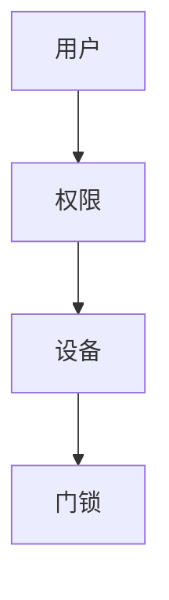
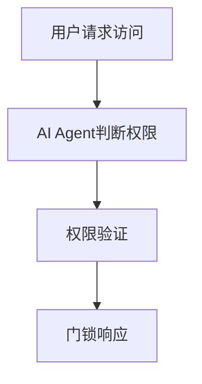
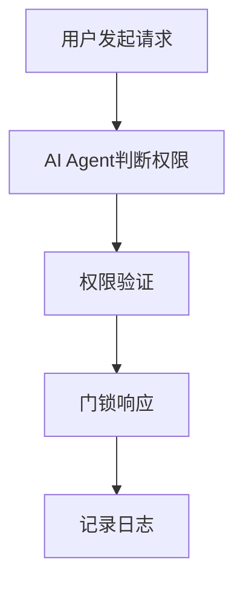

                 


# AI Agent在智能门锁中的访客权限管理

## 关键词：AI Agent，智能门锁，访客权限管理，系统架构，算法实现，项目实战，最佳实践

## 摘要：本文深入探讨AI Agent在智能门锁中的访客权限管理，分析其背景、核心概念、算法原理、系统架构，并通过项目实战和最佳实践提供详细的技术指导。

---

# 第一部分: 背景介绍

## 第1章: 问题背景与描述

### 1.1 当前智能门锁的访问控制问题

智能门锁作为智能家居的重要组成部分，传统的访问控制方式存在诸多问题，例如手动输入密码、钥匙管理复杂等。随着AI技术的发展，访客权限管理需要更加智能化和自动化。

### 1.2 AI Agent在访客权限管理中的作用

AI Agent能够通过学习用户行为和环境数据，优化访问控制策略，提升安全性。它能够实时分析数据，动态调整权限，有效防止未经授权的访问。

### 1.3 问题解决的必要性与目标

访客权限管理的必要性在于提升安全性、便捷性和管理效率。目标是实现智能化的权限分配和管理，确保访客在授权范围内自由访问，同时防止未授权的访问。

## 1.2 问题背景的边界与外延

### 1.2.1 访客权限管理的边界

访客权限管理仅限于门锁的访问控制，不涉及其他设备或功能。权限管理的边界包括用户身份验证、权限判断和门锁响应。

### 1.2.2 系统的外延与扩展性

系统可以通过扩展功能，如多设备联动、远程控制等，进一步提升智能化水平。外延功能包括与智能家居系统的集成、远程权限管理等。

## 1.3 核心概念与结构

### 1.3.1 核心概念的定义与组成

- **用户**：包括房主和访客。
- **权限**：用户对门锁的访问权限等级。
- **设备**：智能门锁及相关硬件。

### 1.3.2 核心要素的特征对比

| 特性 | 房主 | 访客 |
|------|------|------|
| 权限等级 | 最高 | 受限 |
| 管理权限 | 可设置 | 受限制 |

### 1.3.3 实体关系ER图



---

# 第二部分: 核心概念与联系

## 第2章: AI Agent的定义与原理

### 2.1 AI Agent的基本概念

AI Agent是能够感知环境并自主决策的智能体，用于执行特定任务。在访客权限管理中，AI Agent负责分析用户行为和环境数据，优化权限分配策略。

### 2.2 AI Agent的核心原理

AI Agent通过传感器数据、用户行为分析和环境模型，利用机器学习算法优化决策过程。其核心流程包括数据采集、特征提取、模型训练和决策执行。

### 2.3 AI Agent的分类与特点

AI Agent可分为基于规则的和基于模型的两种类型。基于规则的Agent通过预定义规则进行决策，而基于模型的Agent则通过学习数据构建模型，动态调整策略。

## 第3章: 智能门锁的定义与架构

### 3.1 智能门锁的基本结构

智能门锁由锁体、传感器、通信模块和控制单元组成。锁体负责机械部分，传感器检测状态，通信模块与外部系统交互，控制单元协调各部分工作。

### 3.2 智能门锁的通信协议

主流通信协议包括Wi-Fi、蓝牙、ZigBee和Z-Wave。这些协议支持智能门锁与智能家居系统和其他设备的联动。

### 3.3 智能门锁的功能模块

智能门锁的功能模块包括身份识别、权限验证、状态监控、远程控制和日志记录。这些模块协同工作，实现智能化的访问控制。

## 第4章: 访客权限管理的定义与实现

### 4.1 访客权限管理的基本概念

访客权限管理是指对访客的访问权限进行设置、调整和监控的过程。通过权限管理，确保访客在授权范围内自由访问，同时防止未经授权的访问。

### 4.2 访客权限管理的实现方式

访客权限管理可通过基于规则的系统和基于模型的系统实现。基于规则的系统通过预定义规则判断权限，而基于模型的系统利用机器学习模型动态调整权限。

### 4.3 访客权限管理的流程图



---

# 第三部分: 算法原理与实现

## 第5章: 算法原理

### 5.1 AI Agent在权限管理中的算法流程

AI Agent通过感知环境数据和用户行为，利用机器学习算法优化权限分配策略。其核心算法包括监督学习、无监督学习和强化学习。

### 5.2 访客权限判断的逻辑模型

权限判断的逻辑模型如下：

$$
\text{权限判断} = \begin{cases} 
允许 & \text{if } 权限 \geq 门锁级别 \\
拒绝 & \text{otherwise}
\end{cases}
$$

### 5.3 访客权限管理的Python代码实现

```python
def permission_check(user, level):
    if user.permission >= level:
        return "允许"
    else:
        return "拒绝"
```

### 5.4 算法实现的详细讲解与举例

#### 5.4.1 算法逻辑的详细说明

AI Agent通过分析用户行为数据，构建用户画像，动态调整权限。例如，当访客多次尝试未授权访问时，AI Agent会触发警报并降低权限。

#### 5.4.2 示例场景分析

假设访客的权限等级为1，门锁的最低权限等级为2。AI Agent判断访客权限低于门锁等级，拒绝访问。

---

# 第四部分: 系统分析与架构设计

## 第6章: 问题场景介绍

### 6.1 系统需求分析

系统需要实现访客权限管理、实时监控、日志记录等功能。系统架构包括前端、后端和设备层，支持多设备联动和远程控制。

### 6.2 系统功能设计

系统功能设计包括用户管理、权限管理、状态监控和日志管理。通过领域模型和架构图展示系统的模块划分和交互流程。

### 6.3 系统架构设计

系统架构采用分层设计，包括感知层、网络层、数据层和应用层。各层协同工作，实现智能化的访客权限管理。

### 6.4 系统接口设计

系统接口包括用户请求接口、权限验证接口和门锁控制接口。通过RESTful API实现系统各部分的通信和交互。

### 6.5 系统交互流程图



---

# 第五部分: 项目实战

## 第7章: 项目安装与环境配置

### 7.1 环境安装

安装必要的Python库，如flask、numpy和scikit-learn。配置开发环境，确保智能门锁设备与系统通信正常。

### 7.2 系统核心功能实现

实现用户管理、权限管理、状态监控和日志管理功能。通过代码示例展示系统核心逻辑的实现。

## 第8章: 项目实战与案例分析

### 8.1 项目实现的代码示例

```python
def main():
    user = User(permission=1)
    level = 2
    print(permission_check(user, level))  # 输出：拒绝
```

### 8.2 项目实现的详细讲解

通过实际案例分析，展示系统如何处理访客权限请求，动态调整权限，记录访问日志。

## 第9章: 项目小结

项目实现了智能化的访客权限管理，通过AI Agent优化访问控制策略，提升了系统的安全性和便捷性。

---

# 第六部分: 最佳实践

## 第10章: 最佳实践与注意事项

### 10.1 小结

AI Agent在智能门锁中的访客权限管理，提升了系统的智能化水平和安全性。

### 10.2 注意事项

在实际应用中，需要注意数据安全、权限管理的实时性和系统的可扩展性。

### 10.3 拓展阅读

推荐阅读相关领域的书籍和论文，深入了解AI在智能家居中的应用。

---

通过以上结构，文章详细讲解了AI Agent在智能门锁中的访客权限管理，从理论到实践，为读者提供了全面的技术指导。

