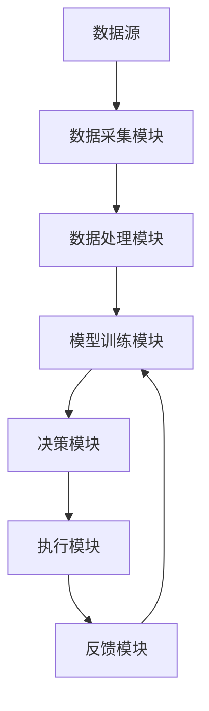

                 


# AI Agent在智能零售中的应用实践

## 关键词：AI Agent, 智能零售, 机器学习, 强化学习, 自然语言处理, 系统架构设计, 数学模型

## 摘要：本文系统地探讨了AI Agent在智能零售中的应用，从背景介绍到技术实现，再到实际案例分析，详细解析了AI Agent如何提升零售效率和客户体验。文章涵盖了AI Agent的核心概念、算法原理、系统架构设计以及项目实战，为读者提供了全面的视角和实践指导。

---

## 第一章: AI Agent与智能零售概述

### 1.1 AI Agent的基本概念

#### 1.1.1 什么是AI Agent
AI Agent（人工智能代理）是指能够感知环境并采取行动以实现目标的智能实体。它可以是一个软件程序，也可以是一个物理设备，通过传感器和执行器与环境交互。

**示例：** Amazon的推荐系统就是一个典型的AI Agent，它根据用户的购买历史和浏览行为推荐商品。

#### 1.1.2 AI Agent的核心特征
- **自主性**：能够在没有人工干预的情况下运行。
- **反应性**：能够根据环境变化实时调整行为。
- **目标导向**：所有行动都围绕特定目标展开。
- **学习能力**：能够通过经验改进性能。

#### 1.1.3 AI Agent与传统零售的区别
传统零售依赖人工决策和固定流程，而AI Agent能够实时分析数据、自主决策并执行行动，从而提高效率和客户体验。

### 1.2 智能零售的定义与特点

#### 1.2.1 智能零售的定义
智能零售是指利用人工智能、大数据、物联网等技术，实现零售过程的智能化、自动化和个性化。

#### 1.2.2 智能零售的核心特点
- **数据驱动**：依赖实时数据分析做出决策。
- **个性化服务**：根据客户需求提供定制化服务。
- **自动化运营**：减少人工干预，提高效率。

#### 1.2.3 智能零售与传统零售的对比
智能零售通过技术手段提高效率和客户体验，而传统零售依赖人工服务和经验判断。

### 1.3 AI Agent在智能零售中的应用背景

#### 1.3.1 零售行业的数字化转型
随着技术进步，零售行业正在从传统模式向数字化、智能化转型。

#### 1.3.2 AI技术在零售中的发展现状
AI技术在零售中的应用日益广泛，尤其是在客户行为分析、库存管理和营销策略方面。

#### 1.3.3 AI Agent在智能零售中的作用
AI Agent能够实时分析数据、优化库存、个性化推荐，从而提升零售效率和客户满意度。

---

## 第二章: AI Agent的核心概念与原理

### 2.1 AI Agent的核心概念

#### 2.1.1 AI Agent的定义与分类
AI Agent可以分为基于规则的代理和基于学习的代理。基于规则的代理根据预定义规则行动，而基于学习的代理通过机器学习模型不断优化行为。

#### 2.1.2 AI Agent的主要功能
- 数据采集与处理
- 行为决策
- 任务执行

#### 2.1.3 AI Agent的工作原理
AI Agent通过感知环境、分析数据、制定策略并执行行动来实现目标。

### 2.2 AI Agent的技术基础

#### 2.2.1 机器学习基础
机器学习是AI Agent的核心技术之一，用于模式识别和预测。

#### 2.2.2 自然语言处理
自然语言处理（NLP）使AI Agent能够理解和生成人类语言，从而与客户进行自然对话。

#### 2.2.3 强化学习
强化学习通过试错机制优化AI Agent的行为，使其在复杂环境中做出最优决策。

### 2.3 AI Agent与智能零售的结合

#### 2.3.1 AI Agent在零售中的应用场景
- 客户服务：通过聊天机器人提供24/7支持。
- 库存管理：实时监控库存并自动补货。
- 营销策略：根据客户行为制定个性化推荐。

#### 2.3.2 AI Agent如何提升零售效率
AI Agent能够快速分析数据、优化库存和推荐产品，从而提高运营效率和客户满意度。

#### 2.3.3 AI Agent在零售中的价值体现
通过提高效率、降低成本和提升客户体验，AI Agent为零售商带来了显著的竞争优势。

---

## 第三章: AI Agent在智能零售中的技术实现

### 3.1 AI Agent的核心算法

#### 3.1.1 机器学习算法
- **线性回归**：用于预测客户购买行为。
- **决策树**：用于分类客户群体。

#### 3.1.2 深度学习算法
- **卷积神经网络（CNN）**：用于图像识别和分类。
- **循环神经网络（RNN）**：用于序列数据处理，如时间序列预测。

#### 3.1.3 强化学习算法
- **Q-Learning**：用于状态-动作-奖励模型，优化决策策略。

### 3.2 AI Agent的系统架构

#### 3.2.1 系统模块划分
- 数据采集模块：收集客户行为、库存数据等。
- 数据处理模块：清洗和预处理数据。
- 模型训练模块：训练机器学习模型。
- 决策模块：基于模型输出决策。
- 执行模块：执行决策并反馈结果。

#### 3.2.2 系统功能设计
- 数据采集与处理
- 模型训练与优化
- 决策与执行
- 反馈与优化

#### 3.2.3 系统架构图


### 3.3 AI Agent的实现流程

#### 3.3.1 数据采集与处理
- 使用爬虫或API获取客户行为数据。
- 数据清洗和特征提取。

#### 3.3.2 模型训练与优化
- 选择合适的算法，如随机森林或神经网络。
- 调参和交叉验证优化模型。

#### 3.3.3 系统部署与测试
- 部署模型到生产环境。
- 监控模型性能并持续优化。

---

## 第四章: AI Agent在智能零售中的实际应用

### 4.1 AI Agent在客户行为分析中的应用

#### 4.1.1 客户画像构建
通过聚类分析将客户分为不同的群体，如高价值客户、潜在客户等。

#### 4.1.2 购物行为预测
使用时间序列模型预测客户购买时间，优化库存管理。

#### 4.1.3 客户需求挖掘
通过NLP分析客户评论，识别客户偏好和痛点。

### 4.2 AI Agent在库存管理中的应用

#### 4.2.1 库存预测与优化
使用ARIMA模型预测销售量，优化库存水平。

#### 4.2.2 库存监控与报警
实时监控库存变化，当库存低于阈值时自动报警。

#### 4.2.3 库存调整策略
根据销售预测和供应商交货时间，制定最优补货策略。

### 4.3 AI Agent在营销策略中的应用

#### 4.3.1 个性化推荐
基于协同过滤或深度学习模型推荐个性化产品。

#### 4.3.2 营销活动优化
通过A/B测试优化营销策略，提高转化率。

#### 4.3.3 客户忠诚度提升
通过定制化优惠和会员计划提升客户忠诚度。

---

## 第五章: 项目实战

### 5.1 环境安装

#### 5.1.1 安装Python和必要的库
- 使用pip安装numpy、pandas、scikit-learn、tensorflow等。

#### 5.1.2 安装机器学习框架
- 安装并配置TensorFlow或PyTorch。

### 5.2 核心代码实现

#### 5.2.1 数据采集与处理
```python
import pandas as pd
import numpy as np

# 数据采集
data = pd.read_csv('customer_data.csv')

# 数据清洗
data.dropna(inplace=True)
data = pd.get_dummies(data)
```

#### 5.2.2 模型训练
```python
from sklearn.ensemble import RandomForestClassifier
from sklearn.model_selection import train_test_split

# 数据分割
X_train, X_test, y_train, y_test = train_test_split(data.drop('target', axis=1), data['target'], test_size=0.2)

# 模型训练
model = RandomForestClassifier(n_estimators=100)
model.fit(X_train, y_train)
```

#### 5.2.3 模型评估
```python
from sklearn.metrics import accuracy_score

# 预测
y_pred = model.predict(X_test)

# 评估
print('准确率:', accuracy_score(y_test, y_pred))
```

### 5.3 案例分析与总结

#### 5.3.1 案例分析
- 某零售店使用AI Agent优化库存管理，库存准确率提高30%，减少缺货情况。

#### 5.3.2 项目总结
通过AI Agent技术，企业能够显著提高运营效率和客户满意度，实现智能化零售。

---

## 第六章: 最佳实践与总结

### 6.1 小结
AI Agent在智能零售中的应用前景广阔，能够显著提升效率和客户体验。

### 6.2 注意事项
- 数据隐私和安全问题需高度重视。
- 模型需持续优化，以适应市场变化。

### 6.3 拓展阅读
建议阅读《机器学习实战》和《深度学习》等书籍，深入了解相关技术。

---

## 第七章: 附录

### 7.1 技术术语表
- AI Agent：人工智能代理。
- 机器学习：通过数据训练模型进行预测或分类。
- 强化学习：通过试错优化决策策略。

### 7.2 参考文献
1. 《机器学习实战》
2. 《深度学习入门》
3. 《人工智能导论》

---

通过以上内容，我们系统地探讨了AI Agent在智能零售中的应用，从理论到实践，为读者提供了全面的视角和深入的分析。

