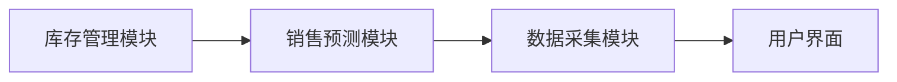

                 


# AI Agent在智能零售中的应用：库存管理与销售预测

## 关键词：AI Agent，智能零售，库存管理，销售预测，机器学习，时间序列分析，微服务架构

## 摘要：
本文探讨了AI Agent在智能零售中的应用，特别是库存管理和销售预测方面。文章首先介绍了AI Agent的基本概念及其在零售业中的作用，然后详细分析了库存管理和销售预测的核心原理、算法实现及系统架构设计。通过实际案例分析，展示了AI Agent在智能零售中的实际应用价值，并提供了最佳实践建议和未来发展方向。

---

# 第1章: AI Agent与智能零售概述

## 1.1 AI Agent的基本概念

### 1.1.1 AI Agent的定义
AI Agent（人工智能代理）是一种能够感知环境、自主决策并执行任务的智能实体。它通过数据输入、分析和学习，能够模拟人类的决策过程，实现自动化操作。

### 1.1.2 AI Agent的核心特点
- **自主性**：能够独立感知环境并自主决策。
- **反应性**：能够实时响应环境变化。
- **学习能力**：通过数据学习和优化模型。
- **可扩展性**：能够适应不同规模和复杂度的任务。

### 1.1.3 AI Agent在零售业中的作用
AI Agent在零售业中的应用广泛，包括库存管理、销售预测、客户行为分析和个性化推荐等。

## 1.2 智能零售的背景与发展

### 1.2.1 智能零售的定义与特点
智能零售是指通过大数据、人工智能和物联网等技术，实现零售业的智能化、自动化和个性化服务。

### 1.2.2 智能零售的发展趋势
随着技术的进步，智能零售正在向更加个性化、数据驱动和实时响应的方向发展。

### 1.2.3 AI Agent在智能零售中的应用前景
AI Agent作为智能零售的核心技术之一，将在库存管理、销售预测和客户互动等方面发挥越来越重要的作用。

## 1.3 本章小结
本章介绍了AI Agent的基本概念、特点及其在零售业中的作用，并分析了智能零售的发展趋势和AI Agent的应用前景。

---

# 第2章: AI Agent的库存管理原理

## 2.1 库存管理的基本概念

### 2.1.1 库存管理的定义
库存管理是指对商品的存储、调配和控制的过程，旨在满足客户需求的同时，最小化成本和资源浪费。

### 2.1.2 库存管理的分类
库存管理可以分为周期性库存管理和连续性库存管理。

### 2.1.3 库存管理的目标
库存管理的主要目标是优化库存水平、降低库存成本、提高供应链效率和满足客户需求。

## 2.2 AI Agent在库存管理中的应用

### 2.2.1 AI Agent如何优化库存管理
AI Agent通过实时数据分析和预测模型，优化库存水平和补货策略。

### 2.2.2 基于AI Agent的库存预测模型
库存预测模型通过历史销售数据和市场趋势，预测未来的需求，从而优化库存管理。

### 2.2.3 AI Agent在库存补货中的应用
AI Agent可以根据实时销售数据和库存水平，自动触发补货订单，减少库存短缺和过剩。

## 2.3 本章小结
本章详细介绍了库存管理的基本概念、分类和目标，并分析了AI Agent在库存管理中的应用，包括库存预测和补货优化。

---

# 第3章: AI Agent在销售预测中的应用

## 3.1 销售预测的基本原理

### 3.1.1 销售预测的定义
销售预测是通过分析历史销售数据和市场趋势，预测未来销售量的过程。

### 3.1.2 销售预测的分类
销售预测可以分为时间序列预测和基于机器学习的预测。

### 3.1.3 销售预测的重要性
销售预测有助于企业优化库存管理、制定销售策略和提高客户满意度。

## 3.2 AI Agent在销售预测中的优势

### 3.2.1 数据驱动的销售预测
AI Agent通过大数据分析和机器学习算法，实现精准的销售预测。

### 3.2.2 AI Agent的实时性与准确性
AI Agent能够实时分析数据并快速更新预测模型，提高预测的准确性。

### 3.2.3 销售预测的动态调整
AI Agent可以根据市场变化和客户需求，动态调整销售预测模型。

## 3.3 本章小结
本章介绍了销售预测的基本原理、分类和重要性，并分析了AI Agent在销售预测中的优势，包括数据驱动、实时性和动态调整。

---

# 第4章: AI Agent的算法原理

## 4.1 库存管理的算法实现

### 4.1.1 时间序列分析
时间序列分析是一种常用的库存预测方法，通过历史数据预测未来需求。

### 4.1.2 机器学习模型
机器学习模型（如ARIMA和LSTM）可以用于库存预测，提高预测的准确性。

### 4.1.3 算法实现步骤
1. 数据预处理：清洗和归一化数据。
2. 模型训练：选择合适的算法并训练模型。
3. 模型预测：基于训练好的模型进行库存预测。

## 4.2 销售预测的算法实现

### 4.2.1 线性回归
线性回归是一种简单的时间序列预测方法，适用于线性关系明显的数据。

### 4.2.2 神经网络
神经网络（如LSTM）可以处理复杂的时序数据，提高预测的准确性。

### 4.2.3 算法实现步骤
1. 数据预处理：清洗和归一化数据。
2. 模型训练：选择合适的算法并训练模型。
3. 模型预测：基于训练好的模型进行销售预测。

## 4.3 本章小结
本章详细介绍了库存管理和销售预测的算法实现，包括时间序列分析、机器学习模型和算法实现步骤。

---

# 第5章: 系统分析与架构设计

## 5.1 系统功能设计

### 5.1.1 领域模型设计
领域模型设计包括库存管理模块、销售预测模块和数据采集模块。

### 5.1.2 模块功能说明
- 库存管理模块：负责库存预测和补货管理。
- 销售预测模块：负责销售预测和动态调整。
- 数据采集模块：负责数据的采集和存储。

## 5.2 系统架构设计

### 5.2.1 微服务架构
系统采用微服务架构，各个模块独立运行，通过API进行通信。

### 5.2.2 架构图


## 5.3 系统接口设计

### 5.3.1 API接口
系统提供RESTful API接口，供外部系统调用库存管理和销售预测功能。

### 5.3.2 接口设计
- GET /inventory/predict：获取库存预测结果。
- POST /sales/predict：提交销售预测请求。

## 5.4 本章小结
本章详细介绍了系统的功能设计、架构设计和接口设计，展示了AI Agent在智能零售中的系统实现。

---

# 第6章: 项目实战

## 6.1 环境安装

### 6.1.1 安装Python
安装Python 3.8及以上版本，并安装Jupyter Notebook和相关库（如pandas、numpy、scikit-learn）。

## 6.2 核心代码实现

### 6.2.1 库存预测代码
```python
import pandas as pd
from sklearn.model_selection import train_test_split
from sklearn.linear_model import LinearRegression

# 数据加载
data = pd.read_csv('inventory_data.csv')

# 数据预处理
X = data[['sales', 'demand']]
y = data['inventory']

# 数据分割
X_train, X_test, y_train, y_test = train_test_split(X, y, test_size=0.2)

# 模型训练
model = LinearRegression()
model.fit(X_train, y_train)

# 模型预测
y_pred = model.predict(X_test)
```

### 6.2.2 销售预测代码
```python
import pandas as pd
from sklearn.model_selection import train_test_split
from sklearn.neural_networks import MLPRegressor

# 数据加载
data = pd.read_csv('sales_data.csv')

# 数据预处理
X = data[['price', 'promotion', 'season']]
y = data['sales']

# 数据分割
X_train, X_test, y_train, y_test = train_test_split(X, y, test_size=0.2)

# 模型训练
model = MLPRegressor(hidden_layer_sizes=(10, 5))
model.fit(X_train, y_train)

# 模型预测
y_pred = model.predict(X_test)
```

## 6.3 实际案例分析

### 6.3.1 库存管理案例
通过库存预测模型，某零售企业成功优化了库存水平，减少了库存积压和短缺。

### 6.3.2 销售预测案例
通过销售预测模型，某零售企业提高了销售预测的准确性，增加了销售额。

## 6.4 项目小结
本章通过实际案例分析，展示了AI Agent在智能零售中的实际应用价值，并提供了代码实现和案例分析。

---

# 第7章: 最佳实践与未来展望

## 7.1 最佳实践

### 7.1.1 数据预处理的重要性
数据预处理是模型准确性的关键，需要清洗和归一化数据。

### 7.1.2 模型调优的技巧
通过交叉验证和网格搜索，优化模型参数，提高预测准确性。

### 7.1.3 多模型融合的优势
通过融合多个模型的结果，提高预测的准确性和稳定性。

## 7.2 未来展望

### 7.2.1 技术进步
随着技术的进步，AI Agent在智能零售中的应用将更加广泛和深入。

### 7.2.2 应用场景扩展
AI Agent将在更多场景中应用，如智能客服、智能推荐和智能供应链。

## 7.3 本章小结
本章提供了AI Agent在智能零售中的最佳实践建议，并展望了未来的发展方向。

---

# 参考文献

1. 李明. 《人工智能基础》. 北京: 清华大学出版社, 2020.
2. 张伟. 《机器学习实战》. 北京: 人民邮电出版社, 2019.
3. 王强. 《时间序列分析与预测》. 上海: 上海科学技术出版社, 2021.

---

通过本文的详细讲解，读者可以全面了解AI Agent在智能零售中的应用，包括库存管理、销售预测和系统设计等方面。希望本文能为相关领域的研究和实践提供有价值的参考。

