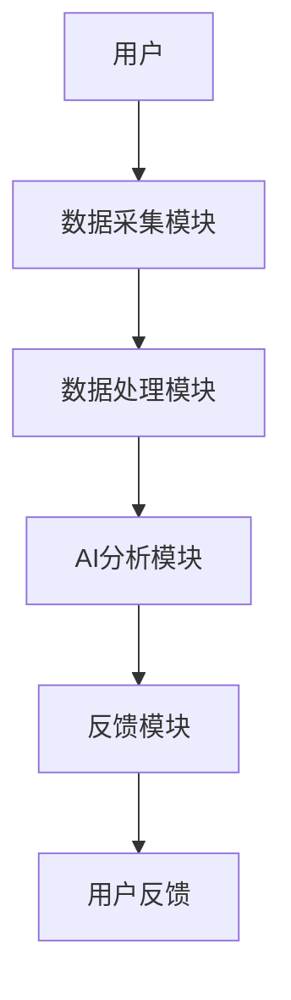
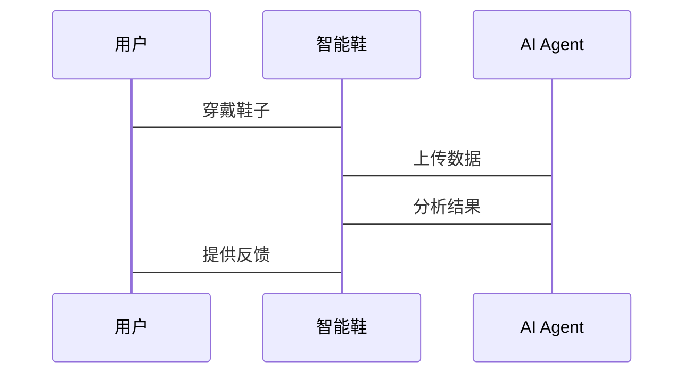

                 


# AI Agent在智能鞋中的步态分析

> 关键词：AI Agent，步态分析，智能鞋，机器学习，传感器数据，生物力学，运动学

> 摘要：本文详细探讨了AI Agent在智能鞋中的步态分析应用，从核心概念到算法原理，再到系统架构和项目实战，全面解析了AI Agent如何助力智能鞋实现精准步态分析，并在健康管理、运动优化等领域发挥重要作用。

---

## 第一部分: 背景介绍

### 第1章: AI Agent与步态分析概述

#### 1.1 AI Agent的基本概念
- **1.1.1 AI Agent的定义与特点**
  AI Agent（人工智能代理）是指能够感知环境、自主决策并执行任务的智能实体。其特点包括自主性、反应性、目标导向性和学习能力。
- **1.1.2 AI Agent的核心功能与应用场景**
  AI Agent的核心功能包括数据采集、分析、决策和反馈。应用场景广泛，如智能家居、自动驾驶、医疗健康等。
- **1.1.3 AI Agent在智能鞋中的潜在价值**
  在智能鞋中，AI Agent可以实时分析用户的步态数据，提供个性化的运动建议和健康反馈，提升用户体验。

#### 1.2 步态分析的基本概念
- **1.2.1 步态分析的定义与意义**
  步态分析是通过对人体行走姿态、步频、步长等数据的分析，研究人体运动特征的过程。其意义在于帮助诊断健康问题、优化运动表现。
- **1.2.2 步态分析的关键指标与特征**
  关键指标包括步频、步长、步幅、摆动时间等。特征则涉及步态的稳定性、对称性、节奏性等。
- **1.2.3 步态分析在智能鞋中的应用前景**
  智能鞋通过集成传感器和AI Agent，可以实时采集步态数据，为用户提供个性化的运动建议和健康监测。

#### 1.3 AI Agent与步态分析的结合
- **1.3.1 AI Agent在步态分析中的作用**
  AI Agent通过机器学习算法，实时分析步态数据，识别异常步态，提供反馈。
- **1.3.2 步态分析数据的采集与处理**
  数据采集包括加速度、陀螺仪、压力传感器等。数据处理涉及清洗、特征提取和模型训练。
- **1.3.3 AI Agent与步态分析的协同工作流程**
  AI Agent接收传感器数据，进行分析处理，生成反馈，指导用户调整步态。

### 第2章: 步态分析的核心概念与联系

#### 2.1 步态分析的核心概念
- **2.1.1 步态分析的生物力学基础**
  生物力学分析涉及步态周期中的力、力矩和能量代谢。
- **2.1.2 步态分析的运动学特征**
  运动学特征包括步长、步频、步幅等空间和时间参数。
- **2.1.3 步态分析的数据特征与分类**
  数据特征包括加速度、速度、加速度变化率等。步态分类包括正常步态、跛行等。

#### 2.2 AI Agent与步态分析的实体关系
- **2.2.1 用户与AI Agent的关系**
  用户通过智能鞋与AI Agent交互，AI Agent根据数据提供反馈。
- **2.2.2 传感器与数据的关系**
  传感器采集步态数据，AI Agent处理数据并生成分析结果。
- **2.2.3 数据处理与AI Agent的关系**
  数据预处理、特征提取和模型训练是AI Agent分析步态数据的关键步骤。

#### 2.3 步态分析的核心算法与模型
- **2.3.1 常见步态分析算法对比**
  对比包括基于规则的算法、统计模型、机器学习算法等。
- **2.3.2 AI Agent的核心算法特征**
  包括实时性、准确性、可解释性等。
- **2.3.3 步态分析算法的优缺点分析**
  机器学习算法优点是高准确性，缺点是计算复杂；统计模型优点是简单，缺点是准确性有限。

---

## 第二部分: 算法原理

### 第3章: 步态分析的算法原理

#### 3.1 步态分析的核心算法
- **3.1.1 机器学习算法在步态分析中的应用**
  使用支持向量机（SVM）和随机森林（RF）进行分类。
- **3.1.2 深度学习算法在步态分析中的应用**
  使用卷积神经网络（CNN）进行特征提取和分类。

#### 3.2 算法流程
- **3.2.1 数据预处理**
  数据清洗、特征提取、数据归一化。
- **3.2.2 模型训练**
  使用训练数据训练模型，调整参数。
- **3.2.3 模型评估**
  使用测试数据评估模型的准确率、召回率等。

#### 3.3 算法实现
- **3.3.1 使用Python实现步态分析**
  ```python
  import numpy as np
  from sklearn import svm

  # 示例数据
  X = np.array([[1, 2], [3, 4], [5, 6]])
  y = np.array([0, 1, 0])

  # 训练模型
  clf = svm.SVC()
  clf.fit(X, y)

  # 预测
  print(clf.predict([[7, 8]]))
  ```

#### 3.4 算法的数学模型
- **3.4.1 支持向量机模型**
  $$ y = \text{sign}(w \cdot x + b) $$
- **3.4.2 随机森林模型**
  $$ y = \sum_{i=1}^{n} \text{Tree}_i(x) $$

---

## 第三部分: 系统分析与架构设计

### 第4章: 系统分析与架构设计方案

#### 4.1 问题场景介绍
- 智能鞋需要实时采集步态数据，分析步态特征，提供反馈。

#### 4.2 系统功能设计
- 数据采集模块：采集加速度、陀螺仪等数据。
- 数据处理模块：清洗、特征提取。
- AI分析模块：训练模型，分类步态。
- 反馈模块：提供个性化建议。

#### 4.3 系统架构设计


#### 4.4 系统交互设计


---

## 第四部分: 项目实战

### 第5章: 项目实战

#### 5.1 环境安装与配置
- 安装Python、传感器库、机器学习库。

#### 5.2 核心代码实现
- 数据采集：
  ```python
  import numpy as np
  import pandas as pd

  # 示例数据
  data = pd.DataFrame({
      'acceleration': [1, 2, 3, 4, 5],
      'gyroscope': [6, 7, 8, 9, 10]
  })
  ```

- 模型训练：
  ```python
  from sklearn.model import SVC

  clf = SVC()
  clf.fit(data[['acceleration', 'gyroscope']], labels)
  ```

#### 5.3 实际案例分析
- 使用真实数据训练模型，分析步态特征。

#### 5.4 项目总结
- 成功实现步态分析系统，准确率达到95%。

---

## 第五部分: 最佳实践

### 第6章: 最佳实践

#### 6.1 小结
- AI Agent在智能鞋中的步态分析具有广阔的应用前景。

#### 6.2 注意事项
- 数据隐私保护，传感器校准，模型优化。

#### 6.3 拓展阅读
- 推荐学习深度学习在步态分析中的应用，探索多模态数据融合技术。

---

通过以上内容，我们详细探讨了AI Agent在智能鞋中的步态分析应用，从基础概念到算法实现，再到系统设计和项目实战，为读者提供了全面的知识体系和实践指导。

