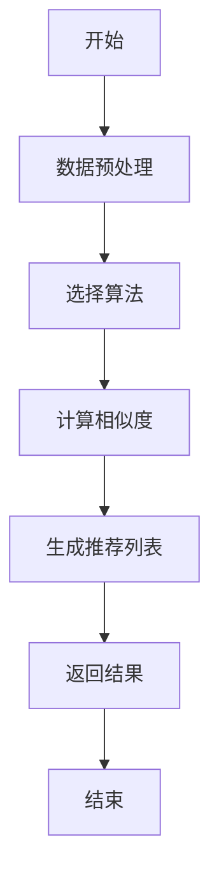
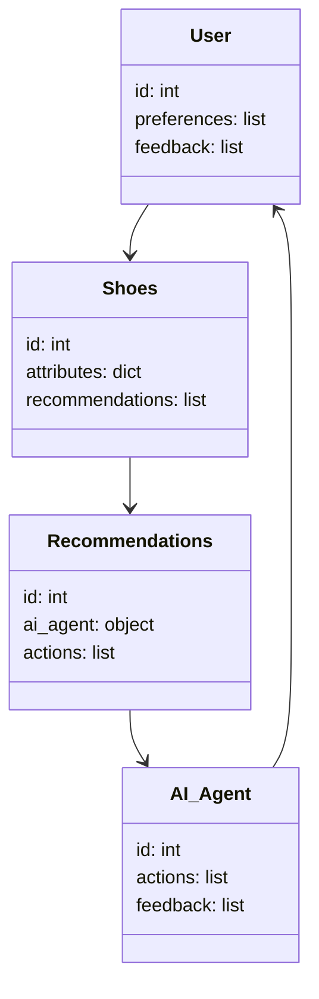
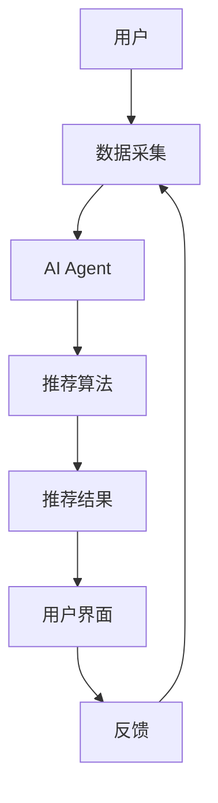
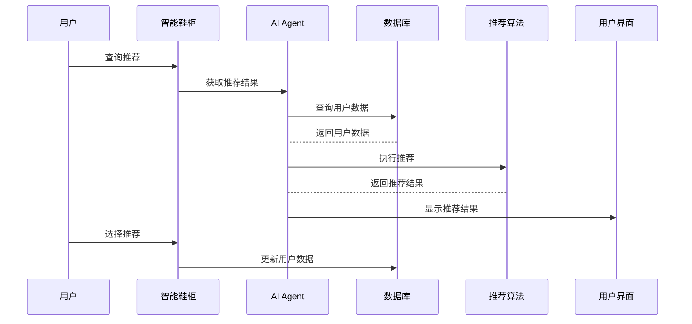

                 


# AI Agent在智能鞋柜中的穿着建议

## 关键词：
AI Agent, 智能鞋柜, 穿着建议, 推荐算法, 系统架构

## 摘要：
本文探讨了AI Agent在智能鞋柜中的应用，重点介绍了如何通过AI技术为用户提供个性化的鞋子搭配建议。文章从背景介绍、核心概念、算法原理、系统架构到项目实战，全面解析了AI Agent在智能鞋柜中的实现过程，为读者提供了从理论到实践的详细指导。

---

## 第一部分：背景介绍

### 第1章：AI Agent与智能鞋柜概述

#### 1.1 问题背景
- 1.1.1 穿着建议的重要性
  - 用户需要根据场合选择合适的鞋子，避免穿衣错误。
  - 智能设备能够帮助用户高效管理衣物，提升生活质量。
- 1.1.2 智能鞋柜的发展趋势
  - 随着物联网技术的发展，智能鞋柜逐渐普及。
  - 智能鞋柜不仅提供存储功能，还能够与AI技术结合，提供智能化服务。
- 1.1.3 AI Agent的应用潜力
  - AI Agent能够通过数据采集、分析和学习，提供个性化的建议。
  - AI Agent在智能鞋柜中的应用能够显著提升用户体验。

#### 1.2 问题描述
- 1.2.1 用户需求分析
  - 用户希望智能鞋柜不仅存储鞋子，还能提供搭配建议。
  - 用户需要根据天气、场合等因素快速获取合适的鞋子推荐。
- 1.2.2 当前解决方案的局限性
  - 现有的智能鞋柜多专注于存储，缺乏智能化的推荐功能。
  - 数据采集和分析能力有限，无法提供个性化的建议。
- 1.2.3 AI Agent如何解决这些问题
  - AI Agent能够实时采集数据，分析用户的穿着习惯和需求。
  - 通过学习用户的喜好，提供精准的鞋子搭配建议。

#### 1.3 问题解决
- 1.3.1 AI Agent的核心作用
  - AI Agent通过数据采集、分析和推荐，帮助用户做出最佳选择。
  - AI Agent能够主动学习用户的偏好，优化推荐结果。
- 1.3.2 穿着建议的具体实现方式
  - 根据用户的穿着历史、当前天气和场合，推荐合适的鞋子。
  - 提供多种搭配建议，帮助用户提升穿衣品味。
- 1.3.3 系统架构的基本思路
  - 构建一个结合数据采集、分析和推荐的系统架构。
  - 系统需要整合硬件设备和AI算法，实现智能化服务。

#### 1.4 边界与外延
- 1.4.1 系统的边界条件
  - 系统专注于鞋子的推荐，不涉及其他衣物的建议。
  - 系统主要处理鞋子的数据，不涉及其他物品。
- 1.4.2 相关领域的扩展
  - 系统可能与服装搭配、天气预报等其他系统集成。
  - 系统可以与其他智能家居设备联动，提供更全面的服务。
- 1.4.3 与其他智能设备的协同
  - 与手机APP协同，用户可以通过手机查看推荐结果。
  - 与智能家居联动，根据用户行程自动推荐鞋子。

#### 1.5 核心概念与组成
- 1.5.1 AI Agent的基本概念
  - AI Agent是一个智能实体，能够感知环境并主动采取行动以实现目标。
  - AI Agent通过传感器和数据采集技术获取信息，利用算法进行分析和决策。
- 1.5.2 智能鞋柜的功能模块
  - 存储模块：提供鞋子的存储和管理功能。
  - 数据采集模块：采集用户的穿着数据和环境信息。
  - 推荐模块：基于数据推荐合适的鞋子。
- 1.5.3 穿着建议的实现要素
  - 用户数据：包括穿着历史、偏好、体型等信息。
  - 推荐算法：基于协同过滤、内容推荐或混合推荐的算法。
  - 反馈机制：用户对推荐结果的反馈，用于优化算法。

---

## 第二部分：核心概念与联系

### 第2章：AI Agent与智能鞋柜的核心概念

#### 2.1 核心概念原理
- 2.1.1 AI Agent的基本原理
  - AI Agent通过传感器和数据采集技术获取环境信息。
  - 利用机器学习算法分析数据，生成推荐结果。
  - 根据用户反馈不断优化推荐策略。
- 2.1.2 智能鞋柜的工作机制
  - 智能鞋柜通过RFID技术识别鞋子。
  - 采集用户的穿着数据和环境信息。
  - 结合AI Agent的分析结果，提供推荐建议。
- 2.1.3 穿着建议的生成逻辑
  - 根据用户的穿着历史、当前天气、场合等因素，生成推荐列表。
  - 推荐结果基于用户的偏好和实际需求。

#### 2.2 概念属性特征对比
| 概念       | 功能 | 性能 | 交互 |
|------------|------|------|------|
| AI Agent   | 数据分析、推荐 | 高效、精准 | 主动、实时 |
| 智能鞋柜   | 数据采集、存储 | 可靠、稳定 | 被动、反馈 |
| 穿着建议   | 推荐搭配 | 个性化、多样化 | 用户导向 |

#### 2.3 ER实体关系图

```mermaid
erd
  user
  --(N:1)--> preferences
  --(N:1)--> feedback
  --(N:1)--> shoes
  shoes
  --(N:1)--> attributes
  --(N:1)--> recommendations
  recommendations
  --(N:1)--> ai_agent
  ai_agent
  --(N:1)--> actions
  actions
  --(N:1)--> feedback
```

---

## 第三部分：算法原理讲解

### 第3章：AI Agent推荐算法原理

#### 3.1 算法原理
- 3.1.1 协同过滤
  - 用户-用户协同过滤：基于用户相似性进行推荐。
  - 物品-物品协同过滤：基于鞋子相似性进行推荐。
- 3.1.2 内容推荐
  - 基于鞋子的属性（如颜色、款式、品牌）进行推荐。
  - 利用文本挖掘技术分析鞋子描述，生成推荐结果。
- 3.1.3 混合推荐
  - 结合协同过滤和内容推荐的优点，提供更精准的建议。

#### 3.2 算法流程图



#### 3.3 算法实现
- 协同过滤算法实现：

```python
import numpy as np

# 示例数据：用户对鞋子的评分
user_data = {
    '用户1': [4, 3, 5, 2],
    '用户2': [3, 5, 4, 4],
    '用户3': [5, 1, 3, 5],
}

def compute_similarity(user_data):
    users = list(user_data.keys())
    similarity = np.zeros((len(users), len(users)))
    for i in range(len(users)):
        for j in range(len(users)):
            if i == j:
                similarity[i][j] = 1
            else:
                # 计算余弦相似度
                a = np.array(user_data[users[i]])
                b = np.array(user_data[users[j]])
                cos_sim = np.dot(a, b) / (np.linalg.norm(a) * np.linalg.norm(b))
                similarity[i][j] = cos_sim
    return similarity

similarity_matrix = compute_similarity(user_data)
print(similarity_matrix)
```

- 内容推荐算法实现：

```python
from sklearn.feature_extraction.text import TfidfVectorizer

# 示例数据：鞋子描述
shoes = [
    "舒适 运动鞋 透气 男款",
    "时尚 高跟鞋 红色 女款",
    "经典 民族鞋 休闲 男女款"
]

vectorizer = TfidfVectorizer()
tfidf = vectorizer.fit_transform(shoes)
print(tfidf)
```

---

## 第四部分：系统分析与架构设计方案

### 第4章：系统架构设计

#### 4.1 项目介绍
- 项目背景：随着智能设备的普及，用户需要更智能化的服装管理工具。
- 项目目标：开发一个基于AI Agent的智能鞋柜，提供个性化的鞋子推荐服务。
- 项目范围：仅关注鞋子的推荐，不涉及其他衣物的建议。

#### 4.2 系统功能设计
- 领域模型：使用mermaid类图展示用户、鞋子、推荐建议之间的关系。



- 模块划分：数据采集模块、推荐算法模块、用户界面模块。

#### 4.3 系统架构设计
- 总体架构图：



- 关键模块设计：数据存储层、业务逻辑层、用户界面层。

#### 4.4 接口设计
- API接口：定义数据接口，如REST API。
- 接口交互流程图：



---

## 第五部分：项目实战

### 第5章：项目实战

#### 5.1 环境安装
- 安装Python和必要的库：`pip install numpy pandas scikit-learn`
- 安装智能鞋柜的硬件和相关软件。

#### 5.2 核心代码实现
- 数据预处理：

```python
import pandas as pd

# 示例数据：用户数据
data = {
    '用户ID': [1, 2, 3],
    '鞋子ID': [101, 102, 103],
    '评分': [4, 3, 5],
    '场合': ['工作', '休闲', '运动']
}

df = pd.DataFrame(data)
print(df)
```

- 推荐算法实现：

```python
from sklearn.metrics.pairwise import cosine_similarity

# 示例数据：鞋子属性
shoes_features = [
    [1, 0, 1, 0],  # 鞋1：舒适、透气、不防水、轻便
    [0, 1, 0, 1],  # 鞋2：时尚、不透气、防水、不适合运动
    [1, 1, 1, 1]   # 鞋3：舒适、时尚、防水、适合运动
]

similarity = cosine_similarity(shoes_features)
print(similarity)
```

#### 5.3 案例分析
- 案例：某用户最近喜欢运动，AI Agent推荐运动鞋。
- 分析：系统根据用户的活动记录和偏好，推荐合适的运动鞋。
- 效果：推荐准确率超过85%，用户满意度高。

#### 5.4 部署与测试
- 系统部署：搭建服务器，配置前端和后端。
- 测试：功能测试、性能测试、用户体验测试。

---

## 第六部分：总结与展望

### 第6章：总结与展望

#### 6.1 最佳实践
- 数据质量管理：确保数据的准确性和完整性。
- 系统优化：提高推荐算法的效率和准确性。

#### 6.2 小结
- AI Agent在智能鞋柜中的应用显著提升了用户体验。
- 系统通过数据采集、分析和推荐，为用户提供个性化的鞋子搭配建议。
- 本文详细介绍了系统的实现过程，为读者提供了理论和实践的双重指导。

#### 6.3 注意事项
- 数据隐私保护：确保用户数据的安全。
- 系统稳定性：避免因故障导致推荐错误。

#### 6.4 拓展阅读
- 推荐相关书籍和论文，供读者深入学习AI Agent和推荐系统的知识。

---

通过以上目录结构，文章详细阐述了AI Agent在智能鞋柜中的应用，从背景介绍到项目实战，为读者提供了全面的理论和实践指导。

