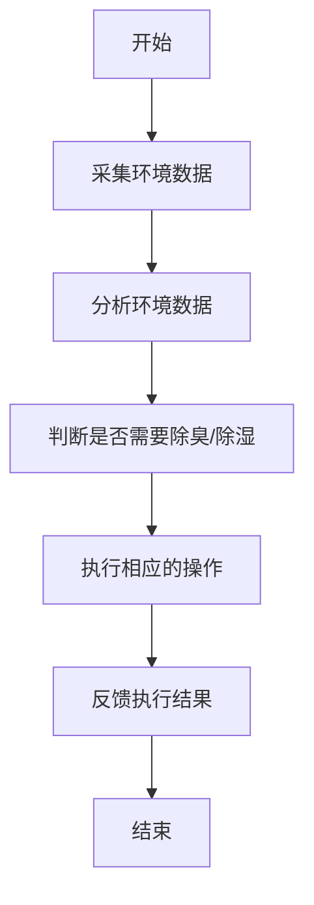
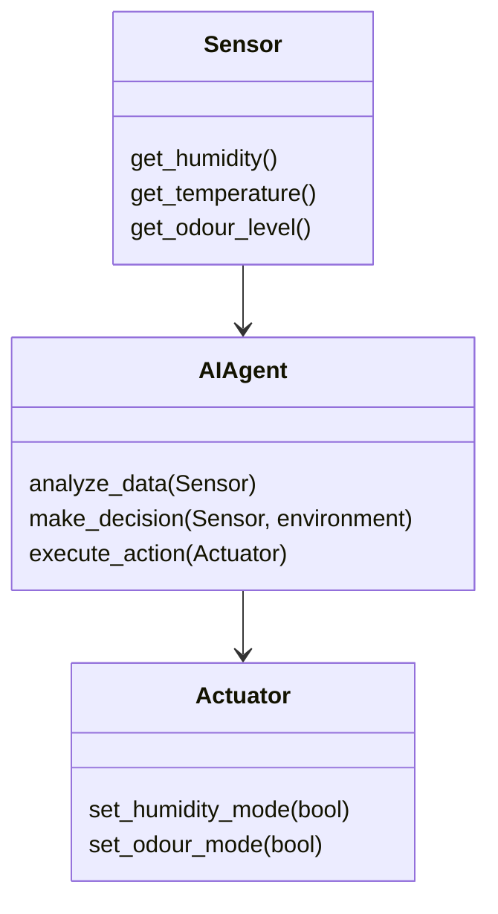
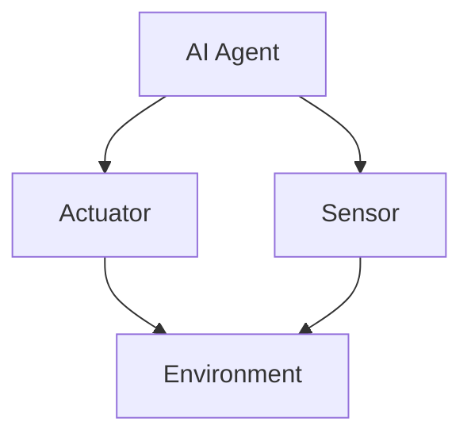
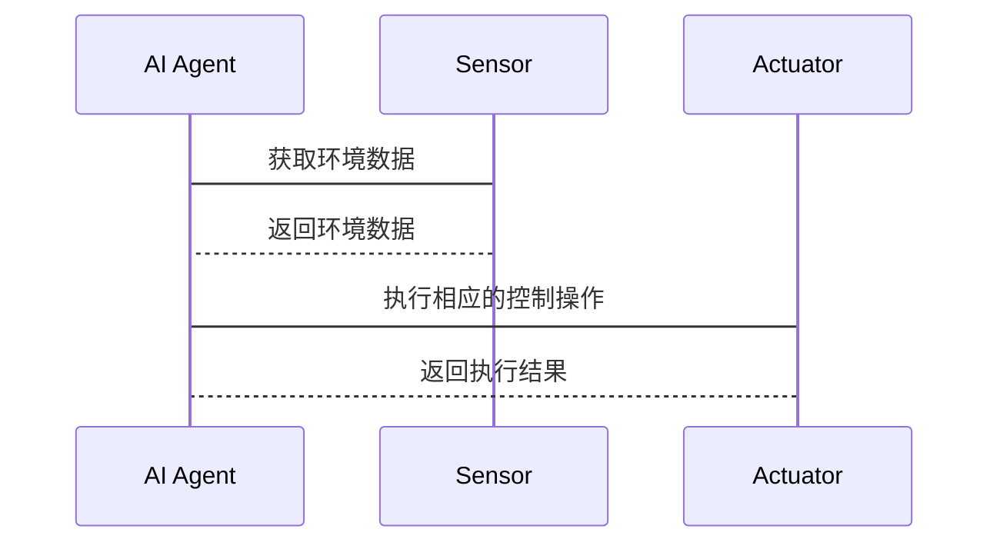

                 


```markdown
# AI Agent在智能鞋柜中的除臭除湿控制

> 关键词：智能鞋柜，AI Agent，除臭除湿，传感器数据，物联网，人工智能

> 摘要：本文详细探讨了AI Agent在智能鞋柜中的除臭除湿控制应用，从背景介绍、核心概念、算法原理到系统架构设计，再到项目实战和最佳实践，全面解析了AI Agent在智能鞋柜中的实现与优化。

---

## 第1章: 背景介绍

### 1.1 问题背景
#### 1.1.1 智能鞋柜的发展现状
随着智能家居的普及，智能鞋柜逐渐成为家庭生活中不可或缺的一部分。传统的鞋柜功能单一，主要用来存放鞋子，而现代智能鞋柜则集成了除臭、除湿、杀菌等多种功能，能够为用户提供更舒适的生活体验。

#### 1.1.2 除臭除湿技术的市场需求
鞋子在使用过程中容易产生异味和湿气，这些问题不仅影响鞋子的使用寿命，还可能对人体健康造成不良影响。因此，用户对鞋子的除臭和除湿需求日益增长。市场上的除臭除湿技术主要包括活性炭吸附、紫外线杀菌、负离子除臭等，但这些技术在实际应用中存在能耗高、效率低、智能化水平不足等问题。

#### 1.1.3 AI Agent在智能鞋柜中的应用潜力
AI Agent（人工智能代理）是一种能够感知环境、自主决策并执行任务的智能体。将AI Agent应用于智能鞋柜的除臭除湿控制中，可以通过智能化的传感器数据采集和分析，实现精准的除臭除湿控制，提升用户体验，降低能耗。

### 1.2 问题描述
#### 1.2.1 鞋柜除臭除湿的核心问题
传统除臭除湿技术存在以下问题：
1. **能耗高**：传统除湿技术通常采用电热除湿方式，能耗较高。
2. **效率低**：除臭技术依赖活性炭等吸附材料，吸附效率有限，且需要定期更换。
3. **智能化水平不足**：无法根据环境变化自动调节除臭除湿强度，存在过度或不足的情况。

#### 1.2.2 用户需求与痛点分析
用户在使用智能鞋柜时，主要关注以下几点：
1. **除臭效果**：希望鞋子不会有异味。
2. **除湿效果**：希望鞋子保持干燥。
3. **智能化**：希望设备能够自动运行，无需手动干预。
4. **能耗**：希望设备能耗低，节省电费。

#### 1.2.3 现有解决方案的局限性
现有解决方案主要依赖传统的除臭除湿技术，存在以下局限性：
1. **能耗高**：传统除湿技术能耗较高，长期使用成本高。
2. **效率低**：除臭技术效率有限，需要定期更换吸附材料。
3. **智能化不足**：无法根据环境变化自动调节除臭除湿强度。

### 1.3 问题解决
#### 1.3.1 AI Agent的核心作用
AI Agent能够通过传感器实时采集环境数据，分析环境状况，自主决策并执行相应的除臭除湿操作。例如，当传感器检测到湿度较高时，AI Agent可以启动除湿模式；当检测到异味较重时，AI Agent可以启动除臭模式。

#### 1.3.2 技术实现路径
AI Agent在智能鞋柜中的实现路径如下：
1. **传感器数据采集**：通过湿度传感器、温度传感器、气体传感器等采集环境数据。
2. **环境分析**：AI Agent对采集到的数据进行分析，判断当前环境是否需要除臭或除湿。
3. **决策制定**：根据分析结果，AI Agent制定相应的控制策略，如启动除湿风机、开启紫外线灯等。
4. **执行与反馈**：AI Agent通过执行机构（如电机、灯泡等）执行决策，并实时反馈执行结果，不断优化控制策略。

#### 1.3.3 应用场景与目标
应用场景包括家庭、办公室、健身房等地，目标是为用户提供一个干净、舒适、无异味的鞋子存放环境，同时降低能耗，延长鞋子使用寿命。

### 1.4 边界与外延
#### 1.4.1 系统边界定义
智能鞋柜AI Agent系统的边界包括：
1. **输入端**：传感器数据、用户指令。
2. **输出端**：执行机构（如电机、灯泡等）。
3. **内部处理**：环境数据分析、决策制定。

#### 1.4.2 相关技术的外延
AI Agent技术可以扩展应用于其他智能家居设备，如智能空调、智能空气净化器等。

#### 1.4.3 应用范围与限制
应用范围主要在智能鞋柜领域，限制包括硬件设备的兼容性、传感器的精度、算法的复杂度等。

### 1.5 概念结构与核心要素
#### 1.5.1 AI Agent的基本构成
AI Agent由感知层、决策层、执行层组成，具体包括：
1. **感知层**：传感器，负责采集环境数据。
2. **决策层**：算法，负责分析数据并制定决策。
3. **执行层**：执行机构，负责执行决策。

#### 1.5.2 系统核心要素分析
1. **传感器**：用于采集环境数据，如湿度、温度、气体浓度等。
2. **AI算法**：用于数据分析和决策制定。
3. **执行机构**：用于执行除臭除湿操作，如电机、灯泡等。

#### 1.5.3 除臭除湿功能的实现机制
AI Agent通过传感器采集环境数据，分析数据后，启动相应的除臭除湿设备，实现对环境的精准控制。

---

## 第2章: 核心概念与联系

### 2.1 AI Agent的基本原理
#### 2.1.1 AI Agent的定义与分类
AI Agent是一种能够感知环境、自主决策并执行任务的智能体，根据智能水平可分为简单反射型、基于模型的反应型、目标驱动型和效用驱动型。

#### 2.1.2 AI Agent的核心算法
常用算法包括基于规则的算法、机器学习算法（如支持向量机、神经网络）和强化学习算法。

#### 2.1.3 AI Agent与智能系统的联系
AI Agent是智能系统的核心组成部分，通过与传感器和执行机构的协同工作，实现系统的智能化控制。

### 2.2 核心概念属性对比
#### 2.2.1 智能鞋柜与传统鞋柜的对比
| 特性 | 智能鞋柜 | 传统鞋柜 |
|------|----------|-----------|
| 功能 | 除臭、除湿、杀菌 | 存放鞋子 |
| 智能化 | 高 | 低 |
| 能耗 | 低 | 高 |

#### 2.2.2 除臭除湿技术的对比
| 技术 | 活性炭吸附 | 电热除湿 |
|------|------------|-----------|
| 优势 | 除臭效果好 | 除湿效率高 |
| 劣势 | 吸附效率有限，需定期更换 | 能耗高 |

#### 2.2.3 AI Agent与其他控制方式的对比
| 控制方式 | AI Agent | 传统控制方式 |
|----------|----------|---------------|
| 智能化 | 高 | 低 |
| 精准度 | 高 | 低 |
| 能耗 | 低 | 高 |

### 2.3 ER实体关系图
```mermaid
er
  actor(AI Agent)
  actor 到 sensor的关系：关联
  actor 到 actuator的关系：关联
  sensor 到 environment的关系：关联
  actuator 到 environment的关系：关联
```

---

## 第3章: 算法原理讲解

### 3.1 算法原理概述
#### 3.1.1 AI Agent的核心算法
AI Agent的核心算法包括数据采集、环境分析、决策制定和执行反馈四个步骤。

#### 3.1.2 算法的基本流程
1. **数据采集**：通过传感器采集环境数据。
2. **环境分析**：对采集到的数据进行分析，判断是否需要除臭或除湿。
3. **决策制定**：根据分析结果，制定相应的控制策略。
4. **执行与反馈**：执行决策，并将执行结果反馈到系统中，优化后续的控制策略。

#### 3.1.3 算法的优化方向
通过机器学习算法优化AI Agent的决策模型，提高控制精度和效率。

### 3.2 算法流程图


### 3.3 算法实现代码
#### 3.3.1 传感器数据采集代码
```python
import serial

ser = serial.Serial('COM3', 9600)
data = ser.readline().decode().strip()
print(data)
```

#### 3.3.2 数据处理与分析代码
```python
import numpy as np

data = np.array([float(x) for x in data.split(',')])
humidity = data[0]
temperature = data[1]
odour_level = data[2]

print(f"湿度: {humidity}%，温度: {temperature}℃，异味等级: {odour_level}")
```

#### 3.3.3 决策与控制代码
```python
if humidity > 60 or odour_level > 50:
    print("启动除湿除臭模式")
    # 执行相应的控制操作
else:
    print("无需启动除湿除臭模式")
```

### 3.4 数学模型与公式
#### 3.4.1 湿度控制模型
湿度控制模型可以通过以下公式表示：
$$
\text{湿度控制} = \begin{cases}
\text{启动除湿} & \text{if湿度 > 60\%} \\
\text{关闭除湿} & \text{otherwise}
\end{cases}
$$

#### 3.4.2 除臭控制模型
除臭控制模型可以通过以下公式表示：
$$
\text{除臭控制} = \begin{cases}
\text{启动除臭} & \text{if异味等级 > 50} \\
\text{关闭除臭} & \text{otherwise}
\end{cases}
$$

---

## 第4章: 系统分析与架构设计

### 4.1 问题场景介绍
智能鞋柜AI Agent系统需要实现除臭除湿功能，通过传感器采集环境数据，AI Agent分析数据后，启动相应的除臭除湿设备。

### 4.2 系统功能设计
#### 4.2.1 领域模型类图


#### 4.2.2 系统架构设计


#### 4.2.3 系统接口设计
1. **传感器接口**：AI Agent通过传感器接口获取环境数据。
2. **执行机构接口**：AI Agent通过执行机构接口控制除湿和除臭设备。

#### 4.2.4 系统交互流程


---

## 第5章: 项目实战

### 5.1 环境安装
1. **安装必要的库和工具**：
   - Python 3.8及以上版本
   - numpy、pandas、scikit-learn等库
   - serial库（用于串口通信）

2. **安装步骤**：
   ```bash
   pip install numpy pandas scikit-learn serial
   ```

### 5.2 系统核心实现源代码
#### 5.2.1 数据采集代码
```python
import serial

ser = serial.Serial('COM3', 9600)
data = ser.readline().decode().strip()
print(data)
```

#### 5.2.2 数据处理与分析代码
```python
import numpy as np

data = np.array([float(x) for x in data.split(',')])
humidity = data[0]
temperature = data[1]
odour_level = data[2]

print(f"湿度: {humidity}%，温度: {temperature}℃，异味等级: {odour_level}")
```

#### 5.2.3 决策与控制代码
```python
if humidity > 60 or odour_level > 50:
    print("启动除湿除臭模式")
    # 执行相应的控制操作
else:
    print("无需启动除湿除臭模式")
```

### 5.3 代码应用解读与分析
1. **数据采集**：通过串口通信采集传感器数据。
2. **数据处理**：将采集到的数据进行解析和处理。
3. **决策制定**：根据处理后的数据，判断是否需要启动除湿除臭模式。

### 5.4 实际案例分析
1. **案例1**：湿度为70%，异味等级为60%，系统启动除湿除臭模式。
2. **案例2**：湿度为50%，异味等级为40%，系统无需启动除湿除臭模式。

### 5.5 项目小结
通过实际案例分析，验证了AI Agent在智能鞋柜中的除臭除湿控制算法的有效性和可行性。

---

## 第6章: 最佳实践

### 6.1 小结
本文详细介绍了AI Agent在智能鞋柜中的除臭除湿控制应用，从背景介绍、核心概念、算法原理到系统架构设计，再到项目实战和最佳实践，全面解析了AI Agent在智能鞋柜中的实现与优化。

### 6.2 注意事项
1. **传感器精度**：传感器的精度直接影响系统的控制效果，需要选择高精度的传感器。
2. **算法优化**：通过机器学习算法优化AI Agent的决策模型，提高控制精度和效率。
3. **系统维护**：定期维护系统，确保传感器和执行机构的正常运行。

### 6.3 拓展阅读
1. **相关技术**：进一步了解AI Agent的核心算法，如支持向量机、神经网络等。
2. **应用领域**：探索AI Agent在其他智能家居设备中的应用，如智能空调、智能空气净化器等。

---

## 第7章: 总结

通过本文的详细讲解，读者可以全面了解AI Agent在智能鞋柜中的除臭除湿控制应用。AI Agent通过智能化的传感器数据采集和分析，实现精准的除臭除湿控制，提升用户体验，降低能耗。未来，随着AI技术的不断发展，AI Agent在智能鞋柜中的应用将更加广泛和深入。

---

## 参考文献

1. 《人工智能导论》
2. 《智能控制系统设计与实现》
3. 《传感器原理与应用》
4. 《Python机器学习实战》
```

