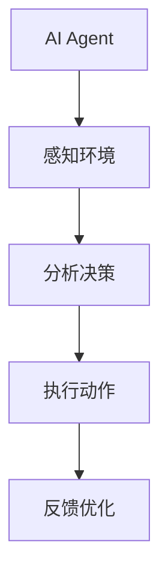
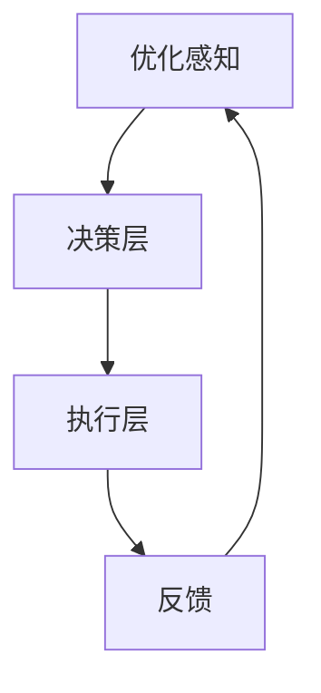
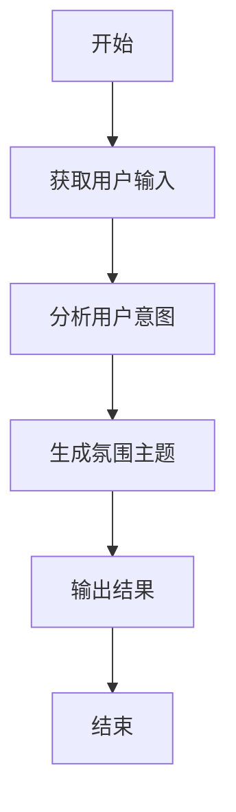
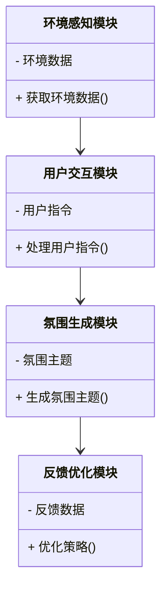
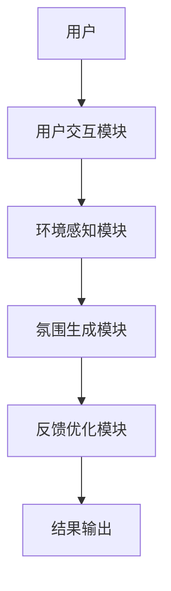

                 


# AI Agent在智能音响中的家庭氛围营造

**关键词**：AI Agent、家庭氛围、智能音响、机器学习、声音控制

**摘要**：本文将深入探讨AI Agent在智能音响中的应用，特别是在家庭氛围营造方面的作用。通过分析AI Agent的核心原理、家庭氛围营造的算法实现、系统架构设计以及实际项目案例，本文将为读者提供一个全面的技术视角，展示如何利用AI技术提升智能音响的功能，打造智能化的家庭氛围体验。

---

## 第一部分: AI Agent与家庭氛围营造的背景与概念

### 第1章: AI Agent的基本概念与家庭氛围营造的背景

#### 1.1 AI Agent的定义与核心原理

##### 1.1.1 什么是AI Agent
AI Agent（人工智能代理）是一种能够感知环境、自主决策并执行任务的智能实体。它可以理解用户的意图、处理复杂信息，并通过与环境的交互来实现预定目标。AI Agent的核心在于其智能性，能够通过学习和自适应优化自身行为。

##### 1.1.2 AI Agent的核心特征
- **自主性**：AI Agent能够自主决策，无需外部干预。
- **反应性**：能够实时感知环境变化并做出反应。
- **学习能力**：通过数据和反馈不断优化自身行为。
- **交互性**：支持多种交互方式，如语音、触控等。

##### 1.1.3 AI Agent与传统软件的区别
传统的软件程序是基于固定的逻辑和规则运行的，而AI Agent则具备学习和自适应能力，能够根据环境和用户行为动态调整自身的行为和决策。这种区别使得AI Agent在复杂环境中更具灵活性和适应性。



#### 1.2 家庭氛围营造的背景与需求

##### 1.2.1 智能家居的发展现状
智能家居的普及使得家庭环境更加智能化，用户对智能化生活的追求也越来越高。智能音响作为智能家居的重要组成部分，不仅是娱乐设备，更是家庭氛围营造的核心工具。

##### 1.2.2 用户对家庭氛围的需求分析
现代用户对家庭氛围的需求不仅仅是简单的音乐播放，而是希望通过智能音响实现多种场景下的氛围营造，例如：
- **娱乐场景**：看电影、听音乐时的沉浸式体验。
- **放松场景**：冥想、放松时的舒缓音乐。
- **工作场景**：专注工作时的背景音。

##### 1.2.3 AI Agent在家庭氛围营造中的作用
AI Agent可以通过感知用户的意图、环境数据和行为模式，智能地调整音响的输出，从而实现个性化、智能化的家庭氛围营造。例如，当用户情绪低落时，AI Agent可以推荐舒缓的音乐；当用户观看电影时，可以自动调整音效以增强观影体验。

---

### 第2章: 智能音响的发展与AI Agent的结合

#### 2.1 智能音响的技术演变

##### 2.1.1 传统音响的功能局限
传统音响的功能相对单一，主要局限于播放音乐和调节音量。用户需要手动操作，无法实现智能化的场景切换和氛围营造。

##### 2.1.2 智能音响的核心技术
现代智能音响集成了多种先进技术，包括：
- **语音识别**：通过语音指令实现设备控制。
- **智能调音**：根据场景和用户偏好自动调整音效。
- **网络连接**：支持在线音乐服务和智能家居生态。

##### 2.1.3 AI技术在智能音响中的应用
AI技术的应用使得智能音响能够实现更复杂的功能，例如：
- **智能语音交互**：通过自然语言处理技术理解用户的意图。
- **个性化推荐**：根据用户的听歌习惯推荐音乐。
- **环境感知**：通过传感器和AI算法感知用户的情绪和行为。

#### 2.2 AI Agent在智能音响中的应用场景

##### 2.2.1 智能语音交互
AI Agent通过自然语言处理技术，能够理解用户的意图并执行相应的操作。例如，用户可以说“播放轻音乐”，AI Agent会根据用户的偏好选择合适的音乐并播放。

##### 2.2.2 智能场景切换
AI Agent可以根据用户的指令或环境数据，自动切换到预设的场景模式。例如，用户可以说“开启电影模式”，AI Agent会调整音响的音效和灯光，以提供最佳的观影体验。

##### 2.2.3 智能氛围营造
AI Agent通过分析用户的偏好和环境数据，能够智能地调整音响的输出，营造出符合用户需求的氛围。例如，当用户情绪低落时，AI Agent可以推荐舒缓的音乐并调整音量，帮助用户放松心情。

---

## 第二部分: AI Agent在家庭氛围营造中的核心原理

### 第3章: AI Agent的核心原理与技术实现

#### 3.1 AI Agent的基本工作原理

##### 3.1.1 感知层: 传感器数据的采集与处理
AI Agent通过传感器（如麦克风、光线传感器）采集环境数据，并通过数据处理算法提取有用的信息。例如，麦克风可以采集用户的语音指令，光线传感器可以检测环境光线的变化。

##### 3.1.2 决策层: 状态分析与决策生成
AI Agent通过分析感知层获取的数据，结合用户的历史行为和偏好，生成决策。例如，AI Agent可以根据用户的语音指令和当前时间，决定播放哪种类型的音乐。

##### 3.1.3 执行层: 动作输出与效果反馈
AI Agent通过执行层（如音响设备）输出动作，并通过反馈机制不断优化自身的决策。例如，AI Agent可以根据用户的反馈（如点赞或负面评价）调整音乐播放列表。



#### 3.2 多模态交互技术在AI Agent中的应用

##### 3.2.1 语音识别与自然语言处理
语音识别技术可以将用户的语音指令转化为文本，自然语言处理技术可以理解文本的语义，从而实现智能交互。例如，用户说“播放轻音乐”，AI Agent会识别用户的意图并执行相应的操作。

##### 3.2.2 声学特征分析
AI Agent可以通过分析音频信号的特征（如音调、节奏）来判断用户的情绪和偏好。例如，AI Agent可以识别出用户喜欢哪种类型的音乐，并根据用户的喜好推荐歌曲。

##### 3.2.3 用户行为分析
通过分析用户的行为数据（如用户的听歌习惯、使用场景），AI Agent可以更好地理解用户的需求，并提供个性化的服务。例如，AI Agent可以根据用户的听歌历史推荐新的音乐。

---

### 第4章: 家庭氛围营造的算法原理

#### 4.1 基于AI Agent的氛围主题生成算法

##### 4.1.1 算法流程图


##### 4.1.2 算法实现的数学模型
$$ P(theme|input) = \frac{P(input|theme)P(theme)}{P(input)} $$
其中，$theme$ 表示氛围主题，$input$ 表示用户输入。

##### 4.1.3 算法实现的代码框架
```python
def 感知环境():
    # 获取环境数据
    return 环境数据

def 决策模块(环境数据):
    # 分析环境数据，生成决策
    return 动作
```

#### 4.2 基于反馈的氛围优化算法

##### 4.2.1 反馈机制的实现
用户可以通过评分或反馈（如“喜欢”或“不喜欢”）来对AI Agent的推荐进行反馈。AI Agent会根据反馈调整其推荐策略。

##### 4.2.2 基于强化学习的优化策略
$$ R(s, a) = \text{奖励函数} $$
其中，$s$ 表示状态，$a$ 表示动作。

##### 4.2.3 算法实现的代码框架
```python
def 反馈优化(反馈):
    # 根据反馈调整推荐策略
    return 新策略
```

---

## 第三部分: 系统架构设计与实现

### 第5章: 系统架构设计

#### 5.1 系统功能设计
- **环境感知模块**：通过传感器感知环境数据。
- **用户交互模块**：支持语音和触控交互。
- **氛围生成模块**：根据环境数据和用户需求生成氛围主题。
- **反馈优化模块**：根据用户反馈优化推荐策略。

#### 5.2 系统架构图


#### 5.3 系统接口设计
- **环境感知接口**：提供环境数据获取的API。
- **用户交互接口**：提供语音识别和自然语言处理的API。
- **氛围生成接口**：提供氛围主题生成的API。

#### 5.4 系统交互流程图


---

## 第四部分: 项目实战与优化

### 第6章: 项目实战

#### 6.1 环境搭建
- **硬件设备**：智能音响、麦克风、传感器。
- **软件工具**：Python、TensorFlow、Flask。

#### 6.2 核心代码实现

##### 6.2.1 感知环境模块
```python
def get_environment_data():
    # 获取环境数据，例如温度、光线强度等
    return {"温度": 25, "光线强度": 500}
```

##### 6.2.2 用户交互模块
```python
def process_voice_command(command):
    # 处理用户的语音指令
    return "播放轻音乐"
```

##### 6.2.3 氛围生成模块
```python
def generate_mood_theme(command):
    # 根据用户指令生成氛围主题
    return "放松"
```

#### 6.3 案例分析
假设用户说“播放轻音乐”，AI Agent会根据用户的指令生成“放松”氛围主题，并推荐相应的音乐列表。同时，AI Agent会通过传感器感知环境数据（如光线强度、温度等），进一步优化音乐的选择和播放效果。

---

### 第7章: 优化与展望

#### 7.1 现有技术的局限性
- **数据依赖性**：AI Agent的性能依赖于数据的质量和数量。
- **实时性问题**：在某些场景下，AI Agent的响应速度可能不够快。

#### 7.2 未来的发展方向
- **增强学习**：通过强化学习进一步优化AI Agent的决策能力。
- **多设备协同**：实现智能音响与其他智能家居设备的协同工作，进一步提升家庭氛围营造的效果。

#### 7.3 实际应用中的注意事项
- **隐私保护**：在处理用户数据时，必须注意隐私保护。
- **用户体验**：确保AI Agent的交互设计符合用户习惯。

---

## 第五部分: 总结与展望

### 第8章: 总结

#### 8.1 核心内容回顾
本文详细介绍了AI Agent在智能音响中的应用，特别是在家庭氛围营造方面的作用。通过分析AI Agent的核心原理、系统架构设计以及实际项目案例，展示了如何利用AI技术提升智能音响的功能。

#### 8.2 未来展望
随着AI技术的不断发展，AI Agent在家庭氛围营造中的应用将更加广泛和深入。未来，通过结合更多的传感器和数据源，AI Agent将能够实现更智能、更个性化的家庭氛围营造。

---

通过本文的详细分析，读者可以全面了解AI Agent在智能音响中的家庭氛围营造的应用，并掌握相关的技术实现方法。希望本文能够为相关领域的研究和实践提供有价值的参考。

