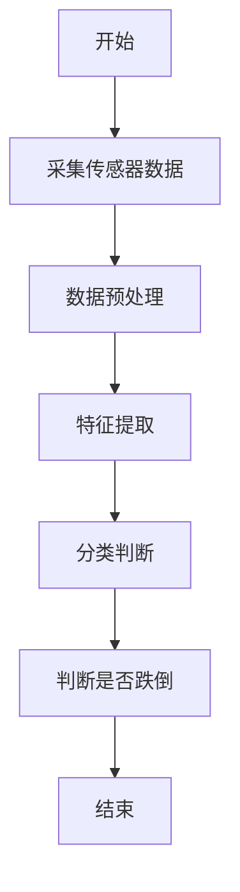
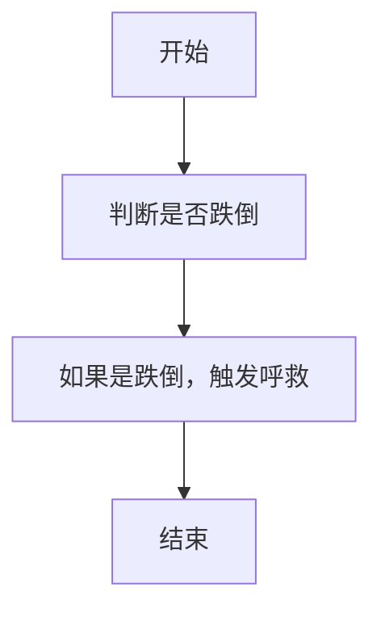
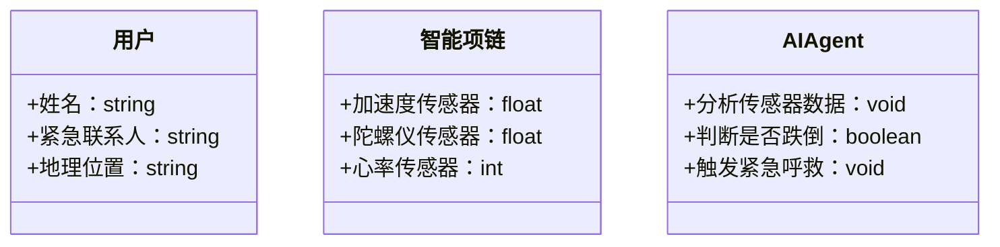
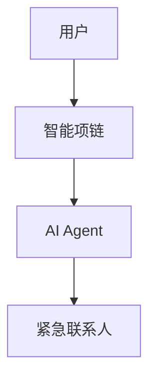
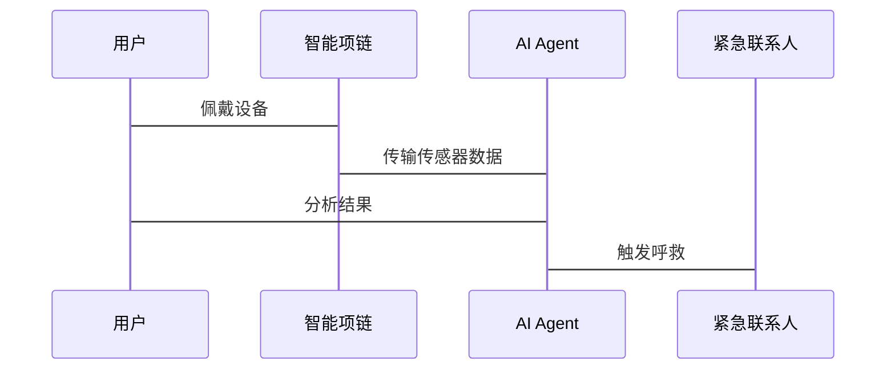

                 


# AI Agent在智能项链中的跌倒检测与紧急呼救

> 关键词：AI Agent、智能项链、跌倒检测、紧急呼救、传感器数据、算法实现

> 摘要：本文详细探讨了AI Agent在智能项链中的跌倒检测与紧急呼救系统的实现过程，从背景分析到算法原理，再到系统设计与项目实战，最后结合优化与扩展，全面阐述了这一技术的应用价值与实现细节。

---

# 第一部分：AI Agent在智能项链中的跌倒检测与紧急呼救概述

## 第1章：背景介绍与问题分析

### 1.1 跌倒检测的重要性

#### 1.1.1 跌倒对老年人健康的影响
- 跌倒是老年人致残和致死的主要原因之一。
- 跌倒检测技术能够及时发现跌倒事件，减少二次伤害的风险。

#### 1.1.2 智能设备在跌倒检测中的作用
- 智能设备（如智能手环、智能项链）通过传感器采集数据，实时监测用户的运动状态。
- 通过AI技术分析传感器数据，实现跌倒检测与预警。

#### 1.1.3 AI Agent在智能项链中的应用前景
- AI Agent能够实时分析传感器数据，快速做出判断并触发紧急呼救机制。
- 结合物联网技术，AI Agent可以与家庭监控系统联动，提供全方位的健康保障。

### 1.2 问题背景与描述

#### 1.2.1 跌倒检测的定义与分类
- 跌倒检测：通过传感器数据判断用户是否发生跌倒行为。
- 跌倒分类：根据跌倒的严重程度、方向和姿势进行分类。

#### 1.2.2 智能项链的功能需求
- 实时监测用户的运动状态。
- 快速判断是否发生跌倒。
- 在发生跌倒时，自动触发紧急呼救机制。

#### 1.2.3 紧急呼救的实现方式
- 触发紧急联系人或医疗机构。
- 发送地理位置信息，便于救援人员快速到达。

### 1.3 问题解决与边界分析

#### 1.3.1 AI Agent在跌倒检测中的解决方案
- 基于传感器数据的AI算法，实时分析用户的运动状态。
- 判断跌倒行为，触发紧急呼救机制。

#### 1.3.2 系统边界与功能范围
- 系统边界：仅关注跌倒检测与紧急呼救功能。
- 功能范围：传感器数据采集、跌倒检测算法、紧急呼救机制。

#### 1.3.3 紧急呼救的实现边界
- 紧急呼救仅在检测到跌倒事件后触发。
- 紧急呼救功能不涉及其他场景（如用户手动触发）。

### 1.4 核心概念与组成要素

#### 1.4.1 AI Agent的核心概念
- AI Agent：具备自主决策能力的智能体。
- 在智能项链中的AI Agent：实时分析传感器数据，判断跌倒行为并触发紧急呼救。

#### 1.4.2 智能项链的组成结构
- 传感器模块：采集用户的运动数据。
- AI算法模块：分析传感器数据，判断是否发生跌倒。
- 紧急呼救模块：在检测到跌倒时，触发紧急联系人或医疗机构。

#### 1.4.3 跌倒检测与呼救系统的核心要素
- 传感器数据：加速度、陀螺仪、心率等。
- AI算法：跌倒检测算法、紧急呼救逻辑。
- 通信模块：与外部系统（如手机、云端）通信。

---

# 第二部分：AI Agent的核心概念与原理

## 第2章：AI Agent的原理与特征

### 2.1 AI Agent的基本原理

#### 2.1.1 AI Agent的定义与分类
- AI Agent：具备自主决策能力的智能体。
- 分类：基于智能水平，分为简单AI Agent和复杂AI Agent。

#### 2.1.2 AI Agent的核心算法
- 传感器数据分析算法。
- 跌倒检测算法。
- 紧急呼救逻辑。

#### 2.1.3 AI Agent在智能项链中的具体实现
- 传感器数据采集：加速度、陀螺仪、心率。
- 数据预处理：滤波、特征提取。
- 跌倒检测：基于机器学习的分类算法。

### 2.2 AI Agent的特征对比

#### 2.2.1 智能性与实时性的对比
- 智能性：AI Agent具备自主判断能力。
- 实时性：跌倒检测需要实时完成。

#### 2.2.2 精准性与稳定性的对比
- 精准性：跌倒检测算法的准确率。
- 稳定性：系统在复杂环境下的稳定性。

#### 2.2.3 可扩展性与易用性的对比
- 可扩展性：系统支持的功能扩展。
- 易用性：用户界面的友好程度。

### 2.3 实体关系与系统架构

#### 2.3.1 ER实体关系图
```mermaid
er
actor: 用户
agent: AI Agent
device: 智能项链

actor --> device: 使用智能项链
device --> agent: 传输传感器数据
agent --> actor: 触发跌倒检测
actor --> agent: 配置紧急联系人
```

---

## 第3章：算法原理与数学模型

### 3.1 跌倒检测算法

#### 3.1.1 算法流程图


#### 3.1.2 算法实现代码
```python
import numpy as np
from sklearn import svm

# 数据预处理
def preprocess(data):
    # 滤波处理
    filtered_data = np.convolve(data, np.ones(3)/3, mode='same')
    return filtered_data

# 特征提取
def extract_features(data):
    features = []
    for window in data:
        # 提取加速度特征
        features.append([np.mean(window), np.std(window)])
    return features

# 分类器训练
model = svm.SVC()
```

#### 3.1.3 数学模型与公式
- 特征提取：基于滑动窗口的均值、标准差计算。
- 分类器：支持向量机（SVM）分类器。

#### 3.1.4 举例说明
- 示例数据：用户在正常行走和跌倒时的加速度数据。
- 分类结果：分类器输出跌倒概率。

### 3.2 紧急呼救算法

#### 3.2.1 算法流程图


#### 3.2.2 算法实现代码
```python
def emergency_call():
    import smtplib
    from email.mime.text import MIMEText
    # 发送邮件通知
    msg = MIMEText("紧急呼救！请立即联系用户。", 'plain', 'utf-8')
    msg['Subject'] = '跌倒检测'
    msg['From'] = 'admin@example.com'
    msg['To'] = 'emergency@example.com'
    server = smtplib.SMTP('smtp.example.com', 587)
    server.starttls()
    server.login('admin@example.com', 'password')
    server.sendmail('admin@example.com', 'emergency@example.com', msg.as_string())
    server.quit()
```

#### 3.2.3 数学模型与公式
- 呼救触发条件：跌倒概率 > 阈值。
- 呼救方式：邮件、短信、电话。

---

## 第4章：系统分析与架构设计

### 4.1 问题场景介绍

#### 4.1.1 系统目标
- 实现跌倒检测与紧急呼救功能。
- 提供实时监测与预警。

#### 4.1.2 项目介绍
- 智能项链硬件设计。
- 软件系统设计。

### 4.2 系统功能设计

#### 4.2.1 领域模型


#### 4.2.2 系统架构设计


### 4.3 系统接口设计

#### 4.3.1 接口定义
- 传感器数据接口：获取加速度、陀螺仪、心率数据。
- 紧急呼救接口：触发呼救功能。

#### 4.3.2 接口实现
- 数据接口：REST API。
- 呼救接口：通过SMTP发送邮件。

### 4.4 系统交互设计

#### 4.4.1 交互序列图


---

## 第5章：项目实战与代码实现

### 5.1 环境安装

#### 5.1.1 安装Python环境
- 安装Python 3.8及以上版本。
- 安装必要的库：numpy、scikit-learn、smtplib。

#### 5.1.2 安装智能项链硬件
- 传感器模块：加速度、陀螺仪、心率传感器。
- 通信模块：Wi-Fi或蓝牙模块。

### 5.2 核心代码实现

#### 5.2.1 传感器数据采集代码
```python
import serial

# 连接智能项链设备
ser = serial.Serial('COM3', 9600)

# 读取传感器数据
while True:
    data = ser.readline().decode('utf-8')
    print(data)
```

#### 5.2.2 跌倒检测算法实现
```python
from sklearn import svm

# 训练数据
X_train = [...]  # 特征数据
y_train = [...]  # 标签（是否跌倒）

# 训练模型
model = svm.SVC()
model.fit(X_train, y_train)

# 预测
X_test = [...]  # 待测数据
y_pred = model.predict(X_test)
print(y_pred)
```

### 5.3 案例分析与实际应用

#### 5.3.1 实际案例分析
- 案例1：用户正常行走，系统无误报。
- 案例2：用户跌倒，系统触发紧急呼救。

#### 5.3.2 代码应用解读
- 传感器数据采集：实时获取用户的运动数据。
- 跌倒检测算法：分析数据并判断是否跌倒。
- 紧急呼救机制：在检测到跌倒后，触发呼救功能。

### 5.4 项目总结

#### 5.4.1 项目成果
- 成功实现跌倒检测与紧急呼救功能。
- 提供实时监测与预警。

#### 5.4.2 经验与教训
- 算法优化：提高检测精度。
- 系统稳定性：确保在复杂环境下稳定运行。

---

## 第6章：优化与扩展

### 6.1 性能优化

#### 6.1.1 算法优化
- 提高跌倒检测的准确率。
- 减少误报和漏报。

#### 6.1.2 系统优化
- 优化传感器数据采集频率。
- 提高系统的实时性和响应速度。

### 6.2 功能扩展

#### 6.2.1 功能扩展方向
- 健康监测：心率、血压等数据监测。
- 健康报告：生成健康报告并发送给医生。

#### 6.2.2 实现方案
- 扩展传感器类型。
- 增加新的功能模块。

### 6.3 未来研究方向

#### 6.3.1 新的AI算法研究
- 深度学习算法在跌倒检测中的应用。
- 图神经网络在智能项链中的应用。

#### 6.3.2 系统扩展研究
- 多设备联动：与其他智能家居设备联动。
- 云平台集成：将数据上传至云平台，进行大数据分析。

---

## 第7章：结论与展望

### 7.1 结论

#### 7.1.1 核心结论
- AI Agent在智能项链中的跌倒检测与紧急呼救系统能够有效减少跌倒事件的伤害。
- 系统具备实时性、精准性和稳定性。

#### 7.1.2 技术总结
- 传感器数据采集与分析是系统的核心。
- AI算法是系统的关键技术。

### 7.2 未来展望

#### 7.2.1 技术进步
- 更先进的AI算法：如深度学习、图神经网络。
- 更高效的传感器技术：更高精度、更低功耗。

#### 7.2.2 应用扩展
- 更多健康监测功能：如心率监测、血压监测。
- 更多应用场景：如医疗健康、体育运动。

---

## 附录：参考文献与拓展阅读

### 附录A：参考文献
1. 《人工智能导论》
2. 《传感器原理与应用》
3. 《机器学习实战》

### 附录B：拓展阅读
- 智能设备在医疗健康中的应用。
- AI在跌倒检测中的最新研究。

---

通过以上目录结构，您可以逐步展开每个章节的内容，结合实际案例和详细的技术实现，深入探讨AI Agent在智能项链中的跌倒检测与紧急呼救系统的实现过程。

