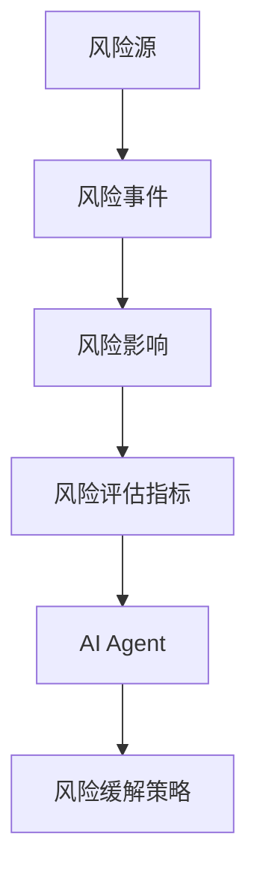
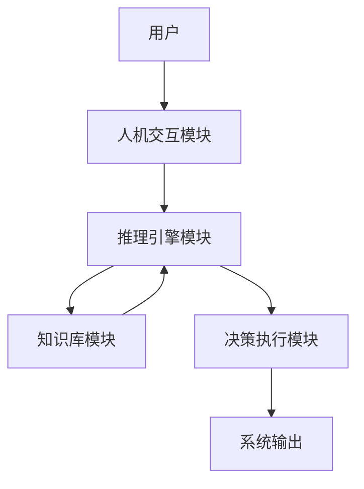

                 


# AI Agent在智能风险评估中的应用

> **关键词**：AI Agent、智能风险评估、知识图谱、生成对抗网络、强化学习、风险缓解策略、系统架构设计

> **摘要**：本文详细探讨了AI Agent在智能风险评估中的应用，从背景、核心概念、算法原理、系统架构到项目实战，系统地分析了AI Agent如何通过知识表示、逻辑推理和多智能体协作提升风险评估的效率和准确性。文章结合实际案例和数学模型，深入剖析了AI Agent在风险评估中的优势和挑战，为读者提供了从理论到实践的全面解读。

---

## 第一部分: AI Agent在智能风险评估中的应用概述

### 第1章: AI Agent与智能风险评估的背景介绍

#### 1.1 AI Agent的基本概念与核心原理

##### 1.1.1 AI Agent的定义与分类
AI Agent（人工智能代理）是指能够感知环境、自主决策并采取行动以实现特定目标的智能实体。根据功能和应用场景的不同，AI Agent可以分为以下几类：
- **简单反射型Agent**：基于固定的规则库做出反应，适用于规则简单、环境稳定的场景。
- **基于模型的反射型Agent**：通过构建环境模型来推理和决策，适用于复杂动态环境。
- **目标驱动型Agent**：以目标为导向，通过优化算法实现目标。
- **实用驱动型Agent**：以效用函数为驱动，最大化效用值。

##### 1.1.2 AI Agent的核心特征与优势
AI Agent的核心特征包括：
- **自主性**：无需外部干预，自主完成任务。
- **反应性**：能够实时感知环境变化并做出反应。
- **目标导向性**：基于目标进行决策和行动。
- **学习能力**：通过经验不断优化自身行为。

AI Agent的优势在于其能够处理复杂、动态和不确定的环境，能够在实时场景中快速做出决策。

##### 1.1.3 AI Agent与传统风险评估方法的对比
传统风险评估方法通常依赖于人工分析和静态模型，存在以下问题：
- **效率低下**：人工分析耗时且容易出错。
- **动态性差**：难以应对环境的快速变化。
- **覆盖性不足**：难以考虑所有可能的风险因素。

AI Agent通过动态感知和自主决策，能够显著提升风险评估的效率和准确性。

#### 1.2 智能风险评估的背景与需求

##### 1.2.1 风险评估的传统方法与局限性
传统风险评估方法通常基于概率论和统计学，主要依赖专家经验和历史数据。然而，这种方法在面对复杂系统和动态环境时，往往难以覆盖所有可能的风险因素，且难以实时更新。

##### 1.2.2 智能风险评估的必要性与应用场景
随着信息技术的快速发展，复杂系统的风险评估需求日益增加。智能风险评估能够实时感知环境变化，动态调整评估模型，适用于金融、医疗、交通、能源等领域。

##### 1.2.3 AI Agent在智能风险评估中的角色与价值
AI Agent在智能风险评估中的角色主要体现在以下几个方面：
- **数据收集与处理**：实时采集环境数据并进行预处理。
- **知识表示与推理**：构建知识图谱并进行逻辑推理。
- **决策与行动**：基于推理结果制定风险缓解策略。

AI Agent通过以上功能，能够显著提升风险评估的效率和准确性。

### 1.3 本章小结
本章主要介绍了AI Agent的基本概念、核心特征及其在智能风险评估中的应用背景。通过对比传统风险评估方法的局限性，突出了AI Agent在复杂动态环境中的优势。

---

## 第二部分: AI Agent的核心概念与原理

### 第2章: AI Agent的核心概念与系统架构

#### 2.1 AI Agent的核心概念

##### 2.1.1 知识表示与推理机制
知识表示是AI Agent的核心之一，常用的知识表示方法包括：
- **逻辑表示**：通过谓词逻辑表示知识。
- **语义网络**：通过节点和边表示概念及其关系。
- **知识图谱**：通过图结构表示实体及其属性。

推理机制是基于知识表示进行逻辑推理，常用的推理方法包括：
- **演绎推理**：从一般到特殊的推理。
- **归纳推理**：从特殊到一般的推理。
- ** abduction推理**：基于最佳解释的推理。

##### 2.1.2 多智能体协作与通信
多智能体协作是AI Agent在复杂环境中的重要能力，协作方式包括：
- **分布式协作**：各智能体独立决策并协同行动。
- **集中式协作**：通过中央控制协调各智能体行动。
- **混合协作**：结合分布式和集中式的优势。

通信机制是多智能体协作的基础，常用的通信方式包括：
- **直接通信**：智能体之间直接交换信息。
- **间接通信**：通过中间媒介传递信息。

##### 2.1.3 动态环境下的自适应能力
AI Agent需要具备在动态环境中自适应的能力，主要体现在：
- **实时感知**：快速感知环境变化。
- **动态推理**：根据环境变化动态调整推理过程。
- **自适应决策**：根据环境变化调整决策策略。

#### 2.2 AI Agent的系统架构

##### 2.2.1 分层架构与模块化设计
AI Agent的系统架构通常采用分层设计，主要包括：
- **感知层**：负责数据采集和环境感知。
- **推理层**：负责知识表示和逻辑推理。
- **决策层**：负责制定决策策略。
- **执行层**：负责执行决策并反馈结果。

模块化设计能够提高系统的可扩展性和可维护性。

##### 2.2.2 知识库与推理引擎的实现
知识库是AI Agent的核心知识存储，常用的实现方法包括：
- **规则库**：基于规则的知识表示。
- **知识图谱**：基于图结构的知识表示。
- **数据库**：基于关系型数据库的知识存储。

推理引擎是基于知识库进行推理的核心模块，常用的推理算法包括：
- **规则推理**：基于规则库进行推理。
- **逻辑推理**：基于谓词逻辑进行推理。
- **概率推理**：基于概率论进行推理。

##### 2.2.3 人机交互界面的设计与优化
人机交互界面是AI Agent与用户交互的重要组成部分，设计原则包括：
- **简洁性**：界面设计简洁明了。
- **直观性**：操作直观易懂。
- **反馈性**：提供及时的用户反馈。

##### 2.3 AI Agent在风险评估中的实体关系图


#### 2.4 本章小结
本章详细介绍了AI Agent的核心概念和系统架构，重点分析了知识表示、推理机制、多智能体协作和系统架构设计。

---

## 第三部分: AI Agent的算法原理与数学模型

### 第3章: AI Agent的算法原理与实现

#### 3.1 知识表示与推理算法

##### 3.1.1 基于图论的知识表示方法
基于图论的知识表示方法常用图结构表示实体及其关系，例如知识图谱。图的表示方法包括：
- **邻接矩阵**：表示节点之间的直接关系。
- **邻接列表**：表示节点之间的关系列表。
- **路径表示**：表示节点之间的路径关系。

##### 3.1.2 逻辑推理与概率推理的对比
逻辑推理基于逻辑规则进行推理，结果确定。概率推理基于概率论进行推理，结果具有不确定性。

##### 3.1.3 知识图谱的构建与优化
知识图谱的构建方法包括：
- **数据抽取**：从结构化数据中抽取实体和关系。
- **实体对齐**：将不同数据源中的实体对齐。
- **知识融合**：将不同数据源中的知识进行融合。

知识图谱的优化方法包括：
- **去噪处理**：去除噪声数据。
- **冗余消除**：消除冗余数据。
- **权重调整**：调整边的权重。

#### 3.2 多智能体协作算法

##### 3.2.1 基于博弈论的多智能体协作
基于博弈论的多智能体协作方法包括：
- **纳什均衡**：所有智能体策略的最优选择。
- **合作博弈**：智能体之间通过合作实现共同目标。
- **非合作博弈**：智能体之间通过竞争实现个体目标。

##### 3.2.2 分布式计算与通信协议
分布式计算是多智能体协作的基础，常用的通信协议包括：
- **RPC（远程过程调用）**：通过远程调用实现协作。
- **HTTP/HTTPS**：通过HTTP协议实现协作。
- **消息队列**：通过消息队列实现协作。

##### 3.2.3 联合推理与决策机制
联合推理是多智能体协作的关键，常用的决策机制包括：
- **投票机制**：通过投票决定最终决策。
- **加权平均**：通过权重计算决定最终决策。
- **协商机制**：通过协商达成一致决策。

#### 3.3 动态环境下的自适应算法

##### 3.3.1 基于强化学习的自适应策略
强化学习是一种常用的自适应算法，其核心是通过与环境的交互获得奖励，优化策略。强化学习的数学模型如下：
$$
Q(s, a) = r + \gamma \max Q(s', a')
$$
其中，\( Q(s, a) \) 表示状态 \( s \) 下动作 \( a \) 的价值，\( r \) 表示奖励，\( \gamma \) 表示折扣因子。

##### 3.3.2 基于生成对抗网络的风险评估模型
生成对抗网络（GAN）是一种常用的生成模型，其核心是通过生成器和判别器的对抗训练生成数据。生成对抗网络的数学模型如下：
$$
\min_{G} \max_{D} \mathbb{E}_{x \sim p_{\text{data}}}[ \log D(x)] + \mathbb{E}_{z \sim p_{z}}[ \log (1 - D(G(z)))]
$$
其中，\( G \) 表示生成器，\( D \) 表示判别器。

##### 3.3.3 动态权重调整方法
动态权重调整方法是基于风险评估指标的动态变化调整权重。常用的动态权重调整方法包括：
- **滑动平均**：通过滑动平均调整权重。
- **指数加权平均**：通过指数加权平均调整权重。
- **自适应权重调整**：根据环境变化自适应调整权重。

#### 3.4 AI Agent的风险评估数学模型

##### 3.4.1 风险评估指标的权重分配
风险评估指标的权重分配方法包括：
- **专家评分法**：通过专家评分确定权重。
- **层次分析法（AHP）**：通过层次分析确定权重。
- **熵值法**：通过熵值法确定权重。

##### 3.4.2 基于概率论的风险评估公式
基于概率论的风险评估公式如下：
$$
R = \sum_{i=1}^{n} w_i \cdot P_i
$$
其中，\( R \) 表示风险值，\( w_i \) 表示指标 \( i \) 的权重，\( P_i \) 表示指标 \( i \) 的概率。

##### 3.4.3 基于图论的网络风险传播模型
网络风险传播模型是基于图结构的风险传播模型，其数学模型如下：
$$
R_{i} = \sum_{j=1}^{m} w_{ij} \cdot R_{j}
$$
其中，\( R_i \) 表示节点 \( i \) 的风险值，\( w_{ij} \) 表示节点 \( i \) 和节点 \( j \) 之间的权重。

#### 3.5 本章小结
本章详细介绍了AI Agent的算法原理与实现，重点分析了知识表示与推理算法、多智能体协作算法以及动态环境下的自适应算法。

---

## 第四部分: AI Agent的系统架构与实现

### 第4章: AI Agent的系统架构设计

#### 4.1 系统功能模块划分

##### 4.1.1 知识库模块
知识库模块是AI Agent的核心模块，负责存储和管理知识。知识库模块的主要功能包括：
- **知识存储**：存储实体、关系和属性。
- **知识查询**：根据查询条件查询知识库。
- **知识更新**：根据新数据更新知识库。

##### 4.1.2 推理引擎模块
推理引擎模块是基于知识库进行推理的核心模块，主要功能包括：
- **逻辑推理**：基于逻辑规则进行推理。
- **概率推理**：基于概率论进行推理。
- **知识图谱推理**：基于知识图谱进行推理。

##### 4.1.3 人机交互模块
人机交互模块是AI Agent与用户交互的接口，主要功能包括：
- **用户输入**：接收用户的输入指令。
- **用户输出**：输出推理结果和决策建议。
- **用户反馈**：处理用户的反馈信息。

##### 4.1.4 决策执行模块
决策执行模块是基于推理结果制定决策并执行的模块，主要功能包括：
- **决策制定**：根据推理结果制定决策。
- **决策执行**：执行决策并反馈结果。
- **结果反馈**：将执行结果反馈给推理引擎模块。

#### 4.2 系统功能设计（领域模型）

##### 4.2.1 领域模型的设计
领域模型是系统功能设计的核心，常用的知识表示方法包括：
- **实体-关系-值模型（ER模型）**：表示实体、关系和值。
- **对象-关系模型**：表示对象和关系。
- **面向服务的体系结构（SOA）**：基于服务进行设计。

##### 4.2.2 领域模型的实现
领域模型的实现方法包括：
- **基于规则的实现**：通过规则表示领域知识。
- **基于知识图谱的实现**：通过知识图谱表示领域知识。
- **基于数据库的实现**：通过数据库表示领域知识。

#### 4.3 系统架构设计

##### 4.3.1 系统架构的分层设计
系统架构通常采用分层设计，主要包括：
- **数据层**：负责数据的存储和访问。
- **业务逻辑层**：负责业务逻辑的实现。
- **表现层**：负责用户界面的实现。

##### 4.3.2 系统架构的模块化设计
系统架构的模块化设计包括：
- **知识库模块**：负责知识的存储和管理。
- **推理引擎模块**：负责知识的推理和分析。
- **人机交互模块**：负责与用户的交互。
- **决策执行模块**：负责决策的制定和执行。

#### 4.4 系统接口设计

##### 4.4.1 系统接口的设计
系统接口设计通常采用RESTful API，常用接口包括：
- **GET**：获取数据。
- **POST**：提交数据。
- **PUT**：更新数据。
- **DELETE**：删除数据。

##### 4.4.2 系统接口的实现
系统接口的实现方法包括：
- **基于HTTP的实现**：通过HTTP协议实现接口。
- **基于RPC的实现**：通过RPC协议实现接口。
- **基于消息队列的实现**：通过消息队列实现接口。

#### 4.5 系统交互设计

##### 4.5.1 系统交互的流程图


##### 4.5.2 系统交互的实现
系统交互的实现方法包括：
- **同步交互**：用户输入后立即得到结果。
- **异步交互**：用户输入后需要等待结果。
- **事件驱动交互**：基于事件进行交互。

#### 4.6 本章小结
本章详细介绍了AI Agent的系统架构设计，重点分析了系统功能模块划分、系统功能设计、系统架构设计、系统接口设计和系统交互设计。

---

## 第五部分: 项目实战

### 第5章: 项目实战

#### 5.1 项目介绍

##### 5.1.1 项目背景
本项目旨在开发一个基于AI Agent的智能风险评估系统，应用于金融领域的风险评估。

##### 5.1.2 项目目标
- 实现基于知识图谱的风险评估模型。
- 实现基于生成对抗网络的风险评估模型。
- 实现基于强化学习的风险评估模型。

##### 5.1.3 项目技术选型
- **编程语言**：Python
- **框架**：TensorFlow、PyTorch
- **数据库**：MySQL、MongoDB
- **工具**：Jupyter Notebook、IDEA

#### 5.2 核心系统实现

##### 5.2.1 环境安装
```bash
pip install numpy
pip install pandas
pip install tensorflow
pip install pytorch
pip install pymongo
pip install mysql-connector
```

##### 5.2.2 核心代码实现

###### 5.2.2.1 知识图谱构建
```python
import networkx as nx
G = nx.Graph()
G.add_nodes_from(['风险源', '风险事件', '风险影响', '风险评估指标'])
G.add_edges_from([('风险源', '风险事件'), ('风险事件', '风险影响'), ('风险影响', '风险评估指标')])
```

###### 5.2.2.2 基于生成对抗网络的风险评估模型
```python
import tensorflow as tf
from tensorflow.keras import layers

# 定义生成器
def generator():
    model = tf.keras.Sequential()
    model.add(layers.Dense(256, activation='relu', input_shape=(100,)))
    model.add(layers.Dense(128, activation='relu'))
    model.add(layers.Dense(64, activation='relu'))
    model.add(layers.Dense(1, activation='sigmoid'))
    return model

# 定义判别器
def discriminator():
    model = tf.keras.Sequential()
    model.add(layers.Dense(64, activation='relu', input_shape=(1,)))
    model.add(layers.Dense(32, activation='relu'))
    model.add(layers.Dense(1, activation='sigmoid'))
    return model
```

###### 5.2.2.3 基于强化学习的自适应策略
```python
import numpy as np

# 定义状态空间
state_space = 5

# 定义动作空间
action_space = 3

# 定义Q-learning算法
class QLearning:
    def __init__(self):
        self.q_table = np.zeros((state_space, action_space))

    def choose_action(self, state):
        return np.argmax(self.q_table[state])

    def update_q_table(self, state, action, reward):
        self.q_table[state, action] += reward
```

#### 5.3 项目实现步骤

##### 5.3.1 数据采集与预处理
- 数据采集：从金融数据库中采集风险数据。
- 数据清洗：清洗数据中的噪声。
- 数据转换：将数据转换为模型所需的格式。

##### 5.3.2 模型训练与优化
- 模型训练：训练生成对抗网络和强化学习模型。
- 模型优化：调整模型参数以提高准确率。
- 模型评估：评估模型的性能。

##### 5.3.3 系统集成与测试
- 系统集成：将各模块集成到系统中。
- 系统测试：测试系统的功能和性能。

#### 5.4 项目案例分析与详细解读

##### 5.4.1 案例背景
假设我们有一个金融领域的风险评估项目，需要评估某公司的财务风险。

##### 5.4.2 数据分析
分析公司的财务数据，构建知识图谱，识别潜在风险。

##### 5.4.3 风险评估
基于知识图谱和生成对抗网络进行风险评估，生成风险评估报告。

##### 5.4.4 风险缓解策略
根据风险评估结果，制定风险缓解策略。

#### 5.5 项目小结
本章通过实际案例详细介绍了AI Agent在智能风险评估中的应用，展示了从数据采集、模型训练到系统集成的完整过程。

---

## 第六部分: 最佳实践与总结

### 第6章: 最佳实践与总结

#### 6.1 最佳实践

##### 6.1.1 知识表示与推理
- 使用知识图谱进行知识表示。
- 采用逻辑推理和概率推理相结合的方法。

##### 6.1.2 多智能体协作
- 采用分布式协作方式。
- 使用可靠的通信协议。

##### 6.1.3 动态环境下的自适应
- 使用强化学习进行自适应。
- 采用动态权重调整方法。

#### 6.2 总结

##### 6.2.1 本文总结
本文详细探讨了AI Agent在智能风险评估中的应用，从背景、核心概念、算法原理到系统架构和项目实战，系统地分析了AI Agent如何通过知识表示、逻辑推理和多智能体协作提升风险评估的效率和准确性。

##### 6.2.2 未来展望
未来，随着AI技术的不断发展，AI Agent在智能风险评估中的应用将更加广泛和深入，可能会出现以下趋势：
- **更复杂的多智能体协作**：多智能体协作将更加复杂和智能化。
- **更先进的自适应算法**：自适应算法将更加先进和高效。
- **更强大的知识表示方法**：知识表示方法将更加丰富和多样化。

#### 6.3 注意事项

##### 6.3.1 知识表示的准确性
知识表示的准确性是AI Agent的核心，需要谨慎处理。

##### 6.3.2 多智能体协作的复杂性
多智能体协作的复杂性较高，需要精心设计和优化。

##### 6.3.3 动态环境下的稳定性
动态环境下的稳定性是AI Agent的重要特性，需要重点关注。

#### 6.4 拓展阅读

##### 6.4.1 推荐书籍
- 《人工智能：一种现代的方法》
- 《机器学习实战》
- 《深度学习》

##### 6.4.2 推荐论文
- "A survey on Generative Adversarial Networks"
- "Deep Reinforcement Learning for Autonomous Systems"
- "Knowledge Graphs and Reasoning"

#### 6.5 本章小结
本章总结了AI Agent在智能风险评估中的应用，并提出了未来的发展趋势和注意事项，同时推荐了相关的拓展阅读资料。

---

## 第七部分: 结束语

### 第7章: 结束语

AI Agent在智能风险评估中的应用前景广阔，随着AI技术的不断发展，AI Agent将能够在更多领域发挥重要作用。本文通过系统地分析AI Agent的核心概念、算法原理和系统架构，为读者提供了从理论到实践的全面解读。希望本文能够为相关领域的研究和应用提供有益的参考和启示。

---

通过以上思考过程，我们可以看到，AI Agent在智能风险评估中的应用是一个复杂而有趣的领域，需要结合多方面的知识和技能。希望本文能够为读者提供有价值的参考，帮助他们更好地理解和应用AI Agent技术。

