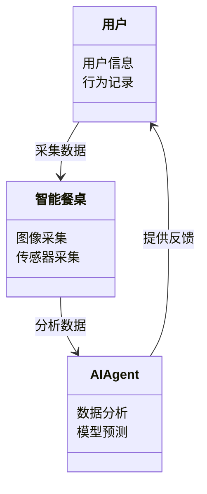

                 


# AI Agent在智能餐桌中的饮食行为分析

> 关键词：AI Agent, 饮食行为分析, 智能餐桌, 数据分析, 机器学习

> 摘要：本文将探讨AI Agent在智能餐桌中的饮食行为分析，从背景介绍、核心概念、算法原理、系统分析与架构设计、项目实战到最佳实践，全面解析AI Agent在智能餐桌中的应用及其对饮食行为分析的深远影响。

---

## 第一部分: AI Agent在智能餐桌中的饮食行为分析概述

### 第1章: 背景介绍

#### 1.1 问题背景
饮食行为分析是理解人类健康、饮食习惯和生活方式的重要手段。随着人工智能技术的发展，AI Agent（智能体）在饮食行为分析中的应用逐渐成为研究热点。智能餐桌作为一种新兴的技术产品，通过传感器、摄像头和AI算法，能够实时采集和分析用户的饮食行为数据，为用户提供个性化的饮食建议和健康管理服务。

#### 1.2 问题描述
传统饮食行为分析依赖于人工记录和统计，存在数据不完整、分析效率低等问题。AI Agent通过智能传感器和机器学习算法，能够实时采集和分析用户的饮食行为数据，包括食物种类、摄入量、用餐时间等，从而实现更高效、更精准的饮食行为分析。

#### 1.3 问题解决
AI Agent在智能餐桌中的应用，通过自动化数据采集和分析，能够实时监测用户的饮食行为，并提供个性化的建议。例如，AI Agent可以根据用户的饮食习惯和健康状况，推荐适合的饮食计划和健康建议。

#### 1.4 边界与外延
智能餐桌的边界包括数据采集、分析和反馈，而外延则涉及用户的饮食习惯、健康管理和智能设备的集成。

---

### 第2章: 核心概念与联系

#### 2.1 AI Agent的原理
AI Agent通过传感器和摄像头采集用户的行为数据，利用机器学习算法进行分析和预测，从而实现对饮食行为的实时监测和反馈。

#### 2.2 饮食行为分析的原理
饮食行为分析基于多模态数据，包括图像识别、语音识别和时间序列分析，结合用户的历史数据，构建个性化的饮食模型。

#### 2.3 核心概念对比分析
以下是AI Agent和传统饮食行为分析的核心概念对比：

| 对比维度 | AI Agent | 传统饮食行为分析 |
|----------|-----------|------------------|
| 数据采集 | 实时采集 | 人工记录         |
| 数据分析 | 自动化分析 | 手工分析         |
| 反馈方式 | 实时反馈 | 延时反馈         |

#### 2.4 ER实体关系图
```mermaid
er
    actor: 用户
    table: 智能餐桌
    meal: 餐点
    behavior: 饮食行为
    user_info: 用户信息
    action: 行为记录
    link: 用户-行为
```

---

### 第3章: 算法原理讲解

#### 3.1 数据采集与预处理
数据采集是AI Agent的核心步骤，包括图像采集、语音采集和传感器数据采集。预处理包括数据清洗、特征提取和数据增强。

#### 3.2 算法选择与实现
常用的算法包括卷积神经网络（CNN）进行图像识别，长短期记忆网络（LSTM）进行时间序列分析，以及支持向量机（SVM）和随机森林（RF）进行分类。

#### 3.3 算法流程图
```mermaid
graph LR
    A[开始] -> B[数据采集]
    B -> C[数据预处理]
    C -> D[特征提取]
    D -> E[模型训练]
    E -> F[模型预测]
    F -> G[结果输出]
    G -> H[结束]
```

#### 3.4 算法数学模型
以支持向量机为例，其数学模型如下：
$$
\text{目标函数: } \min_{\theta} \frac{1}{2}||\theta||^2 + C \sum_{i=1}^n \xi_i
$$
$$
\text{约束条件: } y_i(\theta^T x_i + b) \geq 1 - \xi_i, \xi_i \geq 0
$$

---

### 第4章: 系统分析与架构设计

#### 4.1 问题场景介绍
智能餐桌系统需要实时采集用户的行为数据，并通过AI Agent进行分析和反馈。

#### 4.2 系统功能设计
以下是智能餐桌系统的功能模块：



#### 4.3 系统架构设计
以下是智能餐桌系统的架构图：


#### 4.4 接口设计
智能餐桌系统需要与AI Agent进行数据交互，接口设计如下：

1. 数据采集接口：用于获取用户的行为数据。
2. 数据分析接口：用于调用AI Agent进行分析。
3. 反馈接口：用于将分析结果反馈给用户。

---

### 第5章: 项目实战

#### 5.1 环境安装
需要安装Python、TensorFlow、OpenCV等库。

#### 5.2 核心代码实现
以下是AI Agent的核心代码示例：

```python
import numpy as np
from sklearn.svm import SVC

# 数据预处理
X = np.array([[1, 2], [3, 4], [5, 6]])
y = np.array([0, 1, 0])

# 模型训练
model = SVC()
model.fit(X, y)

# 模型预测
print(model.predict([[7, 8]]))
```

#### 5.3 实际案例分析
以一个用户为例，AI Agent可以通过分析其饮食行为，提供个性化的饮食建议。

---

### 第6章: 最佳实践

#### 6.1 小结
本文详细介绍了AI Agent在智能餐桌中的饮食行为分析，从背景到算法实现，再到系统设计和项目实战，全面解析了这一领域的核心内容。

#### 6.2 注意事项
在实际应用中，需要注意数据隐私和模型的可解释性。

#### 6.3 拓展阅读
推荐阅读《深度学习》和《机器学习实战》等书籍。

--- 

通过本文的学习，读者可以深入了解AI Agent在智能餐桌中的饮食行为分析，掌握相关的核心技术和实现方法。

