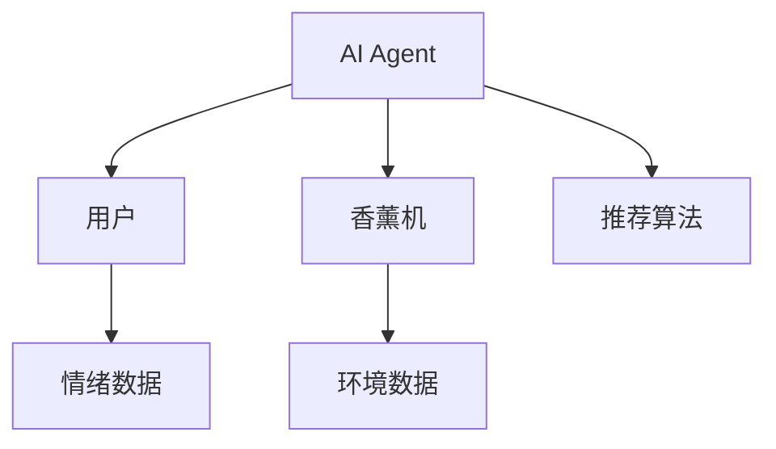
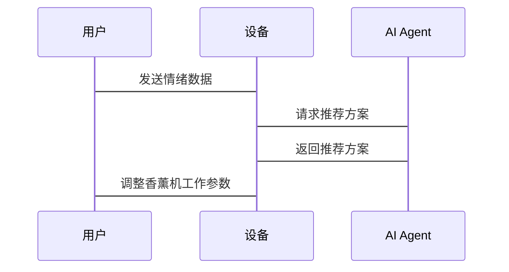

                 


# AI Agent在智能香薰机中的情绪调节

## 关键词：AI Agent, 智能香薰机, 情绪调节, 机器学习, 推荐算法

## 摘要

本文详细探讨了AI Agent在智能香薰机中的情绪调节应用。通过分析情绪识别算法、香薰推荐系统以及AI Agent的决策机制，展示了如何利用人工智能技术实现智能化的情绪调节。文章从背景介绍到系统设计，再到项目实战，全面阐述了AI Agent在智能香薰机中的技术实现和应用价值。

---

# 第一部分: 背景与概念

## 第1章: AI Agent与情绪调节概述

### 1.1 AI Agent的基本概念

AI Agent（人工智能代理）是一种能够感知环境、自主决策并执行任务的智能实体。它能够通过传感器获取信息，利用算法进行分析，并根据结果采取行动。AI Agent的核心功能包括感知、推理、决策和执行。

### 1.2 情绪调节的背景与意义

情绪调节是通过外部手段影响个体情绪状态的过程。在现代社会中，人们面临着巨大的压力和情绪波动，情绪调节技术的应用需求日益增长。智能香薰机作为一种能够通过气味影响情绪的设备，结合AI Agent技术，能够为用户提供个性化的、智能化的情绪调节方案。

### 1.3 智能香薰机的工作原理

智能香薰机通过加热香薰油释放香气，用户可以通过设备调节香味浓度和种类。传统香薰机仅能提供固定的香型和模式，而智能香薰机结合AI技术，能够根据用户的情绪状态智能推荐香型和使用模式。

### 1.4 AI Agent在智能香薰机中的作用

AI Agent通过分析用户的情绪数据（如心率、皮肤温度、呼吸频率等）和环境数据（如光线、温度、湿度等），结合历史使用数据，生成个性化的情绪调节方案。AI Agent能够实时调整香薰机的工作参数，优化用户的情绪状态。

---

# 第二部分: 核心概念与系统架构

## 第2章: 核心概念与系统架构

### 2.1 AI Agent的核心原理

AI Agent通过感知用户的情绪数据和环境数据，利用机器学习算法进行分析和预测，生成推荐方案。其核心原理包括数据采集、特征提取、模型训练和决策执行。

### 2.2 情绪调节的核心算法

情绪调节算法包括情绪识别和香薰推荐两个部分。情绪识别算法通过分析用户的生理数据和行为数据，判断当前情绪状态；香薰推荐算法根据情绪状态推荐合适的香型和使用模式。

### 2.3 智能香薰机的系统架构

智能香薰机的系统架构包括数据采集模块、AI Agent模块、香薰控制模块和用户交互模块。数据采集模块负责采集用户的情绪数据和环境数据；AI Agent模块负责分析数据并生成推荐方案；香薰控制模块根据推荐方案调整香薰机的工作参数；用户交互模块负责与用户进行互动。

### 2.4 AI Agent与智能香薰机的实体关系图



### 2.5 本章小结

本章介绍了AI Agent的核心原理和智能香薰机的系统架构，明确了AI Agent在情绪调节中的作用和实现方式。

---

# 第三部分: AI Agent的情绪调节算法原理

## 第3章: 情绪调节算法的数学模型

### 3.1 情绪识别的数学模型

情绪识别算法通过分析用户的生理数据（如心率、皮肤电活动）和行为数据（如面部表情、语音语调）进行情绪分类。常用的情绪分类算法包括支持向量机（SVM）和随机森林（Random Forest）。

#### 情绪分类模型

$$ f(x) = \arg\max_{i} p(y=i|x) $$

其中，$x$是输入特征向量，$y$是情绪类别标签。

#### 情绪预测模型

$$ p(y|x) = \prod_{j=1}^{n} p(y|x_j) $$

其中，$x_j$是输入特征的第$j$个维度。

### 3.2 情绪调节的算法流程

情绪调节算法的流程包括数据预处理、情绪分类和香薰推荐三个步骤。

#### 数据预处理

数据预处理包括数据清洗、特征提取和数据标准化。

#### 情绪分类

情绪分类算法通过训练好的模型对用户的情绪状态进行分类，输出情绪类别标签。

#### 香薰推荐

香薰推荐算法根据情绪类别标签推荐适合的香型和使用模式。

### 3.3 情绪调节算法的数学公式

#### 情绪分类函数

$$ f(x) = \arg\max_{i} p(y=i|x) $$

#### 损失函数

$$ L = -\sum_{i=1}^{n} y_i \log p(y=i|x) $$

其中，$y_i$是真实标签，$p(y=i|x)$是模型预测的概率。

---

# 第四部分: 系统分析与架构设计

## 第4章: 系统分析与架构设计

### 4.1 问题场景介绍

用户在使用智能香薰机时，希望设备能够根据自己的情绪状态自动调整香型和使用模式，从而达到最佳的情绪调节效果。

### 4.2 系统功能设计

系统功能模块包括：

1. 数据采集模块：负责采集用户的情绪数据和环境数据。
2. AI Agent模块：负责分析数据并生成推荐方案。
3. 香薰控制模块：根据推荐方案调整香薰机的工作参数。
4. 用户交互模块：负责与用户进行互动，展示推荐方案和使用状态。

### 4.3 系统架构设计

系统架构包括：

1. 数据采集层：包括传感器和数据采集接口。
2. 数据处理层：包括数据预处理和特征提取。
3. AI Agent层：包括情绪分类和香薰推荐算法。
4. 设备控制层：包括香薰机的控制接口和执行机构。

### 4.4 系统接口设计

系统接口包括：

1. 用户与设备的交互接口：如手机APP或语音助手。
2. 设备与AI Agent的通信接口：如REST API。
3. AI Agent与数据采集模块的接口：如MQTT协议。

### 4.5 系统交互流程图



---

# 第五部分: 项目实战

## 第5章: 项目实战

### 5.1 环境安装

安装Python和必要的库：

```bash
pip install numpy scikit-learn mermaid.py
```

### 5.2 核心代码实现

#### 情绪分类算法实现

```python
from sklearn.ensemble import RandomForestClassifier

# 数据预处理
X = ...
y = ...

# 模型训练
model = RandomForestClassifier()
model.fit(X, y)

# 模型预测
y_pred = model.predict(X_test)
```

#### 香薰推荐算法实现

```python
def recommend_fragrance(mood):
    if mood == 'happy':
        return '薰衣草'
    elif mood == 'stressed':
        return '洋甘菊'
    else:
        return '茉莉花'
```

### 5.3 代码解读与分析

- 情绪分类算法使用随机森林模型进行训练和预测。
- 香薰推荐算法根据情绪类别标签推荐适合的香型。

### 5.4 实际案例分析

案例：用户当前情绪为“焦虑”，系统推荐使用洋甘菊香型，调整香薰机的工作参数以释放适量的香味。

### 5.5 项目小结

本章通过实际项目案例展示了AI Agent在智能香薰机中的情绪调节应用，详细讲解了代码实现和系统设计。

---

# 第六部分: 最佳实践

## 第6章: 最佳实践

### 6.1 小结

AI Agent在智能香薰机中的情绪调节应用展示了人工智能技术在智能家居领域的巨大潜力。通过结合情绪识别算法和香薰推荐系统，AI Agent能够为用户提供个性化的、智能化的情绪调节方案。

### 6.2 注意事项

1. 数据隐私保护：确保用户数据的安全性和隐私性。
2. 系统稳定性：确保AI Agent的决策算法稳定可靠。
3. 用户体验优化：提供直观易用的用户界面和良好的交互体验。

### 6.3 拓展阅读

- 《机器学习实战》
- 《人工智能：一种现代的方法》
- 《情感计算与智能交互》

---

# 结语

AI Agent在智能香薰机中的情绪调节应用是人工智能技术在智能家居领域的重要创新。通过本文的详细讲解，读者可以深入了解AI Agent的核心原理、系统架构和实际应用。未来，随着人工智能技术的不断发展，智能香薰机将在情绪调节领域发挥更大的作用，为用户提供更加智能化和个性化的服务。

