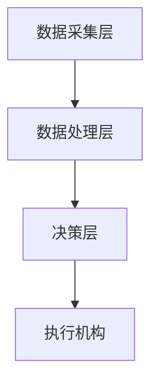
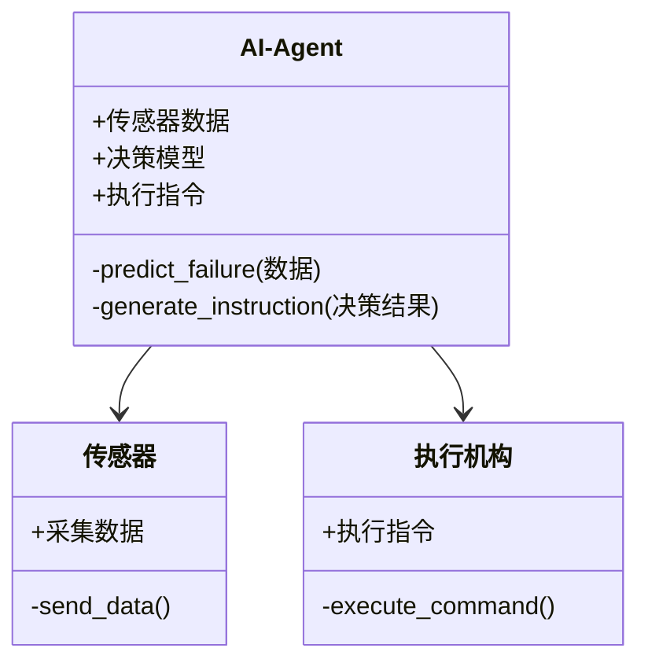
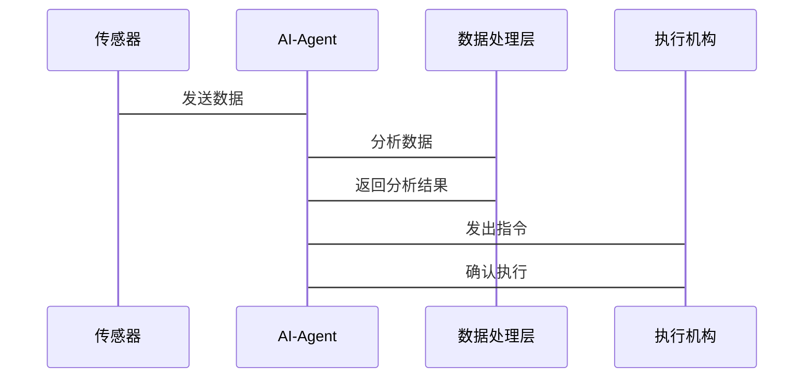

                 


# AI Agent在核电站安全监控中的应用

> 关键词：AI Agent, 核电站安全监控, 人工智能, 安全监控, 核电站运行

> 摘要：本文探讨了AI Agent在核电站安全监控中的应用，详细分析了核电站安全监控的重要性、AI Agent的基本概念与特点，以及AI Agent在核电站安全监控中的核心算法原理和系统架构设计。本文还通过实际案例分析，展示了AI Agent在核电站安全监控中的实际应用价值，并提出了未来的研究方向。

---

# 第一部分：AI Agent在核电站安全监控中的应用背景

## 第1章：核电站安全监控的挑战与AI Agent的引入

### 1.1 核电站安全监控的重要性

核电站作为重要的能源设施，其安全运行至关重要。核电站的安全监控需要实时监测各种参数，包括温度、压力、流量、振动等，以确保设备的正常运行和防止事故的发生。传统的监控系统依赖于人工操作和固定规则，存在响应速度慢、处理复杂情况能力有限的问题。

#### 1.1.1 核电站的基本概念与运行特点

核电站通过核反应产生热量，将水加热成蒸汽，推动涡轮机发电。其运行涉及复杂的物理和化学过程，需要严格控制各种参数以确保安全。

#### 1.1.2 核电站安全监控的核心目标

核电站安全监控的核心目标是实时监测设备运行状态，及时发现和处理异常情况，防止事故的发生。同时，监控系统还需要具备预测潜在故障的能力，以实现预防性维护。

#### 1.1.3 核电站安全监控的传统方法与局限性

传统方法主要依赖于传感器和固定规则的监控系统，缺乏智能化和自主决策能力。面对复杂多变的运行环境，传统方法难以应对突发情况和优化决策。

### 1.2 AI Agent的基本概念与特点

AI Agent是一种具有感知、推理、规划和执行能力的智能体，能够自主决策并适应动态环境。AI Agent的核心特点是具备学习能力和自主性，能够在复杂环境中完成任务。

#### 1.2.1 什么是AI Agent

AI Agent（人工智能代理）是一种能够感知环境、理解任务目标并采取行动以实现目标的智能系统。AI Agent可以是软件程序，也可以是硬件设备，具备自主决策和学习能力。

#### 1.2.2 AI Agent的核心功能与优势

AI Agent的核心功能包括感知、推理、规划和执行。其优势在于能够处理复杂数据，快速做出决策，并在动态环境中自主调整策略。

#### 1.2.3 AI Agent与传统监控系统的区别

与传统监控系统相比，AI Agent具备更高的智能化和自主性，能够主动发现问题并提出解决方案，而不仅仅是被动地响应异常情况。

### 1.3 AI Agent在核电站安全监控中的应用前景

#### 1.3.1 核电站安全监控对智能化的需求

核电站安全监控需要快速响应和优化决策，智能化的AI Agent能够满足这一需求。

#### 1.3.2 AI Agent在核电站监控中的潜在价值

AI Agent可以通过实时数据分析和预测，提前发现潜在故障，优化设备运行，降低事故风险。

#### 1.3.3 当前技术发展对AI Agent应用的支撑

随着人工智能技术的快速发展，AI Agent在核电站安全监控中的应用已经具备技术基础，未来有望在核电站安全监控中发挥重要作用。

---

## 第2章：AI Agent与核电站安全监控的核心概念

### 2.1 核电站安全监控的系统架构

#### 2.1.1 核电站监控系统的组成

核电站监控系统通常包括传感器、数据采集系统、数据处理系统和执行机构。AI Agent作为核心组件，负责数据的分析和决策。

#### 2.1.2 各子系统的功能与交互关系

传感器负责采集数据，数据采集系统将数据传输给AI Agent进行处理，AI Agent根据处理结果向执行机构发出指令。

#### 2.1.3 系统的层次结构与数据流

核电站监控系统的层次结构包括数据采集层、数据处理层和决策层。数据流从传感器流向AI Agent，AI Agent根据数据做出决策并反馈给执行机构。

### 2.2 AI Agent在核电站监控中的角色定位

#### 2.2.1 AI Agent作为智能决策层的作用

AI Agent负责接收传感器数据，分析设备状态，预测潜在故障，并制定相应的应对策略。

#### 2.2.2 AI Agent与其他系统组件的协作关系

AI Agent与传感器、数据采集系统和执行机构协同工作，形成一个闭环的监控系统。

#### 2.2.3 AI Agent的核心功能模块与实现方式

AI Agent的核心功能模块包括数据采集、数据处理、决策推理和执行控制。这些模块通过协同工作，实现核电站的安全监控。

### 2.3 核电站安全监控的核心指标与评估体系

#### 2.3.1 核电站安全监控的关键指标

关键指标包括设备运行状态、异常事件发生率、故障预测准确率等。

#### 2.3.2 监控数据的分类与处理

监控数据可以分为正常数据和异常数据，AI Agent需要对异常数据进行分析和处理。

#### 2.3.3 安全事件的分类与优先级评估

安全事件可以根据严重性和影响范围进行分类，优先级评估帮助AI Agent快速做出决策。

### 2.4 核电站安全监控的边界与外延

#### 2.4.1 核电站监控的物理边界

核电站监控系统的物理边界包括设备、传感器和执行机构的物理位置。

#### 2.4.2 监控系统的功能边界

监控系统功能边界包括数据采集、处理和决策制定。

#### 2.4.3 AI Agent应用的边界与限制

AI Agent的应用边界主要集中在数据处理和决策制定，其物理执行依赖于其他系统组件。

### 2.5 核电站安全监控的概念结构与核心要素

#### 2.5.1 核电站安全监控的系统模型

系统模型包括传感器、数据采集系统、AI Agent和执行机构四个部分。

#### 2.5.2 相关概念的属性特征对比表格

| 概念       | 属性特征                       |
|------------|--------------------------------|
| AI Agent   | 智能化、自主性、适应性       |
| 核电站监控 | 实时性、准确性、可靠性       |

#### 2.5.3 核心要素的相互关系与影响

传感器提供数据，AI Agent进行分析和决策，执行机构根据决策采取行动，形成一个闭环系统。

---

## 第3章：AI Agent在核电站安全监控中的核心算法原理

### 3.1 AI Agent的核心算法概述

#### 3.1.1 AI Agent的感知与决策算法

AI Agent通过感知环境数据，利用决策算法做出最优选择。

#### 3.1.2 AI Agent的自主学习与优化算法

AI Agent通过机器学习算法不断优化自身模型，提高决策准确性。

#### 3.1.3 AI Agent的多目标优化算法

多目标优化算法帮助AI Agent在多个目标之间找到平衡点，做出最优决策。

### 3.2 AI Agent的感知算法原理

#### 3.2.1 数据采集与预处理

数据采集包括传感器数据的获取和预处理，如去噪和标准化。

#### 3.2.2 数据特征提取与降维

通过特征提取和降维技术，减少数据维度，提高处理效率。

#### 3.2.3 感知模型的构建与训练

感知模型通常采用深度学习模型，如卷积神经网络（CNN）和长短期记忆网络（LSTM）。

### 3.3 AI Agent的决策算法原理

#### 3.3.1 决策树算法

决策树是一种基于树状结构的分类方法，常用于处理多类别问题。

#### 3.3.2 支持向量机算法

支持向量机（SVM）是一种监督学习算法，适用于分类和回归问题。

#### 3.3.3 神经网络算法

神经网络算法模拟人脑神经网络，适用于复杂的非线性问题。

### 3.4 AI Agent的优化算法原理

#### 3.4.1 遗传算法

遗传算法是一种模拟生物进化过程的优化算法，适用于全局优化问题。

#### 3.4.2 蚁群算法

蚁群算法模拟蚂蚁觅食行为，适用于组合优化问题。

#### 3.4.3 模拟退火算法

模拟退火算法是一种全局优化算法，适用于复杂的能量 landscapes。

### 3.5 算法的数学模型与公式

#### 3.5.1 决策树的ID3算法公式

信息增益公式：
$$ I(d) = \sum_{i=1}^{n} p_i \log_2 p_i $$

ID3算法选择信息增益最大的特征作为决策树的根节点。

#### 3.5.2 支持向量机的优化目标

支持向量机的优化目标是最大化分类间隔，同时最小化误分类率：
$$ \min_{w, b, \xi} \frac{1}{2} ||w||^2 + C \sum_{i=1}^{n} \xi_i $$
$$ s.t. \ y_i (w \cdot x_i + b) \geq 1 - \xi_i $$
$$ \xi_i \geq 0 $$

#### 3.5.3 神经网络的损失函数

神经网络的损失函数通常采用交叉熵损失：
$$ L = -\sum_{i=1}^{n} y_i \log(p_i) + (1 - y_i) \log(1 - p_i) $$

---

## 第4章：AI Agent在核电站安全监控中的系统架构设计

### 4.1 系统分析与架构设计方案

#### 4.1.1 核电站安全监控系统的需求分析

需求包括实时监控、异常检测、故障预测和优化控制。

#### 4.1.2 系统功能设计

系统功能包括数据采集、数据处理、决策支持和执行控制。

#### 4.1.3 系统架构设计

系统架构采用分层设计，包括数据采集层、数据处理层和决策层。

### 4.2 系统架构的Mermaid图



### 4.3 系统功能模块的类图



### 4.4 系统接口设计

系统接口包括数据采集接口、决策接口和执行接口。

### 4.5 系统交互的Mermaid序列图



---

## 第5章：AI Agent在核电站安全监控中的项目实战

### 5.1 环境安装与配置

安装Python、TensorFlow、Kafka等依赖库。

### 5.2 核心代码实现

#### 5.2.1 数据采集模块

```python
import kafka

# 生产者
producer = kafka.Producer()
producer.send('sensor_data', data)
```

#### 5.2.2 数据处理模块

```python
import tensorflow as tf

model = tf.keras.Sequential([
    tf.keras.layers.Conv2D(32, (3,3), activation='relu'),
    tf.keras.layers.MaxPooling2D((2,2)),
    tf.keras.layers.Flatten(),
    tf.keras.layers.Dense(10, activation='softmax')
])
model.compile(optimizer='adam', loss='sparse_categorical_crossentropy', metrics=['accuracy'])
model.fit(data, labels, epochs=10)
```

#### 5.2.3 决策模块

```python
def predict_failure(data):
    prediction = model.predict(data)
    if prediction > 0.5:
        return True
    else:
        return False
```

### 5.3 代码解读与分析

数据采集模块使用Kafka进行数据传输，数据处理模块采用深度学习模型进行分析，决策模块基于模型预测结果做出决策。

### 5.4 实际案例分析

通过实际核电站运行数据，展示AI Agent如何实时监控设备状态，预测潜在故障并发出警报。

### 5.5 项目总结

项目成功实现了AI Agent在核电站安全监控中的应用，提高了监控系统的智能化水平和决策能力。

---

## 第6章：总结与展望

### 6.1 本章总结

本文详细探讨了AI Agent在核电站安全监控中的应用，分析了其核心算法和系统架构设计，展示了其在实际应用中的价值。

### 6.2 未来展望

未来研究可以进一步优化AI Agent算法，探索其在核电站安全监控中的更多应用场景。

### 6.3 注意事项

在实际应用中，需要考虑系统的可靠性和安全性，确保AI Agent的决策准确性和执行机构的稳定性。

### 6.4 拓展阅读

推荐阅读相关领域的学术论文和行业报告，深入了解AI Agent在核电站安全监控中的最新研究进展。

---

通过以上章节的详细分析，可以全面了解AI Agent在核电站安全监控中的应用，为核电站的安全运行提供了新的解决方案。

