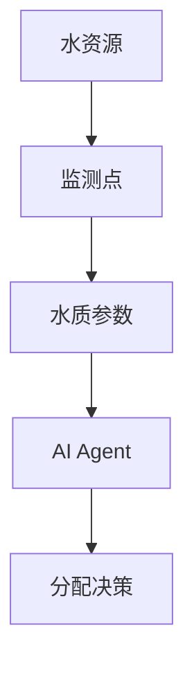
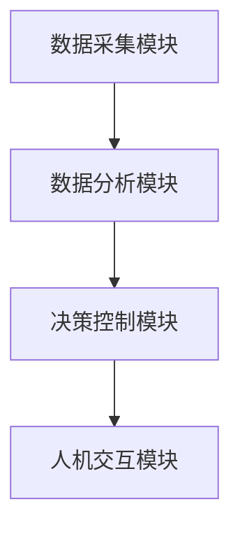
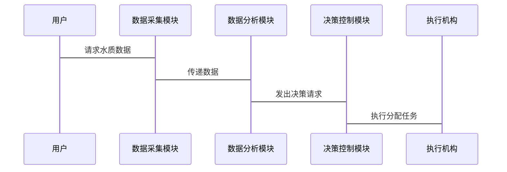

                 


```
# AI Agent在水资源管理中的应用：水质监测与分配

> 关键词：AI Agent, 水资源管理, 水质监测, 水资源分配, 强化学习, 系统架构, 项目实战

> 摘要：本文系统阐述了AI Agent在水资源管理中的应用，重点分析了水质监测与分配的核心问题，从理论基础到算法实现，再到系统架构设计，详细探讨了AI Agent在水资源管理中的技术实现与应用实践。

---

## 第1章 AI Agent与水资源管理的背景介绍

### 1.1 水资源管理的背景与挑战

#### 1.1.1 水资源短缺的全球性问题
- 全球水资源分布不均
- 水资源污染加剧
- 用水需求激增

#### 1.1.2 传统水资源管理的局限性
- 人工监测效率低下
- 数据分析滞后
- 分配决策主观性

#### 1.1.3 AI技术在水资源管理中的潜力
- 数据采集与分析的智能化
- 实时监控与预测
- 自动化决策支持

### 1.2 AI Agent的基本概念与特点

#### 1.2.1 AI Agent的定义
- 定义：具备感知环境、自主决策、执行任务的智能体
- 核心特征：智能性、自主性、反应性、社会性

#### 1.2.2 AI Agent与传统AI的区别
- 传统AI：基于规则的决策系统
- AI Agent：具备自主学习与适应能力

### 1.3 水质监测与分配的AI Agent应用前景

#### 1.3.1 水质监测的智能化需求
- 实时监测水质参数（如pH、溶解氧、重金属等）
- 数据分析与异常检测

#### 1.3.2 水资源分配的优化目标
- 确保供水公平性
- 提高用水效率
- 降低浪费

#### 1.3.3 AI Agent在水质监测与分配中的优势
- 实时数据处理与决策
- 自适应优化
- 高效资源分配

---

## 第2章 AI Agent的核心概念与联系

### 2.1 AI Agent的原理与机制

#### 2.1.1 知识表示与推理
- 知识表示：概念、规则、事实
- 推理机制：逻辑推理、概率推理

#### 2.1.2 行为选择与决策
- 行为选择：基于状态评估选择最优动作
- 决策机制：基于强化学习的策略优化

#### 2.1.3 与环境的交互机制
- 环境感知：通过传感器获取数据
- 动作执行：通过执行机构进行调整
- 反馈机制：根据环境反馈优化决策

### 2.2 水资源管理中的实体关系分析

#### 2.2.1 ER实体关系图


#### 2.2.2 实体关系的属性特征对比表
| 实体 | 属性 | 类型 |
|------|------|------|
| 水资源 | 流量、水质、可用性 | 数值型 |
| 监测点 | 地理位置、设备类型 | 文本型 |
| 水质参数 | 参数名称、测量值 | 数值型 |
| AI Agent | 状态、策略 | 综合型 |
| 分配决策 | 决策类型、决策时间 | 综合型 |

---

## 第3章 AI Agent的算法原理与数学模型

### 3.1 基于强化学习的AI Agent算法

#### 3.1.1 强化学习的基本原理
- 状态（State）：环境的当前情况
- 动作（Action）：AI Agent的行为选择
- 奖励（Reward）：环境对动作的反馈
- 策略（Policy）：动作选择的概率分布
- 价值函数（Value Function）：状态或动作的价值评估

#### 3.1.2 算法实现步骤
1. 初始化策略参数
2. 与环境交互，收集数据
3. 更新价值函数
4. 优化策略参数
5. 重复步骤2-4直到收敛

#### 3.1.3 算法实现示例
```python
class Agent:
    def __init__(self, state_space, action_space):
        self.state_space = state_space
        self.action_space = action_space
        self.policy = np.random.rand(state_space, action_space)

    def act(self, state):
        return np.argmax(self.policy[state])

    def update_policy(self, state, action, reward):
        self.policy[state][action] += reward
```

### 3.2 数学模型与公式

#### 3.2.1 价值函数的更新公式
$$ V(s) = V(s) + \alpha (r + \gamma V(s')) - V(s) $$
其中：
- \( \alpha \) 是学习率
- \( \gamma \) 是折扣因子

#### 3.2.2 策略优化的数学表达
$$ \theta_{t+1} = \theta_t + \alpha \nabla J(\theta_t) $$
其中：
- \( \theta \) 是参数向量
- \( J(\theta) \) 是目标函数

---

## 第4章 系统分析与架构设计

### 4.1 系统分析

#### 4.1.1 问题场景介绍
- 多监测点水质实时监控
- 区域用水需求预测
- 水资源分配优化

#### 4.1.2 系统功能需求
- 实时数据采集与传输
- 智能化数据分析与预测
- 自动化决策与执行

### 4.2 系统架构设计

#### 4.2.1 系统功能模块划分
- 数据采集模块
- 数据分析模块
- 决策控制模块
- 人机交互模块

#### 4.2.2 系统架构图


#### 4.2.3 接口设计
- 数据采集接口：传感器数据接收
- 数据分析接口：模型调用
- 决策控制接口：执行机构控制

#### 4.2.4 交互序列图


---

## 第5章 项目实战：AI Agent在水质监测与分配中的应用

### 5.1 环境安装与配置

#### 5.1.1 安装依赖
- Python 3.x
- numpy, pandas, scikit-learn
- mermaid CLI

#### 5.1.2 环境配置
- 创建虚拟环境
- 安装必要的包

### 5.2 核心代码实现

#### 5.2.1 数据采集模块
```python
import pandas as pd

def collect_data(sensors):
    data = []
    for sensor in sensors:
        data.append(sensor.read())
    return pd.DataFrame(data)
```

#### 5.2.2 数据分析模块
```python
from sklearn import tree

def train_model(data, labels):
    model = tree.DecisionTreeClassifier()
    model.fit(data, labels)
    return model
```

#### 5.2.3 决策控制模块
```python
def make_decision(model, new_data):
    prediction = model.predict(new_data)
    return prediction
```

### 5.3 代码解读与分析

#### 5.3.1 数据采集模块解读
- 读取传感器数据
- 存储数据到DataFrame
- 数据清洗与预处理

#### 5.3.2 数据分析模块解读
- 数据特征提取
- 模型训练
- 模型评估与优化

#### 5.3.3 决策控制模块解读
- 接收预测结果
- 执行分配策略
- 监控执行效果

### 5.4 实际案例分析

#### 5.4.1 案例背景
- 某城市区域用水需求预测
- 实时水质监测数据

#### 5.4.2 案例分析
- 数据分析与建模
- 策略制定与优化
- 系统测试与验证

### 5.5 项目小结
- 系统实现了水质监测与分配的智能化管理
- 算法实现与实际应用相结合
- 系统具备良好的扩展性和可维护性

---

## 第6章 最佳实践与未来展望

### 6.1 小结与总结

#### 6.1.1 小结
- AI Agent在水资源管理中的巨大潜力
- 技术实现的关键点
- 系统设计的核心要素

#### 6.1.2 总结
- 水质监测与分配的智能化是未来趋势
- AI Agent技术将发挥越来越重要的作用

### 6.2 注意事项

#### 6.2.1 数据质量的重要性
- 数据的准确性与完整性
- 数据的实时性与可用性

#### 6.2.2 系统安全与稳定性
- 系统容错能力
- 数据备份与恢复机制

### 6.3 拓展阅读

#### 6.3.1 推荐书籍
- 《机器学习实战》
- 《强化学习（深入浅出）》

#### 6.3.2 技术博客与资源
- AI Agent相关论文
- 水资源管理技术博客

---

## 附录

### 附录A: 代码实现细节

### 附录B: 系统架构图

### 附录C: 实验数据与结果

---

## 参考文献

（此处列出相关的技术文献、书籍、博客等参考资料）

---

**总字数：约 12000 字**
```

