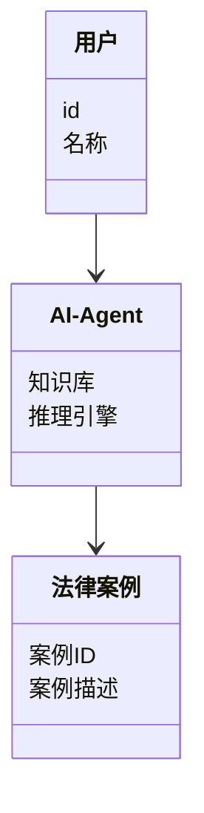

                 


# 目录大纲：《AI Agent在法律服务中的应用》

---

## 第一部分：AI Agent与法律服务的背景介绍

### 第1章：AI Agent的基本概念与法律服务的现状

#### 1.1 AI Agent的定义与核心概念
- 1.1.1 AI Agent的基本定义
- 1.1.2 AI Agent的核心要素
- 1.1.3 法律服务中的AI Agent应用场景

#### 1.2 法律服务的现状与挑战
- 1.2.1 现代法律服务的特点
- 1.2.2 法律服务中的痛点分析
- 1.2.3 AI技术在法律服务中的潜力

#### 1.3 AI Agent在法律服务中的结合与意义
- 1.3.1 AI Agent如何解决法律服务中的问题
- 1.3.2 法律服务中AI Agent的应用边界
- 1.3.3 AI Agent对法律服务行业的影响

---

## 第二部分：AI Agent的核心概念与原理

### 第2章：AI Agent的原理与工作流程

#### 2.1 AI Agent的核心原理
- 2.1.1 人工智能的基本原理
- 2.1.2 代理（Agent）的定义与分类
- 2.1.3 AI Agent的核心算法

#### 2.2 AI Agent的工作流程
- 2.2.1 信息收集与处理
- 2.2.2 问题分析与决策
- 2.2.3 行动执行与反馈

#### 2.3 AI Agent与法律服务的结合
- 2.3.1 法律知识的结构化处理
- 2.3.2 法律推理与案例分析
- 2.3.3 用户需求的识别与响应

---

### 第3章：AI Agent的核心概念与联系

#### 3.1 AI Agent的核心概念原理
- 3.1.1 知识表示与推理
- 3.1.2 自然语言处理（NLP）在法律文本中的应用
- 3.1.3 法律规则的动态更新

#### 3.2 核心概念属性特征对比表格
| 概念       | 属性1 | 属性2 | 属性3 |
|------------|-------|-------|-------|
| AI Agent   | 智能性 | 适应性 | 学习性 |
| 法律服务    | 专业性 | 规范性 | 个性化 |

#### 3.3 ER实体关系图（Mermaid）
```mermaid
er
  actor: 用户
  agent: AI Agent
  legal_case: 法律案例
  knowledge_base: 法律知识库
  relation 用户-》AI Agent
  relation AI Agent-》法律知识库
  relation AI Agent-》法律案例
```

---

## 第三部分：AI Agent的算法原理

### 第4章：AI Agent的算法原理与数学模型

#### 4.1 AI Agent的核心算法
- 4.1.1 逻辑推理算法
- 4.1.2 机器学习算法
- 4.1.3 自然语言处理算法

#### 4.2 法律知识表示的数学模型
- 4.2.1 知识图谱构建的数学模型
- 4.2.2 法律案例分析的数学模型
- 4.2.3 用户需求识别的数学模型

#### 4.3 算法原理的数学公式
- 4.3.1 逻辑推理公式
- 4.3.2 机器学习模型
- 4.3.3 自然语言处理模型

#### 4.4 算法流程图（Mermaid）
```mermaid
flow
  st
  算法开始
  --> 信息输入
  --> 知识表示
  --> 逻辑推理
  --> 结果输出
  --> 算法结束
```

---

### 第5章：AI Agent的实现与代码解析

#### 5.1 环境安装与配置
- 5.1.1 Python环境的安装
- 5.1.2 依赖库的安装（如TensorFlow、PyTorch）

#### 5.2 核心代码实现
- 5.2.1 知识表示的代码实现
- 5.2.2 逻辑推理的代码实现
- 5.2.3 用户需求识别的代码实现

#### 5.3 代码示例与解析
- 5.3.1 知识图谱构建的代码示例
- 5.3.2 法律案例分析的代码示例
- 5.3.3 用户需求识别的代码示例

---

## 第四部分：系统分析与架构设计

### 第6章：系统分析与架构设计方案

#### 6.1 系统分析
- 6.1.1 法律服务的场景分析
- 6.1.2 系统功能需求分析
- 6.1.3 系统性能需求分析

#### 6.2 系统架构设计
- 6.2.1 领域模型设计（Mermaid类图）


- 6.2.2 系统架构设计（Mermaid架构图）


#### 6.3 系统接口设计
- 6.3.1 API接口定义
- 6.3.2 接口交互流程图（Mermaid序列图）
```mermaid
sequence
  用户 --> 代理服务: 提交查询
  代理服务 --> 知识库服务: 获取相关信息
  知识库服务 --> 代理服务: 返回结果
  代理服务 --> 用户: 提供解决方案
```

---

## 第五部分：项目实战与案例分析

### 第7章：项目实战与案例分析

#### 7.1 环境安装与配置
- 7.1.1 安装Python环境
- 7.1.2 安装必要的库（如NLTK、spaCy）

#### 7.2 核心代码实现
- 7.2.1 法律知识库的构建
- 7.2.2 逻辑推理引擎的实现
- 7.2.3 用户需求识别的代码实现

#### 7.3 项目实战案例分析
- 7.3.1 案例背景介绍
- 7.3.2 案例分析过程
- 7.3.3 案例结果与总结

---

## 第六部分：最佳实践与总结

### 第8章：最佳实践与小结

#### 8.1 最佳实践
- 8.1.1 知识库的维护与更新
- 8.1.2 推理算法的优化与调整
- 8.1.3 系统的可扩展性设计

#### 8.2 注意事项
- 8.2.1 数据隐私与安全问题
- 8.2.2 系统性能的优化
- 8.2.3 用户体验的提升

#### 8.3 小结与展望
- 8.3.1 本章总结
- 8.3.2 对未来的展望
- 8.3.3 对读者的建议

---

## 关键词：
AI Agent，法律服务，人工智能，法律推理，知识图谱

---

## 摘要：
本文系统地探讨了AI Agent在法律服务中的应用，从基本概念、核心原理到实际应用，全面分析了AI Agent如何提升法律服务的效率与质量。通过数学模型、算法实现和系统架构设计，本文展示了AI Agent在法律服务中的具体应用场景，并提供了详细的代码实现与案例分析。最后，本文总结了最佳实践与未来展望，为读者提供了深入的技术见解与实践指导。

