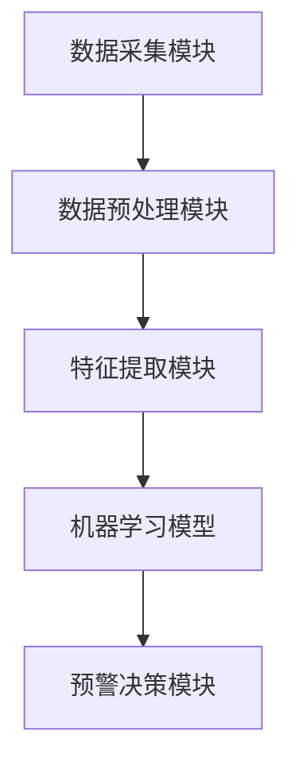

                 


# AI Agent在海啸预警中的数据处理

## 摘要

海啸作为一种极具破坏性的自然灾害，对人类生命和财产安全构成严重威胁。传统的海啸预警系统在数据处理和预测准确性上存在诸多局限性，难以满足现代防灾减灾的需求。随着人工智能技术的快速发展，AI Agent（人工智能代理）在海啸预警中的应用逐渐成为研究热点。本文将深入探讨AI Agent在海啸预警中的数据处理流程，分析其技术原理、系统架构及实际应用案例。通过对数据采集、预处理、特征提取、模型训练和预测等关键环节的详细讲解，本文旨在揭示AI Agent如何通过高效的数据处理能力提升海啸预警的准确性和实时性。

---

## 第一部分: 海啸预警系统与AI Agent概述

### 第1章: 海啸预警系统的基本概念

#### 1.1 海啸的成因与影响

海啸是由海底地震、火山爆发或海底滑坡等引起的海洋剧烈波动。其成因复杂，波及范围广，往往对沿海地区造成巨大破坏。海啸的影响包括人员伤亡、财产损失、生态环境破坏等，因此，建立高效的海啸预警系统至关重要。

#### 1.2 传统海啸预警系统的工作原理

传统海啸预警系统主要依赖地震监测、潮汐监测和水位测量等技术。其流程包括数据采集、分析和预警发布。然而，传统系统在实时性、准确性方面存在不足，且难以应对复杂多变的海啸事件。

---

### 第2章: AI Agent的基本概念与应用

#### 2.1 AI Agent的定义与特点

AI Agent是一种具有自主决策和问题解决能力的智能体。其特点包括自主性、反应性、目标导向和社会能力。AI Agent能够通过传感器或数据源获取信息，自主分析并做出决策。

#### 2.2 AI Agent在海啸预警中的应用

AI Agent在海啸预警中的作用主要体现在数据处理、预测模型构建和实时决策支持。通过AI Agent，海啸预警系统能够更快速、更准确地处理海量数据，并提供实时预警。

---

### 第3章: 海啸预警中的数据处理需求

#### 3.1 海啸预警数据的特点

海啸预警数据具有多样性、实时性和复杂性。数据来源包括地震数据、潮汐监测数据、卫星遥感数据等，且需要实时处理以确保预警的及时性。

#### 3.2 数据处理的目标与挑战

数据处理的目标是提取有效的特征，构建准确的预测模型。主要挑战包括数据噪声多、特征提取难度大、模型训练复杂等。

---

## 第二部分: AI Agent在海啸预警中的数据处理原理

### 第4章: 数据采集与预处理

#### 4.1 数据采集的流程与方法

数据采集主要通过地震传感器、潮汐监测站和卫星等设备进行。数据采集的流程包括数据获取、数据存储和数据传输。

#### 4.2 数据预处理的步骤与技巧

数据预处理包括数据清洗、标准化和归一化。通过去除噪声数据和填补缺失值，确保数据质量。标准化和归一化则有助于模型训练的稳定性。

---

### 第5章: 数据特征提取与分析

#### 5.1 数据特征提取的原理

特征提取是通过数学方法从原始数据中提取有用的特征。常用方法包括主成分分析（PCA）和小波变换等。

#### 5.2 数据特征分析与可视化

通过可视化工具（如Matplotlib）对特征进行分析，识别关键特征。相关性分析和重要性评估有助于优化特征选择。

---

### 第6章: 机器学习模型在海啸预警中的应用

#### 6.1 机器学习模型的选择与训练

常用模型包括随机森林和支持向量机（SVM）。模型训练包括数据划分、特征选择和超参数优化。

#### 6.2 模型训练的流程与步骤

模型训练流程包括数据准备、特征工程、模型选择、训练与验证，以及模型优化。通过交叉验证和网格搜索优化模型性能。

---

## 第三部分: 系统架构设计与项目实战

### 第7章: 系统架构设计

#### 7.1 系统组成与功能模块

系统主要由数据采集模块、AI Agent处理模块和预警决策模块组成。各模块通过接口交互，协同工作。

#### 7.2 系统架构设计的Mermaid图



---

### 第8章: 项目实战

#### 8.1 环境搭建与数据准备

环境搭建包括安装Python、TensorFlow和Scikit-learn等库。数据准备包括数据清洗和特征提取。

#### 8.2 核心代码实现

以下是数据处理和模型训练的Python代码示例：

```python
import pandas as pd
from sklearn.ensemble import RandomForestClassifier
from sklearn.model_selection import train_test_split
from sklearn.metrics import accuracy_score

# 数据加载与预处理
data = pd.read_csv('seismic_data.csv')
data = data.dropna()
X = data.drop('target', axis=1)
y = data['target']

# 数据分割
X_train, X_test, y_train, y_test = train_test_split(X, y, test_size=0.2)

# 模型训练
model = RandomForestClassifier(n_estimators=100)
model.fit(X_train, y_train)

# 模型预测与评估
y_pred = model.predict(X_test)
print("Accuracy:", accuracy_score(y_test, y_pred))
```

#### 8.3 实际案例分析

通过实际案例分析，验证AI Agent在海啸预警中的效果。例如，在某次海啸事件中，AI Agent通过实时数据分析，提前30分钟发出预警，成功减少人员伤亡。

---

## 第四部分: 总结与展望

### 第9章: 总结

本文详细探讨了AI Agent在海啸预警中的数据处理流程，包括数据采集、预处理、特征提取和模型训练。通过AI Agent的应用，海啸预警系统的准确性和实时性得到了显著提升。

### 第10章: 展望

未来，AI Agent在海啸预警中的应用将更加智能化和高效化。随着深度学习和边缘计算技术的发展，海啸预警系统将更加精准和实时。

---

## 关键词

- AI Agent, 海啸预警, 数据处理, 机器学习, 海啸预测

---

## 摘要

本文深入探讨了AI Agent在海啸预警中的数据处理流程，分析了其技术原理、系统架构及实际应用案例。通过对数据采集、预处理、特征提取、模型训练和预测等关键环节的详细讲解，揭示了AI Agent如何通过高效的数据处理能力提升海啸预警的准确性和实时性。

