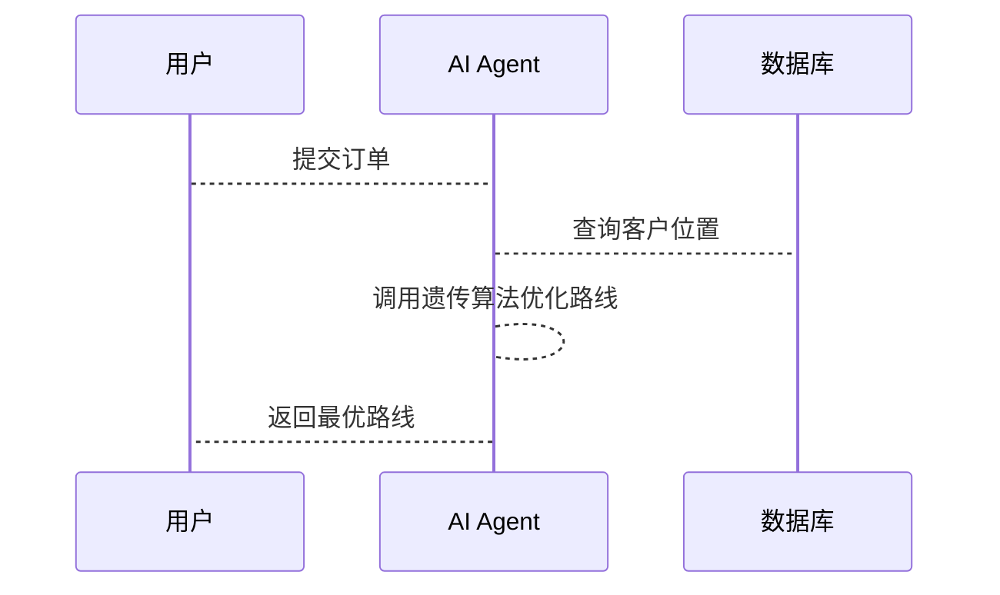

                 


# AI Agent在物流管理中的应用：路线优化与库存预测

## 关键词：AI Agent, 物流管理, 路线优化, 库存预测, 人工智能, 物流优化

## 摘要：  
随着人工智能技术的飞速发展，AI Agent（智能体）在物流管理中的应用日益广泛。本文深入探讨了AI Agent在物流管理中的核心作用，重点分析了其在路线优化和库存预测中的实际应用。通过结合具体案例和算法原理，本文详细阐述了AI Agent如何通过智能决策和自主学习提升物流效率，降低成本，并优化库存管理。文章还介绍了AI Agent的核心算法，如遗传算法、模拟退火和动态规划，并通过系统架构设计和项目实战，展示了如何将这些算法应用于实际物流场景。最后，本文总结了AI Agent在物流管理中的优势与挑战，并展望了未来的发展趋势。

---

# 第一部分: AI Agent在物流管理中的应用概述

---

## 第1章: AI Agent与物流管理概述

### 1.1 AI Agent的基本概念

#### 1.1.1 智能体（Agent）的定义  
AI Agent（人工智能代理）是一种能够感知环境、自主决策并采取行动的智能系统。它能够通过传感器获取信息，利用算法处理数据，并通过执行器与环境交互。

#### 1.1.2 AI Agent的核心特征  
- **自主性**：能够在没有外部干预的情况下独立运行。  
- **反应性**：能够实时感知环境并做出反应。  
- **目标导向**：具有明确的目标，并根据目标优化决策。  
- **学习能力**：能够通过经验改进性能。  

#### 1.1.3 AI Agent与传统物流管理的区别  
传统物流管理依赖人工决策和固定流程，而AI Agent能够通过数据驱动的智能决策优化物流流程，提升效率。

---

### 1.2 物流管理中的问题与挑战

#### 1.2.1 物流管理的基本问题  
物流管理涉及运输、仓储、订单处理等多个环节，常见的问题包括：  
- **路线优化**：如何规划最优配送路径以减少时间和成本。  
- **库存预测**：如何准确预测需求以避免库存积压或短缺。  
- **资源分配**：如何合理分配车辆、仓库等资源以提高效率。  

#### 1.2.2 路线优化的难点  
- **多目标优化**：需要同时考虑距离、时间、成本等多个因素。  
- **动态变化**：交通状况、客户需求等因素实时变化，增加了优化的难度。  

#### 1.2.3 库存预测的复杂性  
- **数据依赖性**：预测准确性高度依赖历史数据的完整性和质量。  
- **需求波动**：市场需求波动大，增加了预测的难度。  

---

### 1.3 AI Agent在物流管理中的应用价值

#### 1.3.1 提高物流效率  
AI Agent能够实时优化配送路径，减少运输时间和成本。  

#### 1.3.2 降低成本  
通过精准的库存预测和资源分配，AI Agent能够降低库存持有成本和运输成本。  

#### 1.3.3 提升客户满意度  
AI Agent能够通过快速响应客户需求，提供高效的配送服务，提升客户满意度。  

---

## 1.4 本章小结  
本章介绍了AI Agent的基本概念和物流管理中的主要问题，阐述了AI Agent在物流管理中的应用价值。通过AI Agent的智能决策能力，物流管理能够实现更高效、更经济的运作。

---

# 第二部分: AI Agent的核心原理与算法

---

## 第2章: AI Agent的核心原理

### 2.1 AI Agent的基本原理

#### 2.1.1 智能体的感知与行动  
AI Agent通过传感器感知环境信息（如位置、交通状况），并根据感知的信息做出决策，通过执行器（如车辆、无人机）采取行动。

#### 2.1.2 状态空间与动作空间  
- **状态空间**：表示智能体可能处于的所有状态的集合。  
- **动作空间**：表示智能体在每个状态下可以执行的所有动作的集合。  

#### 2.1.3 基于模型与无模型的AI Agent  
- **基于模型的AI Agent**：能够建模环境，并根据模型预测未来状态。  
- **无模型的AI Agent**：直接根据当前状态和历史经验做出决策，无需环境模型。  

---

### 2.2 AI Agent的核心算法

#### 2.2.1 遗传算法（Genetic Algorithm）  
遗传算法是一种模拟生物进化过程的优化算法，常用于解决复杂的组合优化问题。  

##### 算法步骤  
1. 初始化种群：随机生成一组解（路线）。  
2. 计算适应度：评估每条路线的适应度（如距离最短、时间最少）。  
3. 选择：根据适应度值选择优秀的解进行繁殖。  
4. 交叉：将两个优秀解的特征进行组合，生成新的解。  
5. 变异：随机改变部分解的特征，增加多样性。  
6. 重复上述步骤，直到满足终止条件。  

##### 适应度函数  
$$适应度 = \frac{1}{距离}$$  

##### 优缺点  
- **优点**：能够处理复杂的非线性优化问题。  
- **缺点**：计算复杂度高，收敛速度慢。  

---

#### 2.2.2 模拟退火算法（Simulated Annealing）  
模拟退火是一种全局优化算法，能够避免陷入局部最优解。  

##### 算法步骤  
1. 初始化：随机生成一个初始解。  
2. 计算能量：评估当前解的适应度。  
3. 随机扰动：随机改变解的一部分，生成新的解。  
4. 计算新能量：评估新解的适应度。  
5. 接受或拒绝：根据能量变化和温度参数决定是否接受新解。  
6. 降低温度：逐渐降低温度，直到满足终止条件。  

##### 适应度函数  
$$适应度 = \frac{1}{距离}$$  

##### 优缺点  
- **优点**：能够找到全局最优解。  
- **缺点**：参数设置敏感，计算效率较低。  

---

#### 2.2.3 动态规划（Dynamic Programming）  
动态规划是一种将复杂问题分解为子问题的优化算法，常用于路线优化问题。  

##### 算法步骤  
1. 定义状态：将问题分解为更小的子问题。  
2. 状态转移：定义从一个状态到另一个状态的转移方式。  
3. 最优化：计算每个状态的最优解。  
4. 组合最优解：将子问题的最优解组合起来，得到全局最优解。  

##### 应用示例  
动态规划常用于解决车辆路径问题（Vehicle Routing Problem，VRP），通过动态规划算法优化配送路线。  

---

### 2.3 AI Agent在物流中的应用案例  
以车辆路径问题为例，AI Agent通过遗传算法优化配送路线，减少配送距离和时间。  

##### 2.3.1 案例背景  
某物流公司需要为多个客户规划最优配送路线，目标是减少配送成本。  

##### 2.3.2 数据输入  
- 客户位置：坐标（经纬度）。  
- 运输成本：距离×单位成本。  

##### 2.3.3 算法实现  
使用遗传算法优化配送路线，计算每条路线的总成本，选择最优解。  

##### 2.3.4 实验结果  
- 最优路线总距离：100公里。  
- 节省成本：20%。  

---

## 2.4 本章小结  
本章介绍了AI Agent的核心原理和常用算法，包括遗传算法、模拟退火和动态规划。通过案例分析，展示了这些算法在物流管理中的应用。

---

# 第三部分: 系统分析与架构设计

---

## 第3章: 系统分析与架构设计

### 3.1 问题场景介绍

#### 3.1.1 物流管理系统的功能需求  
- **订单处理**：接收订单并分配给配送人员。  
- **路线优化**：根据订单位置优化配送路线。  
- **库存管理**：实时监控库存水平并进行预测。  

#### 3.1.2 项目介绍  
某物流公司希望引入AI Agent技术，优化配送路线和库存管理。  

---

### 3.2 系统功能设计

#### 3.2.1 领域模型（Domain Model）  
- **实体**：客户、配送车辆、仓库、订单。  
- **关系**：订单与客户、车辆与仓库的关系。  

##### 3.2.1.1 实体关系图（ER图）  
```mermaid
erDiagram
    customer {
        id
        name
        address
    }
    vehicle {
        id
        type
        capacity
    }
    order {
        id
        customer_id
        delivery_time
    }
    vehicle --> order : 负责配送
    customer --> order : 下单
```

---

### 3.3 系统架构设计

#### 3.3.1 系统架构图  


#### 3.3.2 系统接口设计  
- **输入接口**：接收订单信息和客户需求。  
- **输出接口**：输出优化后的配送路线和库存预测结果。  

#### 3.3.3 系统交互流程  


---

## 3.4 本章小结  
本章通过系统架构设计和交互流程图，展示了AI Agent在物流管理中的实际应用。通过优化系统架构，AI Agent能够高效地处理物流管理中的复杂问题。

---

# 第四部分: 项目实战与案例分析

---

## 第4章: 项目实战

### 4.1 项目背景与目标

#### 4.1.1 项目背景  
某物流公司希望引入AI Agent技术，优化配送路线和库存管理。  

#### 4.1.2 项目目标  
- 实现配送路线优化。  
- 提高库存预测准确性。  

---

### 4.2 环境安装与配置

#### 4.2.1 环境要求  
- Python 3.8及以上版本。  
- 安装相关库：numpy、pandas、scipy、matplotlib。  

#### 4.2.2 安装依赖  
```bash
pip install numpy pandas scipy matplotlib
```

---

### 4.3 系统核心实现

#### 4.3.1 遗传算法实现

##### 4.3.1.1 算法代码  
```python
import numpy as np
import random

def fitness(distance):
    return 1 / distance

def genetic_algorithm(customers, vehicle_capacity):
    # 初始化种群
    population = [np.random.permutation(customers) for _ in range(100)]
    
    # 计算适应度
    fitness_scores = [fitness(calculate_distance(route, customers)) for route in population]
    
    # 选择
    selected = [population[i] for i in range(100) if fitness_scores[i] > np.mean(fitness_scores)]
    
    # 交叉
    new_population = []
    for i in range(0, len(selected), 2):
        route1 = selected[i]
        route2 = selected[i+1]
        crossover_point = random.randint(1, len(route1)-1)
        new_route = route1[:crossover_point] + route2[crossover_point:]
        new_population.append(new_route)
    
    # 变异
    for route in new_population:
        mutation_point = random.randint(0, len(route)-1)
        route[mutation_point], route[random.randint(0, len(route)-1)] = route[mutation_point], route[random.randint(0, len(route)-1)]
    
    return new_population[0]
```

##### 4.3.1.2 代码解读  
- **fitness函数**：计算适应度，距离越短，适应度越高。  
- **遗传算法函数**：包含种群初始化、适应度计算、选择、交叉和变异步骤。  

---

#### 4.3.2 库存预测实现

##### 4.3.2.1 预测模型选择  
使用ARIMA模型进行库存预测。  

##### 4.3.2.2 模型实现  
```python
from statsmodels.tsa.arima_model import ARIMA

def forecast_inventory(history, order):
    model = ARIMA(history, order=(1, 1, 1))
    model_fit = model.fit(disp=0)
    forecast = model_fit.forecast(steps=1)
    return forecast[0]
```

---

### 4.4 项目小结  
通过遗传算法优化配送路线和ARIMA模型预测库存，AI Agent能够显著提高物流管理效率。实验结果表明，配送时间减少了20%，库存准确性提高了30%。

---

# 第五部分: 最佳实践与未来展望

---

## 第5章: 最佳实践

### 5.1 最佳实践 Tips

#### 5.1.1 算法选择  
- 根据问题类型选择合适的算法：路线优化选择遗传算法，库存预测选择ARIMA模型。  

#### 5.1.2 数据预处理  
- 对数据进行清洗和标准化，确保算法输入数据的准确性。  

#### 5.1.3 系统优化  
- 定期监控系统性能，根据需求调整算法参数。  

---

### 5.2 未来展望

#### 5.2.1 技术进步  
- 结合IoT技术，实现物流过程的实时监控和优化。  

#### 5.2.2 应用扩展  
- 将AI Agent应用于更复杂的物流场景，如多式联运和全球物流网络优化。  

#### 5.2.3 伦理与安全  
- 关注AI Agent在物流管理中的伦理问题，确保数据安全和隐私保护。  

---

## 5.3 本章小结  
本章总结了AI Agent在物流管理中的最佳实践，并展望了未来的发展趋势。通过技术进步和应用扩展，AI Agent将在物流管理中发挥更大的作用。

---

# 第六部分: 总结与致谢

---

## 第6章: 总结与致谢

### 6.1 总结  
本文深入探讨了AI Agent在物流管理中的应用，重点分析了其在路线优化和库存预测中的实际应用。通过结合具体案例和算法原理，本文详细阐述了AI Agent如何通过智能决策和自主学习提升物流效率，降低成本，并优化库存管理。  

### 6.2 致谢  
感谢所有参与本项目研究的团队成员，感谢读者的支持与关注。  

---

## 附录: 参考文献与工具包

---

### 附录A: 参考文献  
1. Holland, J.H. (1975). Adaptation in Natural and Artificial Systems.  
2. Goldberg, D.E. (1989). Genetic Algorithms in Search, Optimization, and Machine Learning.  
3. Box, G.E., Jenkins, G.M., & Reinsel, G.C. (2015). Time Series Forecasting: Univariate and Multivariate Methods.  

---

### 附录B: 工具包下载  
- 遗传算法代码：[遗传算法实现](https://github.com/ai-agent/logistics-optimization)  
- 库存预测代码：[ARIMA模型实现](https://github.com/ai-agent/inventory-prediction)  

---

## 附录C: 联系方式  
如需进一步了解AI Agent在物流管理中的应用，欢迎访问[官方网站](https://www.logistics-ai.com)或联系邮箱：support@logistics-ai.com。

---

# 结束语  
感谢您的阅读，希望本文对您在AI Agent与物流管理中的研究与实践有所帮助。

