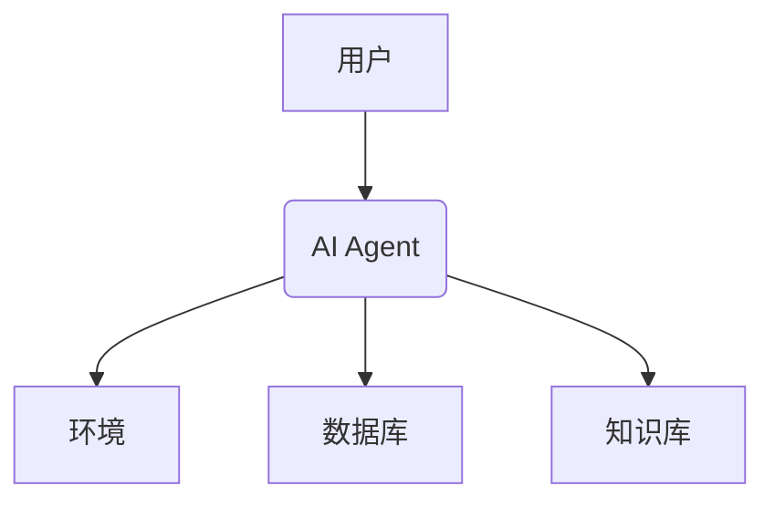
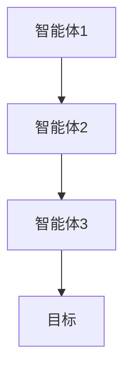
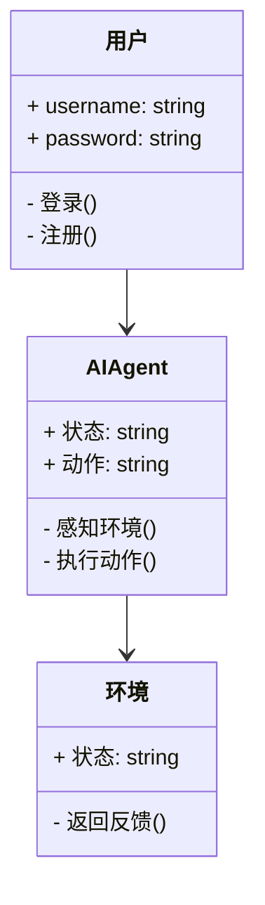

                 


# AI Agent在特定领域的深度应用：法律、医疗、金融

## 关键词：AI Agent, 特定领域, 法律, 医疗, 金融, 智能系统, 人机交互

## 摘要：  
本文深入探讨了AI Agent在法律、医疗和金融这三个特定领域的深度应用。通过分析AI Agent的核心概念、算法原理、系统架构，结合实际案例，展示了AI Agent如何在这些领域中提供智能化解决方案。文章还讨论了AI Agent的优势、挑战以及未来的发展趋势。

---

# 第一部分: AI Agent 在特定领域的深度应用概述

## 第1章: AI Agent 的基本概念与背景

### 1.1 AI Agent 的定义与特点  
AI Agent（人工智能代理）是指能够感知环境、自主决策并执行任务的智能实体。它通过与用户或系统的交互，提供个性化的服务和解决方案。  
- **特点**：  
  - **自主性**：能够在没有外部干预的情况下独立运行。  
  - **反应性**：能够实时感知环境并做出反应。  
  - **目标导向**：以实现特定目标为导向执行任务。  
  - **学习能力**：能够通过数据学习和优化性能。  

### 1.2 AI Agent 在特定领域的应用背景  
AI Agent在法律、医疗和金融领域的应用具有重要意义：  
- **法律领域**：AI Agent可以辅助法律咨询、案例分析和合同审查。  
- **医疗领域**：AI Agent能够辅助诊断、治疗方案制定和药物研发。  
- **金融领域**：AI Agent用于金融数据分析、风险评估和自动化交易。  

---

## 第2章: AI Agent 在特定领域的核心应用  

### 2.1 法律领域的深度应用  
AI Agent在法律领域的应用主要体现在以下几个方面：  
- **法律咨询与案例分析**：通过自然语言处理技术，AI Agent能够快速分析大量法律文献，为用户提供准确的法律建议。  
- **合同审查与法律文书生成**：AI Agent可以自动审查合同条款，识别潜在风险，并生成标准化的法律文书。  
- **法律风险评估与合规性分析**：AI Agent能够评估企业经营中的法律风险，并提供合规性建议。  

### 2.2 医疗领域的深度应用  
AI Agent在医疗领域的应用主要体现在：  
- **病历分析与诊断辅助**：AI Agent能够分析患者的病历数据，辅助医生进行诊断。  
- **医疗影像识别与疾病预测**：通过深度学习技术，AI Agent能够识别医疗影像中的病变，并预测疾病的发展趋势。  
- **药物研发与个性化治疗方案**：AI Agent能够加速药物研发过程，并为患者制定个性化的治疗方案。  

### 2.3 金融领域的深度应用  
AI Agent在金融领域的应用主要体现在：  
- **金融数据分析与市场预测**：通过分析市场数据，AI Agent能够预测股票价格和市场趋势。  
- **风险评估与信用评分**：AI Agent能够评估客户的信用风险，并为金融机构提供信用评分服务。  
- **自动化交易与投资决策**：AI Agent能够根据市场变化自动执行交易，并为投资者提供投资建议。  

---

# 第二部分: AI Agent 的核心概念与系统架构  

## 第3章: AI Agent 的核心概念与原理  

### 3.1 AI Agent 的核心概念  
AI Agent的核心概念包括：  
- **多智能体协作**：多个AI Agent协同工作，共同完成复杂任务。  
- **知识表示与推理**：通过知识图谱和逻辑推理，AI Agent能够理解复杂问题。  
- **人机交互与反馈机制**：AI Agent通过自然语言处理和用户反馈，不断优化服务。  

### 3.2 AI Agent 的系统架构  
AI Agent的系统架构主要包括：  
- **分层架构**：分为感知层、决策层和执行层。  
- **分布式架构**：多个AI Agent分布在不同的节点上，协同工作。  
- **事件驱动架构**：通过事件触发，AI Agent能够快速响应环境变化。  

---

## 第4章: AI Agent 的系统架构设计  

### 4.1 系统功能设计  
AI Agent的系统功能设计包括：  
- **领域模型设计**：根据具体领域需求，构建相应的知识模型。  
- **交互界面设计**：设计用户友好的人机交互界面。  
- **数据处理与存储**：对数据进行清洗、存储和管理。  

### 4.2 系统架构设计  
AI Agent的系统架构设计可以通过以下方式展示：  



---

# 第三部分: AI Agent 的算法原理  

## 第5章: AI Agent 的算法原理  

### 5.1 多智能体协作算法  
多智能体协作算法的核心思想是通过分布式计算，实现多个AI Agent的协同工作。  

#### Q-learning算法  
Q-learning是一种常用的强化学习算法，其公式为：  
$$ Q(s, a) = Q(s, a) + \alpha (r + \max_{a'} Q(s', a') - Q(s, a)) $$  
其中，$s$ 是状态，$a$ 是动作，$r$ 是奖励，$\alpha$ 是学习率。  

#### 多智能体协作流程图  


---

## 第6章: AI Agent 的系统分析与架构  

### 6.1 系统分析  
系统分析包括以下步骤：  
1. **问题场景介绍**：明确系统需要解决的问题。  
2. **项目介绍**：简要介绍项目的背景和目标。  
3. **系统功能设计**：设计系统的功能模块。  
4. **系统架构设计**：通过类图展示系统的架构。  

#### 系统功能设计类图  


---

## 第7章: AI Agent 的项目实战  

### 7.1 环境安装  
在运行AI Agent之前，需要安装以下环境：  
- Python 3.8 或更高版本  
- TensorFlow 2.0 或更高版本  
- PyTorch 1.0 或更高版本  

### 7.2 核心代码实现  

#### 示例代码  
```python
import numpy as np

def q_learning(q_table, state, action):
    q_value = q_table[state][action]
    return q_value

# 初始化Q表
q_table = np.zeros((num_states, num_actions))

# Q-learning算法实现
for episode in range(num_episodes):
    state = env.reset()
    while True:
        action = policy(state)
        next_state, reward, done = env.step(action)
        q_table[state][action] = q_table[state][action] + learning_rate * (reward + discount_factor * np.max(q_table[next_state]) - q_table[state][action])
        state = next_state
        if done:
            break
```

#### 代码解读  
上述代码实现了Q-learning算法，用于训练AI Agent在特定环境中的行为策略。通过不断迭代，AI Agent能够学习到最优的行动策略。  

---

## 第8章: 总结与展望  

### 8.1 总结  
AI Agent在法律、医疗和金融领域的深度应用，显著提升了行业的智能化水平。通过多智能体协作和强化学习算法，AI Agent能够高效地解决复杂问题。  

### 8.2 展望  
未来，随着AI技术的不断发展，AI Agent在更多领域的应用将会更加广泛。同时，如何解决数据隐私和伦理问题，也是AI Agent发展过程中需要重点关注的方向。  

### 8.3 注意事项  
在实际应用中，AI Agent的设计和部署需要充分考虑系统的安全性和稳定性。此外，还需要注重用户隐私保护，确保数据的安全性。  

---

## 附录: 进一步阅读  

### 1. 推荐书籍  
- 《深度学习》—— Ian Goodfellow  
- 《强化学习》—— Richard S. Sutton  

### 2. 开源项目  
- [OpenAI Gym](https://gym.openai.com/)  
- [TensorFlow官方文档](https://tensorflow.org/)  

通过本文的深入分析，读者可以更好地理解AI Agent在特定领域的应用，并为实际项目提供参考。

