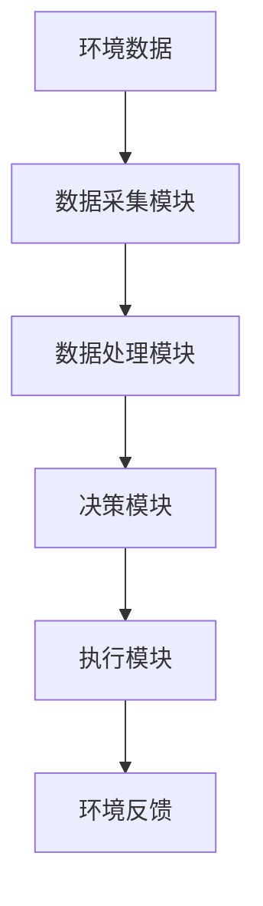

                 


# AI Agent在环境保护中的应用

## 关键词：AI Agent, 环境保护, 污染监测, 资源优化, 强化学习, 系统架构

## 摘要：  
AI Agent（人工智能代理）作为一种智能化的计算模型，正在逐渐成为解决复杂环境保护问题的重要工具。本文从AI Agent的基本概念出发，结合环境保护的实际需求，详细探讨了AI Agent在环境监测、污染控制、资源优化等方面的应用。通过分析AI Agent的核心原理，包括感知、决策和执行机制，本文展示了其在环境保护中的巨大潜力。同时，结合实际案例和算法实现，本文详细阐述了AI Agent在环境保护中的具体应用场景和技术实现方案，为读者提供了一个全面的技术视角。

---

## 第1章: AI Agent的基本概念与环境保护的现状

### 1.1 AI Agent的定义与核心概念

AI Agent是指在计算机系统中，能够感知环境、自主决策并执行任务的智能实体。它具备以下核心属性：

- **自主性**：能够在没有外部干预的情况下独立运行。
- **反应性**：能够根据环境变化实时调整行为。
- **目标导向**：具备明确的目标，并通过行为选择实现目标。
- **学习能力**：能够通过数据和经验不断优化自身性能。

### 1.2 环境保护的现状与挑战

环境保护的核心目标是保护和改善环境质量，减少污染，促进可持续发展。然而，环境保护面临以下挑战：

- **复杂性**：环境问题往往涉及多领域、多因素的交互作用。
- **动态性**：环境状况会因自然和人为因素而不断变化。
- **资源约束**：环境保护需要大量资源投入，但资源分配效率低下。

### 1.3 AI Agent在环境保护中的应用前景

AI Agent在环境保护中的应用前景广阔，尤其是在以下几个方面：

- **环境监测**：通过AI Agent实时感知环境数据，实现精准的污染监测和预测。
- **污染控制**：利用AI Agent优化污染治理策略，减少环境损害。
- **资源优化**：通过AI Agent实现资源的高效利用和分配，降低浪费。

---

## 第2章: AI Agent的核心原理

### 2.1 AI Agent的感知机制

AI Agent的感知机制是其获取环境信息的关键部分，主要包括数据采集、特征提取和环境理解三个步骤。

#### 2.1.1 数据采集与处理
AI Agent通过传感器、数据库等多源数据输入，获取环境数据。例如，在空气污染监测中，AI Agent可以通过空气质量传感器获取PM2.5、NO2等污染物的浓度数据。

#### 2.1.2 环境特征提取与分析
通过对原始数据进行特征提取和分析，AI Agent能够识别环境中的关键特征。例如，通过分析PM2.5浓度的时间序列数据，AI Agent可以识别污染高峰期。

#### 2.1.3 数据驱动的环境理解
AI Agent通过机器学习算法，将环境数据转化为对环境状态的理解。例如，使用监督学习算法训练模型，识别空气质量指数（AQI）的高低。

### 2.2 AI Agent的决策机制

AI Agent的决策机制是其根据感知到的环境信息，制定最优行为策略的关键部分。

#### 2.2.1 基于强化学习的决策模型
强化学习是一种通过试错机制优化决策的算法。例如，在污染控制场景中，AI Agent可以通过强化学习选择最优的污染治理策略。

#### 2.2.2 基于监督学习的决策模型
监督学习是一种基于已有标签数据的预测方法。例如，在资源分配问题中，AI Agent可以通过监督学习预测最优的资源分配方案。

#### 2.2.3 多目标优化的决策策略
多目标优化是一种同时优化多个目标的算法。例如，在环境监测中，AI Agent可以通过多目标优化同时优化监测成本和监测精度。

### 2.3 AI Agent的执行机制

AI Agent的执行机制是其将决策转化为实际行动的关键部分。

#### 2.3.1 动作规划与优化
AI Agent需要根据决策结果制定具体的执行动作，并优化这些动作以实现最优效果。

#### 2.3.2 动作执行与反馈
AI Agent通过执行动作影响环境，并根据环境反馈调整自身行为。

#### 2.3.3 动作效果的评估与优化
AI Agent需要对执行动作的效果进行评估，并根据评估结果优化未来的决策。

---

## 第3章: AI Agent在环境保护中的具体应用

### 3.1 环境监测与污染控制中的AI Agent应用

#### 3.1.1 环境数据采集与处理
在环境监测中，AI Agent可以通过传感器网络实时采集环境数据，并通过数据融合技术提高数据准确性。

#### 3.1.2 环境污染预测与控制
AI Agent可以通过机器学习算法预测污染扩散趋势，并制定最优的污染治理策略。

#### 3.1.3 环境质量评估与改善
AI Agent可以通过多源数据融合和机器学习模型，评估环境质量，并提出改善建议。

### 3.2 资源优化与能源管理中的AI Agent应用

#### 3.2.1 资源分配优化
AI Agent可以通过强化学习优化资源分配策略，提高资源利用效率。

#### 3.2.2 能源消耗预测
AI Agent可以通过时间序列分析预测能源消耗趋势，并制定最优的能源管理策略。

#### 3.2.3 能源浪费减少
AI Agent可以通过实时监控和优化能源使用，减少能源浪费。

---

## 第4章: AI Agent在环境保护中的算法实现

### 4.1 基于强化学习的AI Agent算法实现

#### 4.1.1 强化学习算法
强化学习是一种通过试错机制优化决策的算法。例如，在污染控制场景中，AI Agent可以通过强化学习选择最优的污染治理策略。

#### 4.1.2 算法实现
以下是Q-Learning算法的Python实现示例：

```python
import numpy as np

class QLearning:
    def __init__(self, state_space, action_space, learning_rate=0.1, gamma=0.9):
        self.state_space = state_space
        self.action_space = action_space
        self.learning_rate = learning_rate
        self.gamma = gamma
        self.q_table = np.zeros((state_space, action_space))
    
    def choose_action(self, state):
        return np.argmax(self.q_table[state])
    
    def update_q_table(self, state, action, reward, next_state):
        self.q_table[state][action] = self.q_table[state][action] * (1 - self.learning_rate) + self.learning_rate * (reward + self.gamma * np.max(self.q_table[next_state]))
```

---

## 第5章: AI Agent在环境保护中的系统架构设计

### 5.1 系统功能设计

AI Agent在环境保护中的系统功能设计包括：

- **数据采集模块**：负责采集环境数据。
- **数据处理模块**：负责数据清洗和特征提取。
- **决策模块**：负责制定最优决策。
- **执行模块**：负责执行决策并返回反馈。

### 5.2 系统架构设计

以下是AI Agent在环境保护中的系统架构图：



---

## 第6章: 项目实战

### 6.1 环境安装

安装必要的Python库：

```bash
pip install numpy pandas scikit-learn
```

### 6.2 系统核心实现源代码

以下是AI Agent在环境保护中的Python代码实现：

```python
import numpy as np
import pandas as pd
from sklearn.model_selection import train_test_split
from sklearn.linear_model import LinearRegression

# 数据加载
data = pd.read_csv('environment_data.csv')

# 数据预处理
X = data[['temperature', 'humidity']]
y = data['pollution_level']

# 数据分割
X_train, X_test, y_train, y_test = train_test_split(X, y, test_size=0.2)

# 模型训练
model = LinearRegression()
model.fit(X_train, y_train)

# 模型预测
y_pred = model.predict(X_test)

# 模型评估
print('预测结果:', y_pred)
print('真实结果:', y_test)
```

---

## 第7章: 总结与展望

### 7.1 总结

本文详细探讨了AI Agent在环境保护中的应用，包括其核心原理、具体应用以及算法实现。通过实际案例和代码实现，展示了AI Agent在环境保护中的巨大潜力。

### 7.2 展望

未来，随着AI技术的不断发展，AI Agent在环境保护中的应用将更加广泛。例如，AI Agent可以通过边缘计算技术实现实时环境监测，通过联邦学习技术实现多机构的环境数据协作。

---

## 注意事项

- 在使用AI Agent进行环境保护时，需要考虑数据隐私和安全问题。
- AI Agent的决策过程需要符合相关法律法规。
- 在实际应用中，需要根据具体场景选择合适的算法和模型。

---

## 拓展阅读

- 《强化学习入门：算法与应用》
- 《机器学习在环境保护中的应用》
- 《AI Agent在智能系统中的设计与实现》

