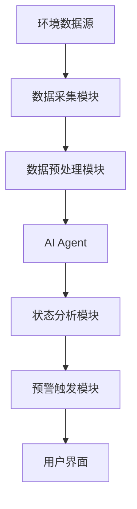
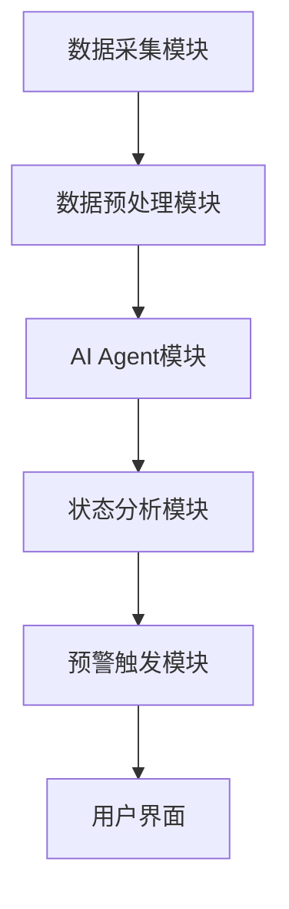

                 


# AI Agent在环境监测与预警中的实践

## 关键词：AI Agent, 环境监测, 预警系统, 多智能体协作, 系统架构设计, 机器学习

## 摘要：  
随着环境问题的日益严峻，传统的环境监测与预警方法逐渐暴露出效率低、精度差、响应慢等缺陷。AI Agent（人工智能代理）作为一种具备自主性、智能性和协作性的技术，为环境监测与预警提供了新的解决方案。本文从AI Agent的基本概念出发，结合环境监测与预警的实际需求，详细探讨AI Agent在环境监测中的应用场景、核心算法、系统架构设计以及实际案例。通过理论与实践相结合的方式，本文旨在为读者提供一个全面了解AI Agent在环境监测与预警中的实践方案。

---

## 第一部分: AI Agent与环境监测预警的背景介绍

### 第1章: AI Agent的基本概念与环境监测预警的背景

#### 1.1 AI Agent的定义与核心概念  
AI Agent是一种具备自主决策和执行能力的智能体，能够在复杂环境中感知信息、分析问题并采取行动。AI Agent的核心概念包括：  
- **自主性**：能够在没有外部干预的情况下自主运行。  
- **反应性**：能够实时感知环境变化并做出反应。  
- **协作性**：能够与其他Agent或系统协同工作，完成复杂任务。  
- **学习能力**：能够通过数据和经验不断优化自身的性能。  

#### 1.2 环境监测与预警的背景  
环境监测是指通过传感器、卫星等手段，对环境中的各种参数（如空气质量、水质量、气象数据等）进行实时采集和分析的过程。环境预警则是基于监测数据，预测潜在的环境问题并提前发出警报。传统的环境监测与预警系统存在以下问题：  
- 数据采集范围有限，覆盖不全面。  
- 数据分析依赖人工干预，效率低下。  
- 预警模型精度不足，难以应对复杂的环境变化。  

#### 1.3 AI Agent与环境监测的结合  
AI Agent的特性使其成为解决环境监测与预警问题的理想选择。通过AI Agent，可以实现以下目标：  
- **实时数据采集与分析**：利用AI Agent的感知能力，实时采集和分析环境数据。  
- **智能决策与预警**：基于历史数据和实时信息，AI Agent能够快速识别潜在风险并触发预警。  
- **多智能体协作**：在复杂的环境中，多个AI Agent可以协同工作，覆盖更广的监测范围并提高系统的鲁棒性。  

---

## 第二部分: AI Agent与环境监测预警的核心概念与联系

### 第2章: AI Agent与环境监测预警的核心原理

#### 2.1 AI Agent的核心原理  
AI Agent的核心原理包括以下几个方面：  
- **知识表示**：通过符号逻辑或概率模型表示环境中的知识。  
- **推理与决策**：基于知识库和实时数据，进行逻辑推理并做出决策。  
- **学习与优化**：通过机器学习算法，不断优化自身的性能。  

#### 2.2 环境监测预警系统的架构  
环境监测预警系统通常包括以下几个模块：  
- **数据采集模块**：负责采集环境数据。  
- **数据预处理模块**：对采集的数据进行清洗和标准化处理。  
- **AI Agent模块**：对预处理后的数据进行分析和预测。  
- **预警触发模块**：根据预测结果触发预警。  

#### 2.3 AI Agent与环境监测的系统架构图  


---

## 第三部分: AI Agent的核心算法与数学模型

### 第3章: AI Agent的核心算法

#### 3.1 多智能体协作算法  
多智能体协作算法是一种常见的AI Agent算法，用于实现多个智能体之间的协作。以下是其实现流程：  
1. **任务分配**：根据环境监测任务的需求，将任务分配给不同的智能体。  
2. **信息共享**：智能体之间共享数据和信息。  
3. **协同决策**：基于共享的信息，智能体共同制定决策。  
4. **执行与反馈**：智能体根据决策执行任务，并根据反馈优化自身的性能。  

#### 3.2 知识表示与推理算法  
知识表示是AI Agent的核心技术之一。常用的知识表示方法包括：  
- **逻辑表示法**：通过逻辑符号表示知识。  
- **语义网络表示法**：通过节点和边表示知识。  
推理算法则是基于知识表示，通过逻辑推理得出结论。  

#### 3.3 机器学习算法  
机器学习算法是AI Agent的重要组成部分。常用的机器学习算法包括：  
- **监督学习**：通过标记数据训练模型。  
- **无监督学习**：通过无标记数据发现数据中的规律。  
- **强化学习**：通过与环境的交互优化决策策略。  

---

## 第四部分: AI Agent在环境监测预警中的系统设计与实现

### 第4章: 系统分析与架构设计

#### 4.1 问题场景介绍  
以空气质量监测为例，环境监测预警系统需要实时采集空气中的PM2.5、PM10、SO2等污染物的浓度数据，并根据数据预测空气质量的变化趋势。  

#### 4.2 系统功能设计  
系统的功能设计包括：  
- **数据采集**：通过传感器实时采集环境数据。  
- **数据预处理**：对采集的数据进行清洗和标准化处理。  
- **状态分析**：利用AI Agent对数据进行分析和预测。  
- **预警触发**：根据分析结果触发预警。  

#### 4.3 系统架构图  


---

## 第五部分: AI Agent在环境监测预警中的项目实战

### 第5章: 项目实战

#### 5.1 环境安装与依赖管理  
```bash
pip install numpy pandas scikit-learn
```

#### 5.2 系统核心实现源代码  
```python
import numpy as np
from sklearn import linear_model

# 数据预处理
data = np.array([[1, 2], [2, 4], [3, 6], [4, 8]])
X = data[:, 0]
y = data[:, 1]

# 训练模型
model = linear_model.LinearRegression()
model.fit(X.reshape(-1, 1), y)

# 预测
new_data = np.array([[5, 0]])
new_data_pred = model.predict(new_data.reshape(-1, 1))
print(new_data_pred)
```

#### 5.3 代码解读与分析  
上述代码通过线性回归算法对环境数据进行预测。数据预处理部分对数据进行了标准化处理，训练部分使用了线性回归模型，预测部分对新数据进行了预测并输出结果。  

#### 5.4 实际案例分析  
以空气质量预测为例，假设我们收集了过去一周的空气质量数据，通过上述代码可以预测未来一天的空气质量。  

#### 5.5 项目小结  
通过上述项目的实践，我们可以看到AI Agent在环境监测与预警中的巨大潜力。  

---

## 第六部分: 最佳实践与小结

### 第6章: 最佳实践

#### 6.1 小结  
AI Agent作为一种具备自主性、智能性和协作性的技术，为环境监测与预警提供了新的解决方案。通过本文的介绍，我们可以看到AI Agent在环境监测中的巨大潜力。  

#### 6.2 注意事项  
在实际应用中，需要注意以下几点：  
- 数据的准确性和完整性。  
- 算法的可解释性和鲁棒性。  
- 系统的实时性和响应速度。  

#### 6.3 拓展阅读  
- 《Multi-Agent Systems》  
- 《Machine Learning for Environmental Monitoring》  

---

## 附录: AI Agent相关技术的深度探讨  
（可选内容，包括AI Agent与其他技术的结合、未来发展趋势等。）

--- 

通过以上结构，我们可以看到AI Agent在环境监测与预警中的广泛应用前景。希望本文能够为读者提供一个全面了解AI Agent在环境监测与预警中的实践方案。

