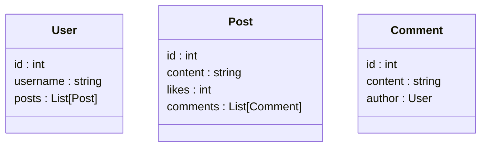
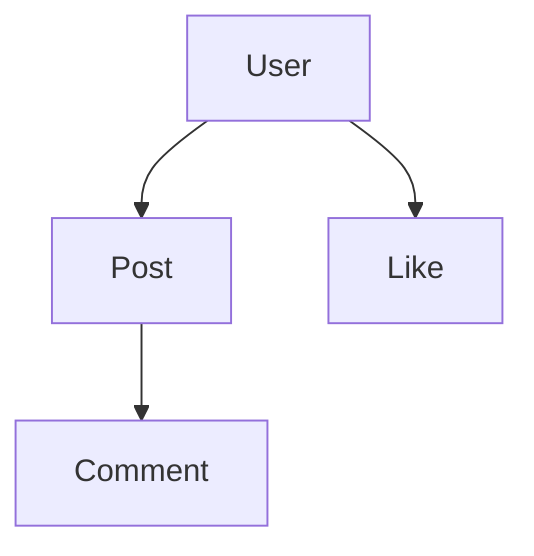
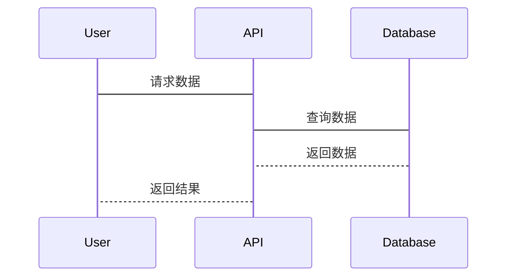

                 


# AI Agent在社交媒体分析中的应用

## 关键词
AI Agent, 社交媒体分析, 自然语言处理, 情感分析, 主题建模, 社交网络分析

## 摘要
随着社交媒体的普及，分析社交媒体数据变得至关重要。AI Agent作为人工智能代理，能够自动化地处理和分析大量数据，提供实时洞察。本文将深入探讨AI Agent在社交媒体分析中的应用，包括其核心概念、算法原理、系统架构设计以及实际项目案例，帮助读者全面理解并应用这一技术。

---

# 第1章 AI Agent与社交媒体分析概述

## 1.1 AI Agent的基本概念
### 1.1.1 AI Agent的定义与特点
AI Agent（人工智能代理）是能够感知环境并采取行动以实现目标的智能实体。其特点包括自主性、反应性、目标导向和社会能力。

### 1.1.2 社交媒体分析的基本概念
社交媒体分析是对社交媒体数据进行收集、处理和分析的过程，旨在提取有价值的信息，如情感倾向、用户行为和社交网络结构。

### 1.1.3 AI Agent在社交媒体分析中的应用背景
社交媒体数据的海量性和实时性要求高效的自动化工具，AI Agent能够满足这些需求，实时处理和分析数据。

## 1.2 社交媒体分析的背景与挑战
### 1.2.1 社交媒体数据的特性
社交媒体数据具有多样性、实时性和动态性，但存在噪声和隐私问题。

### 1.2.2 社交媒体分析的主要挑战
包括数据量大、信息复杂、隐私保护和计算资源需求高等挑战。

### 1.2.3 AI Agent在社交媒体分析中的作用
AI Agent能够自动化处理数据，提供实时洞察，帮助决策者快速响应。

## 1.3 AI Agent在社交媒体分析中的应用前景
### 1.3.1 AI Agent的核心优势
具备高效性、智能性和自适应性，能够处理复杂任务。

### 1.3.2 社交媒体分析的未来趋势
向实时化、个性化和智能化方向发展，AI Agent将发挥更大作用。

### 1.3.3 AI Agent在社交媒体分析中的潜力
应用于情感分析、话题检测、社交网络分析等领域，提升分析效率和准确性。

## 1.4 本章小结
本章介绍了AI Agent和社交媒体分析的基本概念，分析了其应用背景和挑战，并展望了未来的发展前景。

---

# 第2章 AI Agent的核心概念与原理

## 2.1 AI Agent的核心原理
### 2.1.1 AI Agent的基本原理
AI Agent通过感知环境、分析数据、制定策略并采取行动来实现目标。

### 2.1.2 AI Agent的决策机制
基于感知的信息，结合预设规则或机器学习模型，做出最优决策。

### 2.1.3 AI Agent的学习与自适应能力
通过机器学习算法不断优化模型，适应新的数据和环境变化。

## 2.2 社交媒体分析的核心技术
### 2.2.1 自然语言处理（NLP）技术
NLP用于处理文本数据，提取关键词、句法结构和语义信息。

### 2.2.2 情感分析与主题建模
情感分析判断文本情感倾向，主题建模识别文本主题。

### 2.2.3 社交网络分析
分析用户之间的关系和影响力，识别关键用户和社群结构。

## 2.3 AI Agent与社交媒体分析的结合
### 2.3.1 AI Agent在社交媒体分析中的角色
作为自动化工具，AI Agent负责数据收集、处理和分析。

### 2.3.2 AI Agent与社交媒体分析的协同工作
AI Agent与其他工具协同，提供端到端的分析解决方案。

### 2.3.3 AI Agent在社交媒体分析中的核心流程
数据收集→预处理→分析→结果输出。

## 2.4 核心概念对比表
| 比较项            | AI Agent                 | 社交媒体分析          |
|-------------------|--------------------------|-----------------------|
| 核心功能          | 自动化数据处理           | 提供分析结果           |
| 技术基础          | 机器学习、NLP            | 数据挖掘、统计分析     |
| 应用场景          | 实时监控、自动化分析     | 市场分析、舆情监测      |

## 2.5 ER实体关系图
```mermaid
erDiagram
    user {
        User <---| many
        Post
    }
    Post {
        belongs to
        Topic
    }
    Topic {
        has
        Sentiment
    }
```

---

# 第3章 AI Agent的算法原理

## 3.1 情感分析算法
### 3.1.1 情感分析的定义
判断文本的情感倾向，通常分为正面、负面和中性。

### 3.1.2 基于机器学习的情感分析
使用训练好的模型，如支持向量机（SVM）和随机森林（Random Forest）进行分类。

### 3.1.3 基于深度学习的情感分析
使用神经网络模型，如LSTM和Transformer进行情感分析。

### 3.1.4 情感分析的流程
数据预处理→特征提取→模型训练→结果预测。

### 3.1.5 情感分析的实现代码
```python
from sklearn.feature_extraction.text import TfidfVectorizer
from sklearn.svm import SVC

# 数据预处理
X = text_data
y = labels

# 特征提取
vectorizer = TfidfVectorizer()
X_features = vectorizer.fit_transform(X)

# 模型训练
model = SVC()
model.fit(X_features, y)

# 预测
new_post = ["I love this product!"]
new_features = vectorizer.transform(new_post)
print(model.predict(new_features))
```

### 3.1.6 情感分析的数学模型
$$ P(y|X) = \frac{P(X|y)}{P(X)} $$

## 3.2 主题建模算法
### 3.2.1 主题建模的定义
识别文本中的主题分布，通常使用LDA模型。

### 3.2.2 LDA模型的实现
```python
from gensim import corpora, models

# 数据准备
texts = ["text1", "text2", ...]

# 创建词袋模型
dictionary = corpora.Dictionary(texts)
corpus = [dictionary.doc2bow(text) for text in texts]

# 训练LDA模型
 lda = models.LdaModel(corpus, num_topics=5, id2word=dictionary)
```

### 3.2.3 主题建模的流程
数据预处理→构建词袋模型→训练LDA模型→提取主题。

## 3.3 社交网络分析算法
### 3.3.1 社交网络分析的定义
分析用户之间的关系和社交结构，识别关键用户。

### 3.3.2 社交网络分析的实现
使用图论算法，如PageRank和社区检测算法。

### 3.3.3 社交网络分析的流程
数据收集→构建社交图谱→计算节点属性→识别社群。

---

# 第4章 系统架构设计

## 4.1 系统功能设计
### 4.1.1 领域模型


### 4.1.2 系统架构图


## 4.2 系统接口设计
### 4.2.1 接口描述
API接口用于数据获取和结果返回，如RESTful API。

### 4.2.2 接口实现
使用Flask框架，定义RESTful API。

## 4.3 系统交互流程
### 4.3.1 交互序列图


---

# 第5章 项目实战

## 5.1 项目背景与目标
分析社交媒体上的用户评论，进行情感分析和主题建模。

## 5.2 环境配置
安装必要的库，如Python、scikit-learn、Gensim和Flask。

## 5.3 核心代码实现
### 5.3.1 数据预处理
```python
import pandas as pd

data = pd.read_csv('comments.csv')
```

### 5.3.2 情感分析
使用预训练的模型进行情感分类。

### 5.3.3 主题建模
训练LDA模型，提取主题。

## 5.4 实际案例分析
分析用户评论，提取主题和情感倾向，识别关键用户。

## 5.5 项目小结
总结项目实现过程，讨论优缺点和改进建议。

---

# 第6章 最佳实践与小结

## 6.1 最佳实践
### 6.1.1 数据预处理的重要性
确保数据质量，避免错误分析。

### 6.1.2 模型调优的必要性
通过交叉验证和网格搜索优化模型性能。

### 6.1.3 结果可视化的重要性
使用图表展示分析结果，便于理解和汇报。

## 6.2 小结
回顾全文，强调AI Agent在社交媒体分析中的重要性，展望未来发展方向。

## 6.3 注意事项
注意数据隐私和合规性，避免侵犯用户隐私。

## 6.4 拓展阅读
推荐相关书籍和论文，供进一步学习。

---

# 结语
AI Agent在社交媒体分析中的应用前景广阔，通过本文的学习，读者可以掌握其核心概念和实现方法，应用于实际项目中。

