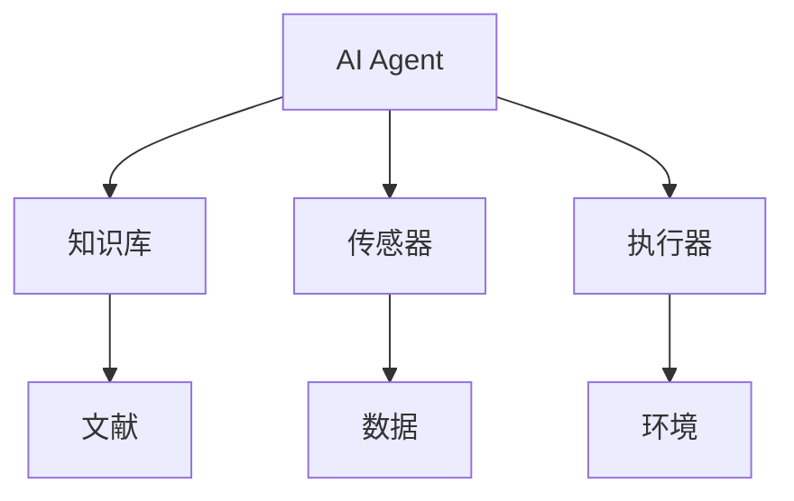
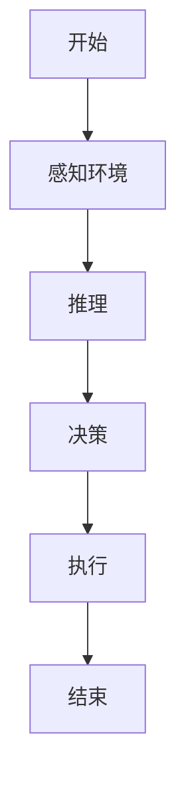
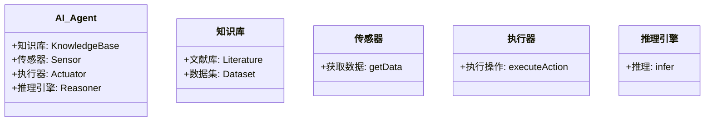

                 


# AI Agent在科学研究辅助中的应用

> 关键词：AI Agent，科学研究，人工智能，算法原理，系统架构，项目实战

> 摘要：本文探讨AI Agent在科学研究中的应用，从基本概念、技术原理、系统设计到项目实战，详细分析其在科学数据分析、知识图谱构建、实验设计优化等领域的应用，揭示AI Agent如何提升科学研究的效率和深度。

---

# 第一部分: AI Agent在科学研究辅助中的应用概述

## 第1章: AI Agent的基本概念与背景介绍

### 1.1 AI Agent的定义与核心概念

#### 1.1.1 AI Agent的定义
AI Agent（人工智能代理）是指能够感知环境、自主决策并执行任务的智能实体。它通过传感器获取信息，利用推理引擎进行分析，并通过执行器与环境交互。

#### 1.1.2 AI Agent的核心要素
- **感知能力**：通过传感器或API获取数据。
- **推理能力**：基于知识库和模型进行逻辑推理。
- **决策能力**：根据推理结果制定行动计划。
- **执行能力**：通过执行器或API实现目标。

#### 1.1.3 AI Agent与传统计算工具的区别
- **自主性**：AI Agent能够自主决策，而传统工具需要人工干预。
- **适应性**：AI Agent能够适应环境变化，传统工具则需要手动调整。

### 1.2 AI Agent在科学研究中的作用

#### 1.2.1 科学研究中的问题与挑战
科学研究通常涉及复杂的数据分析、实验设计和结果验证。科学家需要处理大量数据，同时需要快速找到相关知识并进行推理。

#### 1.2.2 AI Agent在科学研究中的应用场景
- **数据处理与分析**：帮助科学家处理和分析实验数据。
- **知识检索与推理**：快速查找相关文献并进行推理。
- **实验设计优化**：优化实验方案，减少不必要的实验次数。

#### 1.2.3 AI Agent的优势与局限性
- **优势**：提高效率、减少错误、加速发现。
- **局限性**：依赖数据质量、可能缺乏创造性、需要持续维护。

### 1.3 AI Agent的技术基础

#### 1.3.1 人工智能与机器学习基础
AI Agent依赖于机器学习算法，如深度学习和强化学习，来处理数据和做出决策。

#### 1.3.2 自然语言处理与知识图谱
自然语言处理技术帮助AI Agent理解文献，知识图谱用于存储和推理知识。

#### 1.3.3 大数据分析与计算
AI Agent需要处理大量数据，依赖大数据技术进行分析和计算。

## 1.4 本章小结
本章介绍了AI Agent的基本概念，分析了它在科学研究中的作用和应用场景，讨论了其优势和局限性。

---

# 第二部分: AI Agent的核心概念与技术原理

## 第2章: AI Agent的核心概念与联系

### 2.1 AI Agent的核心概念

#### 2.1.1 感知与理解
AI Agent通过传感器或API获取环境数据，并利用自然语言处理技术理解文献。

#### 2.1.2 决策与推理
基于知识库和推理引擎，AI Agent进行逻辑推理，制定行动计划。

#### 2.1.3 行动与执行
通过执行器或API，AI Agent执行决策任务，如发送邮件或调整实验参数。

### 2.2 AI Agent的核心要素对比表

| 核心要素 | 描述 | 示例 |
|----------|------|------|
| 感知能力 | 数据获取方式 | 传感器、API接口 |
| 推理能力 | 使用算法 | 基于规则的推理、机器学习模型 |
| 决策能力 | 决策方式 | 最小化风险、最大化收益 |
| 执行能力 | 执行方式 | 调整实验参数、发送提醒 |

### 2.3 AI Agent的实体关系图



### 2.4 本章小结
本章详细分析了AI Agent的核心概念和核心要素，通过对比表和实体关系图展示了它们之间的关系。

---

# 第三部分: AI Agent的算法原理与数学模型

## 第3章: AI Agent的算法原理

### 3.1 AI Agent的算法概述

#### 3.1.1 基于规则的推理算法
- **规则定义**：如`IF温度>30 THEN采取降温措施`。
- **应用**：适用于简单场景，如温度控制。

#### 3.1.2 基于机器学习的推理算法
- **算法**：如决策树、随机森林。
- **应用**：复杂场景下的分类和预测。

#### 3.1.3 基于强化学习的决策算法
- **算法**：如Q-learning。
- **应用**：如游戏AI、机器人路径规划。

### 3.2 AI Agent的数学模型

#### 3.2.1 状态空间与动作空间的数学表示
- **状态空间**：S，表示所有可能的状态。
- **动作空间**：A，表示所有可能的动作。

#### 3.2.2 概率论与贝叶斯网络的应用
- **贝叶斯网络**：概率图模型，用于推理和决策。

#### 3.2.3 马尔可夫决策过程的数学模型
$$ V(s) = \max_{a} \left( r(s,a) + \gamma V(s') \right) $$

### 3.3 AI Agent的算法流程图



### 3.4 本章小结
本章介绍了AI Agent的算法原理，包括基于规则、机器学习和强化学习的算法，以及数学模型的应用。

---

# 第四部分: AI Agent的系统分析与架构设计

## 第4章: AI Agent的系统分析与架构设计

### 4.1 问题场景介绍
在科学研究中，AI Agent需要处理数据、分析文献、优化实验方案。

### 4.2 系统功能设计

#### 4.2.1 领域模型mermaid类图展示



### 4.3 系统架构设计

#### 4.3.1 mermaid架构图展示


### 4.4 本章小结
本章分析了AI Agent在科学研究中的问题场景，设计了系统的功能和架构，并展示了类图和架构图。

---

# 第五部分: AI Agent的项目实战

## 第5章: AI Agent的项目实战

### 5.1 环境安装与配置
安装Python和必要的库，如numpy、pandas、scikit-learn。

### 5.2 系统核心实现

#### 5.2.1 代码实现

```python
class AI_Agent:
    def __init__(self, knowledge_base, sensor, actuator):
        self.knowledge_base = knowledge_base
        self.sensor = sensor
        self.actuator = actuator

    def perceive(self):
        data = self.sensor.getData()
        return data

    def reason(self, data):
        # 简单的推理逻辑
        return "建议采取降温措施"

    def decide(self, conclusion):
        self.actuator.executeAction(conclusion)

if __name__ == "__main__":
    # 初始化知识库
    knowledge_base = KnowledgeBase()
    # 初始化传感器
    sensor = Sensor()
    # 初始化执行器
    actuator = Actuator()
    # 初始化AI Agent
    agent = AI_Agent(knowledge_base, sensor, actuator)
    # 执行
    data = agent.perceive()
    conclusion = agent.reason(data)
    agent.decide(conclusion)
```

### 5.3 代码应用解读与分析
上述代码展示了AI Agent的核心功能：感知、推理和决策。通过传感器获取数据，推理引擎进行分析，并通过执行器采取行动。

### 5.4 实际案例分析
以优化实验参数为例，AI Agent可以根据历史数据和文献，推荐最优参数组合，加速实验进程。

### 5.5 本章小结
本章通过代码实现和案例分析，展示了AI Agent在科学研究中的实际应用。

---

# 第六部分: 总结与展望

## 6.1 总结

### 6.1.1 最佳实践 tips
- 确保数据质量，选择合适的算法，定期维护系统。

### 6.1.2 小结
AI Agent在科学研究中具有重要作用，能够提高效率和准确性。

## 6.2 注意事项
- 数据隐私和安全问题
- 系统的可解释性
- 算法的可扩展性

## 6.3 拓展阅读
推荐阅读相关书籍和论文，深入学习AI Agent的应用。

---

# 结语

AI Agent正在改变科学研究的方式，未来随着技术的进步，其应用将更加广泛和深入。希望本文能为读者提供有价值的参考和启发。

