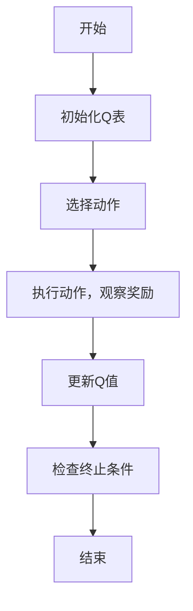
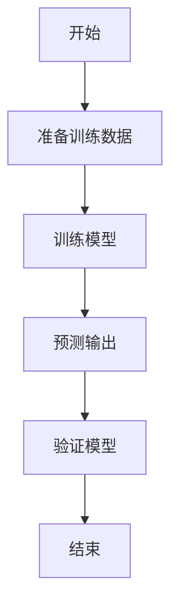
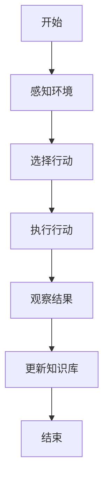
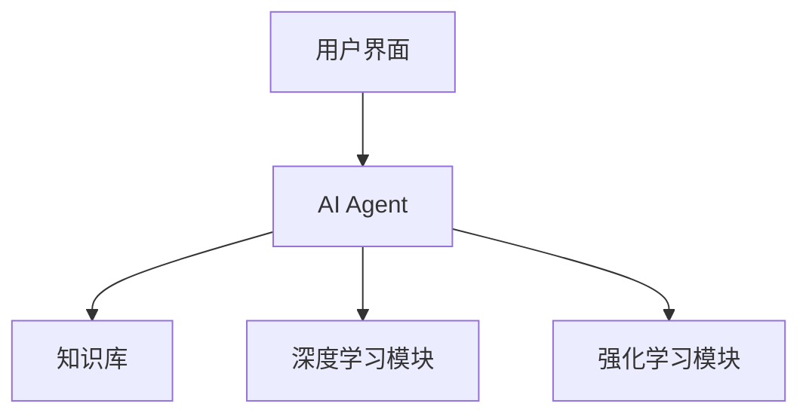
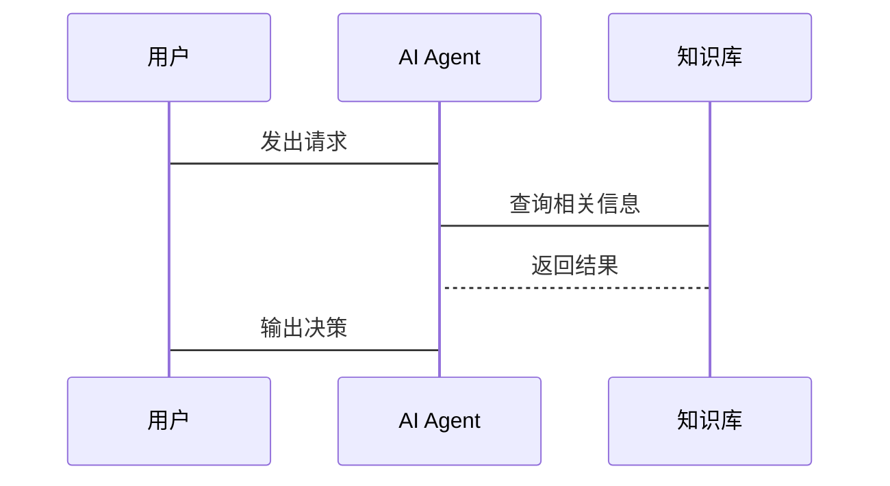

                 


# AI Agent在科研领域的应用：加速科学发现

> 关键词：AI Agent，科研应用，科学发现，人工智能，算法原理，系统架构

> 摘要：本文探讨了AI Agent在科研领域的应用，重点分析了其在加速科学发现中的作用。通过详细讲解AI Agent的核心概念、算法原理、系统架构，以及实际项目案例，本文旨在为读者提供全面的视角，帮助他们理解并应用AI Agent技术。

---

# 第1章: AI Agent的基本概念与背景

## 1.1 AI Agent的定义与特点

### 1.1.1 AI Agent的定义
AI Agent（人工智能代理）是一种能够感知环境、自主决策并执行任务的智能实体。它通过与环境交互，利用感知信息做出决策，并采取行动以实现特定目标。

### 1.1.2 AI Agent的核心特点
- **自主性**：AI Agent能够在没有外部干预的情况下自主运行。
- **反应性**：能够实时感知环境变化并做出响应。
- **目标导向**：所有行为都围绕实现特定目标展开。
- **学习能力**：通过经验或数据优化决策能力。

### 1.1.3 AI Agent与传统AI的区别
| 特性       | AI Agent                          | 传统AI                           |
|------------|-----------------------------------|-----------------------------------|
| 自主性     | 高                                | 低                                |
| 交互能力   | 强                                | 弱                                |
| 应用场景   | 动态、复杂环境                    | 静态、简单任务                    |

## 1.2 AI Agent在科研中的重要性

### 1.2.1 科研中的问题与挑战
- 数据量大、复杂度高，传统方法效率低。
- 科研任务需要快速迭代和优化，人工操作效率不足。
- 需要处理多目标、多约束的复杂问题。

### 1.2.2 AI Agent如何加速科学发现
AI Agent能够：
- 自动化处理数据，提升科研效率。
- 实现实验设计和优化，降低试错成本。
- 协助科学家进行复杂问题建模和求解。

### 1.2.3 AI Agent在不同科研领域的应用案例
- **药物发现**：AI Agent辅助分子筛选和药物设计。
- **材料科学**：优化材料合成过程。
- **天文学**：自动分析观测数据，发现新天体。

## 1.3 本章小结
本章介绍了AI Agent的基本概念、特点及其在科研中的重要性。通过对比分析，明确了AI Agent在加速科学发现中的独特优势。

---

# 第2章: AI Agent的核心概念与原理

## 2.1 AI Agent的基本原理

### 2.1.1 知识表示与推理
AI Agent通过知识表示（如知识图谱）构建领域知识，并利用推理算法（如逻辑推理）进行信息处理。

### 2.1.2 行为决策机制
AI Agent基于感知信息和预设策略，通过决策算法（如强化学习）选择最优行为。

### 2.1.3 与环境的交互过程
AI Agent通过传感器或接口与环境交互，获取信息并执行行动，形成闭环系统。

## 2.2 AI Agent的结构与功能

### 2.2.1 知识库的构建与管理
AI Agent需要一个动态更新的知识库，包含领域知识、经验教训等。

### 2.2.2 目标设定与优化
AI Agent通过设定明确的目标，并不断优化目标实现策略。

### 2.2.3 行为规划与执行
AI Agent根据当前状态和目标，制定行动计划并执行。

## 2.3 AI Agent与其他技术的关系

### 2.3.1 AI Agent与机器学习的联系
AI Agent依赖机器学习算法进行决策优化。

### 2.3.2 AI Agent与大数据分析的结合
AI Agent利用大数据分析技术处理和理解海量数据。

### 2.3.3 AI Agent与知识图谱的交互
AI Agent通过知识图谱进行知识推理和关联分析。

## 2.4 ER实体关系图

```mermaid
er
  actor(AI Agent)
  actor(环境)
  actor(目标)
  actor(数据源)
  relation(交互)
  relation(依赖)
  relation(驱动)
```

## 2.5 本章小结
本章详细讲解了AI Agent的核心概念、工作原理及其与其他技术的联系。

---

# 第3章: AI Agent的算法原理与数学模型

## 3.1 基于强化学习的AI Agent算法

### 3.1.1 强化学习的基本概念
强化学习是一种通过试错机制，学习最优策略的算法。

### 3.1.2 Q-learning算法
Q-learning是一种经典的强化学习算法，通过更新Q值表实现策略优化。

### 3.1.3 数学模型
Q-learning的数学模型如下：

$$ Q(s, a) \leftarrow Q(s, a) + \alpha [r + \max_{a'} Q(s', a') - Q(s, a)] $$

其中：
- \( Q(s, a) \)：状态 \( s \) 下采取行动 \( a \) 的价值。
- \( \alpha \)：学习率。
- \( r \)：奖励。
- \( s' \)：新状态。

### 3.1.4 算法流程


## 3.2 基于监督学习的AI Agent算法

### 3.2.1 监督学习的基本概念
监督学习通过训练数据学习函数，预测输出。

### 3.2.2 线性回归算法
线性回归是一种简单的监督学习算法，用于预测连续值。

### 3.2.3 数学模型
线性回归的数学模型如下：

$$ y = \theta^T x + b $$

其中：
- \( y \)：输出。
- \( \theta \)：权重向量。
- \( x \)：输入向量。
- \( b \)：偏置项。

### 3.2.4 算法流程


## 3.3 算法实现代码

```python
# 强化学习Q-learning算法实现
class QAgent:
    def __init__(self, state_size, action_size, alpha=0.1):
        self.state_size = state_size
        self.action_size = action_size
        self.Q = np.zeros((state_size, action_size))
        self.alpha = alpha

    def act(self, state):
        return np.argmax(self.Q[state])

    def update(self, state, action, reward, next_state):
        self.Q[state, action] += self.alpha * (reward + np.max(self.Q[next_state]) - self.Q[state, action])
```

## 3.4 本章小结
本章详细讲解了AI Agent的算法原理，包括强化学习和监督学习，并通过数学公式和代码示例进行了说明。

---

# 第4章: AI Agent的系统分析与架构设计

## 4.1 系统功能设计

### 4.1.1 领域模型设计
AI Agent系统需要构建领域知识图谱，支持知识推理和关联分析。

### 4.1.2 功能模块划分
- 知识库管理模块：负责知识的存储和管理。
- 行为决策模块：负责策略选择和执行。
- 交互接口模块：负责与环境的交互。

### 4.1.3 功能流程图


## 4.2 系统架构设计

### 4.2.1 系统架构图


### 4.2.2 系统接口设计
- 输入接口：接收环境信息和用户指令。
- 输出接口：输出决策结果和执行命令。

### 4.2.3 系统交互流程


## 4.3 本章小结
本章通过领域模型和系统架构设计，展示了AI Agent系统的整体结构和交互流程。

---

# 第5章: 项目实战——AI Agent在药物发现中的应用

## 5.1 项目背景介绍

### 5.1.1 项目目标
开发一个AI Agent系统，辅助药物分子的筛选和优化。

### 5.1.2 数据准备
收集和整理药物分子数据库，提取分子结构和活性数据。

## 5.2 系统核心实现

### 5.2.1 环境安装
```bash
pip install numpy pandas scikit-learn
```

### 5.2.2 核心代码实现
```python
class DrugDiscoveryAgent:
    def __init__(self, data_path):
        self.data = pd.read_csv(data_path)
        self.model = self.build_model()

    def build_model(self):
        # 构建机器学习模型
        return RandomForestClassifier()

    def train(self):
        self.model.fit(self.data[['分子结构', '理化性质']], self.data['活性'])

    def predict(self, molecule):
        return self.model.predict([[molecule]])
```

### 5.2.3 代码功能解读
- `DrugDiscoveryAgent`类：管理数据和模型。
- `build_model`方法：构建机器学习模型。
- `train`方法：训练模型。
- `predict`方法：预测药物分子活性。

## 5.3 实际案例分析

### 5.3.1 案例背景
某药物研发公司希望通过AI Agent筛选出具有高活性的候选药物分子。

### 5.3.2 数据分析
通过机器学习模型预测分子活性，筛选出top 10高活性分子。

### 5.3.3 结果展示
生成可视化报告，展示预测结果和分析结论。

## 5.4 本章小结
本章通过一个实际项目案例，展示了AI Agent在药物发现中的应用，并详细讲解了系统实现和数据分析过程。

---

# 第6章: 最佳实践与小结

## 6.1 本章小结
总结本文的主要内容，重申AI Agent在科研中的重要性。

## 6.2 注意事项
- 确保数据质量和完整性。
- 合理设置AI Agent的目标和约束条件。
- 定期优化系统和模型。

## 6.3 拓展阅读
推荐相关领域的书籍和论文，帮助读者进一步学习。

---

# 附录: 参考文献

1. Russell, S., & Norvig, P. (2010). Artificial Intelligence: A Modern Approach.
2. Goodfellow, I., Bengio, Y., & Courville, A. (2016). Deep Learning.

---

# END

