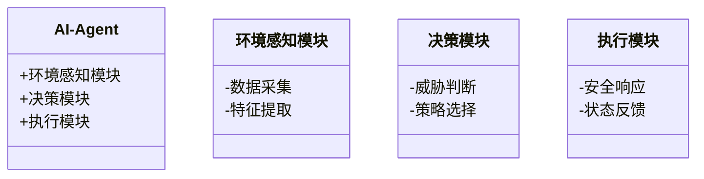
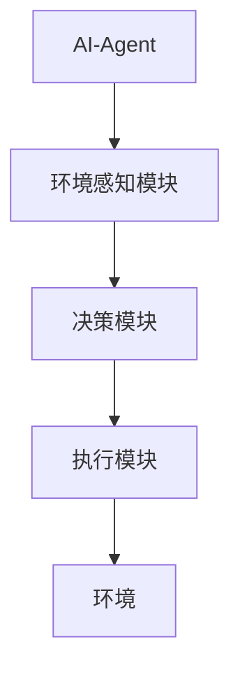
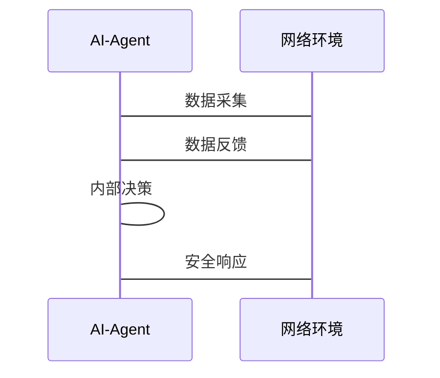

                 


# AI Agent在网络安全中的应用

> 关键词：AI Agent, 网络安全, 人工智能, 机器学习, 强化学习, 网络威胁检测

> 摘要：AI Agent在网络安全中的应用是当前技术发展的重要方向，通过结合人工智能和网络安全技术，AI Agent能够实现智能化的安全防护，包括威胁检测、漏洞挖掘、异常行为分析等。本文详细探讨了AI Agent的核心概念、算法原理、系统架构及其在网络安全中的实际应用案例，旨在为读者提供一个全面的理解和实践指南。

---

# 第1章: AI Agent与网络安全概述

## 1.1 AI Agent的基本概念

### 1.1.1 AI Agent的定义
AI Agent（人工智能代理）是指能够感知环境、自主决策并执行任务的智能实体。在网络安全领域，AI Agent通常被设计为能够自动识别威胁、分析数据并采取相应措施的智能系统。

### 1.1.2 AI Agent的核心特征
- **自主性**：能够在没有人工干预的情况下自主运行。
- **反应性**：能够实时感知环境变化并做出反应。
- **学习能力**：通过机器学习算法不断优化自身的决策能力。
- **协作性**：能够与其他AI Agent或系统协同工作。

### 1.1.3 AI Agent在网络安全中的应用背景
随着网络安全威胁的日益复杂化，传统的基于规则的安全防护手段已难以应对新型攻击方式。AI Agent通过引入智能化技术，能够显著提升安全防护的效率和效果。

---

## 1.2 网络安全中的AI Agent应用背景

### 1.2.1 网络安全的现状与挑战
- 网络攻击手段多样化，攻击者利用AI技术进行高级持续性威胁（APT）攻击。
- 数据量爆炸式增长，传统安全工具难以处理海量数据。
- 安全防护需要更高的实时性和准确性。

### 1.2.2 AI技术在网络安全中的优势
- **高效性**：AI Agent能够快速处理海量数据，实时识别威胁。
- **准确性**：通过机器学习模型，AI Agent能够更精准地识别异常行为。
- **适应性**：AI Agent能够根据新的威胁不断优化自身的防护策略。

### 1.2.3 AI Agent在网络安全中的独特价值
AI Agent不仅能够执行常规的安全监控任务，还能够通过自主学习和决策，在复杂的安全场景中提供智能化的解决方案。

---

## 1.3 AI Agent与网络安全的关系

### 1.3.1 AI Agent如何提升网络安全能力
- AI Agent能够通过机器学习算法识别未知威胁。
- AI Agent能够通过自我优化不断改进安全防护能力。

### 1.3.2 AI Agent在网络安全中的典型应用场景
- **威胁检测**：实时监控网络流量，识别潜在威胁。
- **漏洞挖掘**：自动化发现系统中的安全漏洞。
- **异常行为分析**：基于用户行为分析，识别内部威胁。

### 1.3.3 AI Agent与传统网络安全技术的结合
AI Agent可以与防火墙、入侵检测系统（IDS）等传统安全技术结合，形成更加完善的防护体系。

---

## 1.4 本章小结
本章介绍了AI Agent的基本概念及其在网络安全中的应用背景，阐述了AI Agent的核心特征和在网络安全中的独特价值。通过本章的学习，读者可以理解AI Agent在网络安全中的重要性及其应用前景。

---

# 第2章: AI Agent的核心概念与技术基础

## 2.1 AI Agent的核心概念

### 2.1.1 AI Agent的定义与分类
- **定义**：AI Agent是一种能够感知环境、自主决策并执行任务的智能实体。
- **分类**：
  - **反应式AI Agent**：基于当前感知做出决策，如实时威胁检测。
  - **认知式AI Agent**：具备推理和规划能力，如复杂的安全策略制定。

### 2.1.2 AI Agent的决策机制
- **基于规则的决策**：通过预定义的规则进行判断，适用于简单场景。
- **基于机器学习的决策**：通过训练模型进行预测和决策，适用于复杂场景。

### 2.1.3 AI Agent的智能特性
- **学习能力**：通过机器学习算法不断优化决策模型。
- **推理能力**：能够基于已有信息进行推理和判断。
- **自适应能力**：能够根据环境变化调整自身行为。

---

## 2.2 AI Agent在网络安全中的技术基础

### 2.2.1 机器学习基础
- **监督学习**：基于标记的数据进行训练，适用于分类任务。
- **无监督学习**：基于未标记的数据进行训练，适用于异常检测。
- **强化学习**：通过与环境交互，学习最优决策策略。

### 2.2.2 自然语言处理基础
- **文本分类**：用于识别恶意邮件或消息。
- **实体识别**：用于识别网络中的异常实体。

### 2.2.3 知识图谱与推理
- **知识图谱**：构建网络安全领域的知识库。
- **推理**：基于知识图谱进行逻辑推理，辅助决策。

---

## 2.3 AI Agent与网络安全技术的结合

### 2.3.1 AI Agent在威胁检测中的应用
- **网络流量分析**：通过机器学习模型识别异常流量。
- **日志分析**：通过自然语言处理技术分析系统日志，发现异常行为。

### 2.3.2 AI Agent在漏洞挖掘中的应用
- **自动化漏洞扫描**：通过AI Agent自动发现系统漏洞。
- **漏洞优先级排序**：基于机器学习模型评估漏洞的严重性。

### 2.3.3 AI Agent在安全策略优化中的应用
- **动态调整安全策略**：根据实时威胁情况优化安全策略。
- **自适应防护**：基于环境变化动态调整防护措施。

---

## 2.4 本章小结
本章详细讲解了AI Agent的核心概念及其在网络安全中的技术基础，探讨了AI Agent如何与网络安全技术相结合，为后续章节的深入分析奠定了基础。

---

# 第3章: AI Agent的算法原理

## 3.1 强化学习在AI Agent中的应用

### 3.1.1 强化学习的基本原理
- **定义**：通过智能体与环境的交互，学习最优决策策略。
- **核心要素**：
  - **状态（State）**：环境当前的状态。
  - **动作（Action）**：智能体采取的动作。
  - **奖励（Reward）**：环境对智能体动作的反馈。

### 3.1.2 基于强化学习的AI Agent算法
- **Q-learning算法**：
  - **数学模型**：
    $$ Q(s, a) = r + \gamma \max_{a'} Q(s', a') $$
  - **流程**：
    ```mermaid
    graph TD
        A[状态s] --> B[动作a]
        B --> C[状态s']
        C --> D[奖励r]
    ```

### 3.1.3 强化学习在网络安全中的应用
- **案例分析**：通过Q-learning算法训练AI Agent进行网络入侵检测。

---

## 3.2 监督学习在AI Agent中的应用

### 3.2.1 监督学习的基本原理
- **定义**：基于标记的数据进行训练，预测新的数据标签。
- **核心算法**：
  - **线性回归**：用于回归任务。
  - **支持向量机（SVM）**：用于分类任务。

### 3.2.2 监督学习在网络安全中的应用
- **威胁分类**：通过监督学习算法对网络流量进行分类，识别恶意流量。

---

## 3.3 无监督学习在AI Agent中的应用

### 3.3.1 无监督学习的基本原理
- **定义**：基于未标记的数据进行训练，发现数据中的潜在结构。
- **核心算法**：
  - **聚类分析**：将相似的数据点分组。
  - **异常检测**：识别数据中的异常点。

### 3.3.2 无监督学习在网络安全中的应用
- **异常检测**：通过聚类分析识别网络中的异常行为。

---

## 3.4 本章小结
本章详细讲解了AI Agent中常用的三种机器学习算法：强化学习、监督学习和无监督学习，并探讨了它们在网络安全中的具体应用。

---

# 第4章: AI Agent的系统架构与设计

## 4.1 系统功能设计

### 4.1.1 领域模型设计


### 4.1.2 系统架构设计


### 4.1.3 系统接口设计
- **输入接口**：接收网络流量数据和系统日志。
- **输出接口**：输出安全响应和决策结果。

---

## 4.2 系统交互流程

### 4.2.1 系统交互序列图


---

## 4.3 本章小结
本章详细讲解了AI Agent的系统架构与设计，包括功能模块划分、系统架构设计和系统交互流程，为后续的项目实现奠定了基础。

---

# 第5章: AI Agent的项目实战

## 5.1 环境配置

### 5.1.1 系统环境
- **操作系统**：Ubuntu 20.04
- **工具**：Python 3.8, Scikit-learn, TensorFlow

### 5.1.2 数据集
- **训练数据**：网络流量日志（CSV格式）
- **测试数据**：未标记的网络流量数据

---

## 5.2 核心代码实现

### 5.2.1 异常流量检测代码
```python
import numpy as np
from sklearn.ensemble import IsolationForest

# 数据预处理
data = np.loadtxt('network_traffic.csv', delimiter=',')
X = data[:, :-1]
y = data[:, -1]

# 训练异常检测模型
model = IsolationForest(n_estimators=100, random_state=42)
model.fit(X, y)

# 预测异常点
y_pred = model.predict(X)
```

### 5.2.2 威胁判断代码
```python
import tensorflow as tf
from tensorflow.keras import layers

# 构建神经网络模型
model = tf.keras.Sequential()
model.add(layers.Dense(64, activation='relu', input_shape=(input_dim,)))
model.add(layers.Dense(1, activation='sigmoid'))
model.compile(optimizer='adam', loss='binary_crossentropy')

# 训练模型
model.fit(X_train, y_train, epochs=10, batch_size=32)
```

---

## 5.3 案例分析

### 5.3.1 异常流量检测案例
- **输入数据**：未标记的网络流量数据。
- **模型预测**：识别出异常流量，并标记为潜在威胁。

### 5.3.2 威胁响应案例
- **输入数据**：识别出的异常流量。
- **安全响应**：触发警报并阻止可疑连接。

---

## 5.4 本章小结
本章通过一个具体的项目案例，详细讲解了AI Agent的环境配置、核心代码实现和实际应用，帮助读者更好地理解AI Agent在网络安全中的实践应用。

---

# 第6章: AI Agent的最佳实践与未来发展

## 6.1 最佳实践

### 6.1.1 数据质量管理
- 确保数据的完整性和准确性。
- 数据预处理是模型训练的关键步骤。

### 6.1.2 模型优化
- 定期更新模型，适应新的威胁。
- 使用交叉验证评估模型性能。

### 6.1.3 安全策略优化
- 结合AI Agent的决策结果优化安全策略。
- 定期进行安全演练和测试。

---

## 6.2 未来发展趋势

### 6.2.1 多模态AI Agent
- 结合文本、图像等多种数据源进行安全分析。

### 6.2.2 自适应AI Agent
- 根据环境动态调整自身的行为和策略。

### 6.2.3 跨领域应用
- AI Agent在网络安全以外的领域（如金融、医疗）的应用。

---

## 6.3 本章小结
本章总结了AI Agent在网络安全中的最佳实践，并展望了其未来的发展趋势，为读者提供了进一步学习和研究的方向。

---

# 第7章: 附录

## 7.1 相关工具与框架

### 7.1.1 机器学习框架
- **Scikit-learn**：用于监督学习和无监督学习。
- **TensorFlow**：用于深度学习模型的训练。

### 7.1.2 网络安全工具
- **Wireshark**：网络流量分析工具。
- **Nmap**：网络扫描工具。

---

## 7.2 相关论文与书籍

### 7.2.1 推荐论文
- "A Survey on AI-driven Cybersecurity: Opportunities and Challenges"。
- "AI in Network Security: A Comprehensive Review"。

### 7.2.2 推荐书籍
- 《人工智能: 一种现代方法》。
- 《网络安全技术及应用》。

---

## 7.3 本章小结
本章提供了与AI Agent相关的工具、框架和推荐的论文与书籍，供读者进一步学习和研究。

---

# 结语

通过本篇文章，我们详细探讨了AI Agent在网络安全中的应用，从基本概念到算法原理，从系统设计到项目实战，为读者提供了一个全面的学习和实践指南。希望本文能够为AI Agent在网络安全中的进一步研究和应用提供有价值的参考。

