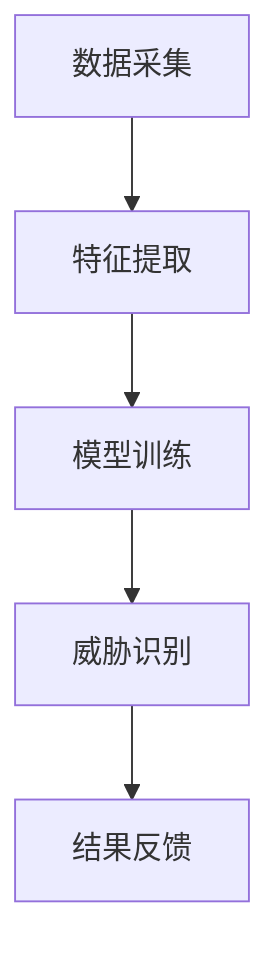
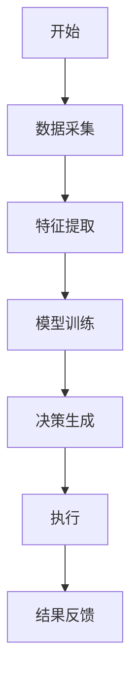

                 


# AI Agent在网络安全防御中的应用

## 关键词：
- AI Agent
- 网络安全
- 算法原理
- 系统架构
- 项目实战

## 摘要：
本文探讨AI Agent在网络安全防御中的应用，从AI Agent的基本概念到其在网络安全中的实际应用，详细分析其核心原理、算法实现、系统架构设计以及项目实战。文章通过理论与实践相结合的方式，深入解读AI Agent如何提升网络安全防御能力，为网络安全领域的研究和实践提供有价值的参考。

---

# 第1章: AI Agent与网络安全防御概述

## 1.1 AI Agent的基本概念
### 1.1.1 什么是AI Agent
AI Agent（人工智能代理）是指能够感知环境、自主决策并执行任务的智能体。它通过数据输入、模型构建和算法优化，实现对复杂问题的分析和解决。

### 1.1.2 AI Agent的核心特征
| 特性 | 描述 |
|------|------|
| 智能性 | 能够自主学习和适应环境 |
| 反应性 | 对环境变化做出实时响应 |
| 主动性 | 能够主动执行任务 |
| 社会性 | 可与其他系统或人类进行交互 |

### 1.1.3 AI Agent与传统安全防御的区别
| 方面 | AI Agent | 传统安全防御 |
|------|---------|----------------|
| 决策方式 | 自主学习优化 | 预定义规则 |
| 处理速度 | 实时高效 | 可能存在延迟 |
| 适应性 | 高度灵活 | 较低 |

## 1.2 网络安全防御的背景与挑战
### 1.2.1 网络安全的基本概念
网络安全是指保护计算机网络系统的硬件、软件和数据免受未经授权的访问、破坏或泄露的活动。网络安全的核心目标是确保数据的机密性、完整性和可用性。

### 1.2.2 当前网络安全的主要威胁
- 病毒和恶意软件
- 黑客攻击
- 数据泄露
- 内部威胁
- 网络钓鱼攻击

### 1.2.3 传统网络安全防御的局限性
- 需要手动配置和更新规则
- 无法快速应对未知威胁
- 依赖于已知的攻击模式

## 1.3 AI Agent在网络安全中的应用前景
### 1.3.1 AI Agent的优势与潜力
- 自动化威胁检测与响应
- 实时监控和分析
- � 强大的学习和适应能力

### 1.3.2 网络安全防御中引入AI Agent的意义
通过AI Agent，网络安全防御可以实现：
1. **自动化**：自动识别和应对威胁
2. **智能化**：基于历史数据和模式识别，预测潜在威胁
3. **高效性**：快速响应，减少人工干预

### 1.3.3 未来发展趋势与研究方向
- 深度学习在威胁检测中的应用
- 联邦学习（Federated Learning）在网络安全中的潜力
- 多智能体协同防御

## 1.4 本章小结
本章介绍了AI Agent的基本概念及其在网络安全中的应用前景，强调了AI Agent在提升网络安全防御能力中的潜力和重要性。

---

# 第2章: AI Agent的核心原理

## 2.1 AI Agent的感知机制
### 2.1.1 数据采集与处理
AI Agent通过传感器、日志文件、网络流量等多种数据源采集信息，并进行预处理、特征提取等步骤。

### 2.1.2 感知模型的构建
使用机器学习算法（如支持向量机、随机森林）构建感知模型，识别异常行为和潜在威胁。

### 2.1.3 感知结果的分析与反馈
将感知结果与历史数据对比，分析潜在威胁的可能性，并实时反馈给决策模块。

### 2.1.4 图表展示


## 2.2 AI Agent的决策机制
### 2.2.1 决策模型的构建
基于感知结果，构建多目标优化模型，权衡不同决策方案的优缺点。

### 2.2.2 多目标优化与权衡
通过强化学习（Reinforcement Learning）优化决策策略，确保在不同场景下做出最优选择。

### 2.2.3 决策结果的验证与优化
通过模拟测试和实际应用，验证决策的正确性，并不断优化模型参数。

## 2.3 AI Agent的执行机制
### 2.3.1 执行策略的制定
根据决策结果，制定具体的执行策略，如隔离异常流量、阻止恶意连接。

### 2.3.2 执行过程的监控
实时监控执行过程，确保策略的有效性和安全性。

### 2.3.3 执行结果的评估与反馈
对执行结果进行评估，总结经验教训，为后续决策提供参考。

## 2.4 AI Agent的核心算法与数学模型
### 2.4.1 算法原理概述
AI Agent的核心算法包括监督学习、无监督学习和强化学习。监督学习用于分类任务，无监督学习用于异常检测，强化学习用于策略优化。

### 2.4.2 算法流程图


### 2.4.3 数学模型与公式
损失函数：
$$
\text{损失函数} = \sum_{i=1}^{n} (y_i - \hat{y}_i)^2
$$

决策函数：
$$
\hat{y} = f(x) = w x + b
$$

---

# 第3章: AI Agent在网络安全防御中的算法实现

## 3.1 算法实现的步骤
### 3.1.1 数据预处理
- 数据清洗：去除噪声数据
- 特征工程：提取关键特征

### 3.1.2 模型训练
- 使用训练数据训练模型参数
- 采用交叉验证优化模型

### 3.1.3 模型评估与优化
- 使用测试数据评估模型性能
- 调整超参数，优化模型

## 3.2 算法实现的代码示例
### 3.2.1 数据加载与处理
```python
import numpy as np
import pandas as pd

# 加载数据
data = pd.read_csv('network_traffic.csv')

# 数据预处理
data = data.dropna()
data = pd.get_dummies(data)
```

### 3.2.2 模型训练
```python
from sklearn.model

