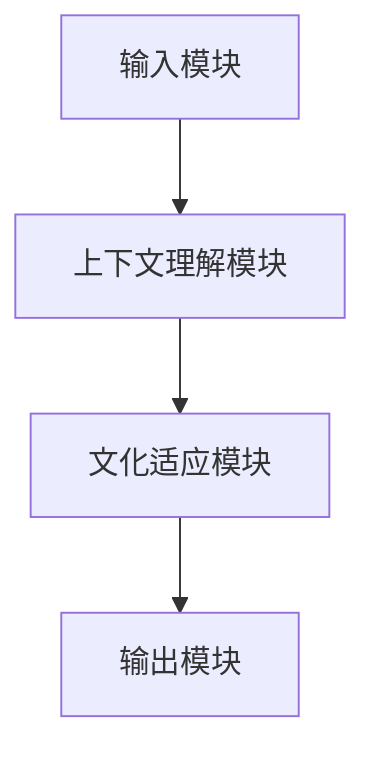
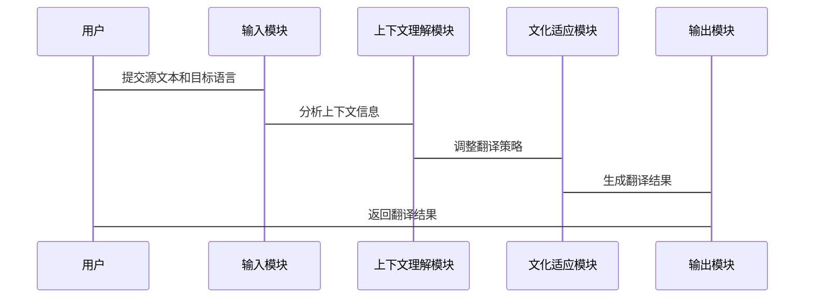

                 


# AI Agent在翻译领域的应用：上下文理解与文化适应

> 关键词：AI Agent, 翻译, 上下文理解, 文化适应, 自然语言处理, 翻译系统, 人工智能

> 摘要：随着人工智能技术的快速发展，AI Agent在翻译领域展现出了巨大的潜力。本文将深入探讨AI Agent在翻译中的应用，特别是在上下文理解和文化适应方面。通过分析翻译的核心概念、AI Agent的技术原理以及实际应用场景，我们将揭示如何利用AI Agent提升翻译质量，同时解决文化差异带来的挑战。本文将从背景介绍、核心概念、算法原理、系统架构、项目实战和最佳实践等多个方面展开讨论。

---

## 第一部分：AI Agent与翻译的背景介绍

### 第1章：AI Agent的基本概念

#### 1.1 AI Agent的定义与特点
- **1.1.1 AI Agent的定义**
  AI Agent（人工智能代理）是指能够感知环境并采取行动以实现目标的智能实体。它可以通过学习和推理，自主完成特定任务。

- **1.1.2 AI Agent的核心特点**
  - **自主性**：能够自主决策和行动。
  - **反应性**：能够实时感知环境并做出反应。
  - **目标导向性**：所有行动都以实现特定目标为导向。
  - **学习能力**：能够通过数据和经验不断优化自身性能。

- **1.1.3 AI Agent与传统翻译工具的区别**
  AI Agent不仅仅是工具，它具备自主决策和学习能力，能够根据上下文和用户需求动态调整翻译策略。

### 第2章：翻译的基本概念与背景

#### 2.1 翻译的定义与历史演变
- **2.1.1 翻译的定义**
  翻译是将一种语言（源语言）转换为另一种语言（目标语言）的过程，同时保持原意不变。

- **2.1.2 翻译的历史发展**
  翻译的历史可以追溯到古代，经历了从人工翻译到机器翻译的演变。现代翻译技术的快速发展得益于人工智能和自然语言处理技术的进步。

- **2.1.3 现代翻译技术的发展**
  从基于规则的机器翻译到统计机器翻译，再到当前的神经机器翻译，翻译技术的每一次进步都离不开AI技术的推动。

### 第3章：AI Agent在翻译领域的结合

#### 3.1 AI Agent与翻译的结合背景
- **3.1.1 翻译技术的智能化需求**
  随着全球化的发展，翻译需求日益增长，但高质量的翻译依赖于对上下文和文化背景的理解，这需要智能化的解决方案。

- **3.1.2 AI Agent在翻译中的角色定位**
  AI Agent可以作为翻译系统的核心模块，负责处理复杂语境和文化差异，提供个性化的翻译服务。

- **3.1.3 翻译中的上下文理解与文化适应**
  AI Agent能够通过上下文分析和文化特征提取，实现更精准的翻译，避免因文化差异导致的误解。

---

## 第二部分：上下文理解与文化适应的核心概念

### 第4章：上下文理解的原理与方法

#### 4.1 上下文理解的定义与分类
- **4.1.1 上下文理解的定义**
  上下文理解是指在翻译过程中，AI Agent能够分析文本的语境、语义和语用信息，以确保翻译的准确性和自然性。

- **4.1.2 上下文理解的分类**
  - **显式上下文**：文本中明确表达的信息，例如时间、地点、人物等。
  - **隐式上下文**：文本中未明确表达的信息，需要通过推理和常识来推断。

- **4.1.3 不同类型上下文理解的特点**
  - 显式上下文：可以通过关键词提取和句法分析实现。
  - 隐式上下文：需要依赖语境理解和常识推理。

#### 4.2 自然语言处理在上下文理解中的应用
- **4.2.1 NLP技术在上下文理解中的作用**
  - **分词与句法分析**：将文本分解为词语，并分析句子的结构。
  - **语义分析**：理解词语之间的关系和句子的含义。
  - **语用分析**：理解语言的实际使用场景和意图。

- **4.2.2 常见的NLP技术与算法**
  - **统计NLP**：基于概率模型，如Naive Bayes。
  - **深度学习NLP**：基于神经网络，如RNN、LSTM、Transformer。

### 第5章：文化适应的核心原理

#### 5.1 文化适应的定义与特征
- **5.1.1 文化适应的定义**
  文化适应是指在翻译过程中，AI Agent能够根据目标语言的文化背景和习惯，调整翻译内容，使其更符合目标读者的阅读习惯和文化认知。

- **5.1.2 文化适应的核心特征**
  - **文化敏感性**：能够识别和理解不同文化背景下的语言习惯和表达方式。
  - **文化适配性**：能够根据目标文化的特点，动态调整翻译策略。

- **5.1.3 文化适应与翻译的关系**
  翻译不仅仅是语言的转换，更是文化背景的转换。文化适应是实现高质量翻译的关键因素。

#### 5.2 不同文化背景下的翻译策略
- **5.2.1 中英文文化差异对翻译的影响**
  - 中文注重整体性和含蓄性，英文注重直接性和逻辑性。
  - 例如，中文中的成语和谚语在英文中可能没有直接对应的表达，需要通过意译来实现。

- **5.2.2 其他文化背景下的翻译策略**
  - 针对不同文化背景，AI Agent需要具备多语言和多文化的理解能力，能够根据目标文化的特点调整翻译策略。

- **5.2.3 AI Agent如何处理上下文与文化适应**
  AI Agent可以通过以下方式实现文化适应：
  - **文化特征提取**：识别目标语言中的文化特征，如成语、俚语、习惯用语。
  - **文化适配模型**：基于机器学习构建文化适配模型，动态调整翻译策略。

---

## 第三部分：AI Agent在翻译中的算法原理与实现

### 第6章：上下文理解的算法原理

#### 6.1 基于统计的上下文理解算法
- **6.1.1 统计语言模型的基本原理**
  统计语言模型通过统计词语之间的概率关系，来预测下一个词的概率分布。

- **6.1.2 基于统计的上下文理解流程**
  1. 文本预处理：分词、去停用词。
  2. 统计词语之间的共现概率。
  3. 基于概率模型生成上下文理解结果。

#### 6.2 基于深度学习的上下文理解算法
- **6.2.1 基于神经网络的上下文理解模型**
  - **RNN（循环神经网络）**：适用于序列数据的处理。
  - **LSTM（长短期记忆网络）**：能够捕捉长距离依赖关系。
  - **Transformer**：通过自注意力机制，能够更好地捕捉上下文信息。

- **6.2.2 Transformer模型在上下文理解中的应用**
  Transformer模型通过自注意力机制，能够同时处理整个句子的信息，从而实现更精准的上下文理解。

### 第7章：文化适应的算法实现

#### 7.1 文化特征提取算法
- **7.1.1 基于NLP的文化特征提取**
  - 通过词袋模型或TF-IDF方法，提取文本中的文化特征词汇。

- **7.1.2 文化特征的量化方法**
  - 将文化特征转化为向量表示，如Word2Vec、GloVe。

#### 7.2 基于机器学习的文化适应模型
- **7.2.1 文化适应的监督学习方法**
  - 标签化训练数据，训练分类器识别文化特征。
  - 例如，使用SVM、随机森林等算法。

- **7.2.2 文化适应的无监督学习方法**
  - 基于聚类算法，自动发现文化特征。
  - 例如，使用K-means、DBSCAN等算法。

---

## 第四部分：系统分析与架构设计

### 第8章：翻译系统的设计与实现

#### 8.1 翻译系统的模块划分
- **输入模块**：接收源文本和目标语言。
- **上下文理解模块**：分析文本的上下文信息。
- **文化适应模块**：根据目标语言的文化背景调整翻译结果。
- **输出模块**：生成最终的翻译文本。

#### 8.2 系统架构设计

**系统架构图（使用Mermaid）：**



#### 8.3 系统接口设计
- **输入接口**：接收源文本和目标语言。
- **输出接口**：返回翻译结果。

#### 8.4 系统交互流程（使用Mermaid）



---

## 第五部分：项目实战与最佳实践

### 第9章：翻译系统实战

#### 9.1 环境配置
- **Python版本**：Python 3.8+
- **依赖库**：安装必要的NLP库，如`transformers`, `jieba`, `scikit-learn`。

#### 9.2 系统核心实现源代码

**上下文理解模块代码示例：**

```python
from transformers import AutoTokenizer, AutoModelForMaskedLM
import torch

# 初始化模型和tokenizer
model_name = "bert-base-uncased"
tokenizer = AutoTokenizer.from_pretrained(model_name)
model = AutoModelForMaskedLM.from_pretrained(model_name)

def contextual_understanding(text):
    # 分词
    tokens = tokenizer.encode(text, add_special_tokens=True)
    # 预测上下文关系
    outputs = model(torch.tensor([tokens]))
    # 获取预测结果
    predicted_ids = outputs.logits.argmax(dim=-1).tolist()[0]
    context = [tokenizer.decode([predicted_ids[i]]) for i in range(len(predicted_ids))]
    return context
```

**文化适应模块代码示例：**

```python
from sklearn.feature_extraction.text import TfidfVectorizer
from sklearn.svm import SVC

# 初始化向量器和分类器
vectorizer = TfidfVectorizer()
classifier = SVC()

def cultural_adaptation(text):
    # 特征提取
    X = vectorizer.fit_transform([text])
    # 预测文化特征
    y_pred = classifier.predict(X)
    return y_pred
```

#### 9.3 实际案例分析与详细讲解

**案例分析：中英文翻译中的文化适应**

例如，中文成语“一箭双雕”在英文中没有直接对应的表达，AI Agent需要通过上下文理解，将其翻译为“killing two birds with one stone”，并确保在英文语境中自然流畅。

#### 9.4 项目小结
- 项目实现了基于AI Agent的翻译系统，能够处理上下文理解和文化适应。
- 系统的核心模块包括上下文理解和文化适应，采用深度学习和机器学习技术实现。

### 第10章：最佳实践

#### 10.1 小结
- AI Agent在翻译领域的应用前景广阔，特别是在上下文理解和文化适应方面。
- 综合运用NLP技术和机器学习算法，能够显著提升翻译质量。

#### 10.2 注意事项
- 数据质量和多样性对翻译系统的性能至关重要。
- 需要定期更新模型和优化算法，以应对语言和文化的变化。

#### 10.3 拓展阅读
- 推荐阅读《神经机器翻译：原理与实践》。
- 参考Transformers库中的最新模型，探索更高效的翻译算法。

---

## 结语

通过本文的详细分析，我们揭示了AI Agent在翻译领域的巨大潜力，特别是在上下文理解和文化适应方面。未来，随着NLP技术和机器学习算法的不断进步，AI Agent将能够在翻译领域实现更高质量的翻译服务，满足全球化时代多样化的翻译需求。

