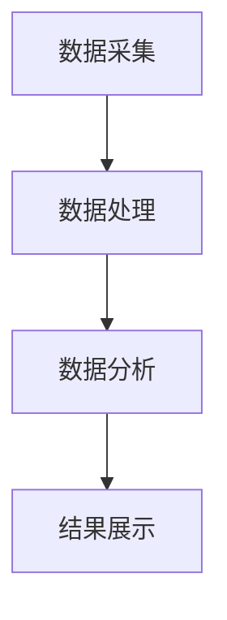

                 

# AI Agent在考古发掘中的数据分析

> 关键词：AI Agent, 数据分析, 考古学, 人工智能, 考古数据, 数据挖掘

> 摘要：本文详细探讨了AI Agent在考古学中的数据分析应用，从基础概念到高级算法，结合实际案例，系统地分析了AI Agent如何提升考古数据的处理效率和准确性。

---

# 第一部分: AI Agent与考古学的结合基础

## 第1章: AI Agent与考古学的概述

### 1.1 AI Agent的基本概念

#### 1.1.1 AI Agent的定义
AI Agent（人工智能代理）是一种能够感知环境、自主决策并执行任务的智能实体。它能够通过传感器获取数据，利用算法进行分析，并通过执行器与环境交互。

#### 1.1.2 AI Agent的核心特征
- **自主性**：无需外部干预，自主完成任务。
- **反应性**：能够实时感知环境变化并做出反应。
- **学习能力**：通过数据和经验不断优化自身行为。
- **协作性**：能够与其他Agent或系统协同工作。

#### 1.1.3 AI Agent与传统数据分析的区别
传统数据分析依赖于固定的算法和规则，而AI Agent能够动态调整策略，适应复杂环境。

### 1.2 考古学与数据分析的结合

#### 1.2.1 考古学的基本概念
考古学是研究人类历史的学科，通过发掘和分析遗址、遗物等，揭示古代社会的结构、文化和技术。

#### 1.2.2 数据分析在考古学中的应用
- **遗址分析**：通过数据分析确定遗址的年代、布局等。
- **遗物分类**：利用图像识别技术自动分类出土文物。
- **重建历史场景**：通过数据建模还原古代社会的结构和功能。

#### 1.2.3 AI Agent在考古学中的潜在价值
AI Agent能够高效处理大量考古数据，提供实时分析和决策支持，帮助考古学家更快地发现重要线索。

---

## 第2章: AI Agent的核心原理

### 2.1 AI Agent的感知与推理

#### 2.1.1 数据感知的基本原理
AI Agent通过传感器或数据接口获取环境中的信息，如图像、文本、数值等。

#### 2.1.2 数据推理的逻辑框架
- **逻辑推理**：基于知识库进行推理，得出结论。
- **概率推理**：利用概率模型处理不确定性。

#### 2.1.3 考古数据中的感知与推理
例如，AI Agent可以通过分析卫星图像，识别潜在的考古遗址。

### 2.2 AI Agent的规划与决策

#### 2.2.1 规划算法的基本原理
- **状态空间搜索**：通过搜索状态空间找到最优路径。
- **启发式算法**：利用启发式函数减少搜索空间。

#### 2.2.2 考古场景中的决策模型
AI Agent可以根据当前任务需求，动态调整数据处理策略。

#### 2.2.3 考古数据驱动的决策优化
通过分析历史数据，优化考古发掘的策略和计划。

### 2.3 AI Agent的核心算法对比

#### 2.3.1 传统数据分析算法
- **聚类分析**：K-means算法。
- **分类分析**：决策树、随机森林。

#### 2.3.2 基于AI的分析算法
- **深度学习**：卷积神经网络（CNN）用于图像识别。
- **强化学习**：用于动态环境中的决策优化。

#### 2.3.3 考古场景中的算法选择
根据任务需求选择合适的算法，例如使用CNN进行文物图像分类。

---

## 第3章: 数据预处理与特征提取

### 3.1 数据预处理的基本方法

#### 3.1.1 数据清洗与标准化
- **数据清洗**：去除噪声数据，填补缺失值。
- **标准化**：将数据归一化到统一范围。

#### 3.1.2 数据归一化与离散化
- **归一化**：将数据缩放到[0,1]范围。
- **离散化**：将连续数据离散化为类别数据。

#### 3.1.3 考古数据的特殊处理
例如，处理不同年代的文物数据，需要考虑时间因素。

### 3.2 特征提取的核心技术

#### 3.2.1 基于统计的特征提取
- **统计指标**：均值、方差等。
- **频次分析**：词频（TF）和逆文档频率（IDF）。

#### 3.2.2 基于机器学习的特征提取
- **主成分分析（PCA）**：降维技术。
- **线性判别分析（LDA）**：用于分类任务。

#### 3.2.3 考古数据特征的提取策略
根据任务需求选择合适的特征提取方法，例如在图像识别中使用CNN提取特征。

### 3.3 数据特征的可视化分析

#### 3.3.1 数据分布的可视化
- **直方图**：展示数据分布情况。
- **箱线图**：展示数据的四分位数和异常值。

#### 3.3.2 数据关联的可视化
- **散点图**：展示变量之间的关系。
- **热力图**：展示数据的关联程度。

#### 3.3.3 考古数据特征的可视化工具
使用Python的Matplotlib和Seaborn库进行可视化分析。

---

## 第4章: 数据分析方法与考古应用

### 4.1 基于图像识别的考古数据分析

#### 4.1.1 图像识别的基本原理
- **卷积神经网络（CNN）**：用于图像分类和目标检测。
- **目标检测**：使用Faster R-CNN等算法检测考古遗址中的目标。

#### 4.1.2 考古图像识别的应用场景
- **文物修复**：通过图像识别技术辅助修复破损的文物。
- **遗址测绘**：利用无人机拍摄的图像进行遗址结构分析。

#### 4.1.3 常见图像识别算法的实现
使用TensorFlow框架实现图像分类任务，例如在MNIST数据集上训练手写数字识别模型。

### 4.2 基于文本挖掘的考古数据分析

#### 4.2.1 文本挖掘的基本原理
- **分词**：将文本分割成词语或短语。
- **主题建模**：使用LDA模型提取文本的主题。

#### 4.2.2 考古文本挖掘的应用场景
- **文献分析**：分析古代文献中的关键词和主题。
- **铭文识别**：通过文本挖掘技术识别和翻译古代铭文。

#### 4.2.3 常见文本挖掘算法的实现
使用Python的NLTK库进行文本分词和主题建模。

### 4.3 基于统计分析的考古数据挖掘

#### 4.3.1 统计分析的基本原理
- **假设检验**：检验数据的显著性。
- **回归分析**：分析变量之间的关系。

#### 4.3.2 考古统计分析的应用场景
- **年代测定**：通过统计分析确定文物的年代。
- **分布分析**：分析考古遗址的分布规律。

#### 4.3.3 常见统计分析算法的实现
使用Python的Scipy库进行假设检验和回归分析。

---

## 第5章: 系统架构与接口设计

### 5.1 系统架构设计

#### 5.1.1 系统功能模块
- **数据采集模块**：采集考古数据。
- **数据处理模块**：进行数据预处理和特征提取。
- **数据分析模块**：执行图像识别、文本挖掘和统计分析。
- **结果展示模块**：可视化分析结果。

#### 5.1.2 系统架构图（Mermaid）

---

通过以上步骤，我们详细介绍了AI Agent在考古学中的数据分析应用。从基础概念到系统设计，结合实际案例，展示了AI Agent如何提升考古数据的处理效率和准确性。希望这篇文章能够为考古学家和AI研究人员提供有价值的参考。

