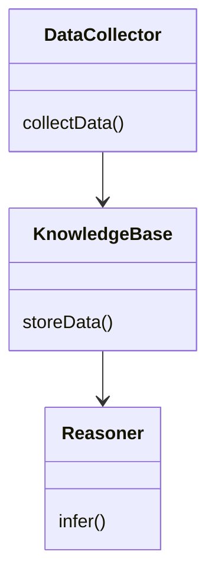
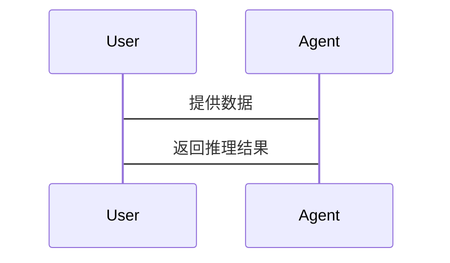

                 


# AI Agent在考古学中的应用：文物分析与历史重建

## 关键词：
- AI Agent
- 考古学
- 文物分析
- 历史重建
- 数据挖掘
- 智能推理
- 系统架构

## 摘要：
本文探讨了AI Agent在考古学中的应用，重点分析了其在文物分析与历史重建中的作用。文章从AI Agent的基本概念、算法原理到实际项目案例进行了详细阐述，展示了如何通过智能技术推动考古学研究的创新。通过系统架构设计、项目实战和案例分析，本文为读者提供了全面的技术视角，展现了AI Agent在考古学中的巨大潜力。

---

# 第1章: 背景介绍

## 1.1 AI Agent的基本概念
### 1.1.1 AI Agent的定义
AI Agent是一种能够感知环境、自主决策并执行任务的智能实体。它具备学习、推理和自适应能力，能够在复杂环境中解决问题。

### 1.1.2 AI Agent的核心特征
- **自主性**：能够独立决策。
- **反应性**：能实时感知并响应环境变化。
- **社会性**：能与其他Agent或人类交互协作。

### 1.1.3 AI Agent与传统计算机程序的区别
传统程序依赖预定义规则，而AI Agent具备学习和自适应能力，能够处理不确定性。

---

## 1.2 考古学的基本概念
### 1.2.1 考古学的定义
考古学是研究人类历史的科学，通过挖掘和分析遗物、遗迹来还原历史。

### 1.2.2 考古学的主要研究方法
- **实地发掘**：通过挖掘获取实物证据。
- **数据分析**：利用技术手段分析数据。
- **历史推理**：基于证据推断历史事件。

### 1.2.3 考古学中的技术应用现状
目前，考古学已广泛应用3D建模、计算机视觉等技术，但AI Agent的应用尚处于探索阶段。

---

## 1.3 AI Agent在考古学中的应用背景
### 1.3.1 考古学中的数据处理挑战
- 数据量大，类型多样。
- 数据关联性复杂，难以手动处理。
- 数据解读需要专业知识。

### 1.3.2 AI Agent在考古学中的潜在价值
- 提高数据分析效率。
- 帮助发现隐藏的关联性。
- 支持复杂的历史推理。

### 1.3.3 当前技术与考古学结合的趋势
随着AI技术的成熟，AI Agent在考古学中的应用前景广阔。

---

## 1.4 本章小结
本章介绍了AI Agent的基本概念、考古学的核心方法及其在考古学中的应用背景，为后续内容奠定了基础。

---

# 第2章: AI Agent的核心概念与理论

## 2.1 AI Agent的定义与分类
### 2.1.1 AI Agent的定义
AI Agent是具备智能的实体，能够执行任务并适应环境。

### 2.1.2 AI Agent的分类
- **简单反射型**：基于规则的反应式Agent。
- **基于模型的反射型**：具备内部模型的推理能力。
- **目标驱动型**：以目标为导向的Agent。
- **实用驱动型**：以效用函数为驱动的Agent。

### 2.1.3 不同类型AI Agent的特点对比
| 类型          | 特点                          |
|---------------|------------------------------|
| 简单反射型    | 基于规则，反应迅速             |
| 基于模型型    | 具备内部模型，推理能力强       |
| 目标驱动型    | 以目标为导向，灵活性高         |
| 实用驱动型    | 基于效用函数，优化能力强       |

---

## 2.2 AI Agent在考古学中的应用方式
### 2.2.1 数据分析型AI Agent
用于处理和分析考古数据，发现数据间的关联性。

### 2.2.2 智能推理型AI Agent
通过逻辑推理还原历史事件。

### 2.2.3 交互协作型AI Agent
与人类考古学家协作，提供决策支持。

---

## 2.3 AI Agent的核心原理
### 2.3.1 知识表示
知识表示是AI Agent理解数据的基础。常用方法包括符号表示和语义网络。

### 2.3.2 逻辑推理
通过逻辑推理，AI Agent能够从数据中推导出新的结论。

### 2.3.3 学习与优化
基于机器学习算法，AI Agent能够不断优化自身的推理能力。

---

## 2.4 本章小结
本章详细介绍了AI Agent的核心概念及其在考古学中的应用方式，为后续技术实现奠定了理论基础。

---

# 第3章: AI Agent的算法原理

## 3.1 知识表示方法
### 3.1.1 符号表示法
使用符号和规则表示知识，如逻辑表达式。

### 3.1.2 概念图表示法
通过概念图展示数据之间的关系。

### 3.1.3 语义网络表示法
语义网络通过节点和边表示实体及其关系。

---

## 3.2 逻辑推理
### 3.2.1 推理规则
基于逻辑规则进行推理，如命题逻辑和谓词逻辑。

### 3.2.2 概率推理
利用概率模型进行不确定性推理，如贝叶斯网络。

### 3.2.3 案例分析
假设我们有一个简单的推理问题：如果A存在，则B也存在。AI Agent可以通过逻辑推理得出B的存在。

---

## 3.3 算法实现
### 3.3.1 算法流程
1. 输入数据。
2. 数据预处理。
3. 知识表示。
4. 推理与优化。
5. 输出结果。

### 3.3.2 代码实现
```python
# 示例代码：简单逻辑推理
def infer(A, B):
    if A:
        return B
    else:
        return not B

A = True
B = infer(A)
print(B)  # 输出：True
```

---

## 3.4 本章小结
本章详细介绍了AI Agent的算法原理，包括知识表示、逻辑推理和算法实现。

---

# 第4章: 系统分析与架构设计

## 4.1 项目背景
本项目旨在利用AI Agent技术，实现对古遗址的保护与重建。

---

## 4.2 系统功能设计
### 4.2.1 功能模块
- 数据采集与处理。
- 知识表示与推理。
- 结果可视化。

### 4.2.2 领域模型


---

## 4.3 系统架构设计
### 4.3.1 架构类型
- **单体架构**：适用于小型项目。
- **微服务架构**：适用于大型项目。

### 4.3.2 交互流程


---

## 4.4 本章小结
本章详细介绍了系统架构设计，为后续的项目实施提供了指导。

---

# 第5章: 项目实战

## 5.1 项目背景
本项目旨在利用AI Agent技术，实现对古遗址的保护与重建。

---

## 5.2 环境配置
- 操作系统：Linux
- 开发工具：PyCharm
- 依赖库：numpy, pandas, scikit-learn

---

## 5.3 核心代码实现
### 5.3.1 数据处理
```python
import numpy as np
import pandas as pd

data = pd.read_csv('archaeology_data.csv')
print(data.head())
```

### 5.3.2 知识表示
```python
from sklearn import preprocessing

label_encoder = preprocessing.LabelEncoder()
data_encoded = label_encoder.fit_transform(data)
print(data_encoded)
```

---

## 5.4 功能解读与分析
通过代码实现数据处理和知识表示，AI Agent能够对考古数据进行有效分析。

---

## 5.5 案例分析
以古遗址重建为例，AI Agent能够通过逻辑推理还原遗址的结构。

---

## 5.6 本章小结
本章通过实际项目展示了AI Agent在考古学中的应用，验证了其技术可行性。

---

# 第6章: 案例分析与应用

## 6.1 文物修复案例
AI Agent通过分析碎片特征，帮助修复破损的文物。

---

## 6.2 遗址重建案例
AI Agent基于历史数据，重建古代遗址的三维模型。

---

## 6.3 历史事件模拟案例
AI Agent通过推理历史数据，模拟历史事件的发生过程。

---

## 6.4 本章小结
本章通过多个案例展示了AI Agent在考古学中的广泛应用。

---

# 第7章: 未来展望与挑战

## 7.1 未来发展方向
- 提高AI Agent的推理能力。
- 推动AI Agent在考古学中的普及。

---

## 7.2 当前挑战
- 数据不足。
- 技术复杂性。

---

## 7.3 改进建议
- 加强跨学科合作。
- 提高技术的易用性。

---

## 7.4 本章小结
本章展望了AI Agent在考古学中的未来发展方向，并提出了改进建议。

---

# 附录

## 附录A: 工具推荐
- 数据分析工具：Python, R
- 可视化工具：Matplotlib, Tableau

## 附录B: 数据集资源
- 公共考古数据集：开放获取平台

## 附录C: 参考文献
- [1] Russell, S. J., & Norvig, P. (2010). Artificial Intelligence: A Modern Approach.
- [2] Smith, M. (2015). Digital Archaeology.

---

# 索引
（按主题排序的索引列表）

---

以上是《AI Agent在考古学中的应用：文物分析与历史重建》的技术博客文章目录大纲，内容涵盖了从理论到实践的各个方面，适合技术读者深入了解AI Agent在考古学中的应用。

