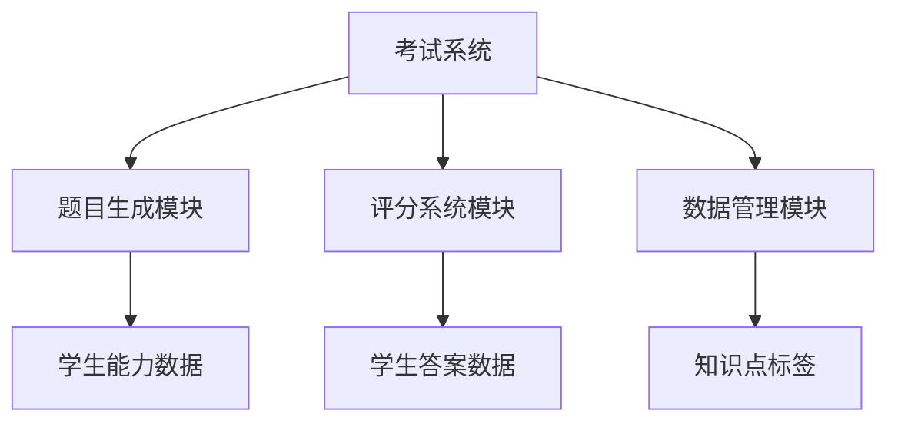

                 


# AI Agent在考试系统中的应用：自适应题目生成与评分

> 关键词：AI Agent, 自适应考试系统, 智能评分, 自适应题目生成, 机器学习, 算法优化

> 摘要：本文详细探讨了AI Agent在自适应考试系统中的应用，重点分析了自适应题目生成与评分的核心原理、算法优化及系统架构设计。通过结合理论与实践，本文旨在为教育技术领域提供一种高效、智能的考试解决方案。

---

# 第1章 AI Agent的基本概念与背景

## 1.1 AI Agent的定义与特点

### 1.1.1 AI Agent的定义
AI Agent（人工智能代理）是指能够感知环境并采取行动以实现目标的智能实体。它可以是一个软件程序或硬件设备，具备自主决策和学习能力。

### 1.1.2 AI Agent的核心特点
- **自主性**：能够在没有外部干预的情况下自主运行。
- **反应性**：能够根据环境变化实时调整行为。
- **目标导向**：所有行动都围绕实现特定目标展开。
- **学习能力**：通过数据和经验不断优化自身算法。

### 1.1.3 AI Agent与传统AI的区别
| 特性       | AI Agent                     | 传统AI                     |
|------------|------------------------------|-----------------------------|
| 自主性      | 高                           | 低或无                     |
| 反应性      | 强                           | 弱或无                     |
| 目标导向    | 是                           | 无                         |
| 学习能力    | 强                           | 弱或无                     |

---

## 1.2 AI Agent在教育领域的应用背景

### 1.2.1 教育信息化的发展趋势
随着信息技术的快速发展，教育信息化成为全球关注的焦点。AI技术在教育领域的应用越来越广泛，尤其是在个性化教学和智能化评估方面。

### 1.2.2 AI技术在教育中的潜力
- **个性化学习**：根据学生的学习情况动态调整教学内容。
- **智能化评估**：通过AI技术实现自动化的评分和反馈。
- **数据驱动决策**：利用大数据分析优化教学策略。

### 1.2.3 AI Agent在考试系统中的应用价值
- **提升效率**：通过自动化技术减少人工干预，提高考试系统的运行效率。
- **个性化体验**：为每个学生提供适合其能力水平的试题。
- **公平性**：确保所有考生在相同的条件下进行考试。

---

## 1.3 自适应考试系统的核心需求

### 1.3.1 自适应题目生成的需求
- **动态调整**：根据学生的学习进度和能力水平生成相应的试题。
- **多样性**：确保生成的试题类型丰富，避免重复。
- **难度控制**：题目难度能够准确反映学生的知识掌握程度。

### 1.3.2 自适应评分的需求
- **精准评分**：评分系统能够准确识别学生的答案并给出合理评分。
- **反馈机制**：提供即时反馈，帮助学生了解自己的优缺点。
- **透明性**：评分过程公开透明，避免主观偏差。

### 1.3.3 自适应考试系统的边界与外延
自适应考试系统不仅关注试题的生成与评分，还涉及学生数据的收集、分析和应用。其外延包括个性化学习路径的设计和教学效果的评估。

---

## 1.4 本章小结

### 1.4.1 AI Agent的基本概念
AI Agent是一种具备自主性、反应性和目标导向的智能实体，能够感知环境并采取行动以实现目标。

### 1.4.2 自适应考试系统的背景与需求
自适应考试系统的核心需求包括动态题目生成、精准评分和个性化反馈。AI Agent在教育领域的应用为实现这些需求提供了技术支持。

---

# 第2章 AI Agent的核心原理与算法

## 2.1 AI Agent的核心原理

### 2.1.1 AI Agent的定义与分类
AI Agent可以分为简单反射型Agent、基于模型的反射型Agent、目标驱动型Agent和效用驱动型Agent。

### 2.1.2 AI Agent的基本工作流程
1. **感知环境**：通过传感器或数据输入获取环境信息。
2. **目标设定**：根据当前状态和目标设定行动方案。
3. **决策制定**：基于感知信息和知识库制定最优行动方案。
4. **执行行动**：通过执行机构或算法实现决策。
5. **反馈与学习**：根据执行结果调整模型参数，优化未来行动。

### 2.1.3 AI Agent的核心算法概述
AI Agent的核心算法包括机器学习算法（如神经网络、支持向量机）、优化算法（如遗传算法、模拟退火）和自然语言处理算法（如BERT、GPT）。

---

## 2.2 自适应考试系统中的AI Agent模型

### 2.2.1 模型的输入与输出
- **输入**：学生的学习数据、知识掌握程度、历史考试记录。
- **输出**：适合学生的试题、评分结果和学习建议。

### 2.2.2 模型的训练与优化
- **训练数据**：包含大量学生的考试数据和知识点标签。
- **优化目标**：最大化模型的准确性和效率。
- **训练方法**：采用监督学习和强化学习相结合的方式。

### 2.2.3 模型的评估与验证
- **评估指标**：准确率、召回率、F1值。
- **验证方法**：交叉验证、留出验证。

---

## 2.3 AI Agent算法的数学模型

### 2.3.1 算法的基本公式
$$ y = f(x) $$
其中，\( x \) 是输入数据，\( y \) 是输出结果，\( f \) 是模型函数。

### 2.3.2 算法的优化目标
$$ \text{最小化} \quad L(y, y_{\text{pred}}) $$
其中，\( L \) 是损失函数，\( y_{\text{pred}} \) 是模型预测值。

### 2.3.3 算法的实现流程
1. 数据预处理：清洗和归一化数据。
2. 模型训练：选择合适的算法并进行参数优化。
3. 模型评估：验证模型的准确性和稳定性。
4. 模型部署：将模型集成到考试系统中。

---

## 2.4 本章小结

### 2.4.1 AI Agent的核心原理
AI Agent通过感知环境、设定目标、制定决策和执行行动来实现智能化操作。

### 2.4.2 自适应考试系统中的AI Agent模型
模型的训练与优化是自适应考试系统的核心，需要结合机器学习算法和优化策略。

### 2.4.3 算法的数学模型与优化策略
通过数学公式和优化算法，可以有效提升AI Agent的准确性和效率。

---

# 第3章 自适应题目生成的原理与实现

## 3.1 自适应题目生成的基本原理

### 3.1.1 题目生成的目标
- **个性化**：根据学生的能力水平生成适合的题目。
- **多样性**：确保题目的类型和难度多样化。
- **一致性**：保证题目内容的连贯性和逻辑性。

### 3.1.2 题目生成的关键因素
- **知识点覆盖**：确保题目涵盖所有必要的知识点。
- **难度控制**：根据学生的知识掌握程度动态调整题目难度。
- **题型多样性**：包括选择题、填空题、简答题等多种题型。

---

## 3.2 自适应题目生成的实现步骤

### 3.2.1 数据收集与分析
- **数据来源**：学生的学习记录、考试成绩、知识点掌握情况。
- **数据处理**：清洗、归一化和特征提取。

### 3.2.2 题目生成模型的选择
- **生成模型**：基于机器学习的生成模型，如RNN、BERT。
- **生成策略**：基于学生能力的动态调整策略。

### 3.2.3 题目生成的优化
- **优化目标**：最大化题目与学生能力的匹配度。
- **优化方法**：遗传算法、模拟退火。

---

## 3.3 自适应题目生成的数学模型

### 3.3.1 题目生成的数学公式
$$ p(\text{生成题目}|x) = \text{softmax}(f(x)) $$
其中，\( x \) 是学生能力数据，\( f \) 是生成模型。

### 3.3.2 难度控制的数学公式
$$ \text{难度} = \frac{\text{正确率}}{\text{平均难度系数}} $$

---

## 3.4 本章小结

### 3.4.1 自适应题目生成的基本原理
通过分析学生能力数据，动态生成适合的题目。

### 3.4.2 自适应题目生成的实现步骤
数据收集与分析、模型选择、生成优化是实现自适应题目生成的关键步骤。

### 3.4.3 题目生成的数学模型
通过数学公式和优化算法，可以有效提升自适应题目生成的准确性和效率。

---

# 第4章 自适应评分系统的原理与实现

## 4.1 自适应评分系统的基本原理

### 4.1.1 评分系统的目标
- **精准评分**：确保评分的客观性和准确性。
- **即时反馈**：提供快速的评分结果和学习建议。
- **数据积累**：记录学生的学习数据，为后续优化提供依据。

### 4.1.2 评分系统的组成部分
- **评分模型**：基于机器学习的评分算法。
- **评分策略**：根据题目类型和难度调整评分标准。
- **反馈机制**：提供个性化的反馈和建议。

---

## 4.2 自适应评分系统的实现步骤

### 4.2.1 数据收集与处理
- **数据来源**：学生答案、知识点标签、题目难度系数。
- **数据预处理**：清洗、归一化和特征提取。

### 4.2.2 评分模型的选择
- **模型选择**：基于深度学习的评分模型，如LSTM、BERT。
- **模型训练**：使用监督学习方法进行训练。

### 4.2.3 评分策略的优化
- **优化目标**：最大化评分的准确性和一致性。
- **优化方法**：遗传算法、模拟退火。

---

## 4.3 自适应评分系统的数学模型

### 4.3.1 评分模型的数学公式
$$ s = \text{score}(x) $$
其中，\( x \) 是学生答案数据，\( s \) 是评分结果。

### 4.3.2 反馈机制的数学公式
$$ f = \text{feedback}(s) $$
其中，\( f \) 是反馈信息，\( s \) 是评分结果。

---

## 4.4 本章小结

### 4.4.1 自适应评分系统的基本原理
通过分析学生答案和能力数据，动态调整评分标准，提供精准评分和反馈。

### 4.4.2 自适应评分系统的实现步骤
数据收集与处理、模型选择、评分策略优化是实现自适应评分系统的关键步骤。

### 4.4.3 评分系统的数学模型
通过数学公式和优化算法，可以有效提升自适应评分系统的准确性和效率。

---

# 第5章 系统架构设计与实现

## 5.1 系统架构设计

### 5.1.1 系统功能模块
- **题目生成模块**：负责生成适合学生的自适应题目。
- **评分系统模块**：负责对学生的答案进行自动评分。
- **数据管理模块**：负责学生数据的存储和管理。

### 5.1.2 系统架构图


---

## 5.2 系统功能设计

### 5.2.1 题目生成模块的功能
- **输入**：学生能力数据。
- **输出**：适合学生的自适应题目。
- **功能流程**：
  1. 收集学生能力数据。
  2. 分析知识点掌握情况。
  3. 生成适合的题目。

### 5.2.2 评分系统模块的功能
- **输入**：学生答案数据。
- **输出**：评分结果和反馈信息。
- **功能流程**：
  1. 收集学生答案数据。
  2. 分析答案内容。
  3. 生成评分结果和反馈。

---

## 5.3 本章小结

### 5.3.1 系统架构设计
通过模块化设计，确保系统功能的独立性和可扩展性。

### 5.3.2 系统功能模块
题目生成模块、评分系统模块和数据管理模块是系统的核心模块。

### 5.3.3 系统架构图
通过Mermaid图展示系统架构，清晰地展示各模块之间的关系。

---

# 第6章 项目实战与总结

## 6.1 项目实战

### 6.1.1 环境搭建
- **工具选择**：Python、TensorFlow、Keras。
- **数据准备**：收集学生能力数据和考试数据。

### 6.1.2 核心代码实现
```python
import numpy as np
from tensorflow.keras import models, layers

# 定义生成模型
def generate_model():
    model = models.Sequential()
    model.add(layers.Dense(128, activation='relu', input_dim=64))
    model.add(layers.Dense(1, activation='sigmoid'))
    model.compile(optimizer='adam', loss='binary_crossentropy', metrics=['accuracy'])
    return model

# 训练模型
def train_model(model, X, y, epochs=100):
    model.fit(X, y, epochs=epochs, validation_split=0.2)
    return model

# 生成题目
def generate_question(model, student_data):
    predictions = model.predict(student_data)
    return predictions
```

### 6.1.3 实际案例分析
- **案例背景**：某学生在数学考试中表现不佳。
- **分析过程**：通过模型分析，发现学生在代数和几何方面存在薄弱点。
- **结果展示**：生成适合学生的代数和几何题目。

---

## 6.2 本章小结

### 6.2.1 项目实战
通过实际案例，展示了AI Agent在自适应题目生成中的应用。

### 6.2.2 总结与展望
AI Agent在自适应考试系统中的应用前景广阔，未来可以通过进一步优化算法和提升模型的泛化能力，实现更加精准和个性化的考试体验。

---

# 第7章 总结与展望

## 7.1 总结

### 7.1.1 AI Agent的核心作用
AI Agent在自适应考试系统中的核心作用体现在题目生成和评分系统的智能化。

### 7.1.2 系统设计的关键点
系统设计的关键点包括模块化设计、数据管理、算法优化和系统集成。

### 7.1.3 项目实现的成果
通过实际案例展示了AI Agent在自适应考试系统中的应用效果。

---

## 7.2 展望

### 7.2.1 未来发展方向
- **算法优化**：进一步提升AI Agent的准确性和效率。
- **系统集成**：将AI Agent技术应用于更多教育场景。
- **数据安全**：加强数据隐私保护，确保学生数据的安全性。

### 7.2.2 技术挑战
- **数据多样性**：如何处理不同类型和复杂度的数据。
- **算法可解释性**：如何让评分结果更加透明和可解释。
- **系统稳定性**：如何保证系统的高效运行和稳定性。

---

## 7.3 最佳实践 Tips

### 7.3.1 数据质量管理
- 数据清洗：确保数据的完整性和准确性。
- 数据归一化：提升模型的训练效率。

### 7.3.2 算法优化技巧
- 参数调优：通过交叉验证找到最优参数。
- 模型集成：结合多种算法提升模型性能。

### 7.3.3 系统维护建议
- 定期更新：根据新的数据和需求优化系统。
- 模型再训练：保持模型的准确性和适用性。

---

## 7.4 结语

AI Agent在自适应考试系统中的应用为教育技术领域带来了新的可能性。通过不断优化算法和提升系统性能，未来可以实现更加智能化、个性化的考试体验，助力学生的学习与发展。

--- 

希望这个目录和内容安排能够为您提供有价值的参考！如果需要进一步调整或补充，请随时告诉我！

