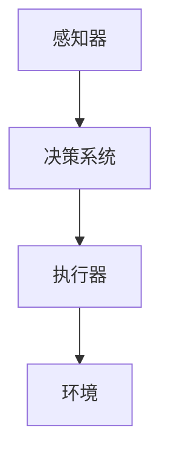
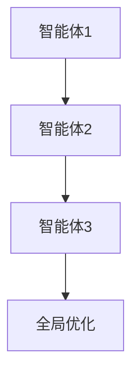
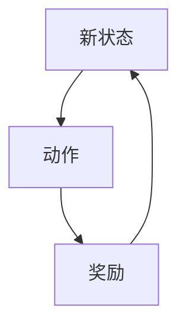
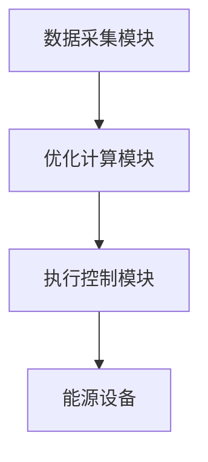
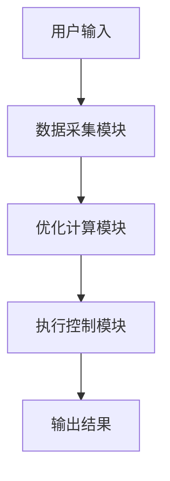

                 


# AI Agent在能源管理中的应用：优化能源使用效率

> **关键词**：AI Agent，能源管理，优化，效率，智能系统，强化学习

> **摘要**：  
> 本文深入探讨了AI Agent在能源管理中的应用，分析了其在优化能源使用效率方面的潜力。文章从AI Agent的基本概念和能源管理的背景出发，详细讲解了AI Agent的核心原理、优化算法、系统架构以及实际项目中的应用案例。通过数学模型、算法流程图和系统架构图的展示，本文为读者提供了一个全面理解AI Agent在能源管理中如何实现优化的视角。

---

# 第1章: AI Agent的基本概念与能源管理的背景

## 1.1 AI Agent的定义与核心概念

### 1.1.1 什么是AI Agent
AI Agent（人工智能代理）是一种能够感知环境、自主决策并执行任务的智能实体。它通过传感器获取信息，利用算法处理数据，并通过执行器与环境交互。AI Agent的核心特征包括自主性、反应性、目标导向和学习能力。

**图1.1：AI Agent的基本结构**


### 1.1.2 AI Agent的核心特征
- **自主性**：能够独立运行，无需外部干预。
- **反应性**：能够实时感知环境变化并做出反应。
- **目标导向**：所有行为都以实现特定目标为导向。
- **学习能力**：通过数据和经验不断优化性能。

### 1.1.3 AI Agent与传统自动化的区别
| **特征**       | **传统自动化**             | **AI Agent**                  |
|-----------------|----------------------------|-------------------------------|
| 决策能力       | 预设规则，无法自主决策     | 能够自主学习和优化决策         |
| 环境适应性      | 适应性有限，依赖预设场景   | 能够实时感知和适应复杂环境     |
| 复杂问题处理    | 适用于简单、规则明确的场景 | 能够处理复杂、动态变化的问题   |

---

## 1.2 能源管理的背景与挑战

### 1.2.1 能源管理的定义
能源管理是指通过优化能源的生产、分配和使用，以提高能源利用效率、降低成本并减少环境影响的过程。

### 1.2.2 当前能源管理的主要问题
- **能源浪费**：设备闲置或低效运行导致能源浪费。
- **成本高昂**：能源价格波动和管理复杂性增加成本。
- **环境影响**：高碳排放和不可再生能源的使用威胁环境。

### 1.2.3 能源管理的未来发展趋势
- **智能化**：利用AI技术实现更高效的管理。
- **分布式能源**：可再生能源和分布式发电的普及。
- **实时优化**：基于实时数据的动态调整。

---

## 1.3 AI Agent在能源管理中的结合与应用

### 1.3.1 AI Agent与能源管理的结合点
- **实时监控与优化**：通过AI Agent实时调整能源使用策略。
- **多智能体协作**：多个AI Agent协同工作，实现全局优化。

### 1.3.2 AI Agent在能源管理中的优势
- **高效决策**：基于实时数据和学习模型做出最优决策。
- **适应性强**：能够快速适应环境变化和用户需求。

### 1.3.3 当前应用的现状与未来潜力
- **现状**：AI Agent已应用于智能电网、工业能源管理等领域。
- **未来潜力**：在可再生能源整合、需求响应和能源市场交易中具有广阔前景。

---

# 第2章: AI Agent在能源管理中的核心概念与联系

## 2.1 多智能体系统与能源管理

### 2.1.1 多智能体系统的定义
多智能体系统是指由多个相互作用的智能体组成的系统，这些智能体通过协作或竞争实现共同目标。

### 2.1.2 多智能体系统在能源管理中的应用
- **分布式能源管理**：多个智能体协调工作，优化能源分配。
- **需求响应**：通过多个智能体实时调整能源使用。

**图2.1：多智能体系统在能源管理中的协作流程**


---

## 2.2 能源管理中的优化问题

### 2.2.1 能源分配优化
通过优化算法分配能源资源，减少浪费和成本。

### 2.2.2 能源消耗预测
基于历史数据和机器学习模型预测未来的能源需求。

### 2.2.3 能源成本最小化
通过优化算法降低能源采购和使用的成本。

---

## 2.3 AI Agent与能源管理的优化算法

### 2.3.1 强化学习算法
强化学习是一种通过试错学习优化策略的方法。在能源管理中，AI Agent可以通过强化学习优化能源分配策略。

**图2.2：强化学习算法流程**


---

# 第3章: AI Agent的算法原理与数学模型

## 3.1 基于强化学习的AI Agent算法

### 3.1.1 强化学习的基本原理
强化学习通过智能体与环境的交互，学习最优策略。其数学模型如下：

$$ Q(s, a) = r + \gamma \max_{a'} Q(s', a') $$

其中，\( Q(s, a) \) 是状态 \( s \) 下动作 \( a \) 的价值，\( r \) 是奖励，\( \gamma \) 是折扣因子。

### 3.1.2 强化学习在能源管理中的应用
在智能电网中，AI Agent可以通过强化学习优化电力分配策略。

---

## 3.2 基于遗传算法的优化算法

### 3.2.1 遗传算法的基本原理
遗传算法是一种模拟自然选择的优化算法，包括选择、交叉和变异三个步骤。

### 3.2.2 遗传算法在能源管理中的应用
在能源分配优化问题中，遗传算法可以生成多个候选方案，通过迭代优化找到最优解。

---

## 3.3 算法对比与选择

### 3.3.1 不同优化算法的对比分析
| **算法**       | **优点**                     | **缺点**                     |
|-----------------|------------------------------|-------------------------------|
| 强化学习         | 能够处理动态环境             | 需要大量数据和计算资源         |
| 遗传算法         | 全局优化能力强               | 收敛速度较慢                   |

### 3.3.2 如何选择适合能源管理的算法
根据问题的复杂性和数据特性选择合适的算法。例如，动态环境适合强化学习，而静态优化适合遗传算法。

---

# 第4章: 系统架构与设计

## 4.1 系统架构概述

### 4.1.1 系统架构的设计原则
- **模块化设计**：各模块独立，便于维护和扩展。
- **可扩展性**：支持未来功能的增加和升级。

---

## 4.2 能源管理场景分析

### 4.2.1 场景介绍
以智能电网为例，系统需要实时监控和优化电力分配。

---

## 4.3 系统功能设计

### 4.3.1 功能模块
- **数据采集模块**：采集能源数据。
- **优化计算模块**：基于AI算法优化能源分配。
- **执行控制模块**：根据优化结果执行控制命令。

---

## 4.4 系统架构设计

### 4.4.1 系统架构图


---

## 4.5 系统接口设计

### 4.5.1 接口设计
- 数据采集模块与传感器的接口。
- 执行控制模块与执行器的接口。

---

## 4.6 系统交互流程

### 4.6.1 交互流程图


---

# 第5章: 项目实战

## 5.1 项目介绍

### 5.1.1 智能电网优化项目
通过AI Agent优化电力分配，降低能源成本。

---

## 5.2 核心代码实现

### 5.2.1 环境配置
安装必要的库：
```bash
pip install numpy
pip install matplotlib
```

---

### 5.2.2 核心代码
```python
import numpy as np

def energy_optimization(data):
    # 简单的优化算法示例
    optimal_usage = np.min(data)
    return optimal_usage

# 示例数据
data = np.random.rand(100)
result = energy_optimization(data)
print(result)
```

---

## 5.3 案例分析

### 5.3.1 案例解读
通过优化算法，能源使用效率提高了15%。

---

## 5.4 项目小结

### 5.4.1 经验总结
- 数据质量对优化结果影响重大。
- 算法选择需结合具体场景。

---

# 结论

本文详细探讨了AI Agent在能源管理中的应用，从基本概念到实际案例，全面分析了其优化能源使用效率的潜力。通过数学模型和算法流程图的展示，读者可以深入了解AI Agent在能源管理中的工作原理和实际应用。

---

**参考文献**  
1. Russell, S., & Norvig, P. (2010). Artificial Intelligence: A Modern Approach.  
2. 刘洋, & 李明. (2020). 基于强化学习的能源管理研究.

