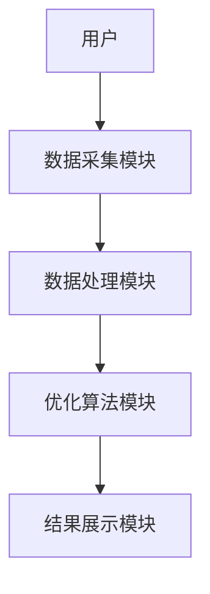

                 


# AI Agent在能源管理中的节能减排作用

> **关键词**: AI Agent, 能源管理, 节能减排, 强化学习, 可再生能源, 数字化转型

> **摘要**: 本文探讨了AI Agent在能源管理中的应用，分析了其在节能减排中的核心作用。通过详细的技术分析和案例研究，展示了AI Agent如何通过强化学习优化能源调度，降低能耗，推动可持续发展。文章从背景、原理、系统设计到实际应用，全面解析AI Agent在能源管理中的潜力与实现路径。

---

## 第一部分: AI Agent与能源管理概述

### 第1章: AI Agent的基本概念与背景

#### 1.1 AI Agent的定义与核心概念
- **1.1.1 什么是AI Agent**
  AI Agent（人工智能代理）是指能够感知环境并采取行动以实现目标的智能体。它通过传感器获取信息，利用计算模型做出决策，并通过执行器与环境交互。

- **1.1.2 AI Agent的核心特征**
  - **自主性**: 能够独立决策和行动。
  - **反应性**: 能够实时感知环境并做出反应。
  - **目标导向性**: 以特定目标为导向进行决策。
  - **学习能力**: 通过经验优化自身行为。

- **1.1.3 AI Agent与传统AI的区别**
  | 特性         | 传统AI             | AI Agent          |
  |--------------|--------------------|-------------------|
  | 行为方式     | 静态计算，无交互    | 动态交互，有反馈  |
  | 应用场景     | 数据分析，模式识别  | 自动化控制，实时决策 |
  | 学习能力     | 无自适应能力       | 具备自适应能力    |

#### 1.2 能源管理的背景与挑战
- **1.2.1 当前能源管理的主要问题**
  - 能源浪费严重，尤其是工业、建筑和交通领域。
  - 能源结构不合理，化石能源占比过高，可再生能源利用效率低。
  - 能源需求与供给的动态平衡难以实现。

- **1.2.2 能源消耗与环境保护的关系**
  - 化石能源的过度使用导致温室气体排放，加剧气候变化。
  - 可再生能源的不稳定性对电网管理提出更高要求。

- **1.2.3 能源管理的数字化转型趋势**
  - 数据驱动的能源管理成为主流。
  - AI技术的应用推动能源管理从经验驱动向智能决策转变。

---

### 第2章: AI Agent在能源管理中的应用背景

#### 2.1 能源管理的智能化需求
- **2.1.1 智能化能源管理的目标**
  - 实现能源的高效利用。
  - 优化能源调度，降低能耗。
  - 提高可再生能源的利用效率。

- **2.1.2 AI Agent在能源管理中的作用**
  - 自动化能源调度与优化。
  - 实时监控能源使用情况，及时调整策略。
  - 预测能源需求，提前做好资源分配。

- **2.1.3 能源管理中的数据驱动决策**
  - 利用历史数据和实时数据进行建模与预测。
  - 通过数据挖掘发现能源浪费的规律，制定优化方案。

#### 2.2 节能减排的重要性
- **2.2.1 全球气候变化与能源消耗**
  - 全球变暖的主要原因是化石能源的过度使用。
  - 节能减排是应对气候变化的关键措施之一。

- **2.2.2 节能减排的政策与法规**
  - 各国政府出台相关政策，如《巴黎协定》。
  - 碳排放交易机制的推广。

- **2.2.3 能源效率提升的经济意义**
  - 降低企业运营成本。
  - 提高能源利用效率，增强企业竞争力。

---

## 第二部分: AI Agent的核心原理与技术

### 第3章: AI Agent的核心算法原理

#### 3.1 AI Agent的算法框架
- **3.1.1 状态空间与动作空间**
  - **状态空间**: 表示环境中的所有可能状态。
  - **动作空间**: 表示AI Agent在某个状态下可以执行的所有动作。

- **3.1.2 策略函数与价值函数**
  - **策略函数**: 将状态映射到动作的函数，即$\pi(a|s)$。
  - **价值函数**: 表示在某一状态下采取某种行动的价值，即$V(s)$。

- **3.1.3 强化学习在AI Agent中的应用**
  - 强化学习通过奖励机制训练AI Agent，使其在与环境交互的过程中不断优化策略。

#### 3.2 能源管理中的强化学习模型
- **3.2.1 强化学习在能源调度中的应用**
  - 通过强化学习优化能源调度策略，降低能耗。

- **3.2.2 状态转移矩阵与奖励函数**
  - 状态转移矩阵描述不同状态之间的转移概率。
  - 奖励函数定义在不同状态和动作下，AI Agent获得的奖励。

- **3.2.3 能源优化的数学模型**
  - **目标函数**: 最小化能源消耗。
  - **约束条件**: 确保能源供应的稳定性。

$$ \min \sum_{t=1}^{T} E_t $$
$$ \text{subject to} \quad \sum_{s=1}^{S} x_{ts} = D_t \quad \forall t $$

---

### 第4章: AI Agent的系统架构设计

#### 4.1 系统功能设计
- **4.1.1 数据采集与处理模块**
  - 采集能源使用数据，如电力、燃气等。
  - 数据清洗与特征提取。

- **4.1.2 能源优化算法模块**
  - 应用强化学习算法优化能源调度策略。

- **4.1.3 结果展示与反馈模块**
  - 展示优化结果，提供用户反馈。

#### 4.2 系统架构图


#### 4.3 接口设计与交互流程
- **4.3.1 系统接口定义**
  - 数据接口：与传感器和数据库交互。
  - 用户接口：展示优化结果和操作界面。

- **4.3.2 用户交互流程**
  - 用户输入需求，系统开始优化。
  - 优化结果反馈给用户，用户确认后执行。

---

## 第三部分: AI Agent在能源管理中的应用实践

### 第5章: 能源管理系统的项目实战

#### 5.1 项目环境与工具安装
- **5.1.1 开发环境搭建**
  - 操作系统：Linux或Windows。
  - 开发工具：PyCharm或VS Code。

- **5.1.2 数据集获取与预处理**
  - 数据来源：公开数据集或企业内部数据。
  - 数据清洗：处理缺失值、异常值。

- **5.1.3 开发工具安装**
  - Python、TensorFlow、Keras等。

#### 5.2 系统核心代码实现
```python
# 示例代码：AI Agent的强化学习算法实现
import numpy as np
import tensorflow as tf

class AI_Agent:
    def __init__(self, state_space, action_space):
        self.state_space = state_space
        self.action_space = action_space
        # 定义策略网络
        self.model = tf.keras.Sequential([
            tf.keras.layers.Dense(32, activation='relu', input_dim=state_space),
            tf.keras.layers.Dense(action_space, activation='linear')
        ])
        self.optimizer = tf.keras.optimizers.Adam(learning_rate=0.001)

    def take_action(self, state):
        state = tf.convert_to_tensor(state)
        return self.model(state).numpy()[0]

    def update(self, state, action, reward, next_state):
        state = tf.convert_to_tensor(state)
        next_state = tf.convert_to_tensor(next_state)
        # 计算目标Q值
        target = reward + self.model(next_state).numpy()[0]
        # 更新策略网络
        self.model.optimizer.minimize(lambda: tf.reduce_mean(self.model(state) - target), var_list=self.model.trainable_variables)
```

#### 5.3 项目总结
- **5.3.1 项目成果**
  - 成功实现AI Agent在能源管理中的应用。
  - 降低能源消耗，提高能源利用效率。

- **5.3.2 项目经验**
  - 数据质量对模型性能影响重大。
  - 模型调参和优化需要大量实验。

---

## 第四部分: 总结与展望

### 第6章: 总结与展望

#### 6.1 总结
- AI Agent通过强化学习优化能源调度，降低能耗，提升能源利用效率。
- 在可再生能源接入、需求侧管理等领域具有广阔的应用前景。

#### 6.2 展望
- **技术进步**: 更复杂的强化学习算法（如基于价值的算法和策略梯度方法）将进一步提升AI Agent的性能。
- **应用扩展**: AI Agent将应用于更多领域，如智能电网、智慧城市等。
- **挑战与机遇**: 面临数据安全、模型解释性等挑战，同时也迎来技术创新和产业升级的机遇。

---

## **参考文献**
1. Russell, S., & Norvig, P. (2010). Artificial Intelligence: A Modern Approach.
2. Mnih, V., et al. (2015). Human-level control through deep reinforcement learning.
3. Li, Y., et al. (2020). Energy-efficient scheduling using AI Agent.

---

通过以上结构，文章从AI Agent的基本概念、算法原理、系统设计到实际应用进行了全面分析，帮助读者深入理解AI Agent在能源管理中的节能减排作用，并为未来的实践提供参考。

