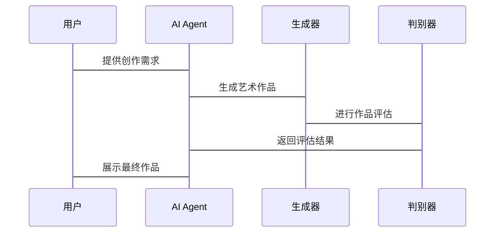

                 


# AI Agent在艺术创作中的应用：新形式探索

## 关键词：AI Agent，艺术创作，生成式AI，艺术生成模型，强化学习，GAN（生成对抗网络）

## 摘要：  
随着人工智能技术的飞速发展，AI Agent（人工智能代理）在艺术创作中的应用正逐渐成为一种新兴趋势。通过结合生成式AI、强化学习和深度学习等技术，AI Agent能够辅助或独立完成艺术创作，探索全新的艺术形式和创作方式。本文将从AI Agent的基本概念出发，深入分析其在艺术创作中的算法原理、系统架构、项目实战及未来展望，为读者提供全面的技术解析和实践指导。

---

# 目录大纲

## 第一部分：AI Agent在艺术创作中的背景与概念

### 第1章：AI Agent与艺术创作的背景介绍

#### 1.1 问题背景  
- 1.1.1 艺术创作的数字化转型与技术需求  
- 1.1.2 AI技术在艺术领域的潜力与发展趋势  
- 1.1.3 当前艺术创作中的技术瓶颈与效率问题  

#### 1.2 问题描述  
- 1.2.1 艺术创作的个性化需求与多样性挑战  
- 1.2.2 艺术创作的可扩展性与规模化生产的限制  
- 1.2.3 传统艺术创作中的创意与技术结合的难点  

#### 1.3 问题解决  
- 1.3.1 AI Agent的定义与核心功能  
- 1.3.2 AI Agent在艺术创作中的角色定位与作用机制  
- 1.3.3 AI Agent与传统艺术创作的结合方式与优势  

#### 1.4 边界与外延  
- 1.4.1 AI Agent的适用范围与局限性  
- 1.4.2 艺术创作的边界问题与AI Agent的潜在影响  
- 1.4.3 AI Agent的伦理与安全问题  

#### 1.5 概念结构与核心要素  
- 1.5.1 AI Agent的核心要素：感知、决策、执行  
- 1.5.2 艺术创作的流程分解与AI Agent的介入点  
- 1.5.3 AI Agent与人类艺术家的协同关系与未来趋势  

---

## 第二部分：AI Agent的核心概念与联系

### 第2章：AI Agent的核心概念原理

#### 2.1 AI Agent的原理概述  
- 2.1.1 AI Agent的基本工作原理与技术框架  
- 2.1.2 AI Agent的感知与决策机制：输入处理、特征提取、目标设定  
- 2.1.3 AI Agent的学习与进化能力：监督学习、无监督学习、强化学习  

#### 2.2 AI Agent的属性特征对比  
- 2.2.1 AI Agent与传统软件的对比：自主性、适应性、智能性  
- 2.2.2 AI Agent与人类艺术家的对比：效率、创意、情感表达  
- 2.2.3 AI Agent的可定制性与适应性：参数调节、风格迁移、用户反馈  

#### 2.3 ER实体关系图  
```mermaid
er
actor: 用户
agent: AI Agent
artifact: 艺术作品
goal: 创作目标
rule: 创作规则
dependency: 依赖关系
```

---

## 第三部分：AI Agent的算法原理与数学模型

### 第3章：AI Agent的算法原理

#### 3.1 基于GAN的AI Agent算法  
- 3.1.1 GAN的基本原理：生成器与判别器的对抗训练  
- 3.1.2 GAN在艺术创作中的应用：图像生成、风格迁移、图像修复  
- 3.1.3 GAN的优缺点分析：模式崩溃、训练不稳定、计算资源需求  

#### 3.2 基于强化学习的AI Agent算法  
- 3.2.1 强化学习的基本原理：状态、动作、奖励机制  
- 3.2.2 强化学习在艺术创作中的应用：音乐生成、绘画创作、文本生成  
- 3.2.3 强化学习的优缺点分析：训练时间长、样本效率低、模型复杂性  

#### 3.3 GAN与强化学习的结合  
- 3.3.1 GAN与强化学习的协同机制  
- 3.3.2 结合案例：使用GAN生成艺术风格，利用强化学习优化创作过程  

#### 3.4 数学模型与公式解读  
- 3.4.1 GAN的损失函数：  
  $$\mathcal{L}_{\text{GAN}} = \mathbb{E}_{x \sim P_{\text{data}}}[\log D(x)] + \mathbb{E}_{z \sim P_{z}}[\log(1 - D(G(z)))]$$  
- 3.4.2 强化学习的奖励函数：  
  $$R(s, a) = r_1 \cdot f_1(s, a) + r_2 \cdot f_2(s, a) + \dots + r_n \cdot f_n(s, a)$$  

---

## 第四部分：AI Agent的系统分析与架构设计

### 第4章：AI Agent的系统架构设计

#### 4.1 问题场景介绍  
- 4.1.1 艺术创作的场景分析：从创意构思到作品完成的全生命周期  
- 4.1.2 AI Agent在艺术创作中的应用场景：绘画、音乐、文学、影视  

#### 4.2 项目介绍  
- 4.2.1 项目目标：构建一个基于AI Agent的艺术创作系统  
- 4.2.2 项目范围：支持多种艺术形式，提供个性化创作服务  
- 4.2.3 项目约束：计算资源限制、用户隐私保护、模型可解释性  

#### 4.3 系统功能设计  
- 4.3.1 领域模型：  
  ```mermaid
  classDiagram
  class 用户 {
    + 用户ID: int
    + 用户偏好: string
    + 用户历史记录: list
  }
  class AI Agent {
    + 生成器: Model
    + 判别器: Model
    + 状态机: StateMachine
  }
  class 艺术作品 {
    + 作品ID: int
    + 作品类型: string
    + 作品数据: bytes
  }
  用户 --> AI Agent: 提供输入
  AI Agent --> 艺术作品: 生成输出
  ```

#### 4.4 系统架构设计  
- 4.4.1 分层架构：数据层、算法层、应用层  
- 4.4.2 微服务架构：用户界面、AI Agent服务、存储服务  
- 4.4.3 可扩展性设计：支持多种艺术形式，灵活配置模型  

#### 4.5 接口设计与交互流程  
- 4.5.1 系统接口：API定义与调用流程  
- 4.5.2 系统交互：用户与AI Agent的协作流程与反馈机制  

#### 4.6 系统交互流程图  


---

## 第五部分：AI Agent的项目实战

### 第5章：AI Agent的艺术创作系统实现

#### 5.1 环境安装与配置  
- 5.1.1 开发环境：Python 3.8+，TensorFlow 2.0+，Keras  
- 5.1.2 依赖安装：pip install tensorflow-gan, numpy, matplotlib  

#### 5.2 系统核心实现源代码  
```python
import tensorflow as tf
from tensorflow.keras import layers
import numpy as np
import matplotlib.pyplot as plt

# 定义生成器模型
def build_generator(latent_dim):
    model = tf.keras.Sequential()
    model.add(layers.Dense(256, activation='relu', input_dim=latent_dim))
    model.add(layers.Dense(128, activation='relu'))
    model.add(layers.Dense(64, activation='relu'))
    model.add(layers.Dense(32, activation='relu'))
    model.add(layers.Dense(16, activation='relu'))
    model.add(layers.Dense(128))
    model.add(layers.Reshape((128, 1)))
    return model

# 定义判别器模型
def build_discriminator(input_shape):
    model = tf.keras.Sequential()
    model.add(layers.Dense(64, activation='relu', input_dim=input_shape))
    model.add(layers.Dense(32, activation='relu'))
    model.add(layers.Dense(1, activation='sigmoid'))
    return model

# 定义GAN模型
def train_gan(generator, discriminator, latent_dim, epochs=100):
    discriminator.compile(loss='binary_crossentropy', optimizer='adam')
    generator.compile(loss='binary_crossentropy', optimizer='adam')

    for epoch in range(epochs):
        # 生成假数据
        latent = np.random.randn(100, latent_dim)
        generated = generator.predict(latent)
        # 训练判别器
        valid = np.ones((100, 1))
        fake = np.zeros((100, 1))
        discriminator.trainable = True
        discriminator.train_on_batch(generated, fake)
        # 训练生成器
        discriminator.trainable = False
        generator.train_on_batch(latent, fake)
    return generator

# 训练GAN模型
latent_dim = 100
generator = build_generator(latent_dim)
discriminator = build_discriminator(128)
gan = train_gan(generator, discriminator, latent_dim)
```

#### 5.3 代码实现解读与分析  
- 5.3.1 生成器模型的构建：从噪声向量生成艺术作品的特征表示  
- 5.3.2 判别器模型的构建：区分真实作品与生成作品  
- 5.3.3 GAN的联合训练：生成器与判别器的对抗训练过程  

#### 5.4 案例分析与详细讲解  
- 5.4.1 生成艺术风格的图像：使用GAN生成抽象画作  
- 5.4.2 风格迁移：将照片转换为艺术风格的图像  
- 5.4.3 文本生成：利用强化学习生成诗歌或小说片段  

#### 5.5 项目小结  
- 5.5.1 项目实现的关键点与经验总结  
- 5.5.2 项目的局限性与改进方向  
- 5.5.3 未来研究的潜在方向与应用场景  

---

## 第六部分：小结与展望

### 第6章：小结与未来展望

#### 6.1 小结  
- 6.1.1 AI Agent在艺术创作中的核心作用与技术优势  
- 6.1.2 本文的主要内容与研究成果总结  
- 6.1.3 项目实现的关键技术与创新点  

#### 6.2 未来展望  
- 6.2.1 AI Agent在艺术创作中的潜在应用场景与发展方向  
- 6.2.2 新型AI技术（如GPT-4、多模态AI）对艺术创作的深远影响  
- 6.2.3 人机协作的未来趋势：AI Agent与人类艺术家的深度融合  

---

## 参考文献与拓展阅读  
- 拓展阅读1：《生成式AI在艺术创作中的应用与挑战》  
- 拓展阅读2：《强化学习在艺术创作中的创新实践》  
- 拓展阅读3：《GAN模型的艺术生成能力与优化策略》  

---

通过以上目录大纲，本文将系统地探讨AI Agent在艺术创作中的应用，从理论到实践，为读者提供全面的技术解析和实践指导。

