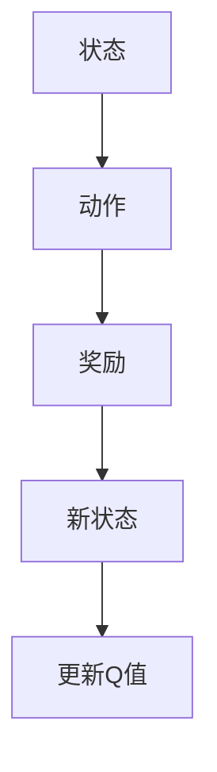
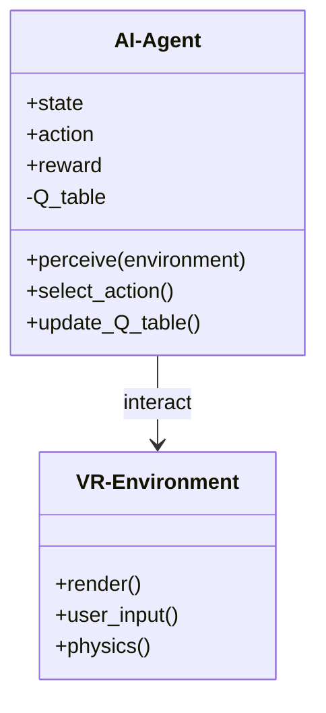
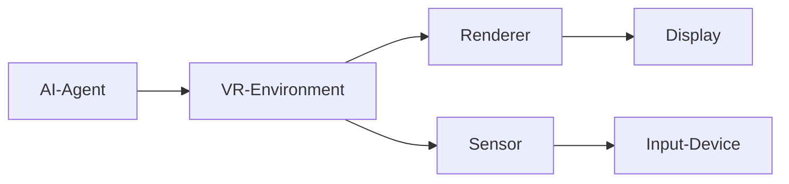
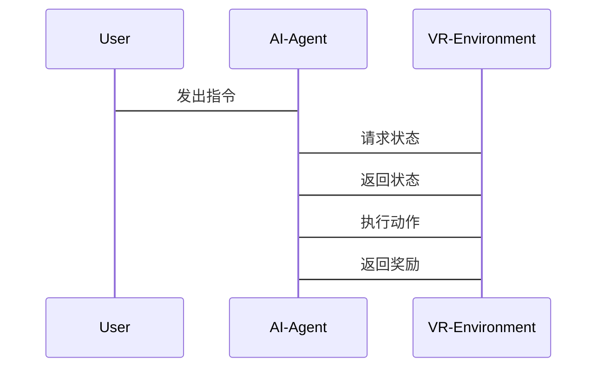

                 


# AI Agent在虚拟现实中的应用

> 关键词：AI Agent, 虚拟现实, 强化学习, 实时渲染, 智能NPC

> 摘要：本文探讨AI Agent在虚拟现实中的应用，涵盖背景介绍、核心概念、算法原理、系统架构、项目实战等，通过详细的技术分析和实例，揭示AI Agent在虚拟现实中的潜力和实现方法。

---

## 第一部分: AI Agent与虚拟现实的背景介绍

### 第1章: AI Agent与虚拟现实概述

#### 1.1 AI Agent的基本概念

##### 1.1.1 AI Agent的定义与特点

AI Agent（人工智能代理）是指能够感知环境并采取行动以实现目标的智能实体。AI Agent具有自主性、反应性、目标导向和社会能力等特点，能够在复杂环境中自主决策和与人交互。

##### 1.1.2 虚拟现实的基本概念与技术

虚拟现实（Virtual Reality，VR）是一种能够提供沉浸式体验的技术，通过计算机生成的三维环境，让用户获得身临其境的体验。VR技术结合了图形学、传感器技术和交互设计，为用户创造一个可交互的虚拟世界。

#### 1.2 AI Agent在虚拟现实中的应用背景

##### 1.2.1 虚拟现实的发展历程

虚拟现实技术起源于20世纪60年代，经历了从简单图形到高精度渲染的发展。随着计算能力的提升和AI技术的进步，VR应用范围不断扩大，从娱乐扩展到教育、医疗等领域。

##### 1.2.2 AI Agent在虚拟现实中的潜力

AI Agent能够增强虚拟现实的沉浸感和交互性，例如智能NPC（非玩家角色）可以提供更自然的对话和行为，虚拟助手能够实时响应用户的指令。AI Agent的应用使虚拟环境更加智能化和动态化。

## 第二部分: AI Agent的核心概念与虚拟现实的联系

### 第2章: AI Agent的核心原理

#### 2.1 AI Agent的决策机制

##### 2.1.1 基于强化学习的决策过程

强化学习通过智能体与环境的交互，通过试错学习来优化策略。在虚拟现实中，AI Agent可以通过强化学习学习复杂的任务，如路径规划和行为决策。

##### 2.1.2 基于规则的决策系统

规则系统通过预定义的条件和动作来实现决策，适合处理简单的任务。在虚拟现实中，规则系统常用于简单的NPC行为控制。

#### 2.2 虚拟现实中的交互机制

##### 2.2.1 用户输入与虚拟环境的反馈

用户通过头显、手柄等设备输入指令，虚拟环境通过渲染和反馈提供实时响应，形成闭环交互。

##### 2.2.2 实时渲染与物理模拟

虚拟现实依赖于高效的实时渲染和物理引擎，确保环境的真实感和互动性。

#### 2.3 AI Agent与虚拟现实的结合点

##### 2.3.1 智能NPC的设计与实现

AI Agent可以控制虚拟角色的行为，使其更具智能性和互动性。

##### 2.3.2 虚拟助手在VR中的应用

AI Agent可以作为虚拟助手，帮助用户完成任务，提供信息查询等服务。

### 第3章: 基于强化学习的AI Agent算法

#### 3.1 强化学习的基本原理

##### 3.1.1 状态、动作、奖励的定义

在强化学习中，智能体通过感知环境状态，选择动作以获得奖励，目标是最大化累计奖励。

##### 3.1.2 Q-learning算法的数学模型

Q-learning算法通过更新Q值表来学习策略：

$$ Q(s, a) = Q(s, a) + \alpha (r + \gamma \max Q(s', a') - Q(s, a)) $$

其中，$\alpha$是学习率，$\gamma$是折扣因子。

##### 3.1.3 算法流程图（Mermaid）



#### 3.2 在虚拟现实中的应用

##### 3.2.1 虚拟角色的行为决策

AI Agent通过强化学习学习NPC的行为，使其在虚拟环境中更具智能性。

##### 3.2.2 环境探索与路径规划

AI Agent在虚拟环境中进行探索，学习最优路径规划。

### 第4章: 系统分析与架构设计方案

#### 4.1 系统功能设计

##### 4.1.1 领域模型（Mermaid类图）



##### 4.1.2 系统架构设计（Mermaid架构图）



#### 4.2 系统接口设计

##### 4.2.1 接口描述

AI Agent与虚拟环境通过API进行交互，接口包括感知环境、执行动作和接收反馈。

##### 4.2.2 交互序列图（Mermaid）



### 第5章: 项目实战

#### 5.1 环境安装

##### 5.1.1 安装虚拟现实开发框架

安装Oculus SDK或OpenVR等开发框架，配置开发环境。

##### 5.1.2 安装机器学习库

安装TensorFlow或PyTorch，用于AI Agent的训练和推理。

#### 5.2 核心代码实现

##### 5.2.1 Python代码示例

```python
import numpy as np

class AI-Agent:
    def __init__(self, state_space, action_space):
        self.state_space = state_space
        self.action_space = action_space
        self.Q_table = np.zeros((state_space, action_space))

    def perceive(self, state):
        return state

    def select_action(self, state, epsilon=0.1):
        if np.random.random() < epsilon:
            return np.random.randint(self.action_space)
        else:
            return np.argmax(self.Q_table[state])

    def update_Q_table(self, state, action, reward, next_state):
        self.Q_table[state][action] += 0.1 * (reward + 0.95 * np.max(self.Q_table[next_state]) - self.Q_table[state][action])
```

##### 5.2.2 代码解读与分析

AI Agent类实现了基于Q-learning的算法，通过感知环境状态，选择动作，并更新Q值表。

#### 5.3 案例分析与详细讲解

##### 5.3.1 智能NPC的实现

在虚拟环境中，AI Agent控制NPC的行为，使其能够与用户进行交互。

##### 5.3.2 虚拟助手的应用

AI Agent作为虚拟助手，提供实时信息查询和任务辅助。

#### 5.4 项目小结

通过项目实战，展示了AI Agent在虚拟现实中的实现和应用，验证了算法的有效性和系统的可行性。

### 第6章: 最佳实践、小结、注意事项和拓展阅读

#### 6.1 最佳实践

- 确保硬件性能充足，以支持实时渲染和AI计算。
- 在开发过程中，注重代码的模块化和可维护性。
- 定期进行性能优化，提升用户体验。

#### 6.2 小结

本文详细探讨了AI Agent在虚拟现实中的应用，从理论到实践，展示了其在虚拟环境中的潜力和实现方法。

#### 6.3 注意事项

- 注意数据安全和隐私保护。
- 处理复杂任务时，考虑计算资源的限制。
- 在实际应用中，结合具体场景优化AI Agent的行为。

#### 6.4 拓展阅读

- 推荐阅读《强化学习入门》和《虚拟现实开发指南》。
- 关注最新的AI和VR技术动态，保持技术前沿。

---

通过以上内容，我们系统地探讨了AI Agent在虚拟现实中的应用，从基本概念到算法实现，再到项目实战，为读者提供了全面的知识体系。希望这篇文章能够帮助读者深入了解AI Agent在虚拟现实中的潜力和实现方法，为未来的应用开发提供参考。

