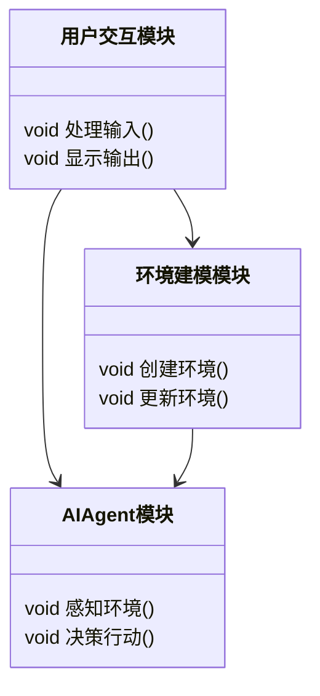
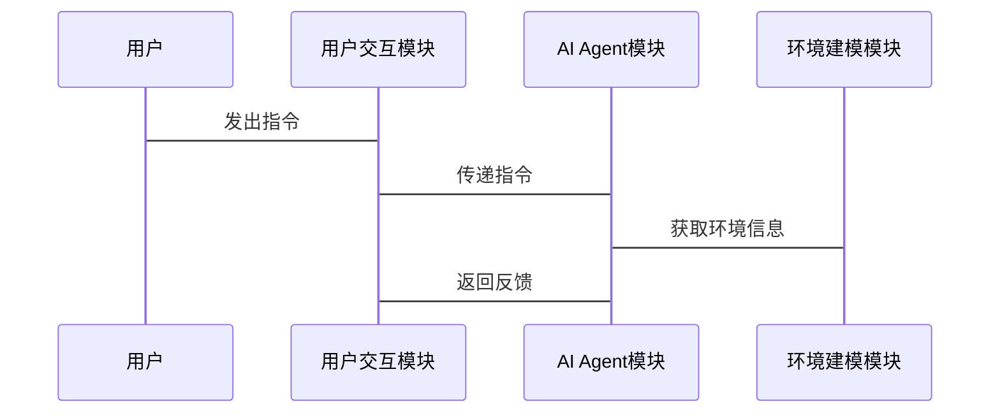

                 


# AI Agent在虚拟现实中的应用：沉浸式体验增强

> 关键词：AI Agent，虚拟现实，沉浸式体验，行为决策，实时交互

> 摘要：本文探讨AI Agent在虚拟现实中的应用，特别是如何通过AI Agent提升沉浸式体验。从基础概念到算法原理，再到系统架构设计和项目实战，系统地分析了AI Agent在VR中的作用，并通过具体案例展示了其在提升用户体验中的潜力。

---

# 第一部分: AI Agent与虚拟现实概述

## 第1章: AI Agent与虚拟现实的基础概念

### 1.1 AI Agent的基本概念

#### 1.1.1 什么是AI Agent
AI Agent（人工智能代理）是一种智能实体，能够感知环境并采取行动以实现目标。它不同于传统程序，具有自主性、反应性、目标导向和社交能力等特征。

#### 1.1.2 AI Agent的核心特征
- **自主性**：能够独立决策和行动。
- **反应性**：能够实时感知环境变化并做出反应。
- **目标导向**：通过目标驱动行为，优化决策以达到目标。
- **社交能力**：能够与其他AI Agent或用户进行交互。

#### 1.1.3 AI Agent与传统AI的区别
AI Agent不仅是静态的知识库，而是动态的、能够与环境和用户互动的实体。传统AI注重数据分析和模式识别，而AI Agent更注重实时交互和目标导向的行为。

### 1.2 虚拟现实的基本概念

#### 1.2.1 虚拟现实的定义与特点
虚拟现实（VR）是通过计算机生成的三维虚拟环境，提供沉浸式的视听体验。其特点包括沉浸性、交互性和构想性。

#### 1.2.2 虚拟现实的主要技术
- **头显设备**：如 Oculus Rift、HTC Vive 等。
- **三维建模**：使用3D建模技术创建虚拟环境。
- **实时渲染**：利用GPU进行高效的图形渲染。
- **交互技术**：如手势识别、语音识别等。

#### 1.2.3 虚拟现实的应用领域
- **游戏**：提供沉浸式游戏体验。
- **教育培训**：模拟真实场景进行培训。
- **医疗**：用于手术模拟和患者治疗。
- **建筑**：进行虚拟建筑可视化和设计。

### 1.3 AI Agent在虚拟现实中的结合

#### 1.3.1 AI Agent在VR中的作用
AI Agent可以作为虚拟环境中的智能角色，与用户互动，提供动态反馈，增强用户体验。

#### 1.3.2 VR中AI Agent的应用场景
- **虚拟助手**：为用户提供实时信息查询和任务协助。
- **智能NPC**：在游戏中提供更智能的非玩家角色。
- **环境优化**：根据用户行为动态调整虚拟环境。

#### 1.3.3 AI Agent如何提升VR体验
通过实时交互、动态反馈和个性化服务，AI Agent能够显著提升用户的沉浸感和互动体验。

---

## 第2章: AI Agent与虚拟现实的核心概念

### 2.1 AI Agent的行为决策流程

#### 2.1.1 行为决策的基本原理
AI Agent的行为决策基于当前状态、环境信息和目标，通过决策模型选择最优行动。

#### 2.1.2 基于状态的决策模型
状态是指AI Agent当前的环境信息。基于状态的决策模型通过状态转移实现行为决策。

#### 2.1.3 基于目标的决策模型
目标驱动的决策模型通过优化路径实现目标，如使用强化学习或A*算法。

### 2.2 虚拟现实中的交互系统

#### 2.2.1 用户输入与输出的处理
- **输入**：接收用户的动作、语音等输入。
- **输出**：生成相应的视觉、听觉反馈。

#### 2.2.2 虚拟环境的建模
使用3D建模技术创建虚拟环境，并通过物理引擎模拟真实世界的物理规律。

#### 2.2.3 实时渲染与优化
利用GPU进行高效的图形渲染，并通过优化算法减少延迟。

### 2.3 AI Agent与虚拟现实的协同工作

#### 2.3.1 AI Agent在VR中的角色
AI Agent可以在VR中作为虚拟助手、智能NPC或环境优化器。

#### 2.3.2 VR环境中的实时反馈机制
AI Agent通过实时感知和反馈，动态调整虚拟环境和交互方式。

#### 2.3.3 AI Agent与用户交互的结合
通过自然语言处理和手势识别，实现更自然的用户交互。

---

## 第3章: AI Agent在虚拟现实中的算法原理

### 3.1 基于强化学习的AI Agent

#### 3.1.1 强化学习的基本原理
强化学习通过试错机制，学习最优策略以最大化奖励。

#### 3.1.2 在VR中的应用实例
在VR游戏中，AI Agent可以通过强化学习学习最优路径和策略。

#### 3.1.3 算法实现与优化
使用深度强化学习框架，如DQN，进行算法实现和优化。

### 3.2 基于图的最短路径算法

#### 3.2.1 Dijkstra算法的原理
Dijkstra算法用于寻找图中两个节点之间的最短路径。

#### 3.2.2 A*算法的优化
A*算法结合启发式搜索，优化路径寻找效率。

#### 3.2.3 在VR中的应用
在VR导航中，A*算法用于优化路径规划。

### 3.3 基于自然语言处理的交互系统

#### 3.3.1 NLP的基本原理
自然语言处理用于理解和生成人类语言，实现人机交互。

#### 3.3.2 在VR中的应用实例
在VR中，NLP用于实现语音指令处理和对话生成。

#### 3.3.3 算法实现与优化
使用预训练语言模型，如GPT，进行自然语言处理。

---

## 第4章: 系统分析与架构设计方案

### 4.1 问题场景介绍
在VR环境中，AI Agent需要实时感知环境和用户行为，动态调整交互方式，提升用户体验。

### 4.2 系统功能设计

#### 4.2.1 领域模型
- **用户交互模块**：处理用户的输入和输出。
- **环境建模模块**：创建和管理虚拟环境。
- **AI Agent模块**：实现AI Agent的行为决策和交互。

#### 4.2.2 系统架构设计
- **分层架构**：包括用户层、业务逻辑层和数据访问层。
- **微服务架构**：将系统功能分解为多个微服务，实现高效协作。

### 4.3 系统架构设计

#### 4.3.1 类图


#### 4.3.2 序列图


---

## 第5章: 项目实战

### 5.1 环境搭建

#### 5.1.1 安装开发环境
安装必要的开发工具，如Unity、Oculus SDK等。

#### 5.1.2 配置AI Agent模块
配置强化学习框架，如TensorFlow或PyTorch。

### 5.2 系统核心实现

#### 5.2.1 用户交互模块
```python
def handle_input(user_input):
    # 处理用户输入
    pass
```

#### 5.2.2 环境建模模块
```python
def create_environment():
    # 创建虚拟环境
    pass
```

#### 5.2.3 AI Agent模块
```python
def perceive_environment(environment):
    # 感知环境
    pass
```

### 5.3 代码应用解读与分析

#### 5.3.1 强化学习算法实现
```python
class AIAgent:
    def __init__(self):
        self.model = DQN()
    
    def act(self, state):
        action = self.model.predict(state)
        return action
```

#### 5.3.2 最短路径算法实现
```python
def a_star(start, end):
    # 实现A*算法
    pass
```

### 5.4 实际案例分析

#### 5.4.1 案例介绍
在VR游戏中，AI Agent通过强化学习和A*算法实现智能NPC。

#### 5.4.2 代码实现
```python
def main():
    agent = AIAgent()
    environment = create_environment()
    while True:
        state = perceive_environment(environment)
        action = agent.act(state)
        environment.update(action)
```

### 5.5 项目小结

通过项目实战，展示了AI Agent在虚拟现实中的实现过程，验证了其在提升用户体验中的有效性。

---

## 第6章: 总结与展望

### 6.1 总结
本文系统地探讨了AI Agent在虚拟现实中的应用，从基础概念到算法实现，再到系统设计和项目实战，全面展示了AI Agent在提升沉浸式体验中的潜力。

### 6.2 未来展望
随着AI和VR技术的不断发展，AI Agent在虚拟现实中的应用将更加广泛，用户体验也将更加沉浸和智能。

---

## 第7章: 最佳实践 tips

### 7.1 小结
AI Agent在虚拟现实中的应用前景广阔，但实现过程中需要注意算法效率和用户体验的平衡。

### 7.2 注意事项
- **性能优化**：确保AI Agent的实时性。
- **用户体验**：注重交互的自然性和流畅性。
- **安全性**：确保虚拟环境的安全性。

### 7.3 拓展阅读
推荐阅读相关领域的最新研究论文和书籍，深入了解AI Agent和虚拟现实的前沿技术。

---

通过以上结构和内容，本文系统地介绍了AI Agent在虚拟现实中的应用，从理论到实践，全面分析了其在沉浸式体验中的潜力和实现方法。希望读者能够通过本文，深入了解AI Agent在VR中的重要性，并掌握其实现的关键技术。

