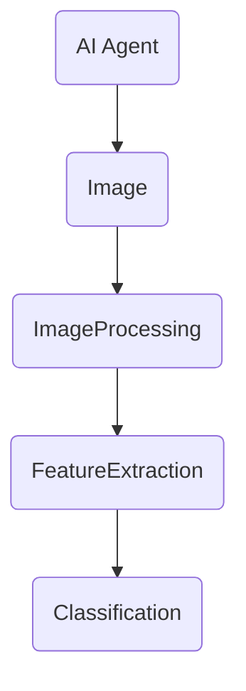

                 


# AI Agent在虚拟试衣中的图像处理

> 关键词：AI Agent，图像处理，虚拟试衣，计算机视觉，深度学习

> 摘要：本文详细探讨了AI Agent在虚拟试衣中的图像处理技术，从基本概念到算法原理，再到系统架构设计和项目实战，全面解析了AI Agent如何通过图像处理技术实现虚拟试衣的核心功能。文章旨在为读者提供从理论到实践的全面指导，帮助理解并应用这一前沿技术。

---

## 第一部分: AI Agent与图像处理基础

### 第1章: AI Agent与图像处理概述

#### 1.1 AI Agent的基本概念
- **定义**：AI Agent是指具有感知环境、自主决策和执行任务能力的智能体。它能够通过传感器获取信息，并基于这些信息做出决策，执行相应的操作。
- **核心特点**：
  - 智能性：能够理解和处理复杂信息。
  - 自主性：无需外部干预，自主完成任务。
  - 适应性：能够根据环境变化调整行为。
- **与传统AI的区别**：AI Agent具有更强的自主性和适应性，能够与环境进行交互，而传统AI更多是静态的规则执行。

#### 1.2 图像处理的基本概念
- **定义**：图像处理是通过计算机对图像进行分析和操作，以提取有用信息或改善图像质量的过程。
- **核心技术**：
  - 图像分割：将图像分成多个部分，识别目标物体。
  - 图像分类：根据特征将图像归类到特定类别。
  - 图像生成：通过算法生成新的图像。
- **与计算机视觉的关系**：图像处理是计算机视觉的基础，计算机视觉依赖于图像处理技术来实现目标识别、图像理解等高级功能。

#### 1.3 AI Agent在虚拟试衣中的应用
- **虚拟试衣的定义**：通过计算机技术让用户在线试穿衣物，提供虚拟试衣体验。
- **需求**：
  - 高精度的图像处理：确保试穿效果逼真。
  - 实时反馈：用户动作与虚拟试穿同步。
  - 个性化推荐：基于用户体型和偏好推荐衣物。
- **AI Agent的作用**：
  - 感知用户体型和动作，实时调整虚拟试穿效果。
  - 基于用户反馈优化试穿体验。
  - 提供个性化推荐和搭配建议。

---

### 第2章: AI Agent与图像处理的核心概念

#### 2.1 AI Agent的核心原理
- **感知与决策机制**：AI Agent通过传感器（如摄像头、麦克风）获取环境信息，利用机器学习模型进行分析，做出决策。
- **学习与推理过程**：AI Agent通过监督学习、强化学习等方法，从数据中学习模式和规律，推理出最佳行动方案。
- **自适应能力**：AI Agent能够根据环境变化调整参数和策略，提高适应性。

#### 2.2 图像处理的核心原理
- **图像的表示与特征提取**：图像通常以像素矩阵表示，特征提取通过卷积神经网络（CNN）等技术提取图像中的关键特征。
- **图像的分类与识别**：基于特征提取的结果，利用分类算法（如支持向量机、随机森林）或深度学习模型进行图像分类和识别。
- **图像的生成与修复**：利用生成对抗网络（GAN）等技术生成逼真图像，修复低质量图像。

#### 2.3 AI Agent与图像处理的联系
- **AI Agent在图像处理中的角色**：
  - 作为控制器，协调图像处理过程。
  - 作为决策者，根据图像处理结果做出判断。
- **图像处理对AI Agent的支撑**：
  - 提供视觉信息，帮助AI Agent感知环境。
  - 优化AI Agent的决策过程，提高准确性和效率。
- **协同效应**：
  - 提高AI Agent的感知能力。
  - 提升图像处理的智能化水平。

#### 2.4 核心概念对比表
| 概念 | AI Agent | 图像处理 |
|------|----------|----------|
| 核心目标 | 智能决策与执行 | 图像分析与处理 |
| 输入 | 多模态数据 | 图像数据 |
| 输出 | 行为或决策 | 处理后的图像或信息 |
| 依赖技术 | 机器学习、自然语言处理 | 计算机视觉、深度学习 |

#### 2.5 ER实体关系图


---

### 第3章: AI Agent在虚拟试衣中的图像处理算法

#### 3.1 图像处理算法原理
- **图像分割算法**：将图像分割成多个区域，识别试穿衣物的关键部分。
- **目标检测算法**：检测用户的身体部位，确保试穿效果准确。
- **图像匹配算法**：将用户的身体模型与虚拟衣物进行匹配，生成逼真试穿效果。

#### 3.2 AI Agent驱动的图像处理流程
- **数据采集与预处理**：
  - 采集用户的身体数据（如三维体型模型）。
  - 对图像进行归一化处理，确保数据格式一致。
- **特征提取与识别**：
  - 使用卷积神经网络提取图像特征。
  - 通过目标检测算法识别用户的身体部位。
- **决策与反馈**：
  - 根据特征匹配结果调整试穿效果。
  - 根据用户反馈优化试穿体验。

#### 3.3 算法实现代码示例
```python
import tensorflow as tf
from tensorflow.keras import layers

# 定义图像分割模型
def segmentation_model(input_shape):
    model = tf.keras.Sequential([
        layers.Conv2D(32, (3, 3), activation='relu', input_shape=input_shape),
        layers.MaxPooling2D((2, 2)),
        layers.Conv2D(64, (3, 3), activation='relu'),
        layers.MaxPooling2D((2, 2)),
        layers.Flatten(),
        layers.Dense(64, activation='relu'),
        layers.Dense(10, activation='softmax')
    ])
    return model

# 训练模型
model = segmentation_model((224, 224, 3))
model.compile(optimizer='adam', loss='sparse_categorical_crossentropy', metrics=['accuracy'])
model.fit(x_train, y_train, epochs=10, batch_size=32)
```

#### 3.4 算法原理的数学模型和公式
- **卷积神经网络的前向传播**：
  $$ a_j^{(l+1)} = \sum_{i=1}^{n} w_{ji}^{(l)} \cdot a_i^{(l)} + b_j^{(l)} $$
  其中，\( a_j^{(l+1)} \) 表示第 \( l+1 \) 层的第 \( j \) 个神经元的激活值，\( w_{ji}^{(l)} \) 表示权重，\( a_i^{(l)} \) 表示第 \( l \) 层的第 \( i \) 个神经元的激活值，\( b_j^{(l)} \) 表示偏置。

- **损失函数（交叉熵损失）**：
  $$ L = -\sum_{i=1}^{m} y_i \log(p_i) + (1-y_i)\log(1-p_i) $$
  其中，\( y_i \) 是标签，\( p_i \) 是模型预测的概率。

- **优化器（Adam）**：
  $$ \theta_{t+1} = \theta_t - \alpha \frac{\rho_1}{1-\rho_1^{t}}} \cdot g_t + \rho_2(1-\rho_2^{t}) \cdot g_t^2 $$
  其中，\( \theta \) 是参数，\( \alpha \) 是学习率，\( \rho_1 \) 和 \( \rho_2 \) 是动量参数，\( g_t \) 是梯度。

---

## 第四章: 系统分析与架构设计方案

### 4.1 问题场景介绍
- **虚拟试衣场景**：用户通过摄像头输入身体数据，系统生成虚拟试穿效果。
- **系统需求**：
  - 实时性：试穿效果与用户动作同步。
  - 准确性：试穿效果逼真。
  - 个性化：根据用户体型推荐衣物。

### 4.2 系统功能设计
- **领域模型**：
  ```mermaid
  classDiagram
      class User {
          id
          body_data
      }
      class ImageProcessor {
          process_image()
      }
      class AI-Agent {
          receive_input()
          process_request()
          send_output()
      }
      class Virtual_Try-On_System {
          receive_request()
          process_request()
          send_response()
      }
      User --> ImageProcessor: 提交图像
      ImageProcessor --> AI-Agent: 处理结果
      AI-Agent --> Virtual_Try-On_System: 生成试穿效果
  ```

- **系统架构设计**：
  ```mermaid
  architecture
      title Virtual Try-On System Architecture
      Data Layer: 数据存储与管理
      Processing Layer: 图像处理与AI Agent
      Application Layer: 用户交互与展示
  ```

- **系统接口设计**：
  - 用户端接口：提交身体数据，获取试穿结果。
  - 后台接口：接收数据，调用图像处理和AI Agent进行处理。

- **系统交互流程**：
  ```mermaid
  sequenceDiagram
      User ->> ImageProcessor: 提交图像
      ImageProcessor ->> AI-Agent: 处理请求
      AI-Agent ->> Virtual_Try-On_System: 生成试穿效果
      Virtual_Try-On_System ->> User: 显示结果
  ```

---

## 第五章: 项目实战

### 5.1 环境搭建
- **开发环境**：Python 3.8+, TensorFlow 2.5+, OpenCV 4.5+
- **安装依赖**：
  ```bash
  pip install tensorflow keras opencv-python
  ```

### 5.2 核心代码实现
```python
import cv2
import tensorflow as tf

# 加载预训练模型
model = tf.keras.models.load_model('try_on_model.h5')

# 图像预处理
def preprocess_image(image_path):
    image = cv2.imread(image_path)
    image = cv2.resize(image, (224, 224))
    image = image / 255.0
    return image

# 试穿效果生成
def generate_try_on(image_path):
    original_image = cv2.imread(image_path)
    processed_image = preprocess_image(image_path)
    prediction = model.predict(tf.expand_dims(processed_image, axis=0))
    # 根据预测结果生成试穿效果
    try_on_image = original_image * (1 - prediction) + clothing_image * prediction
    return try_on_image
```

### 5.3 代码应用解读与分析
- **图像预处理**：将输入图像 resize 并归一化，确保模型输入格式一致。
- **模型预测**：利用预训练模型生成试穿效果的预测结果。
- **试穿效果生成**：根据预测结果，将用户图像与虚拟衣物图像进行融合，生成最终的试穿效果。

### 5.4 实际案例分析
- **案例背景**：用户上传一张身体照片，系统生成虚拟试穿某品牌新款外套的效果。
- **处理步骤**：
  1. 预处理用户图像。
  2. 使用AI Agent分析用户体型和姿势。
  3. 调用图像处理算法生成试穿效果。
  4. 返回结果并展示给用户。

### 5.5 项目小结
- **实现功能**：用户上传身体数据，系统生成虚拟试穿效果。
- **优化建议**：
  - 提高模型的泛化能力，适应不同体型和姿势。
  - 优化图像处理算法，提升实时性。

---

## 第六章: 总结与展望

### 6.1 总结
- **核心内容回顾**：AI Agent通过图像处理技术实现虚拟试衣的核心功能。
- **技术优势**：
  - 提高用户体验。
  - 降低试衣成本。
  - 提升品牌竞争力。

### 6.2 展望
- **未来发展方向**：
  - 提高试穿效果的逼真度。
  - 实现多维度的个性化推荐。
  - 推动虚拟试衣技术在电子商务和零售业的广泛应用。

### 6.3 参考文献
- [1] LeCun Y, Bengio Y, Hinton G. Deep learning. Nature, 2015.
- [2] Goodfellow I, Bengio Y, Courville A. Deep learning. MIT Press, 2016.

### 6.4 附录
- **附录A**：图像处理常用算法总结。
- **附录B**：AI Agent在其他领域的应用案例。

---

## 结语

通过本文的详细讲解，读者可以全面理解AI Agent在虚拟试衣中的图像处理技术，从理论到实践，逐步掌握相关知识和技能。希望本文能够为读者提供有价值的参考，激发更多思考和探索。

