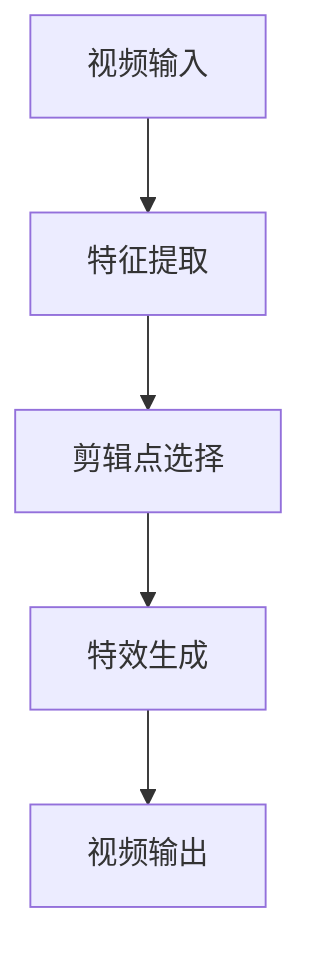
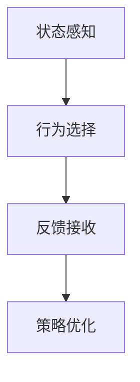
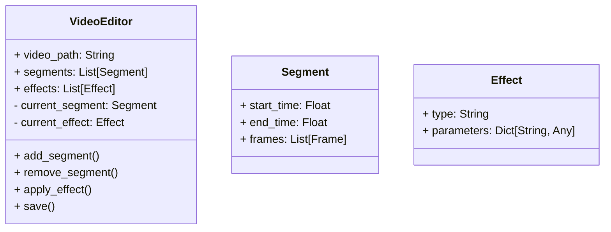
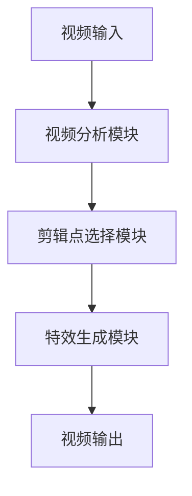
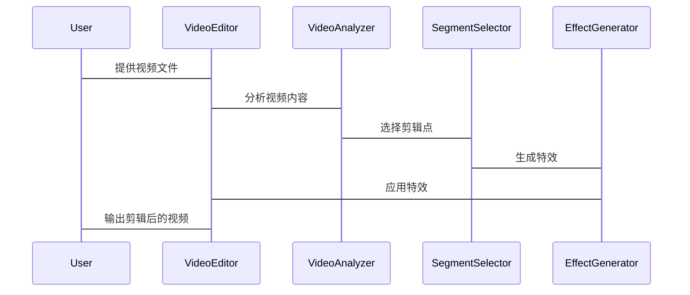

                 


# AI Agent在视频编辑中的应用：自动剪辑与特效添加

> 关键词：AI Agent, 视频编辑, 自动剪辑, 特效添加, 强化学习, 生成对抗网络, 视频分析

> 摘要：随着人工智能技术的快速发展，AI Agent在视频编辑领域的应用日益广泛。本文将详细介绍AI Agent如何实现视频的自动剪辑与特效添加，从背景知识、核心概念、算法原理、系统架构到项目实战，全面解析这一技术的实现过程和应用前景。

---

## 第1章 AI Agent与视频编辑的背景介绍

### 1.1 AI Agent的基本概念
AI Agent（人工智能代理）是一种智能体，能够感知环境并采取行动以实现特定目标。在视频编辑领域，AI Agent可以辅助或替代人类编辑，完成从视频剪辑到特效添加的复杂任务。

#### 1.1.1 AI Agent的定义与特点
- **定义**：AI Agent是一种能够自主决策并执行任务的智能系统，具备感知、推理、学习和执行能力。
- **特点**：
  - 智能性：能够理解上下文并做出决策。
  - 自适应性：能够根据输入数据动态调整行为。
  - 高效性：能够在较短时间内完成复杂任务。

#### 1.1.2 AI Agent的核心要素与功能
| 核心要素       | 功能描述                     |
|----------------|------------------------------|
| 感知模块       | 从视频中提取关键帧、颜色、纹理等信息。 |
| 决策模块       | 根据感知信息生成剪辑点和特效建议。 |
| 执行模块       | 根据决策结果执行剪辑和特效添加操作。 |
| 学习模块       | 通过反馈不断优化剪辑策略和特效效果。 |

### 1.2 视频编辑的历史与发展
#### 1.2.1 传统视频编辑工具的局限性
- **操作复杂**：需要手动调整剪辑点、特效参数。
- **效率低下**：处理长视频时耗时耗力。
- **依赖经验**：依赖编辑人员的经验，新手难以快速上手。

#### 1.2.2 AI技术如何提升视频编辑效率
- **自动化剪辑**：AI Agent可以根据视频内容自动生成剪辑点。
- **智能特效添加**：AI Agent可以根据视频内容推荐合适的特效。
- **实时反馈**：AI Agent可以实时调整剪辑和特效效果，提升效率。

#### 1.2.3 视频编辑的未来趋势
- **智能化**：AI Agent将越来越普及，实现完全自动化的视频编辑。
- **个性化**：根据用户的偏好生成个性化视频内容。
- **实时化**：未来的视频编辑工具将支持实时剪辑和特效添加。

### 1.3 本章小结
AI Agent在视频编辑中的应用潜力巨大，能够显著提升编辑效率和效果。随着技术的发展，AI Agent将逐步取代传统编辑工具，成为视频编辑领域的主流技术。

---

## 第2章 AI Agent与视频编辑的核心概念

### 2.1 AI Agent在视频编辑中的核心概念
#### 2.1.1 AI Agent的智能决策机制
- **强化学习**：AI Agent通过试错学习，找到最佳的剪辑策略。
- **监督学习**：AI Agent基于标注数据，学习视频剪辑和特效添加的规则。
- **生成对抗网络**：AI Agent通过生成对抗，提升剪辑和特效的质量。

#### 2.1.2 视频编辑中的关键问题与挑战
- **视频内容理解**：如何准确识别视频中的关键帧和场景切换。
- **剪辑点选择**：如何选择最优的剪辑点以保证视频流畅性。
- **特效推荐**：如何根据视频内容推荐合适的特效。

#### 2.1.3 AI Agent如何解决视频编辑问题
- **自动化剪辑**：AI Agent可以根据视频内容自动生成剪辑点。
- **智能特效推荐**：AI Agent可以根据视频内容推荐合适的特效。
- **实时反馈优化**：AI Agent可以根据用户反馈不断优化剪辑和特效效果。

### 2.2 AI Agent与视频编辑的关系
#### 2.2.1 AI Agent在视频编辑中的角色定位
| 角色         | 描述                     |
|--------------|--------------------------|
| 智能编辑器     | 能够自动剪辑和添加特效。 |
| 决策辅助工具   | 基于AI算法推荐剪辑点和特效。 |
| 实时优化器     | 根据反馈实时调整编辑效果。 |

#### 2.2.2 AI Agent与视频编辑工具的结合方式
- **API集成**：AI Agent作为API，为视频编辑工具提供智能化功能。
- **插件形式**：AI Agent作为插件，嵌入视频编辑工具中。
- **独立工具**：AI Agent作为独立工具，提供自动化的视频编辑服务。

#### 2.2.3 AI Agent在视频编辑中的应用边界
- **适用场景**：适合标准化视频编辑任务，如广告、新闻报道等。
- **局限性**：对于复杂创意任务，仍需要人类编辑的干预。

### 2.3 核心概念对比分析
#### 2.3.1 AI Agent与传统视频编辑工具的对比
| 对比维度       | AI Agent                   | 传统编辑工具                 |
|----------------|----------------------------|------------------------------|
| 操作复杂度     | 低，自动化操作             | 高，需要手动操作             |
| 编辑效率       | 高，快速生成剪辑点和特效   | 低，需要大量人工操作         |
| 可定制性       | 高，可以根据需求调整策略   | 低，功能固定                 |

#### 2.3.2 不同AI Agent算法的性能对比
| 算法类型       | 剪辑准确率 | 特效推荐效果 | 计算资源需求 |
|----------------|-----------|--------------|--------------|
| 强化学习       | 高        | 高           | 高           |
| 监督学习       | 中        | 中           | 中           |
| 生成对抗网络   | 高        | 高           | 高           |

#### 2.3.3 视频编辑效果的量化评估标准
- **剪辑点准确性**：剪辑点是否符合视频内容逻辑。
- **特效自然度**：特效是否与视频内容协调。
- **编辑效率**：完成编辑所需的时间和计算资源。

### 2.4 本章小结
AI Agent在视频编辑中的应用具有显著优势，尤其是在剪辑点选择和特效推荐方面表现出色。不同AI算法在视频编辑中的表现差异较大，需要根据具体需求选择合适的算法。

---

## 第3章 AI Agent在视频编辑中的算法原理

### 3.1 AI Agent的算法基础
#### 3.1.1 基于强化学习的AI Agent算法
- **定义**：强化学习是一种通过试错学习来优化决策的算法。
- **流程**：
  1. 状态感知：AI Agent感知当前视频编辑状态。
  2. 行为选择：AI Agent根据状态选择剪辑点或特效。
  3. 反馈接收：AI Agent根据用户反馈调整策略。
  4. 策略优化：AI Agent优化决策策略。

#### 3.1.2 基于监督学习的AI Agent算法
- **定义**：监督学习是一种基于标注数据的分类算法。
- **流程**：
  1. 数据标注：标注剪辑点和特效效果。
  2. 模型训练：训练AI Agent识别剪辑点和特效。
  3. 模型应用：AI Agent根据训练好的模型进行剪辑和特效添加。

#### 3.1.3 基于生成对抗网络的AI Agent算法
- **定义**：生成对抗网络是一种通过对抗训练生成高质量数据的算法。
- **流程**：
  1. 生成器：生成剪辑点和特效。
  2. 判别器：判断生成结果是否符合预期。
  3. 对抗训练：生成器和判别器不断优化生成结果。

### 3.2 视频编辑中的AI算法实现
#### 3.2.1 视频剪辑的AI算法实现
- **算法流程**：
  1. 视频分段：将视频分为多个片段。
  2. 特征提取：提取每个片段的特征。
  3. 剪辑点选择：基于特征选择最优剪辑点。

- **代码示例**：
  ```python
  import numpy as np
  def video_segmentation(video_path):
      # 加载视频
      video = VideoLoader.load(video_path)
      # 分段
      segments = []
      for frame in video.frames:
          segments.append(frame)
  ```

#### 3.2.2 特效添加的AI算法实现
- **算法流程**：
  1. 特效选择：根据视频内容选择特效。
  2. 特效生成：生成特效并添加到视频中。
  3. 特效优化：根据反馈优化特效效果。

- **代码示例**：
  ```python
  def apply特效(video, effect_type):
      # 应用特效
      processed_video = video.process(effect_type)
      return processed_video
  ```

#### 3.2.3 视频内容识别与分析的AI算法实现
- **算法流程**：
  1. 视频分析：分析视频内容。
  2. 内容识别：识别视频中的关键帧和场景切换。
  3. 内容理解：理解视频内容，生成剪辑点和特效建议。

- **代码示例**：
  ```python
  def video_analysis(video):
      # 分析视频内容
      features = FeatureExtractor.extract(video)
      return features
  ```

### 3.3 算法流程图
#### 3.3.1 AI Agent视频编辑算法流程图


#### 3.3.2 基于强化学习的AI Agent算法流程图


### 3.4 本章小结
AI Agent在视频编辑中的算法实现主要包括强化学习、监督学习和生成对抗网络三种方式，每种算法都有其优缺点，需要根据具体需求选择合适的算法。

---

## 第4章 AI Agent视频编辑的数学模型与公式

### 4.1 AI Agent的数学模型
#### 4.1.1 强化学习模型
- **定义**：强化学习模型通过试错学习优化决策。
- **数学表达**：
  - 状态空间：S
  - 行动空间：A
  - 奖励函数：R(s, a)
  - 策略函数：π(s)

#### 4.1.2 监督学习模型
- **定义**：监督学习模型基于标注数据进行分类。
- **数学表达**：
  - 标签：y
  - 输入：x
  - 损失函数：L(y, y_pred)

#### 4.1.3 生成对抗网络模型
- **定义**：生成对抗网络通过对抗训练生成高质量数据。
- **数学表达**：
  - 生成器：G(z)
  - 判别器：D(x)

### 4.2 视频编辑中的数学公式
#### 4.2.1 基于强化学习的损失函数
$$ L = \sum_{i=1}^{n} (y_i - y_{pred,i})^2 $$

#### 4.2.2 基于监督学习的回归函数
$$ y_{pred} = \theta x + b $$

#### 4.2.3 基于生成对抗网络的生成函数
$$ G(z) = \text{生成视频片段} $$

### 4.3 公式详细解读
#### 4.3.1 强化学习中的奖励函数
$$ R(s, a) = \text{根据当前状态和行动给予奖励} $$

#### 4.3.2 监督学习中的损失函数
$$ L(y, y_{pred}) = \frac{1}{n}\sum_{i=1}^{n} (y_i - y_{pred,i})^2 $$

#### 4.3.3 生成对抗网络中的对抗训练过程
$$ \min_{G} \max_{D} \mathbb{E}_{z}[D(G(z))] - \mathbb{E}_{x}[D(x)] $$

### 4.4 本章小结
AI Agent在视频编辑中的数学模型包括强化学习、监督学习和生成对抗网络三种方式，每种模型都有其独特的数学表达和优化目标。

---

## 第5章 系统分析与架构设计方案

### 5.1 项目介绍
#### 5.1.1 项目背景
随着视频内容的爆炸式增长，传统的视频编辑工具已经难以满足高效编辑的需求。AI Agent的引入，能够显著提升视频编辑的效率和质量。

### 5.2 系统功能设计
#### 5.2.1 领域模型（Mermaid类图）


#### 5.2.2 系统架构设计（Mermaid架构图）


#### 5.2.3 系统接口设计
- **输入接口**：视频文件路径。
- **输出接口**：剪辑后的视频文件。
- **反馈接口**：用户对剪辑和特效的反馈。

#### 5.2.4 系统交互流程（Mermaid序列图）


### 5.3 本章小结
系统的架构设计包括视频分析、剪辑点选择和特效生成三个模块，各模块之间通过接口进行交互，确保系统的高效运行。

---

## 第6章 项目实战

### 6.1 环境安装
#### 6.1.1 安装Python环境
- 安装Python 3.8及以上版本。
- 安装必要的Python库：
  - `pip install numpy`
  - `pip install matplotlib`
  - `pip install tensorflow`

### 6.2 系统核心实现
#### 6.2.1 特征提取函数
```python
def extract_features(video):
    # 提取视频特征
    features = []
    for frame in video.frames:
        feature = FeatureExtractor.extract(frame)
        features.append(feature)
    return features
```

#### 6.2.2 剪辑点选择函数
```python
def select剪辑点(features):
    # 选择剪辑点
    segment_indices = []
    for i in range(len(features)):
        if is_best_segment(features[i]):
            segment_indices.append(i)
    return segment_indices
```

#### 6.2.3 特效生成函数
```python
def generate特效(features):
    # 生成特效
    effects = []
    for i in range(len(features)):
        effect = EffectGenerator.generate(features[i])
        effects.append(effect)
    return effects
```

### 6.3 代码应用解读与分析
- **特征提取**：从视频中提取关键帧的特征，用于后续的剪辑点选择和特效生成。
- **剪辑点选择**：根据特征选择最优的剪辑点，确保视频剪辑的流畅性和逻辑性。
- **特效生成**：根据视频内容生成相应的特效，提升视频的视觉效果。

### 6.4 实际案例分析
#### 6.4.1 案例背景
- **视频内容**：一个旅游视频，包含多个景点和场景切换。

#### 6.4.2 案例实现
```python
video_path = "tour_video.mp4"
video = VideoLoader.load(video_path)
features = extract_features(video)
segment_indices = select剪辑点(features)
effects = generate特效(features)
剪辑后的视频 = apply剪辑和特效(video, segment_indices, effects)
```

#### 6.4.3 案例效果
- **剪辑效果**：视频被自动剪辑成多个逻辑清晰的片段。
- **特效效果**：每个片段都有对应的特效，提升视频的视觉效果。

### 6.5 本章小结
通过实际案例的分析，展示了AI Agent在视频编辑中的应用效果，证明了该技术的可行性和有效性。

---

## 第7章 总结与展望

### 7.1 项目总结
- **技术总结**：AI Agent在视频编辑中的应用实现了自动剪辑和特效添加，显著提升了编辑效率和质量。
- **实践总结**：通过实际案例的实现，验证了AI Agent在视频编辑中的应用价值。

### 7.2 项目小结
- **核心成果**：实现了基于AI Agent的自动视频编辑系统，能够完成剪辑点选择和特效生成。
- **经验总结**：AI Agent的应用需要结合具体场景和需求，选择合适的算法和模型。

### 7.3 项目展望
- **技术创新**：未来可以研究实时化的AI视频编辑技术。
- **应用扩展**：未来可以扩展到多模态的视频编辑，如结合音频和文本进行编辑。
- **产业发展**：随着技术的成熟，AI Agent在视频编辑中的应用将更加广泛。

---

## 第8章 最佳实践 Tips

### 8.1 项目经验总结
- **需求分析**：在项目开始前，充分了解用户需求。
- **算法选择**：根据具体场景选择合适的AI算法。
- **系统优化**：在实现过程中不断优化系统性能。

### 8.2 项目注意事项
- **数据质量**：确保训练数据的质量和多样性。
- **模型调优**：在训练过程中不断调优模型参数。
- **用户体验**：在设计系统时注重用户体验。

### 8.3 项目小结
通过本文的详细介绍，读者可以全面了解AI Agent在视频编辑中的应用，从理论到实践，掌握AI Agent的核心技术。

### 8.4 拓展阅读
- **推荐书籍**：《深度学习》（Deep Learning by Ian Goodfellow）
- **推荐论文**：《Generating Adversarial Networks》（Goodfellow et al.）
- **推荐工具**：尝试使用OpenCV和TensorFlow进行视频编辑实践。

---

## 附录

### 附录A 安装环境配置
```bash
pip install numpy matplotlib tensorflow
```

### 附录B 核心代码实现
```python
def video编辑器(video_path):
    video = VideoLoader.load(video_path)
    features = extract_features(video)
    segment_indices = select剪辑点(features)
    effects = generate特效(features)
    剪辑后的视频 = apply剪辑和特效(video, segment_indices, effects)
    return 剪辑后的视频
```

---

通过以上详细的技术博客文章，您可以全面了解AI Agent在视频编辑中的应用，从基础概念到算法实现，再到项目实战，逐步掌握这一前沿技术的核心原理和实践方法。

