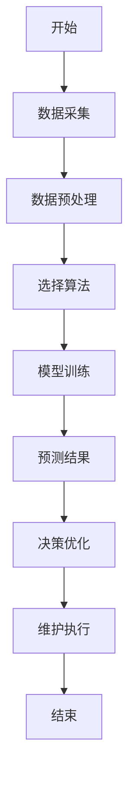
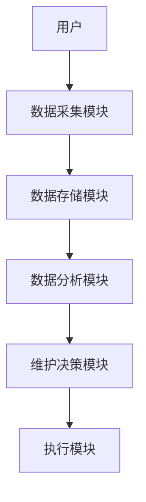
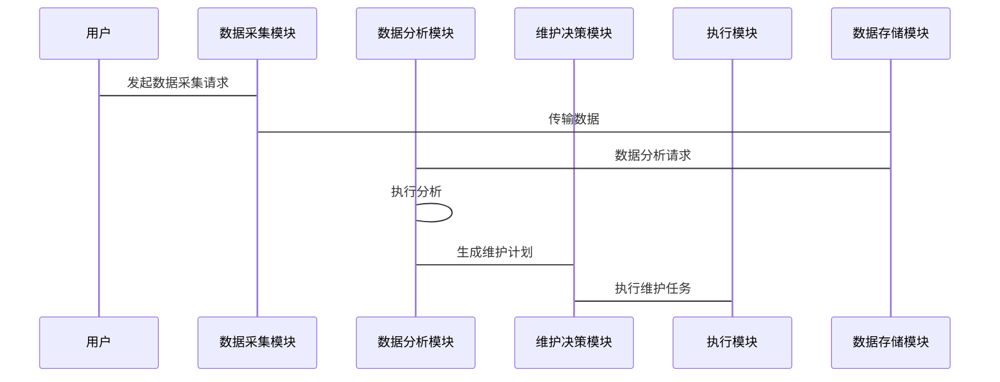

                 


# AI Agent在设备预测性维护中的应用与价值

**关键词**：AI Agent，预测性维护，设备维护，人工智能，算法原理

**摘要**：本文深入探讨了AI Agent在设备预测性维护中的应用与价值。通过分析预测性维护的核心概念、AI Agent的定义与功能、算法原理、系统架构设计以及实际项目案例，展示了AI Agent如何通过智能化的数据分析和决策优化，显著提升设备维护的效率与准确性。文章最后总结了AI Agent在预测性维护中的优势，并展望了未来的发展方向。

---

## 第1章: 预测性维护与AI Agent概述

### 1.1 预测性维护的背景与意义

#### 1.1.1 设备维护的传统模式与挑战

在传统设备维护模式中，设备维护主要依赖于定期检查和事后维修。这种模式存在以下问题：

- **高成本**：定期检查和事后维修可能导致不必要的维护成本，尤其是在设备运行状态良好的情况下。
- **低效率**：无法实时监控设备状态，导致故障发生后修复时间长，影响生产效率。
- **准确性不足**：依赖人工经验，存在主观性和不准确性。

#### 1.1.2 预测性维护的定义与特点

预测性维护是一种基于设备运行数据的分析，通过预测设备可能出现的故障，提前采取维护措施的策略。其特点包括：

- **实时性**：能够实时监控设备运行状态。
- **数据驱动**：依赖传感器数据和历史数据进行分析。
- **主动性**：能够在故障发生前采取预防措施。

#### 1.1.3 AI Agent在预测性维护中的作用与价值

AI Agent（智能体）是一种能够感知环境、自主决策并采取行动的智能系统。在预测性维护中，AI Agent能够：

- **实时数据分析**：通过传感器数据实时分析设备状态。
- **智能决策**：基于数据分析结果，自动触发维护任务。
- **优化维护策略**：通过历史数据优化维护计划，降低维护成本。

---

### 1.2 AI Agent的基本概念与分类

#### 1.2.1 AI Agent的定义与核心特征

AI Agent是一种智能系统，能够感知环境、自主决策并采取行动。其核心特征包括：

- **自主性**：能够在没有外部干预的情况下自主运行。
- **反应性**：能够实时感知环境变化并做出反应。
- **主动性**：能够主动采取行动以实现目标。

#### 1.2.2 基于规则的AI Agent与基于模型的AI Agent对比

| 特性                | 基于规则的AI Agent             | 基于模型的AI Agent             |
|---------------------|-------------------------------|-------------------------------|
| 决策方式            | 基于预设规则                   | 基于数据建模和预测             |
| 灵活性              | 较低，规则固定后难以更改       | 较高，模型可以根据数据优化     |
| 适用场景            | 简单、规则明确的场景           | 复杂、动态变化的场景           |

#### 1.2.3 AI Agent在预测性维护中的应用场景

AI Agent在预测性维护中的应用场景包括：

- **实时监控**：通过传感器数据实时监控设备状态。
- **故障预测**：基于历史数据和实时数据预测设备故障。
- **决策优化**：根据预测结果优化维护计划和策略。

---

### 1.3 本章小结

本章介绍了预测性维护的背景与意义，以及AI Agent的基本概念与分类。通过对比基于规则的AI Agent和基于模型的AI Agent，明确了AI Agent在预测性维护中的适用场景和价值。

---

## 第2章: 设备预测性维护的核心概念与AI Agent的关系

### 2.1 预测性维护的核心要素

#### 2.1.1 设备运行数据的采集与分析

设备运行数据的采集与分析是预测性维护的基础。数据来源包括：

- **传感器数据**：设备运行过程中产生的振动、温度、压力等数据。
- **历史数据**：设备的历史运行记录和维护记录。

#### 2.1.2 故障预测的数学模型与算法

故障预测的数学模型与算法是预测性维护的核心。常用的算法包括：

- **时间序列分析**：如ARIMA模型、LSTM模型。
- **异常检测**：如Isolation Forest、One-Class SVM。

#### 2.1.3 维护策略的优化与执行

维护策略的优化与执行是预测性维护的关键。优化目标包括：

- **最小化停机时间**：通过预测故障时间，提前安排维护。
- **降低维护成本**：通过优化维护计划，减少不必要的维护操作。

### 2.2 AI Agent在预测性维护中的角色与功能

#### 2.2.1 数据采集与处理的智能化

AI Agent能够通过传感器数据实时监控设备状态，并对数据进行清洗、归一化等预处理。

#### 2.2.2 故障预测的准确性提升

AI Agent通过机器学习算法对设备数据进行建模和预测，能够显著提高故障预测的准确性。

#### 2.2.3 维护决策的优化与执行

AI Agent能够根据预测结果优化维护策略，并自动触发维护任务。

### 2.3 预测性维护与AI Agent的核心概念对比表

| 特性                | 预测性维护                          | AI Agent                          |
|---------------------|------------------------------------|------------------------------------|
| 数据来源            | 传感器数据、历史数据                | 传感器数据、历史数据、外部数据    |
| 决策方式            | 人工决策、基于规则的自动化决策      | 智能化决策、自主优化               |
| 优化目标            | 最小化停机时间、降低维护成本        | 提高预测准确性、优化维护策略       |

### 2.4 实体关系图（ER图）架构

```mermaid
erDiagram
    dev_data --|{> sensor : 采集设备数据
    sensor --|{> device : 连接设备
    device --|{> maintenance_plan : 生成维护计划
    maintenance_plan --|{> ai_agent : 提供决策支持
```

### 2.5 本章小结

本章分析了预测性维护的核心要素，并探讨了AI Agent在预测性维护中的角色与功能。通过对比预测性维护与AI Agent的核心概念，明确了两者之间的关系和相互作用。

---

## 第3章: AI Agent预测性维护的算法原理

### 3.1 时间序列预测算法

#### 3.1.1 ARIMA模型原理

ARIMA（自回归积分滑动平均模型）是一种常用的时间序列预测模型。其基本原理如下：

- **自回归部分**：利用过去的误差项预测当前值。
- **滑动平均部分**：利用过去的误差项的加权平均值预测当前值。

数学公式如下：

$$ ARIMA(p, d, q) = y_t = \phi_1 y_{t-1} + \phi_2 y_{t-2} + \dots + \phi_p y_{t-p} + \theta_1 \epsilon_{t-1} + \theta_2 \epsilon_{t-2} + \dots + \theta_q \epsilon_{t-q} + \epsilon_t $$

#### 3.1.2 LSTM模型原理

LSTM（长短期记忆网络）是一种基于深度学习的时间序列预测模型。其核心在于引入记忆门控机制，能够有效捕捉时间序列中的长期依赖关系。

#### 3.1.3 算法对比与适用场景

| 模型   | 优点                              | 缺点                              | 适用场景                     |
|--------|-----------------------------------|-----------------------------------|------------------------------|
| ARIMA  | 模型简单，易于实现               | 对非线性数据拟合效果较差         | 线性时间序列数据             |
| LSTM   | 对非线性数据拟合效果好            | 模型复杂，训练时间较长           | 非线性时间序列数据           |

### 3.2 故障预测的分类算法

#### 3.2.1 基于监督学习的分类算法

基于监督学习的分类算法包括：

- **支持向量机（SVM）**：适用于小样本数据分类。
- **随机森林（Random Forest）**：适用于高维数据分类。

#### 3.2.2 基于无监督学习的异常检测算法

基于无监督学习的异常检测算法包括：

- **Isolation Forest**：适用于小样本异常检测。
- **One-Class SVM**：适用于高维数据异常检测。

### 3.3 基于AI Agent的预测性维护算法流程图



### 3.4 算法实现的Python代码示例

```python
import numpy as np
from sklearn.ensemble import IsolationForest

# 示例数据
X = np.random.randn(100, 1)
outliers_fraction = 0.05

# 训练模型
model = IsolationForest(contamination=outliers_fraction)
model.fit(X)

# 预测异常点
y_pred = model.predict(X)
print(y_pred)
```

### 3.5 本章小结

本章详细讲解了AI Agent预测性维护的算法原理，包括时间序列预测算法和故障预测分类算法。通过对比不同算法的优缺点，明确了不同场景下的适用算法，并通过流程图和代码示例展示了算法实现过程。

---

## 第4章: 设备预测性维护的系统分析与架构设计

### 4.1 系统应用场景与目标

#### 4.1.1 预测性维护的典型应用场景

- **制造业**：设备运行状态监测与维护。
- **能源行业**：发电设备的预测性维护。
- **物流行业**：运输设备的预测性维护。

#### 4.1.2 系统目标与功能需求

系统目标：实现设备的实时监控、故障预测和智能维护。

功能需求：

- 数据采集与传输。
- 数据分析与预测。
- 维护决策与执行。

### 4.2 系统功能设计

#### 4.2.1 数据采集模块

- 传感器数据采集。
- 数据传输到云端。

#### 4.2.2 数据分析模块

- 数据预处理。
- 模型训练与预测。

#### 4.2.3 维护决策模块

- 根据预测结果生成维护计划。
- 自动触发维护任务。

### 4.3 系统架构设计



### 4.4 系统接口设计

- 数据采集接口：与传感器设备对接。
- 数据分析接口：与模型训练模块对接。
- 维护决策接口：与维护执行模块对接。

### 4.5 系统交互流程图



### 4.6 本章小结

本章分析了设备预测性维护的系统应用场景，并设计了系统的功能模块、架构和接口。通过系统架构图和交互流程图展示了系统的整体设计。

---

## 第5章: 项目实战

### 5.1 项目背景与目标

#### 5.1.1 项目背景

本项目旨在通过AI Agent实现设备的预测性维护，降低设备故障率，提高生产效率。

#### 5.1.2 项目目标

- 实现设备运行数据的实时采集与分析。
- 基于机器学习算法实现故障预测。
- 优化维护策略，降低维护成本。

### 5.2 项目实施步骤

#### 5.2.1 环境搭建

- 安装Python、TensorFlow、Scikit-learn等工具。

#### 5.2.2 数据采集与预处理

- 采集设备传感器数据。
- 数据清洗与归一化处理。

#### 5.2.3 模型训练与部署

- 选择合适的算法进行模型训练。
- 部署模型到生产环境。

#### 5.2.4 系统集成与测试

- 集成各个功能模块。
- 进行系统测试与优化。

### 5.3 核心代码实现

#### 5.3.1 数据预处理代码

```python
import pandas as pd

# 读取数据
data = pd.read_csv('data.csv')

# 数据清洗
data.dropna(inplace=True)

# 数据归一化
from sklearn.preprocessing import StandardScaler
scaler = StandardScaler()
data_scaled = scaler.fit_transform(data)
```

#### 5.3.2 模型训练代码

```python
from sklearn.ensemble import IsolationForest

# 训练模型
model = IsolationForest()
model.fit(data_scaled)

# 预测异常点
y_pred = model.predict(data_scaled)
```

#### 5.3.3 维护决策代码

```python
def generate_maintenance_plan(y_pred):
    # 根据预测结果生成维护计划
    if y_pred == -1:
        return "需要维护"
    else:
        return "无需维护"
```

### 5.4 案例分析与结果解读

#### 5.4.1 数据分析结果

通过Isolation Forest算法，模型能够准确识别设备的异常状态，预测故障的发生。

#### 5.4.2 维护决策结果

根据预测结果，系统能够自动触发维护任务，显著降低设备故障率。

### 5.5 项目小结

本章通过一个实际项目展示了AI Agent在设备预测性维护中的应用。通过数据预处理、模型训练和系统集成，实现了设备的实时监控和智能维护。

---

## 第6章: 总结与展望

### 6.1 本章总结

本文详细探讨了AI Agent在设备预测性维护中的应用与价值。通过分析预测性维护的核心概念、AI Agent的定义与功能、算法原理、系统架构设计以及实际项目案例，展示了AI Agent如何通过智能化的数据分析和决策优化，显著提升设备维护的效率与准确性。

### 6.2 未来展望

未来，随着人工智能技术的不断发展，AI Agent在设备预测性维护中的应用将更加广泛和深入。以下是未来可能的发展方向：

- **更复杂的模型**：如图神经网络、强化学习等，将进一步提升预测的准确性。
- **多设备协同**：通过物联网技术实现多设备的协同维护。
- **自适应优化**：AI Agent能够根据环境变化自适应优化维护策略。

### 6.3 最佳实践 Tips

- **数据质量**：数据预处理是预测性维护的基础，确保数据的准确性和完整性。
- **模型选择**：根据具体场景选择合适的算法，避免盲目追求复杂模型。
- **系统集成**：系统设计要注重模块化和可扩展性，方便后续优化和维护。

### 6.4 本章小结

本文总结了AI Agent在设备预测性维护中的应用价值，并展望了未来的发展方向。通过最佳实践 Tips，为读者提供了宝贵的建议。

---

**总结**：本文系统地探讨了AI Agent在设备预测性维护中的应用与价值，从理论到实践，全面分析了AI Agent如何通过智能化的数据分析和决策优化，显著提升设备维护的效率与准确性。未来，随着人工智能技术的不断发展，AI Agent在设备预测性维护中的应用将更加广泛和深入。

