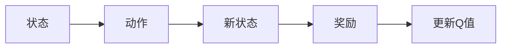
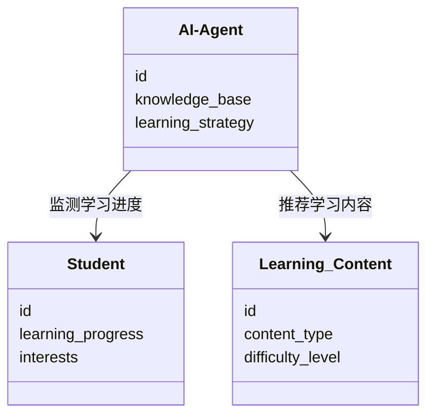
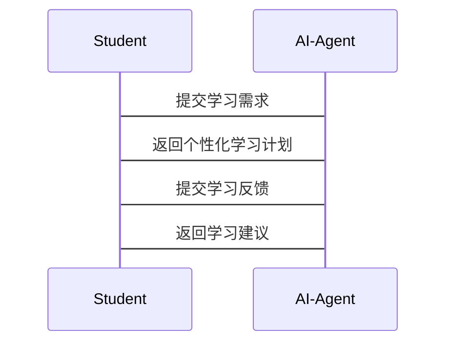

                 


# AI Agent在语言学习中的个性化教学

## 关键词：
AI Agent、个性化教学、自然语言处理、强化学习、自适应学习

## 摘要：
随着人工智能技术的飞速发展，AI Agent（人工智能代理）在教育领域的应用越来越广泛，尤其是在语言学习中的个性化教学方面。本文将深入探讨AI Agent在语言学习中的核心原理、系统架构以及实际应用。通过分析强化学习算法、自然语言处理技术以及自适应推荐系统的实现，本文旨在为教育科技领域的开发者和研究者提供一份详实的技术指南，帮助他们更好地理解并应用AI Agent技术来实现语言学习的个性化教学。

---

# 第一部分: AI Agent与语言学习的背景与基础

## 第1章: AI Agent的基本概念与核心原理

### 1.1 AI Agent的定义与特点
#### 1.1.1 AI Agent的定义
AI Agent（人工智能代理）是一种能够感知环境并采取行动以实现目标的智能实体。它能够通过与用户交互、分析数据以及学习优化自身的决策过程，从而提供个性化的服务。

#### 1.1.2 AI Agent的核心特点
- **自主性**：AI Agent能够独立决策和行动。
- **反应性**：能够实时感知环境变化并做出反应。
- **学习能力**：通过数据和反馈不断优化自身的算法。
- **适应性**：能够根据用户需求动态调整其行为。

#### 1.1.3 AI Agent与传统AI的区别
| 特性 | 传统AI | AI Agent |
|------|---------|----------|
| 决策方式 | 预先编程 | 自主决策 |
| 交互能力 | 单向输出 | 双向交互 |
| 适应性 | 固定模式 | 动态调整 |

---

### 1.2 语言学习中的个性化教学需求
#### 1.2.1 传统语言教学的局限性
传统语言教学往往采用统一的教学方式，难以满足不同学生的个性化需求。例如，有些学生可能在语法理解上有困难，而另一些学生则可能在听力或口语能力上较弱。

#### 1.2.2 个性化学习的需求分析
个性化学习需要根据每个学生的学习进度、兴趣和能力差异，提供定制化的教学内容和学习路径。这要求教学系统能够实时分析学生的行为数据，并动态调整教学策略。

#### 1.2.3 AI Agent在语言学习中的优势
AI Agent能够通过自然语言处理技术理解学生的需求，并通过强化学习算法优化教学策略。例如，AI Agent可以实时分析学生的对话内容，识别其语言错误，并提供个性化的纠错建议。

---

## 第2章: AI Agent的核心原理与技术

### 2.1 AI Agent的核心原理
#### 2.1.1 强化学习原理
强化学习是一种通过试错机制来优化决策策略的算法。AI Agent通过与环境的交互，不断尝试不同的动作，以获得最大的累积奖励。

#### 2.1.2 监督学习原理
监督学习是一种基于标注数据的训练方法。AI Agent通过学习大量标注的训练数据，逐步优化其预测能力。

#### 2.1.3 无监督学习原理
无监督学习是一种基于未标注数据的训练方法。AI Agent通过发现数据中的模式和结构，自动归纳出规律。

#### 2.1.4 强化学习与监督学习的结合
在语言学习中，AI Agent通常结合强化学习和监督学习。例如，AI Agent可以通过监督学习预训练语法模型，再通过强化学习优化其对话生成策略。

---

### 2.2 自然语言处理技术
#### 2.2.1 词嵌入与上下文理解
词嵌入（Word Embedding）是一种将词语表示为低维向量的技术。通过词嵌入，AI Agent可以理解词语的上下文关系。例如，使用Word2Vec模型生成词向量。

#### 2.2.2 语法分析与语义理解
语法分析（Syntactic Parsing）是将自然语言句子分解为语法结构的过程。语义理解（Semantic Understanding）则是理解句子的含义和意图。

#### 2.2.3 对话生成模型
对话生成模型（Dialogue Generation Model）是AI Agent实现人机交互的核心技术。常用的对话生成模型包括基于规则的模型和基于深度学习的模型。

---

### 2.3 个性化推荐算法
#### 2.3.1 基于协同过滤的推荐
协同过滤（Collaborative Filtering）是一种基于用户行为相似性的推荐算法。AI Agent可以通过分析多个用户的学习行为，推荐适合当前用户的学习内容。

#### 2.3.2 基于内容的推荐
基于内容的推荐（Content-Based Recommendation）是一种基于内容特征的推荐算法。AI Agent可以根据学习内容的特征（如难度、主题等）推荐适合用户的学习材料。

#### 2.3.3 混合推荐算法
混合推荐算法（Hybrid Recommendation Algorithm）是结合多种推荐策略的算法。AI Agent可以通过混合协同过滤和内容推荐，提供更精准的个性化推荐。

---

## 第3章: AI Agent在语言学习中的系统架构

### 3.1 系统架构设计
#### 3.1.1 分层架构
分层架构是一种将系统划分为多个层次的架构设计。AI Agent的语言学习系统通常包括数据层、算法层和应用层。

#### 3.1.2 微服务架构
微服务架构是一种将系统功能分解为多个独立服务的架构设计。AI Agent的语言学习系统可以通过微服务实现模块化设计。

#### 3.1.3 数据驱动架构
数据驱动架构是一种以数据为中心的架构设计。AI Agent的语言学习系统可以通过数据驱动优化其决策策略。

---

### 3.2 系统功能模块
#### 3.2.1 知识图谱构建
知识图谱（Knowledge Graph）是一种将知识表示为图数据的结构。AI Agent可以通过构建语言知识图谱，实现对语言知识的深度理解。

#### 3.2.2 自适应学习路径
自适应学习路径（Adaptive Learning Path）是一种根据学生学习情况动态调整学习路径的技术。AI Agent可以根据学生的学习进度和能力，推荐适合的学习内容。

#### 3.2.3 实时反馈与纠错
实时反馈与纠错（Real-time Feedback and Error Correction）是一种根据学生输入实时提供反馈的技术。AI Agent可以通过自然语言处理技术，实时分析学生的语言输入，并提供个性化的纠错建议。

---

### 3.3 系统交互流程
#### 3.3.1 用户需求分析
用户需求分析是AI Agent实现个性化教学的第一步。AI Agent需要通过与用户的交互，了解用户的学习目标和能力水平。

#### 3.3.2 系统响应策略
系统响应策略是AI Agent根据用户需求生成响应的过程。AI Agent可以通过强化学习算法，优化其响应策略。

#### 3.3.3 个性化反馈机制
个性化反馈机制是AI Agent根据用户行为生成反馈的过程。AI Agent可以通过实时分析用户行为，动态调整其反馈内容。

---

# 第二部分: AI Agent的算法原理与数学模型

## 第4章: 强化学习算法原理

### 4.1 强化学习的基本概念
#### 4.1.1 状态、动作、奖励的定义
- **状态（State）**：AI Agent所处的环境状态。
- **动作（Action）**：AI Agent在特定状态下采取的行动。
- **奖励（Reward）**：AI Agent采取动作后获得的反馈。

#### 4.1.2 Q-learning算法
Q-learning是一种基于值函数的强化学习算法。Q-learning通过更新Q值表，优化其决策策略。

#### 4.1.3 Deep Q-Networks (DQN)
Deep Q-Networks是一种基于深度神经网络的强化学习算法。DQN通过神经网络近似Q值函数，实现端到端的强化学习。

---

### 4.2 算法流程图


---

### 4.3 数学模型
#### Q-learning公式：
$$ Q(s, a) = Q(s, a) + \alpha (r + \max Q(s', a') - Q(s, a)) $$

---

## 第5章: 自然语言处理中的数学模型

### 5.1 词嵌入模型
#### Word2Vec模型
Word2Vec是一种常用的词嵌入模型。通过Word2Vec模型，可以将词语表示为低维向量。

---

### 5.2 语法分析与语义理解
#### 语法分析模型
语法分析模型可以通过上下文无关文法（Context-Free Grammar, CFG）进行语法分析。

#### 语义理解模型
语义理解模型可以通过词义网络（Semantic Network）进行语义分析。

---

## 第6章: 个性化推荐算法的数学模型

### 6.1 协同过滤算法
#### 基于用户的协同过滤
基于用户的协同过滤（User-based Collaborative Filtering）是一种通过用户相似性推荐内容的算法。

#### 基于物品的协同过滤
基于物品的协同过滤（Item-based Collaborative Filtering）是一种通过物品相似性推荐内容的算法。

---

### 6.2 混合推荐算法
混合推荐算法是一种结合多种推荐策略的算法。例如，可以通过加权融合协同过滤和内容推荐，实现更精准的个性化推荐。

---

# 第三部分: AI Agent的系统分析与架构设计方案

## 第7章: 系统分析与架构设计方案

### 7.1 问题场景介绍
语言学习中的个性化教学需要解决以下问题：
- 如何根据学生的学习情况动态调整教学策略。
- 如何通过自然语言处理技术实现人机交互。
- 如何通过强化学习优化教学效果。

### 7.2 系统功能设计
#### 7.2.1 领域模型


#### 7.2.2 系统架构
```mermaid
container 教学系统 {
    component 数据层 {
        module 知识图谱
        module 用户数据
    }
    component 算法层 {
        module 强化学习
        module 自然语言处理
    }
    component 应用层 {
        module 个性化推荐
        module 实时反馈
    }
}
```

#### 7.2.3 系统接口设计
- **API接口**：
  - `POST /api/learning_progress`：提交学习进度数据。
  - `GET /api/recommend_content`：获取推荐学习内容。
  - `POST /api/error_correction`：提交纠错请求。

#### 7.2.4 系统交互流程


---

# 第四部分: 项目实战与最佳实践

## 第8章: 项目实战

### 8.1 环境安装
- **Python 3.8+**
- **TensorFlow 2.0+**
- **NLTK库**
- **Scikit-learn库**

### 8.2 系统核心实现源代码

#### 8.2.1 加载数据
```python
import numpy as np
from sklearn.model_selection import train_test_split
from sklearn.feature_extraction.text import TfidfVectorizer
from sklearn.svm import SVC
```

#### 8.2.2 训练模型
```python
vectorizer = TfidfVectorizer(max_features=5000)
X = vectorizer.fit_transform(text_data)
y = labels
X_train, X_test, y_train, y_test = train_test_split(X, y, test_size=0.2)
model = SVC()
model.fit(X_train, y_train)
```

#### 8.2.3 个性化推荐
```python
def get_recommendations(user_id):
    user_profile = get_user_profile(user_id)
    recommended_content = recommend_content(user_profile)
    return recommended_content
```

### 8.3 代码应用解读与分析
通过上述代码，AI Agent可以根据用户的学习需求，动态调整其推荐策略。例如，AI Agent可以通过监督学习训练语法模型，再通过强化学习优化对话生成策略。

---

## 第9章: 最佳实践 tips、小结、注意事项、拓展阅读

### 9.1 tips
- 在实际应用中，建议结合强化学习和监督学习，以实现更精准的个性化推荐。
- 在系统设计中，建议采用微服务架构，以实现模块化设计。

### 9.2 小结
本文详细介绍了AI Agent在语言学习中的个性化教学应用。通过分析强化学习算法、自然语言处理技术以及自适应推荐系统的实现，本文为教育科技领域的开发者和研究者提供了一份详实的技术指南。

### 9.3 注意事项
- 在实际应用中，需要注意数据隐私保护。
- 在系统设计中，需要注意系统的可扩展性和可维护性。

### 9.4 拓展阅读
- 《Deep Learning for Natural Language Processing》
- 《Reinforcement Learning: Theory and Algorithms》

---

# 结语

AI Agent在语言学习中的个性化教学应用前景广阔。通过结合强化学习、自然语言处理和个性化推荐技术，AI Agent能够为学生提供更加智能化、个性化的学习体验。未来，随着人工智能技术的不断发展，AI Agent在教育领域的应用将更加广泛和深入。

