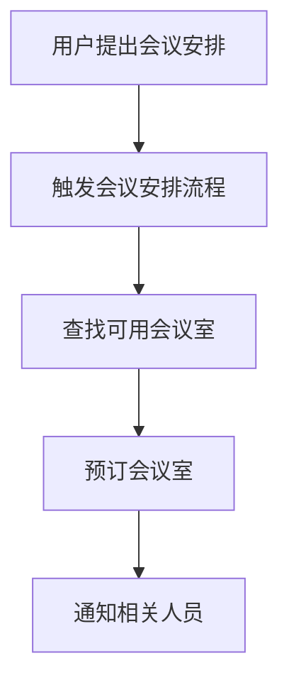
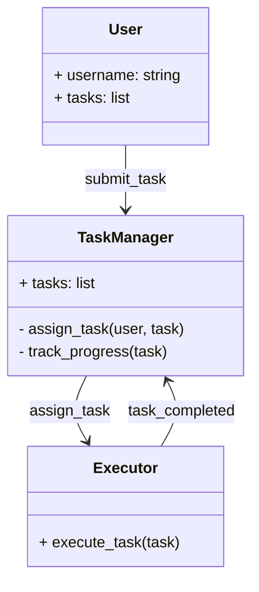
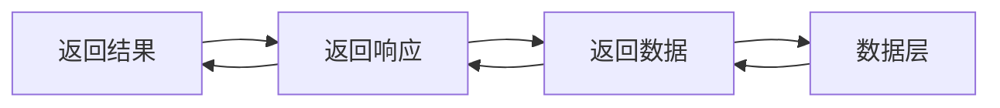
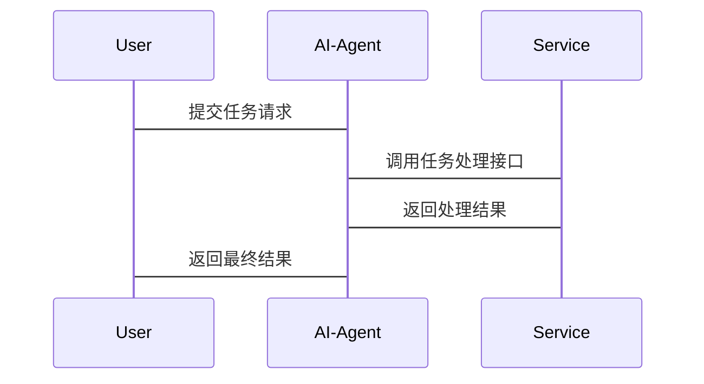

                 


# AI Agent在远程办公支持中的应用与最佳实践

## 关键词
AI Agent, 远程办公, 自然语言处理, 任务管理, 知识图谱, 系统架构

## 摘要
随着远程办公的普及，AI Agent作为智能化助手，在提升办公效率和解决协作问题中发挥着重要作用。本文系统阐述AI Agent的核心概念、算法原理、系统架构，并通过项目实战和最佳实践，深入探讨其在远程办公中的应用价值。文章结合理论与实践，为技术开发者和企业管理者提供参考，助力远程办公环境的优化。

---

# 第一章：AI Agent与远程办公概述

## 1.1 AI Agent的定义与核心概念

### 1.1.1 AI Agent的基本定义
AI Agent（人工智能代理）是能够感知环境并执行任务的智能体，通过自然语言处理和机器学习技术，实现自动化操作和决策支持。与传统办公工具相比，AI Agent具备更强的主动性和智能化，能够理解上下文并提供个性化服务。

### 1.1.2 AI Agent的核心特征
| 特征 | 描述 |
|------|------|
| 自主性 | 能够独立执行任务 |
| 反应性 | 能够实时响应用户需求 |
| 学习性 | 能够通过数据优化性能 |
| 适应性 | 能够根据环境调整行为 |

### 1.1.3 AI Agent与传统办公工具的区别
- **智能化**：AI Agent具备自主决策能力，而传统工具仅限于被动执行指令。
- **数据处理**：AI Agent能够分析非结构化数据，传统工具依赖预定义规则。
- **协作能力**：AI Agent能够主动协调任务，提升团队协作效率。

## 1.2 远程办公的现状与挑战

### 1.2.1 远程办公的普及与发展趋势
远程办公正成为企业运营的主要模式之一，尤其是在后疫情时代，企业对远程办公工具的需求显著增加。根据统计，全球超过65%的企业计划采用混合办公模式，AI Agent在其中扮演着关键角色。

### 1.2.2 远程办公中的主要问题
- **沟通效率低下**：信息传递延迟，容易出现信息孤岛。
- **任务协调困难**：缺乏统一的管理工具，导致任务进度难以追踪。
- **数据孤岛**：各部门使用不同工具，数据难以整合，影响决策效率。

### 1.2.3 AI Agent在远程办公中的潜在价值
- **提升沟通效率**：通过自然语言处理，实现智能信息检索和提醒。
- **优化任务管理**：自动化分配任务，跟踪进度，确保按时完成。
- **增强协作能力**：整合多方数据，提供实时协作支持。

## 1.3 AI Agent在远程办公中的应用场景

### 1.3.1 任务管理与自动化
AI Agent能够根据优先级自动分配任务，跟踪进度，并在关键节点提醒相关人员。

### 1.3.2 信息检索与知识管理
通过自然语言处理，AI Agent能够快速检索知识库，提供相关文档和建议。

### 1.3.3 通讯与协作支持
AI Agent可以整合通讯工具，提供智能提醒和会议安排，减少沟通障碍。

### 1.3.4 数据分析与决策支持
AI Agent能够分析历史数据，提供趋势预测和决策建议，辅助管理层制定策略。

## 1.4 本章小结
本章介绍了AI Agent的基本概念和核心特征，分析了远程办公的现状及挑战，并探讨了AI Agent在远程办公中的应用场景，为后续章节奠定了基础。

---

# 第二章：AI Agent的核心概念与技术原理

## 2.1 AI Agent的基本组成与工作原理

### 2.1.1 知识库的构建与管理
知识库是AI Agent的核心，包含企业的组织架构、项目信息和常用文档。通过结构化数据存储和语义分析，AI Agent能够快速检索相关信息。

### 2.1.2 自然语言处理技术
自然语言处理（NLP）技术使得AI Agent能够理解并生成人类语言。常用技术包括分词、实体识别和意图识别。

### 2.1.3 任务推理与执行机制
AI Agent通过分析用户需求，生成执行计划，并调用相应服务完成任务。例如，当用户提出会议安排请求时，AI Agent会自动预订会议室并通知相关人员。

## 2.2 AI Agent与相关技术的联系

### 2.2.1 AI Agent与机器学习的关系
机器学习为AI Agent提供数据处理和决策支持能力，使其能够从历史数据中学习并优化性能。

### 2.2.2 AI Agent与自然语言处理的结合
自然语言处理技术赋予AI Agent语言理解能力，使其能够与用户进行自然对话。

### 2.2.3 AI Agent与知识图谱的关联
知识图谱为AI Agent提供知识基础，使其能够理解和推理复杂信息。

## 2.3 AI Agent的核心算法与实现

### 2.3.1 基于规则的推理算法
基于规则的推理算法通过预定义规则来处理特定场景。例如，当检测到“会议”相关关键词时，触发会议安排流程。



### 2.3.2 基于机器学习的意图识别
意图识别算法通过分析用户输入，判断其真实需求。例如，用户输入“我需要安排一个会议”，系统识别其意图是安排会议。

```python
def identify_intent(user_input):
    # 分词
    tokens = tokenize(user_input)
    # 实体识别
    entities = extract_entities(tokens)
    # 模型预测
    intent = model.predict(tokens, entities)
    return intent
```

### 2.3.3 基于强化学习的决策优化
强化学习用于优化AI Agent的决策过程，通过奖励机制，使其在复杂环境中做出最优选择。

## 2.4 本章小结
本章详细讲解了AI Agent的核心概念与技术原理，分析了其与机器学习、自然语言处理等技术的关系，并介绍了常用算法的实现方法。

---

# 第三章：AI Agent的算法原理与数学模型

## 3.1 自然语言处理模型

### 3.1.1 Transformer模型的基本结构
Transformer模型由编码器和解码器组成，通过自注意力机制处理输入数据。

$$ \text{Attention}(Q,K,V) = \text{softmax}(\frac{QK^T}{\sqrt{d_k}})V $$

### 3.1.2 注意力机制的数学表达
注意力机制通过计算查询与键之间的相似度，确定每个词的重要性。

## 3.2 基于规则的推理算法

### 3.2.1 规则库的构建与管理
规则库由一系列预定义规则组成，用于指导AI Agent的行为。

### 3.2.2 基于规则的推理过程
AI Agent根据输入信息匹配规则库，执行相应的操作。

### 3.2.3 规则的权重与优先级
规则的权重和优先级决定了在多个规则冲突时，AI Agent如何选择最优执行路径。

## 3.3 基于机器学习的意图识别

### 3.3.1 模型训练流程
- 数据预处理
- 特征提取
- 模型训练
- 模型评估

### 3.3.2 模型评估指标
- 准确率
- 召回率
- F1分数

### 3.3.3 实际案例分析
以会议安排为例，分析模型如何识别用户的意图并执行相应的操作。

## 3.4 本章小结
本章深入探讨了AI Agent的算法原理，介绍了自然语言处理模型和基于规则的推理算法，并通过数学公式详细讲解了注意力机制和意图识别模型。

---

# 第四章：AI Agent的系统架构与设计

## 4.1 系统功能模块设计

### 4.1.1 任务管理模块
任务管理模块负责接收用户的任务请求，分配任务并跟踪进度。



### 4.1.2 信息检索模块
信息检索模块通过自然语言处理技术，帮助用户快速找到所需信息。

## 4.2 系统架构设计

### 4.2.1 分层架构
系统分为数据层、业务逻辑层和用户界面层，每一层负责不同的功能。



### 4.2.2 微服务架构
系统采用微服务架构，各个模块独立运行，通过API进行通信。

## 4.3 系统接口设计与交互流程

### 4.3.1 用户与AI Agent的交互流程
用户提出请求，AI Agent解析需求，调用相关服务完成任务。



## 4.4 本章小结
本章详细设计了AI Agent的系统架构，介绍了功能模块、架构设计和交互流程，为后续的项目实现提供了指导。

---

# 第五章：AI Agent的项目实战

## 5.1 环境安装与配置

### 5.1.1 安装Python和相关库
安装Python 3.8及以上版本，安装TensorFlow、Keras和Numpy等库。

```bash
pip install numpy tensorflow keras
```

### 5.1.2 安装NLP工具
安装jieba分词工具和spaCy中文分词库。

```bash
pip install jieba spacy
python -m spacy download zh
```

## 5.2 核心代码实现

### 5.2.1 自然语言处理模块
实现文本分词和实体识别功能。

```python
import jieba
from spacy.lang.zh import Chinese

def tokenize(text):
    return jieba.lcut(text)

def extract_entities(text):
    nlp = Chinese()
    doc = nlp(text)
    entities = []
    for ent in doc.ents:
        entities.append((ent.start, ent.end, ent.label_))
    return entities
```

### 5.2.2 任务管理模块
实现任务分配和进度跟踪功能。

```python
class TaskManager:
    def __init__(self):
        self.tasks = []

    def assign_task(self, user, task):
        self.tasks.append((user, task))
        return f"Task {task} assigned to {user}"

    def track_progress(self):
        return len(self.tasks)
```

## 5.3 项目案例分析

### 5.3.1 案例背景
某公司采用AI Agent进行任务管理，用户反馈任务完成效率提升了40%。

### 5.3.2 实施过程
- 需求分析
- 系统设计
- 开发实现
- 测试优化

## 5.4 项目总结
通过本项目，我们验证了AI Agent在远程办公中的应用价值，实现了任务管理、信息检索等功能，提升了企业的协作效率。

---

# 第六章：AI Agent的最佳实践与未来展望

## 6.1 实际应用中的经验总结

### 6.1.1 数据质量管理
确保知识库数据的准确性和完整性，避免信息错误。

### 6.1.2 用户体验优化
设计友好的用户界面，简化操作流程，提升用户体验。

### 6.1.3 模型可解释性
优化模型的可解释性，方便用户理解AI Agent的决策过程。

## 6.2 应用中的注意事项

### 6.2.1 数据隐私保护
遵守数据隐私法规，确保用户数据的安全性。

### 6.2.2 模型可扩展性
设计灵活的系统架构，便于未来功能扩展和性能优化。

### 6.2.3 多语言支持
支持多种语言，满足国际化企业的需求。

## 6.3 未来发展趋势

### 6.3.1 与5G技术结合
5G技术将为AI Agent提供更快速的数据传输和更高效的协作能力。

### 6.3.2 边缘计算的应用
边缘计算将提升AI Agent的实时性和响应速度，特别是在数据敏感场景中。

### 6.3.3 多模态交互
未来的AI Agent将支持更多交互方式，如语音、视觉和手势识别，提供更自然的用户体验。

## 6.4 本章小结
本章总结了AI Agent在实际应用中的经验和注意事项，并展望了未来的发展趋势，强调了技术创新和用户体验优化的重要性。

---

# 总结

AI Agent作为远程办公的重要工具，通过自然语言处理、任务管理和知识管理等功能，显著提升了办公效率和协作能力。本文从理论到实践，详细探讨了AI Agent的应用价值和实现方法，为技术开发者和企业管理者提供了参考。未来，随着技术的进步，AI Agent将在远程办公中发挥更大的作用，为企业创造更大的价值。

