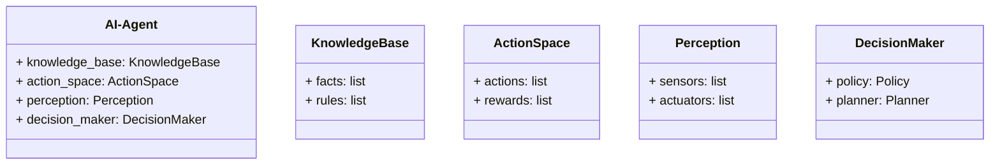
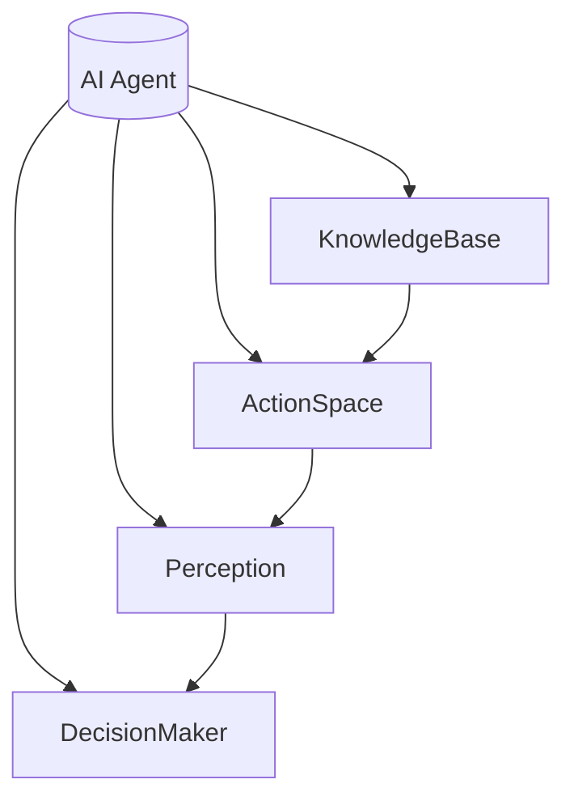

                 

# AI Agent在金融、医疗、制造业等领域的应用场景

> 关键词：AI Agent, 人工智能, 金融, 医疗, 制造业, 应用场景, 强化学习, 监督学习, 系统架构

> 摘要：本文系统地探讨了AI Agent在金融、医疗和制造业等领域的应用场景，分析了其核心概念、算法原理和系统架构，结合实际案例，详细阐述了AI Agent在不同领域的实现方法和应用价值，最后总结了AI Agent的发展趋势和未来方向。

---

# 第一部分: AI Agent概述与基础

## 第1章: AI Agent的基本概念

### 1.1 AI Agent的定义与特点
#### 1.1.1 什么是AI Agent
- AI Agent（人工智能代理）是一种能够感知环境、自主决策并执行任务的智能实体。
- AI Agent的特点包括自主性、反应性、目标导向和社交能力。
- AI Agent与传统AI的区别：AI Agent具有主动性，能够主动与环境交互。

#### 1.1.2 AI Agent的核心特点
- 自主性：AI Agent能够自主决策，无需外部干预。
- 反应性：能够实时感知环境变化并做出响应。
- 目标导向：所有行为都围绕实现特定目标展开。
- 社交能力：能够与其他系统或人类进行有效交互。

#### 1.1.3 AI Agent与传统AI的区别
| 特性       | 传统AI                | AI Agent             |
|------------|-----------------------|-----------------------|
| 智能类型    | 单一任务              | 多任务综合            |
| 决策能力    | 依赖外部指令          | 自主决策              |
| 应用场景    | 静态问题              | 动态复杂场景          |

---

### 1.2 AI Agent的类型
#### 1.2.1 知识型AI Agent
- 基于知识库进行推理和决策。
- 适用于规则明确的场景，如医疗诊断。

#### 1.2.2 数据驱动型AI Agent
- 基于大量数据进行学习和预测。
- 适用于复杂数据模式的场景，如金融交易。

#### 1.2.3 混合型AI Agent
- 结合知识和数据驱动的优势。
- 适用于需要多领域协作的场景，如智能制造。

---

### 1.3 AI Agent的应用场景
#### 1.3.1 金融领域
- 自动交易、风险评估、客户服务。
#### 1.3.2 医疗领域
- 疾病诊断、治疗方案优化、健康管理。
#### 1.3.3 制造业领域
- 生产优化、设备维护、供应链管理。

---

## 第2章: AI Agent的核心技术

### 2.1 机器学习基础
#### 2.1.1 监督学习
- 输入-输出关系的学习，适用于分类和回归任务。

#### 2.1.2 无监督学习
- 从无标签数据中发现模式，适用于聚类和降维。

#### 2.1.3 强化学习
- 通过与环境交互学习策略，适用于复杂决策问题。

---

### 2.2 自然语言处理
#### 2.2.1 NLP基础
- 词袋模型、词嵌入（如Word2Vec）。

#### 2.2.2 意图识别
- 使用序列模型（如LSTM）识别用户意图。

#### 2.2.3 文本生成
- 基于生成对抗网络（GAN）或Transformer模型生成文本。

---

### 2.3 知识图谱与推理
#### 2.3.1 知识图谱构建
- 实体识别、关系抽取、知识融合。

#### 2.3.2 逻辑推理
- 基于规则的推理和基于符号逻辑的推理。

#### 2.3.3 实例推理
- 使用知识图谱中的实例进行推理和决策。

---

## 第3章: AI Agent的算法原理

### 3.1 强化学习算法
#### 3.1.1 Q-learning算法
- 状态-动作-奖励的马尔可夫决策过程。
- 公式：$$ Q(s, a) = r + \gamma \max Q(s', a') $$

#### 3.1.2 Deep Q-Networks (DQN)
- 使用深度神经网络近似Q值函数。
- 经典案例： Atari游戏控制。

#### 3.1.3 策略梯度方法
- 直接优化策略，而非Q值。
- 公式：$$ \nabla \theta J(\theta) = \mathbb{E}[\nabla \log \pi(a|s) Q(s,a)] $$

---

### 3.2 监督学习算法
#### 3.2.1 线性回归
- 最小二乘法求解最优参数。
- 公式：$$ \theta = (X^T X)^{-1} X^T y $$

#### 3.2.2 支持向量机
- 最大间隔分类器，适用于小样本数据。

#### 3.2.3 神经网络
- 多层感知机（MLP）和卷积神经网络（CNN）。

---

### 3.3 混合型AI Agent算法
#### 3.3.1 知识驱动与数据驱动结合
- 知识图谱提供先验知识，数据驱动提供实时反馈。

#### 3.3.2 多模态数据处理
- 综合处理文本、图像、语音等多种数据类型。

#### 3.3.3 跨模型协作
- 不同模型协同工作，共同完成复杂任务。

---

## 第4章: AI Agent的系统架构

### 4.1 系统功能设计
#### 4.1.1 领域模型类图
- 使用Mermaid绘制领域模型类图，展示各模块之间的关系。

---

### 4.2 系统架构设计
#### 4.2.1 系统架构图
- 使用Mermaid绘制系统架构图，展示各模块之间的交互。

---

## 第5章: AI Agent的实现案例

### 5.1 金融领域中的AI Agent
#### 5.1.1 智能投顾系统
- 使用强化学习进行股票交易。

#### 5.1.2 风险评估模型
- 使用监督学习进行信用评分。

---

### 5.2 医疗领域中的AI Agent
#### 5.2.1 疾病诊断系统
- 使用知识图谱和逻辑推理进行诊断。

#### 5.2.2 治疗方案优化
- 使用强化学习优化治疗方案。

---

### 5.3 制造业领域中的AI Agent
#### 5.3.1 生产优化
- 使用强化学习优化生产流程。

#### 5.3.2 设备维护
- 使用监督学习预测设备故障。

---

# 第六章: 总结与展望

## 6.1 总结
- AI Agent在多个领域的广泛应用，展示了其强大的技术潜力。

## 6.2 未来展望
- 多模态AI Agent的发展趋势。
- 知识图谱与强化学习的结合。
- 高可解释性AI Agent的需求。

---

## 参考文献
- [1] Russell, S., & Norvig, P. (2010). Artificial Intelligence: A Modern Approach.
- [2] LeCun, Y., Bengio, Y., & Hinton, G. (2015). Deep Learning.
- [3] Mnih, V., et al. (2016). Deep Q-Networks.

---

通过以上目录大纲，我们可以系统地探讨AI Agent在金融、医疗和制造业等领域的应用场景，深入分析其技术原理和实现方法，结合实际案例，帮助读者全面理解AI Agent的应用价值和未来发展。

