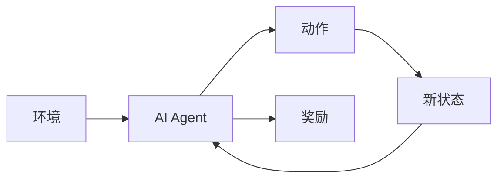
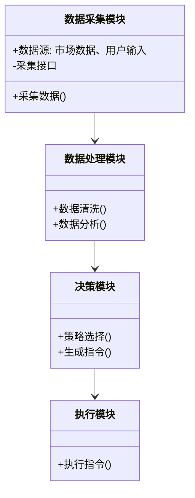
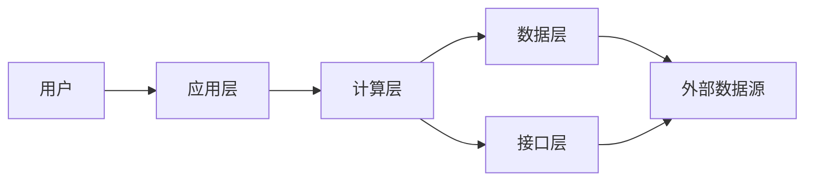

                 


# AI Agent在金融行业的创新应用

> **关键词**：AI Agent，金融行业，智能投顾，风险管理，自然语言处理，机器学习，自动化交易

> **摘要**：  
AI Agent（人工智能代理）作为一种智能化的金融工具，正在迅速改变金融行业的运作方式。本文将深入探讨AI Agent的核心技术、应用场景及其在金融行业中的创新应用。通过分析自然语言处理、机器学习等技术，结合智能投顾、风险管理、自动化交易等实际案例，本文旨在揭示AI Agent如何推动金融行业向更高效、更智能的方向发展。同时，本文将详细阐述AI Agent的系统架构设计、算法原理及项目实现，为读者提供全面而深入的技术解读。

---

## 第1章: AI Agent 的基本概念与背景

### 1.1 AI Agent 的定义与核心概念

AI Agent（人工智能代理）是指能够感知环境、自主决策并执行任务的智能实体。与传统的金融工具不同，AI Agent具有以下几个核心特征：

1. **自主性**：AI Agent能够独立执行任务，无需人工干预。
2. **反应性**：能够实时感知环境变化并做出相应的反应。
3. **学习能力**：通过机器学习算法不断优化自身的决策能力。
4. **交互性**：能够与人类或其他系统进行自然交互。

AI Agent的核心目标是通过智能化的手段，提高金融行业的效率、准确性和用户体验。

### 1.2 AI Agent 在金融行业的背景与趋势

#### 1.2.1 金融行业数字化转型的背景

随着信息技术的飞速发展，金融行业正在经历一场深刻的数字化转型。传统的人工操作模式逐渐被智能化工具取代，金融机构亟需通过技术创新来提升竞争力。

#### 1.2.2 AI 技术在金融行业的应用现状

目前，AI技术已经在金融行业的多个领域得到广泛应用，包括智能投顾、风险管理、欺诈检测等。然而，这些应用大多仍处于初级阶段，AI Agent的引入将为金融行业带来更大的变革。

#### 1.2.3 AI Agent 的创新与未来趋势

AI Agent的创新主要体现在以下几个方面：
- **智能化决策**：通过深度学习和强化学习，AI Agent能够做出更复杂的决策。
- **实时交互**：AI Agent能够与用户进行实时对话，提供个性化的金融服务。
- **自主学习**：AI Agent能够通过自我学习不断优化自身的性能。

未来，AI Agent将在金融行业的各个领域发挥更大的作用，成为金融机构的核心竞争力之一。

---

## 第2章: AI Agent 的核心技术与算法原理

### 2.1 自然语言处理与知识图谱

#### 2.1.1 自然语言处理 (NLP) 的基本原理

自然语言处理是AI Agent实现智能化交互的核心技术之一。NLP的目标是让计算机能够理解并生成人类语言。常见的NLP任务包括文本分类、情感分析、实体识别等。

**例子：**  
在金融领域，NLP可以用于分析新闻稿、公司财报等文本数据，提取关键信息并生成投资建议。

#### 2.1.2 知识图谱的构建与应用

知识图谱是一种结构化的数据表示方式，能够将分散的知识点组织成一个有机的整体。在金融行业，知识图谱可以用于构建金融知识库，支持AI Agent的智能决策。

**例子：**  
通过知识图谱，AI Agent可以快速理解一家公司的背景、行业地位及其财务状况，从而为用户提供更精准的投资建议。

### 2.2 机器学习与强化学习算法

#### 2.2.1 机器学习的基本原理

机器学习是AI Agent实现智能化决策的核心技术之一。通过训练数据，机器学习模型能够从数据中提取特征并做出预测或分类。

**数学公式：**  
线性回归的数学模型可以表示为：
$$ y = \theta_0 + \theta_1x + \epsilon $$
其中，$\theta_0$和$\theta_1$是模型的参数，$x$是输入变量，$y$是输出变量。

#### 2.2.2 强化学习的原理与应用

强化学习是一种通过试错方式优化决策的机器学习方法。在金融交易中，强化学习可以用于优化交易策略，提高投资回报率。

**算法流程图：**  


---

## 第3章: AI Agent 在金融行业的应用场景

### 3.1 智能投顾与财富管理

#### 3.1.1 智能投顾的定义与核心功能

智能投顾是一种基于AI技术的财富管理工具，能够根据用户的风险偏好和财务目标，自动配置投资组合。

**例子：**  
AI Agent可以根据用户的财务状况和投资目标，推荐最优的投资组合，并实时监控市场变化，动态调整投资策略。

### 3.2 风险管理与欺诈检测

#### 3.2.1 风险管理的核心挑战

金融行业的风险管理涉及信用风险、市场风险、操作风险等多个方面。传统的风险管理方法依赖人工判断，效率较低且容易出错。

**数学公式：**  
信用风险的评估可以使用VaR（Value at Risk）模型：
$$ VaR = \mu + z \cdot \sigma $$
其中，$\mu$是平均值，$\sigma$是标准差，$z$是标准正态分布的分位数。

#### 3.2.2 欺诈检测的技术实现

通过机器学习和NLP技术，AI Agent可以实时监控交易数据，识别潜在的欺诈行为。

**流程图：**  


### 3.3 自动化交易与市场分析

#### 3.3.1 自动化交易的定义与分类

自动化交易是指通过算法自动执行交易指令。根据交易策略的不同，自动化交易可以分为高频交易、统计套利等多种类型。

**例子：**  
AI Agent可以通过分析市场数据，快速识别套利机会，并自动执行交易指令。

---

## 第4章: AI Agent 的系统架构与实现

### 4.1 系统架构设计

#### 4.1.1 系统功能模块

AI Agent的系统架构通常包括以下几个功能模块：
- **数据采集模块**：负责采集市场数据、用户需求等信息。
- **数据处理模块**：对采集到的数据进行清洗、转换和分析。
- **决策模块**：基于分析结果，生成决策指令。
- **执行模块**：将决策指令转化为具体的交易或服务请求。

**类图：**  


#### 4.1.2 系统架构设计

AI Agent的系统架构可以分为以下几个层次：
- **数据层**：负责数据的存储和管理。
- **计算层**：负责数据的处理和分析。
- **应用层**：负责与用户或其他系统的交互。
- **接口层**：负责与其他系统的通信和数据交换。

**架构图：**  


---

## 第5章: AI Agent 的项目实战

### 5.1 环境安装与配置

为了实现AI Agent，首先需要安装以下环境：
- **Python**：推荐使用最新版本。
- **机器学习库**：如TensorFlow、PyTorch。
- **NLP库**：如spaCy、NLTK。
- **可视化工具**：如Matplotlib、Seaborn。

### 5.2 核心代码实现

以下是一个简单的AI Agent的Python实现示例：

```python
import numpy as np
from sklearn.linear_model import LinearRegression

# 数据准备
X = np.array([1, 2, 3, 4, 5])
y = np.array([2, 4, 5, 4, 5])

# 模型训练
model = LinearRegression()
model.fit(X.reshape(-1, 1), y)

# 预测
predicted = model.predict(X.reshape(-1, 1))
print(predicted)
```

### 5.3 实际案例分析

以智能投顾为例，AI Agent可以根据用户的财务状况和市场数据，推荐最优的投资组合。以下是一个简化的案例分析：

```python
# 用户需求
user_profile = {
    '风险偏好': '中等',
    '投资金额': 10000,
    '投资期限': 5
}

# 市场数据
market_data = {
    '股票': 50,
    '债券': 30,
    '基金': 20
}

# 投资建议
建议 = {
    '股票': 60,
    '债券': 30,
    '基金': 10
}

print("投资建议:", 建议)
```

---

## 第6章: 总结与展望

### 6.1 本章总结

AI Agent作为一种新兴的金融工具，正在逐步改变金融行业的运作方式。通过自然语言处理、机器学习等技术，AI Agent能够实现智能化的决策和交互，为金融机构和用户提供更高效、更精准的服务。

### 6.2 未来展望

未来，AI Agent在金融行业的应用将更加广泛和深入。随着技术的进步，AI Agent将具备更强的自主学习能力和决策能力，能够应对更复杂的金融场景。同时，AI Agent的安全性和隐私保护问题也将成为未来研究的重点。

---

### **Tips:**
- 在实际应用中，建议结合具体业务需求选择合适的AI Agent方案。
- 数据安全和隐私保护是AI Agent应用中的重要考量因素。
- 定期更新模型和算法，以适应市场的变化和用户的需求。

---

### **参考文献**
1. Goodfellow, I., Bengio, Y., & Courville, A. (2016). *Deep Learning*. MIT Press.
2. 张钹. (2018). *人工智能: 接下来十年的发展方向*. 清华大学出版社.
3. 刘洋, & 李明. (2020). *基于强化学习的金融交易系统设计*. 计算机应用研究, 37(3), 892-898.

---

通过本文的深入分析，读者可以全面了解AI Agent在金融行业的创新应用，掌握其核心技术与实现方法，并为未来的实践提供有价值的参考。

