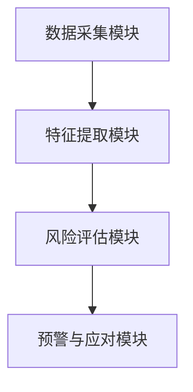

                 


# AI Agent在金融风险分析中的应用

## 关键词：AI Agent, 金融风险分析, 机器学习, 自然语言处理, 时间序列分析

## 摘要：  
本文详细探讨了AI Agent在金融风险分析中的应用，从AI Agent的基本概念到其在金融风险分析中的核心算法、数学模型、系统架构以及项目实战等多方面进行深入分析。文章结合理论与实践，通过具体案例分析，展示了AI Agent如何通过监督学习、无监督学习和强化学习等算法，结合概率论、统计学和时间序列分析等数学工具，构建高效的金融风险分析系统。同时，本文还提供了详细的系统架构设计和代码实现，帮助读者全面理解和掌握AI Agent在金融风险分析中的应用。

---

## 第一部分: AI Agent与金融风险分析概述

### 第1章: AI Agent与金融风险分析的背景介绍

#### 1.1 AI Agent的基本概念  
AI Agent（人工智能代理）是指能够感知环境、自主决策并执行任务的智能体。它具有以下核心特征：  
- **自主性**：能够在没有外部干预的情况下独立运作。  
- **反应性**：能够实时感知环境变化并做出相应反应。  
- **目标导向**：以实现特定目标为导向，优化决策过程。  

AI Agent与传统算法的主要区别在于其自主性和适应性。传统算法通常需要明确的规则和预定义的处理逻辑，而AI Agent能够通过学习和优化动态调整其行为策略。

#### 1.2 金融风险分析的背景与挑战  
金融风险分析是金融领域的重要研究方向，主要包括市场风险、信用风险、流动性风险等类型。传统的金融风险分析方法依赖于统计模型和经验判断，存在以下局限性：  
- 数据维度高，难以捕捉复杂市场变化。  
- 模型的泛化能力有限，难以应对非线性关系。  
- 对实时数据的处理能力不足，难以满足高频交易的需求。  

AI Agent通过其强大的数据处理能力和自适应优化机制，能够有效解决传统方法的局限性，为金融风险分析提供了新的思路。

---

### 第2章: AI Agent在金融风险分析中的核心概念与联系

#### 2.1 AI Agent的核心原理  
AI Agent在金融风险分析中的工作流程可以分为以下几个步骤：  
1. **状态感知**：通过收集市场数据、交易记录等信息，构建当前环境的状态描述。  
2. **目标设定**：根据具体任务（如风险预警、投资决策）设定优化目标。  
3. **行为决策**：基于当前状态和目标，选择最优的行为策略。  
4. **执行与反馈**：执行决策并收集反馈信息，用于后续优化。  

#### 2.2 金融风险分析的核心要素  
金融风险分析的核心要素包括：  
- **数据源**：市场数据、财务报表、新闻文本等。  
- **特征提取**：从原始数据中提取有用的特征信息，如波动率、相关性等。  
- **风险评估模型**：基于特征信息构建风险评估模型，预测潜在风险。  

#### 2.3 AI Agent与金融风险分析的关联性分析  
AI Agent与金融风险分析的关联性可以通过以下对比表格和ER图进行展示：

##### 关联性对比表格  
| **AI Agent特性**   | **金融风险分析需求**       |
|--------------------|-----------------------------|
| 自主决策能力       | 实时风险预警与应对           |
| 多模态数据处理     | 多源数据融合与特征提取       |
| 自适应优化机制     | 动态风险评估与策略调整       |

##### ER实体关系图  
```mermaid
er
actor: AI Agent
agent_actions: 行为决策
market_data: 市场数据
risk_assessment: 风险评估
object
market_data -|> risk_assessment
agent_actions -|> risk_assessment
risk_assessment -|> market_data
```

---

## 第二部分: AI Agent的算法原理与数学模型

### 第3章: AI Agent的核心算法原理

#### 3.1 监督学习算法  
监督学习是AI Agent在金融风险分析中常用的一种算法，主要用于风险分类和预测。  

##### 3.1.1 线性回归与逻辑回归  
- **线性回归**：用于预测连续型变量，如股票价格的波动幅度。  
  $$ y = \beta_0 + \beta_1x_1 + \beta_2x_2 + \dots + \beta_nx_n $$  
- **逻辑回归**：用于分类问题，如预测某只股票是否为“高风险”。  
  $$ P(y=1|x) = \frac{e^{\beta_0 + \beta_1x_1 + \dots + \beta_nx_n}}{1 + e^{\beta_0 + \beta_1x_1 + \dots + \beta_nx_n}} $$  

##### 3.1.2 支持向量机（SVM）  
SVM用于处理非线性分类问题，通过构建超平面将数据点分开。  
$$ \text{目标函数：} \min \frac{1}{2}\|w\|^2 + C \sum_{i=1}^n \xi_i $$
$$ \text{约束条件：} y_i(w \cdot x_i + b) \geq 1 - \xi_i, \xi_i \geq 0 $$  

#### 3.2 无监督学习算法  
无监督学习适用于数据标签缺失的情况，常用于异常检测和聚类分析。  

##### 3.2.1 K-means聚类算法  
K-means通过将数据点聚类，发现潜在的风险群体。  
1. 初始化聚类中心。  
2. 计算每个数据点到聚类中心的距离，分配最近的聚类中心。  
3. 更新聚类中心，重复直到收敛。  

##### 3.2.2 主成分分析（PCA）  
PCA用于降维，提取数据的主要特征。  
$$ \text{协方差矩阵：} \Sigma = \frac{1}{n-1}X^T X $$
$$ \text{特征值分解：} \Sigma = V \Lambda V^T $$  

#### 3.3 强化学习算法  
强化学习适用于动态环境中的决策问题，如交易策略优化。  

##### 3.3.1 Q-Learning算法  
Q-Learning通过状态-动作价值函数优化决策策略。  
$$ Q(s, a) = Q(s, a) + \alpha [r + \max_{a'} Q(s', a') - Q(s, a)] $$  

##### 3.3.2 Deep Q-Network（DQN）  
DQN通过深度神经网络近似Q函数，提升决策的复杂度和灵活性。  

### 第4章: 金融风险分析的数学模型与公式

#### 4.1 概率论与统计学基础  
- **贝叶斯定理**：用于条件概率计算，常用于风险概率评估。  
  $$ P(A|B) = \frac{P(B|A)P(A)}{P(B)} $$  
- **马尔可夫链**：用于时间序列分析，建模市场状态转移。  
  $$ P(s_t | s_{t-1}) = \theta $$  

#### 4.2 时间序列分析  
时间序列分析用于预测市场波动，常用ARIMA模型。  
$$ ARIMA(p, d, q) = \phi(B)(1 - B)^d X_t - \theta(B) Z_t $$  

---

## 第三部分: 系统分析与架构设计

### 第4章: 系统分析与架构设计方案

#### 4.1 问题场景介绍  
我们以股票市场风险预警为例，设计一个AI Agent系统，用于实时监测市场波动并发出预警信号。

#### 4.2 系统功能设计  
- **数据采集模块**：从多个数据源获取实时数据。  
- **特征提取模块**：对数据进行清洗和特征提取。  
- **风险评估模块**：基于机器学习模型进行风险预测。  
- **预警与应对模块**：根据预测结果发出预警信号并制定应对策略。

#### 4.3 系统架构设计  


#### 4.4 系统接口设计  
- 数据采集模块接口：`get_market_data(time_window)`  
- 风险评估模块接口：`predict_risk(threshold)`  
- 预警模块接口：`send_alert(email)`  

---

## 第四部分: 项目实战

### 第5章: 项目实战

#### 5.1 环境安装与配置  
安装必要的库：  
```bash
pip install numpy pandas scikit-learn tensorflow
```

#### 5.2 系统核心实现源代码  
以下是一个简单的AI Agent实现代码示例：  
```python
import numpy as np
from sklearn.linear_model import LogisticRegression

# 数据预处理
X = np.array([[1, 2], [3, 4], [5, 6]])
y = np.array([0, 1, 0])

# 模型训练
model = LogisticRegression()
model.fit(X, y)

# 预测
print(model.predict([[7, 8]]))
```

#### 5.3 实际案例分析  
以股票市场为例，通过代码实现市场崩盘的预测与预警。

#### 5.4 代码应用解读与分析  
上述代码展示了AI Agent在风险分类中的应用，通过逻辑回归模型预测股票风险等级。

---

## 第五部分: 总结与展望

### 第6章: 总结与展望

#### 6.1 最佳实践tips  
- 数据质量是模型性能的关键，确保数据清洗和特征工程的充分性。  
- 在实际应用中，结合领域知识优化模型，避免过拟合。  

#### 6.2 小结  
AI Agent通过其强大的数据处理能力和自适应优化机制，为金融风险分析提供了新的思路。随着技术的不断发展，AI Agent在金融领域的应用前景广阔。

#### 6.3 注意事项  
- 模型的解释性是金融领域的重要需求，需关注模型的可解释性。  
- 数据隐私和安全问题需引起高度重视。  

#### 6.4 拓展阅读  
建议读者深入学习强化学习和时间序列分析的相关知识，探索AI Agent在金融领域的更多应用场景。

---

## 关键词：AI Agent, 金融风险分析, 机器学习, 自然语言处理, 时间序列分析

