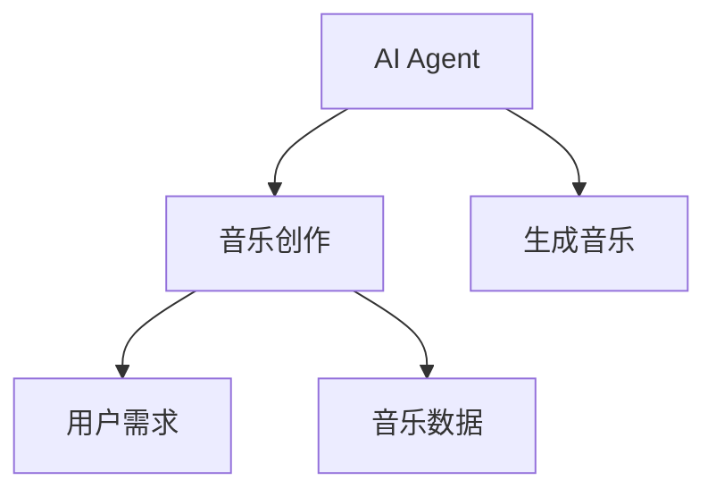
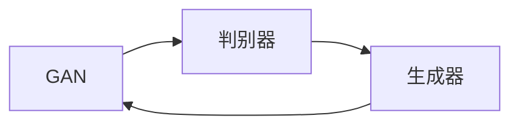
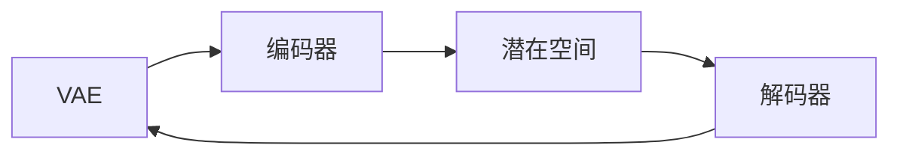
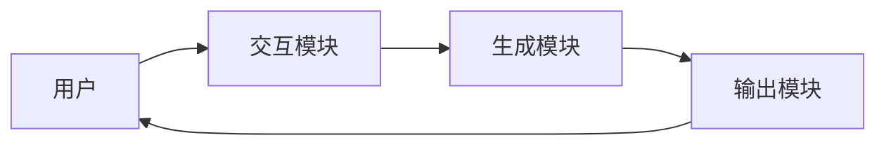
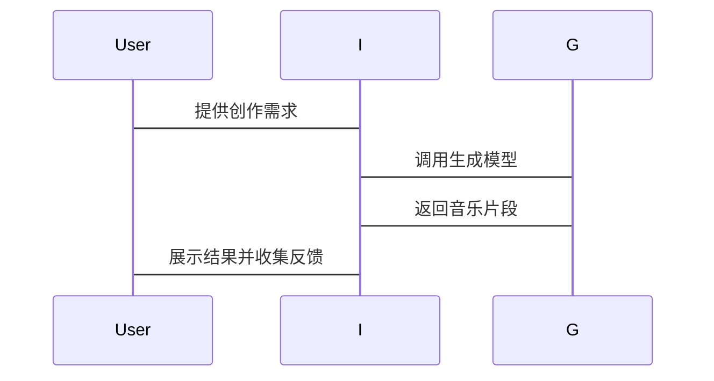

                 


# AI Agent在音乐创作中的辅助角色

## 关键词：AI Agent, 音乐创作, 生成对抗网络, 变分自编码器, 音乐生成, 人工智能

## 摘要：AI Agent在音乐创作中充当辅助角色，通过生成对抗网络和变分自编码器等算法，帮助创作者生成旋律、编曲和和声。本文系统地介绍AI Agent的原理、算法、系统架构，并通过项目实战展示其应用，最后总结最佳实践和未来方向。

---

# 第一部分：AI Agent与音乐创作的背景介绍

## 第1章：AI Agent的基本概念

### 1.1 什么是AI Agent？
- AI Agent的定义：智能体通过感知环境并采取行动以实现目标。
- AI Agent的核心特点：自主性、反应性、目标导向、社交能力。
- AI Agent的分类：简单反射型、基于模型的反应型、目标驱动型、效用驱动型。

### 1.2 音乐创作的基本概念
- 音乐创作的定义：将情感和想法转化为音乐作品的过程。
- 音乐创作的流程：灵感捕捉、旋律创作、编曲、制作与混音。
- 音乐创作中的技术挑战：创作瓶颈、技术复杂性和个性化需求。

### 1.3 AI Agent在音乐创作中的应用背景
- 技术发展的推动：深度学习和生成模型的进步。
- 音乐创作的需求与痛点：创作者需要工具辅助灵感和效率。
- AI Agent的优势与潜力：提供个性化建议、加速创作流程、突破技术限制。

---

## 第2章：AI Agent在音乐创作中的核心概念与联系

### 2.1 AI Agent的核心原理
- 感知模块：通过输入数据（如 MIDI 或音频）提取特征。
- 决策模块：生成音乐片段并评估质量。
- 执行模块：输出生成的音乐并根据反馈优化。

### 2.2 音乐创作中的AI Agent模型
- GAN模型：生成器与判别器的对抗训练。
- VAE模型：通过重构和分布建模生成音乐。
- Transformer模型：基于自注意力机制生成序列。

### 2.3 AI Agent与音乐创作的实体关系图


---

# 第二部分：AI Agent音乐创作的算法原理

## 第3章：基于生成对抗网络（GAN）的音乐生成

### 3.1 GAN的基本原理
- 生成器与判别器的对抗训练：生成器试图欺骗判别器，使其认为生成的数据是真实的。

### 3.2 音乐生成中的GAN架构
- 使用MuseNet或Magenta等模型进行旋律生成。

### 3.3 GAN的训练流程


### 3.4 GAN的损失函数
$$\mathcal{L}_{\text{GAN}} = \mathcal{L}_{\text{D}} + \mathcal{L}_{\text{G}}$$

## 第4章：基于变分自编码器（VAE）的音乐生成

### 4.1 VAE的基本原理
- 通过编码器和解码器对数据进行重构。

### 4.2 音乐生成中的VAE架构
- 使用VAE生成 MIDI 序列。

### 4.3 VAE的训练流程


### 4.4 VAE的损失函数
$$\mathcal{L}_{\text{VAE}} = \mathcal{L}_{\text{recon}} + \mathcal{L}_{\text{KL}}$$

---

# 第三部分：AI Agent音乐创作的系统架构设计

## 第5章：音乐创作的场景与系统功能设计

### 5.1 音乐创作场景
- 用户输入创作需求，AI Agent生成音乐片段。

### 5.2 系统功能设计
- 音乐生成模块：基于模型生成旋律。
- 反馈优化模块：根据用户反馈调整生成结果。
- 用户交互模块：提供可视化界面和实时反馈。

### 5.3 系统架构图


---

## 第6章：系统接口与交互流程图

### 6.1 系统接口设计
- 用户输入：创作主题和风格。
- 系统输出：生成的音乐片段。

### 6.2 交互流程图


---

# 第四部分：AI Agent音乐创作的项目实战

## 第7章：环境安装与代码实现

### 7.1 环境安装
- Python 3.8+
- TensorFlow或Keras
- MIDI处理库（如pretty_midi）

### 7.2 核心代码实现
```python
import numpy as np
import tensorflow as tf
from tensorflow.keras import layers

# 定义生成器模型
def build_generator(input_dim, output_dim):
    model = tf.keras.Sequential()
    model.add(layers.Dense(256, activation='relu', input_dim=input_dim))
    model.add(layers.Dense(output_dim, activation='sigmoid'))
    return model

# 定义判别器模型
def build_discriminator(input_dim):
    model = tf.keras.Sequential()
    model.add(layers.Dense(256, activation='relu', input_dim=input_dim))
    model.add(layers.Dense(1, activation='sigmoid'))
    return model
```

### 7.3 代码解读与优化
- 生成器将潜在向量映射到音乐空间。
- 判别器区分真实与生成的样本。

---

## 第8章：案例分析与效果展示

### 8.1 案例分析
- 输入创作主题：悲伤的钢琴独奏。
- 生成过程：模型生成多个候选片段，用户选择最佳结果。

### 8.2 生成效果展示
- MIDI文件生成与播放。
- 生成音乐的质量评估。

---

# 第五部分：最佳实践与总结

## 第9章：最佳实践

### 9.1 数据质量的重要性
- 使用高质量的训练数据提升生成效果。

### 9.2 模型调参技巧
- 调整学习率和批量大小优化训练效果。

### 9.3 用户反馈的重要性
- 根据用户反馈持续优化模型。

## 第10章：总结与展望

### 10.1 全书总结
- AI Agent在音乐创作中的潜力与应用场景。

### 10.2 未来展望
- 多模态生成模型的发展。
- 实时协作创作的可能性。

---

# 结语

AI Agent正在改变音乐创作的方式，通过本文的系统介绍，读者可以深入了解其原理和应用，并通过项目实战掌握实际操作技巧。未来，随着技术的进步，AI Agent在音乐创作中的角色将更加重要。

