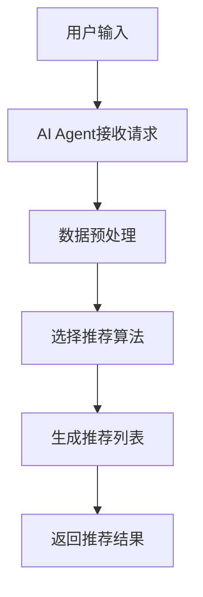
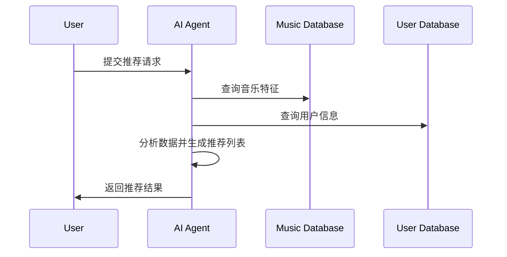

                 


# AI Agent在音乐推荐中的个性化算法

> 关键词：AI Agent，音乐推荐，个性化推荐，算法实现，协同过滤，深度学习，音乐推荐系统

> 摘要：本文详细探讨了AI Agent在音乐推荐中的个性化算法，从背景、算法原理到系统设计和项目实现，全面分析了如何利用AI技术提升音乐推荐的个性化和智能化。文章结合理论与实践，通过具体代码实现和案例分析，总结了AI Agent在音乐推荐中的优势和应用前景。

---

# 第一部分: AI Agent与音乐推荐系统概述

## 第1章: AI Agent与音乐推荐系统概述

### 1.1 AI Agent的基本概念
- **AI Agent的定义**：AI Agent是具有感知环境、执行任务和自适应能力的智能体。在音乐推荐中，AI Agent通过分析用户行为和音乐数据，提供个性化推荐。
- **AI Agent的特点**：
  - 智能性：能够理解用户需求和音乐特征。
  - 自适应性：根据反馈动态调整推荐策略。
  - 可解释性：推荐过程可被用户理解和信任。
- **AI Agent与传统推荐系统的区别**：
  | 特性           | AI Agent                          | 传统推荐系统                 |
  |----------------|-----------------------------------|------------------------------|
  | 数据来源       | 用户行为、音乐特征、社交数据     | 用户行为数据                 |
  | 算法复杂度     | 高（深度学习、强化学习）         | 中等（协同过滤、矩阵分解）   |
  | 个性化程度     | 高                                | 中等                        |

### 1.2 音乐推荐系统的背景与现状
- **音乐推荐系统的定义**：通过算法分析用户行为和音乐属性，提供个性化音乐建议的系统。
- **音乐推荐系统的分类**：
  - **基于协同过滤**：利用用户行为数据进行推荐。
  - **基于内容过滤**：分析音乐本身的特征（如音调、节奏）进行推荐。
  - **混合推荐**：结合协同过滤和内容过滤的优点。
- **当前音乐推荐系统的挑战与机遇**：
  - **挑战**：数据稀疏性、冷启动问题、用户偏好变化。
  - **机遇**：AI技术的进步（如深度学习、强化学习）为音乐推荐带来新方法。

### 1.3 AI Agent在音乐推荐中的应用前景
- **AI Agent在音乐推荐中的优势**：
  - 能够结合多模态数据（如用户行为、音乐特征、社交数据）进行推荐。
  - 具备自适应能力，能够根据用户反馈动态优化推荐策略。
- **音乐推荐系统的智能化发展趋势**：
  - 引入AI Agent后，推荐系统将更加智能化和个性化。
  - 能够实时响应用户需求，提供更精准的音乐推荐。
- **个性化推荐在音乐产业中的重要性**：
  - 提高用户满意度和粘性。
  - 帮助音乐平台发现新兴音乐人和歌曲。

### 1.4 本章小结
本章介绍了AI Agent的基本概念和音乐推荐系统的背景与现状，分析了AI Agent在音乐推荐中的优势和应用前景，为后续章节奠定了基础。

---

# 第二部分: AI Agent与音乐推荐的核心概念

## 第2章: AI Agent与音乐推荐的核心概念

### 2.1 AI Agent的基本原理
- **AI Agent的行为驱动机制**：通过感知环境、目标设定和行动选择来完成推荐任务。
- **AI Agent的学习与自适应能力**：通过机器学习算法（如强化学习）不断优化推荐策略。
- **AI Agent的决策过程**：
  1. 收集用户行为数据。
  2. 分析用户偏好和音乐特征。
  3. 生成推荐列表并返回用户。

### 2.2 音乐推荐系统的原理
- **音乐推荐系统的数据流**：用户行为数据（如播放、收藏）和音乐特征数据（如音调、节奏）共同驱动推荐过程。
- **音乐推荐系统的算法选择**：基于AI Agent的推荐系统通常结合协同过滤和深度学习算法。
- **音乐推荐系统的评价指标**：
  - 准确率（Precision）：推荐列表中相关项的比例。
  - 召回率（Recall）：推荐系统覆盖用户需求的能力。
  - F1分数（F1 Score）：准确率和召回率的调和平均数。

### 2.3 AI Agent与音乐推荐系统的结合
- **AI Agent在音乐推荐中的角色定位**：作为推荐系统的智能核心，负责数据处理、算法选择和推荐结果优化。
- **AI Agent与音乐推荐系统的交互流程**：
  1. 用户向AI Agent发送推荐请求。
  2. AI Agent分析用户行为和音乐数据。
  3. AI Agent生成推荐列表并返回用户。
- **AI Agent在个性化推荐中的作用**：
  - 通过深度学习模型捕捉用户偏好。
  - 利用强化学习优化推荐策略。

### 2.4 核心概念对比表格
| 概念       | AI Agent特点 | 音乐推荐系统特点 |
|------------|--------------|-----------------|
| 数据来源   | 多模态数据   | 用户行为数据     |
| 算法复杂度 | 高（深度学习）| 中等（协同过滤） |
| 个性化程度 | 高           | 中等            |

### 2.5 ER实体关系图
```mermaid
er
actor(AI Agent) -|> action:执行推荐操作
actor(User) --> action:产生推荐请求
```

### 2.6 本章小结
本章详细讲解了AI Agent的基本原理和音乐推荐系统的原理，分析了AI Agent在音乐推荐中的角色和作用，并通过对比表格和ER实体关系图进一步明确了两者的核心概念和联系。

---

# 第三部分: AI Agent在音乐推荐中的算法原理

## 第3章: AI Agent在音乐推荐中的算法原理

### 3.1 协同过滤算法
- **基于用户的协同过滤**：通过寻找与用户兴趣相似的用户群体，推荐这些用户喜欢的音乐。
- **基于物品的协同过滤**：通过分析音乐之间的相似性，推荐与用户已听音乐相似的歌曲。
- **协同过滤的优缺点**：
  - 优点：实现简单，适合数据稀疏性问题。
  - 缺点：计算复杂度高，难以处理大规模数据。

### 3.2 基于深度学习的推荐算法
- **神经网络在音乐推荐中的应用**：通过多层神经网络提取音乐和用户的深层特征。
- **卷积神经网络（CNN）在音乐推荐中的应用**：用于音乐特征的提取和模式识别。
- **循环神经网络（RNN）在音乐推荐中的应用**：处理时间序列数据，捕捉用户的听歌习惯。

### 3.3 基于矩阵分解的推荐算法
- **矩阵分解的基本原理**：将用户-音乐评分矩阵分解为用户特征矩阵和音乐特征矩阵。
- **基于矩阵分解的音乐推荐实现**：通过矩阵分解找到用户和音乐之间的潜在关系。
- **矩阵分解的优缺点**：
  - 优点：能够处理数据稀疏性问题，计算效率高。
  - 缺点：难以解释推荐结果，不适合实时推荐。

### 3.4 算法流程图


### 3.5 本章小结
本章详细介绍了AI Agent在音乐推荐中的几种核心算法，包括协同过滤、深度学习和矩阵分解，并通过流程图展示了推荐系统的整体流程。

---

# 第四部分: 音乐推荐系统的数学模型与公式

## 第4章: 音乐推荐系统的数学模型与公式

### 4.1 协同过滤算法的数学模型
- **基于用户的协同过滤公式**：
  $$ sim(u, v) = \frac{\sum_{i=1}^{n} (r_{u,i} - \bar{r}_u)(r_{v,i} - \bar{r}_v)}{\sqrt{\sum_{i=1}^{n} (r_{u,i} - \bar{r}_u)^2} \sqrt{\sum_{i=1}^{n} (r_{v,i} - \bar{r}_v)^2}} $$
  其中，$sim(u, v)$表示用户u和v之间的相似度，$\bar{r}_u$表示用户u的平均评分。

### 4.2 基于深度学习的推荐算法公式
- **神经网络模型**：
  $$ y = f(Wx + b) $$
  其中，$W$是权重矩阵，$x$是输入向量，$b$是偏置项，$f$是激活函数。
- **卷积神经网络（CNN）公式**：
  $$ conv(x) = ReLU(Wx + b) $$
  其中，$ReLU$是激活函数，$W$是卷积核权重，$x$是输入数据。

### 4.3 矩阵分解算法公式
- **矩阵分解公式**：
  $$ R = P \times Q $$
  其中，$R$是用户-音乐评分矩阵，$P$是用户特征矩阵，$Q$是音乐特征矩阵。

### 4.4 本章小结
本章通过数学公式详细讲解了音乐推荐系统中的几种核心算法，包括协同过滤、深度学习和矩阵分解，并通过公式展示了它们的实现原理。

---

# 第五部分: 系统分析与架构设计方案

## 第5章: 系统分析与架构设计方案

### 5.1 问题场景介绍
- **目标用户**：音乐爱好者、音乐平台。
- **核心需求**：个性化音乐推荐、实时推荐、精准推荐。

### 5.2 系统功能设计
- **领域模型**：
  ```mermaid
  classDiagram
  class User {
    id
    listening_history
    preferences
  }
  class Music {
    id
    title
    artist
    genre
  }
  class AI Agent {
    receive_request()
    analyze_data()
    generate_recommendation()
  }
  User --> AI Agent: 提交推荐请求
  AI Agent --> Music: 生成推荐列表
  ```

### 5.3 系统架构设计
- **系统架构图**：
  ```mermaid
  box "AI Agent" {
    + receive_request()
    + analyze_data()
    + generate_recommendation()
  }
  box "Music Database" {
    + get_music_features()
  }
  box "User Database" {
    + get_user_profile()
  }
  AI Agent --> Music Database: 查询音乐特征
  AI Agent --> User Database: 查询用户信息
  ```

### 5.4 系统接口设计
- **推荐请求接口**：
  ```python
  def recommend_music(user_id):
      # 获取用户信息
      user_profile = get_user_profile(user_id)
      # 获取音乐特征
      music_features = get_music_features()
      # 生成推荐列表
      recommendations = generate_recommendation(user_profile, music_features)
      return recommendations
  ```

### 5.5 系统交互流程图


### 5.6 本章小结
本章通过系统分析和架构设计，展示了AI Agent音乐推荐系统的整体架构和核心功能，为后续的项目实现奠定了基础。

---

# 第六部分: 项目实战

## 第6章: 项目实战：AI Agent音乐推荐系统实现

### 6.1 环境安装
- **Python 3.8及以上版本**
- **安装依赖库**：
  ```bash
  pip install numpy scikit-learn tensorflow-pykerberos
  ```

### 6.2 系统核心实现源代码
```python
import numpy as np
from sklearn.metrics.pairwise import cosine_similarity
from tensorflow.keras.models import Sequential
from tensorflow.keras.layers import Dense, Activation

# 数据预处理
def preprocess_data(data):
    # 假设data是用户-音乐评分矩阵
    return normalized_data

# 协同过滤算法实现
def collaborative_filtering(preprocessed_data):
    # 计算相似度矩阵
    similarity = cosine_similarity(preprocessed_data)
    return similarity

# 神经网络模型实现
def neural_network_model(input_dim):
    model = Sequential()
    model.add(Dense(64, activation='relu', input_dim=input_dim))
    model.add(Dense(1, activation='sigmoid'))
    model.compile(optimizer='adam', loss='binary_crossentropy', metrics=['accuracy'])
    return model

# 推荐系统实现
def ai_agent_recommendation(user_id, data):
    # 获取用户特征和音乐特征
    user_features = get_user_features(user_id)
    music_features = get_music_features()
    # 训练神经网络模型
    model = neural_network_model(len(user_features))
    model.fit(user_features, music_features, epochs=10, batch_size=32)
    # 生成推荐列表
    recommendations = generate_recommendations(user_id, model)
    return recommendations

# 生成推荐列表
def generate_recommendations(user_id, model):
    # 获取所有音乐特征
    all_music_features = get_all_music_features()
    # 预测推荐结果
    predictions = model.predict(all_music_features)
    # 根据预测结果生成推荐列表
    recommendations = []
    for i in range(len(all_music_features)):
        if predictions[i] > 0.5:
            recommendations.append(all_music_features[i])
    return recommendations
```

### 6.3 代码应用解读与分析
- **数据预处理**：对用户-音乐评分矩阵进行归一化处理，确保模型输入的数据格式一致。
- **协同过滤算法**：通过计算用户之间的相似度，找到相似用户的音乐偏好，生成推荐列表。
- **神经网络模型**：通过训练神经网络模型，提取用户和音乐的深层特征，生成推荐列表。

### 6.4 实际案例分析
- **案例背景**：用户A喜欢听流行音乐，但最近也开始关注摇滚音乐。
- **推荐过程**：
  1. 系统分析用户A的听歌历史和偏好。
  2. 通过协同过滤找到与用户A相似的用户群体。
  3. 通过神经网络模型预测用户A可能喜欢的摇滚音乐。
  4. 生成推荐列表并返回用户A。

### 6.5 项目小结
本章通过具体代码实现和案例分析，展示了AI Agent音乐推荐系统的实现过程，从数据预处理到算法实现，再到推荐结果生成，详细讲解了推荐系统的实现步骤。

---

# 第七部分: 优化建议与未来展望

## 第7章: 优化建议与未来展望

### 7.1 系统优化建议
- **数据优化**：
  - 增加音乐特征维度（如歌词情感分析、音乐风格分类）。
  - 引入社交数据（如好友的听歌习惯）。
- **算法优化**：
  - 结合多种推荐算法（如协同过滤和深度学习）。
  - 引入强化学习优化推荐策略。
- **性能优化**：
  - 优化算法计算效率，减少推荐响应时间。
  - 利用分布式计算处理大规模数据。

### 7.2 未来展望
- **AI Agent在音乐推荐中的未来应用**：
  - 实时推荐：根据用户的实时行为动态调整推荐策略。
  - 多模态推荐：结合音乐、视频、文本等多种媒体形式进行推荐。
  - 情感化推荐：通过分析用户情感状态，推荐符合用户情绪的音乐。

### 7.3 本章小结
本章提出了AI Agent音乐推荐系统的优化建议，并展望了未来的发展方向，为读者提供了进一步研究和实践的参考。

---

# 结语

本文系统地探讨了AI Agent在音乐推荐中的个性化算法，从理论到实践，详细分析了如何利用AI技术提升音乐推荐的个性化和智能化。通过具体代码实现和案例分析，展示了AI Agent音乐推荐系统的实现过程。未来，随着AI技术的不断发展，AI Agent在音乐推荐中的应用将更加广泛和深入。

---

**END**

