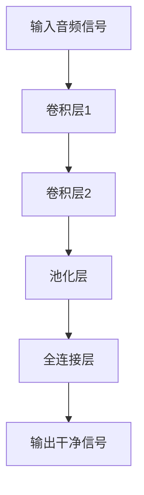
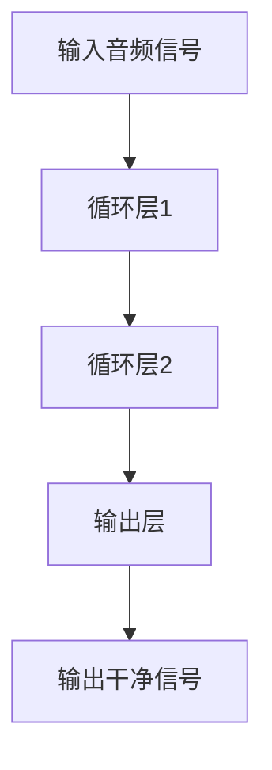
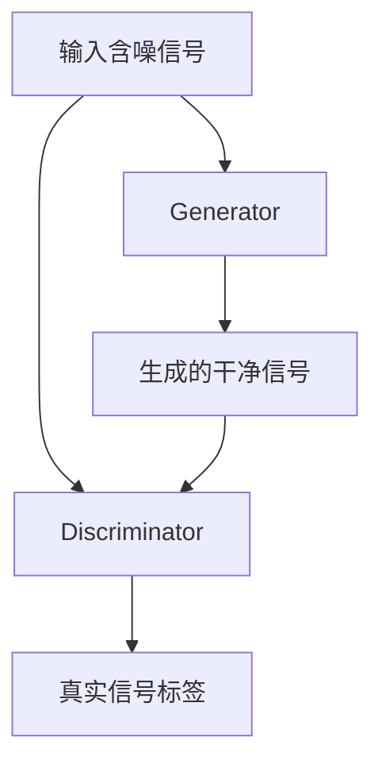
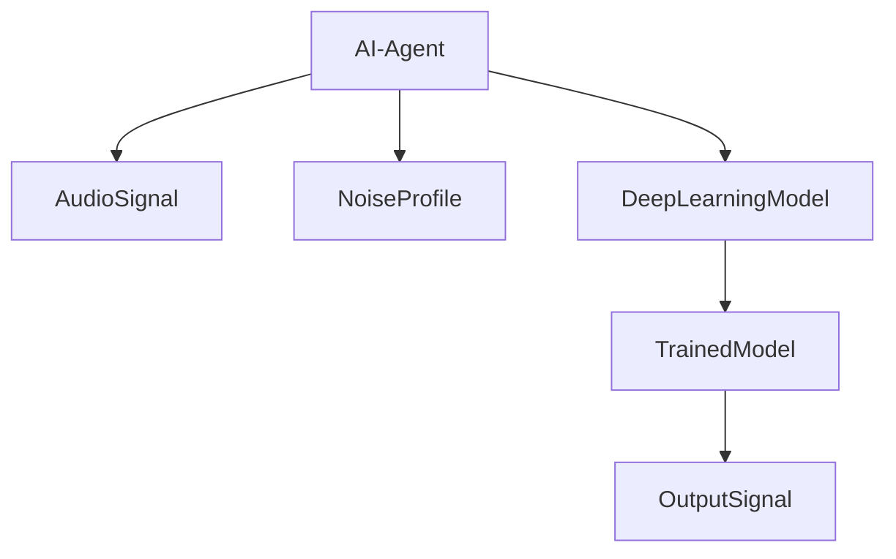
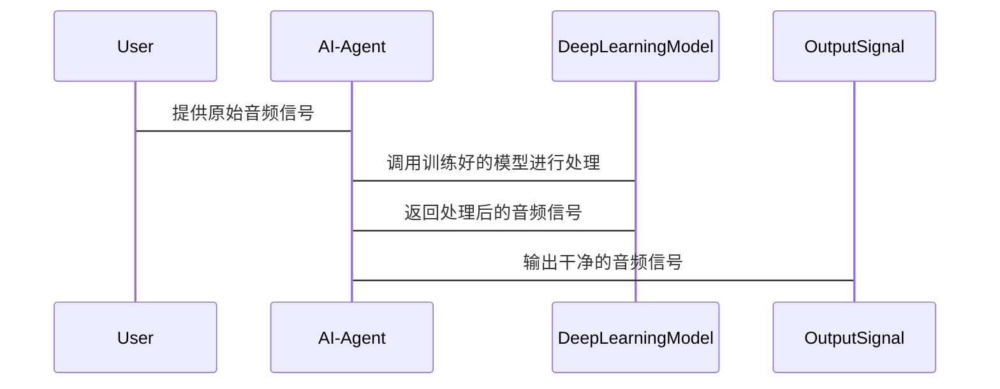

                 


# AI Agent在音频处理中的应用：噪声消除与音质增强

> 关键词：AI Agent，音频处理，噪声消除，音质增强，深度学习，神经网络

> 摘要：本文深入探讨了AI Agent在音频处理中的应用，特别是噪声消除和音质增强的技术细节。通过分析背景、核心概念、算法原理、系统架构设计以及实际项目案例，本文详细阐述了AI Agent如何通过深度学习模型提升音频质量，为音频处理技术的发展提供了新的视角和解决方案。

---

## 第一部分: AI Agent在音频处理中的背景与基础

### 第1章: AI Agent与音频处理概述

#### 1.1 AI Agent的基本概念

##### 1.1.1 AI Agent的定义
AI Agent（人工智能代理）是指能够感知环境并采取行动以实现目标的智能实体。它可以是软件程序，也可以是嵌入式系统，通过传感器接收输入，利用算法处理信息，并通过执行器输出结果。

##### 1.1.2 AI Agent的核心特征
- **自主性**：能够自主决策和行动。
- **反应性**：能实时感知并响应环境变化。
- **目标导向**：所有行动都以实现特定目标为导向。
- **学习能力**：能够通过经验改进性能。

##### 1.1.3 AI Agent与传统音频处理的区别
传统音频处理主要依赖手动设定的滤波器和算法，而AI Agent能够通过机器学习自动优化处理策略，适应不同环境和输入信号。

#### 1.2 音频处理的基本原理

##### 1.2.1 音频信号的特性
音频信号是由一系列波形组成的，每个波形代表不同的声音。音频处理的目标是改善声音的质量，使其更清晰或更符合特定需求。

##### 1.2.2 音频处理的主要技术
- **采样与量化**：将连续的模拟信号转换为数字信号。
- **滤波**：通过频率或时间域操作消除不需要的成分。
- **压缩与扩展**：调整音频的动态范围。
- **降噪**：去除背景噪声，提升音质。

##### 1.2.3 噪声与音质增强的定义
噪声消除是指通过算法去除音频中的不需要的声音成分，而音质增强则是指提升音频的整体听感，使其更清晰、更自然。

#### 1.3 AI在音频处理中的应用现状

##### 1.3.1 AI在音频处理中的优势
- **自适应性**：AI能够根据环境变化自动调整处理策略。
- **高精度**：通过深度学习，AI可以实现比传统方法更高的处理精度。
- **实时性**：现代AI算法能够在实时处理中保持高性能。

##### 1.3.2 当前AI音频处理的主要应用领域
- **语音识别**：如智能音箱和手机语音助手。
- **音乐制作**：如自动混音和效果处理。
- **视频会议**：如实时降噪和回声消除。

##### 1.3.3 AI音频处理的未来发展趋势
随着深度学习和神经网络技术的不断进步，AI在音频处理中的应用将更加广泛和智能化，包括实时音频修复、个性化音质增强等。

---

### 第2章: AI Agent在音频处理中的核心概念

#### 2.1 AI Agent与音频处理的核心联系

##### 2.1.1 AI Agent在音频处理中的角色
AI Agent在音频处理中充当智能处理引擎，负责接收原始音频信号，分析并处理噪声，最终输出高质量的音频信号。

##### 2.1.2 AI Agent如何实现噪声消除
AI Agent通过训练深度学习模型，识别并去除音频中的噪声成分，保留有用信号。

##### 2.1.3 AI Agent如何提升音质
AI Agent利用复杂的神经网络结构，对音频信号进行非线性处理，提升音质，使声音更清晰、更自然。

#### 2.2 核心概念原理

##### 2.2.1 信号处理的基本原理
信号处理是将输入信号通过算法转化为更易理解和更具可用性的形式。在音频处理中，这通常涉及降噪、增强和压缩等步骤。

##### 2.2.2 AI算法的基本原理
AI算法，特别是深度学习，通过多层神经网络结构，从数据中自动学习特征，无需手动设定规则。

##### 2.2.3 AI Agent在音频处理中的工作流程
1. 接收原始音频信号。
2. 使用深度学习模型分析信号特征。
3. 识别并去除噪声。
4. 调整音频参数以提升音质。
5. 输出处理后的音频信号。

#### 2.3 核心概念属性特征对比

##### 2.3.1 噪声消除与音质增强的对比

| 特性         | 噪声消除                          | 音质增强                          |
|--------------|-----------------------------------|-----------------------------------|
| 目标         | 去除不需要的声音成分               | 提升声音的整体质量                 |
| 方法         | 使用滤波器、噪声门限等            | 使用均衡器、动态处理等             |
| 应用场景       | 电话会议、语音识别               | 音乐制作、视频会议                |

##### 2.3.2 AI Agent与传统音频处理方法的对比

| 特性         | AI Agent                          | 传统方法                          |
|--------------|-----------------------------------|-----------------------------------|
| 处理方式       | 基于深度学习的自动处理             | 基于预设规则的手动处理             |
| 灵活性         | 高，能够自适应不同环境             | 低，处理策略固定                   |
| 处理效果       | 更高，能够处理复杂噪声             | 较低，处理简单噪声                 |

##### 2.3.3 不同AI模型在音频处理中的性能对比

| 模型类型       | 卷积神经网络（CNN）               | 循环神经网络（RNN）               |
|--------------|-----------------------------------|-----------------------------------|
| 处理优势       | 适合处理局部特征                 | 适合处理时序数据                 |
| 应用场景       | 图像处理、降噪                   | 语音识别、音质增强                |

#### 2.4 ER实体关系图

```mermaid
er
actor(AI Agent, "负责处理音频信号")
actor(Audio Signal, "原始音频信号输入")
actor(Noise, "噪声信号")
actor(Audio Output, "处理后的音频信号")
```

---

## 第二部分: 噪声消除与音质增强的算法实现

### 第3章: 基于深度学习的噪声消除算法

#### 3.1 算法原理

##### 3.1.1 基于卷积神经网络（CNN）的噪声消除
CNN通过多层卷积操作，能够有效提取音频信号的空间特征，实现噪声去除。

##### 3.1.2 基于循环神经网络（RNN）的噪声消除
RNN擅长处理时序数据，能够捕捉音频信号的时间特征，适用于语音降噪。

#### 3.2 算法流程

##### 3.2.1 CNN降噪流程图



##### 3.2.2 RNN降噪流程图



#### 3.3 算法实现

##### 3.3.1 Python代码实现

```python
import numpy as np
import tensorflow as tf

# 定义卷积神经网络模型
model = tf.keras.Sequential([
    tf.keras.layers.Conv2D(32, (3, 3), activation='relu', input_shape=(None, 128, 1)),
    tf.keras.layers.MaxPooling2D((2, 2)),
    tf.keras.layers.Conv2D(64, (3, 3), activation='relu'),
    tf.keras.layers.MaxPooling2D((2, 2)),
    tf.keras.layers.Flatten(),
    tf.keras.layers.Dense(128, activation='relu'),
    tf.keras.layers.Dense(1, activation='sigmoid')
])

model.compile(optimizer='adam', loss='binary_crossentropy', metrics=['accuracy'])
```

##### 3.3.2 算法数学模型

降噪模型的损失函数可以表示为：

$$
L = -\frac{1}{N}\sum_{i=1}^{N} \log(P(y_i|x_i))
$$

其中，$P(y_i|x_i)$是模型预测的干净信号概率，$x_i$是输入的含噪信号，$y_i$是对应的干净信号标签。

---

### 第4章: 音质增强的算法实现

#### 4.1 音质增强的核心算法

##### 4.1.1 基于深度学习的音质增强
通过训练生成对抗网络（GAN）或变(autoencoder)模型，实现音质的自动增强。

##### 4.1.2 基于波形网络（WaveNet）的音质增强
WaveNet通过自回归方式生成高质量音频信号，能够处理复杂的音频数据。

#### 4.2 算法实现

##### 4.2.1 基于GAN的音质增强模型



##### 4.2.2 Python代码实现

```python
import numpy as np
import tensorflow as tf

# 定义生成器和判别器
def build_generator():
    model = tf.keras.Sequential([
        tf.keras.layers.Dense(256, activation='relu'),
        tf.keras.layers.Dense(128, activation='relu'),
        tf.keras.layers.Dense(64, activation='relu'),
        tf.keras.layers.Dense(32, activation='relu'),
        tf.keras.layers.Dense(16, activation='relu'),
        tf.keras.layers.Dense(8, activation='relu'),
        tf.keras.layers.Dense(1, activation='sigmoid')
    ])
    return model

def build_discriminator():
    model = tf.keras.Sequential([
        tf.keras.layers.Dense(16, activation='relu'),
        tf.keras.layers.Dense(8, activation='relu'),
        tf.keras.layers.Dense(1, activation='sigmoid')
    ])
    return model

# 初始化模型
generator = build_generator()
discriminator = build_discriminator()

# 编译模型
generator_optimizer = tf.keras.optimizers.Adam(0.0002)
discriminator_optimizer = tf.keras.optimizers.Adam(0.0002)

# 定义损失函数
cross_entropy = tf.keras.losses.BinaryCrossentropy()

# 训练过程
def train_step(input_tensor, target):
    with tf.GradientTape() as tape:
        generated = generator(input_tensor)
        real_output = discriminator(target)
        generated_output = discriminator(generated)

        gen_loss = cross_entropy(tf.ones_like(generated_output), generated_output)
        disc_loss = cross_entropy(tf.ones_like(real_output), real_output) + cross_entropy(tf.zeros_like(generated_output), generated_output)

    generator_grads = tape.gradient(gen_loss, generator.trainable_weights)
    discriminator_grads = tape.gradient(disc_loss, discriminator.trainable_weights)

    generator_optimizer.apply_gradients(zip(generator_grads, generator.trainable_weights))
    discriminator_optimizer.apply_gradients(zip(discriminator_grads, discriminator.trainable_weights))
```

---

## 第三部分: 系统分析与架构设计

### 第5章: 项目背景与系统功能设计

#### 5.1 项目背景
本项目旨在利用AI Agent技术，开发一个高效的音频降噪与音质增强系统，提升用户体验。

#### 5.2 系统功能设计

##### 5.2.1 领域模型类图

```mermaid
classDiagram
    class AI-Agent {
        +input_signal: AudioSignal
        +noise_profile: NoiseProfile
        +output_signal: AudioSignal
        -model: DeepLearningModel
        +process_signal()
        +train_model()
    }
    class AudioSignal {
        +samples: array
        +sample_rate: integer
        +bits_per_sample: integer
    }
    class NoiseProfile {
        +noise_type: string
        +noise_level: float
    }
    class DeepLearningModel {
        +weights: array
        +architecture: string
        +train()
        +predict()
    }
    AI-Agent o DeepLearningModel
    AI-Agent --> AudioSignal
    AI-Agent --> NoiseProfile
```

#### 5.3 系统架构设计

##### 5.3.1 系统架构图



#### 5.4 系统接口设计

##### 5.4.1 输入接口
- **音频输入接口**：接收原始音频信号。
- **噪声配置接口**：配置噪声类型和级别。

##### 5.4.2 输出接口
- **音频输出接口**：输出处理后的音频信号。
- **日志接口**：输出处理过程中的日志信息。

#### 5.5 系统交互流程图



---

## 第四部分: 项目实战

### 第6章: 项目实现与案例分析

#### 6.1 环境安装

##### 6.1.1 安装Python环境
```bash
python --version
pip install numpy tensorflow keras
```

##### 6.1.2 安装依赖库
```bash
pip install numpy==1.21.2
pip install tensorflow==2.6.0
pip install keras==2.6.0
```

#### 6.2 系统核心实现源代码

##### 6.2.1 AI Agent实现代码

```python
class AI-Agent:
    def __init__(self, model):
        self.model = model
        self.input_signal = None
        self.output_signal = None

    def process_signal(self, input_signal):
        self.input_signal = input_signal
        self.output_signal = self.model.predict(self.input_signal)
        return self.output_signal

    def train_model(self, input_data, target_data):
        history = self.model.train(input_data, target_data)
        return history
```

##### 6.2.2 模型训练代码

```python
# 训练数据准备
train_input = np.random.random((1000, 128, 1))
train_target = np.random.random((1000, 1))

# 初始化模型
model = build_model()

# 编译模型
model.compile(optimizer='adam', loss='binary_crossentropy', metrics=['accuracy'])

# 开始训练
history = model.fit(train_input, train_target, epochs=10, batch_size=32)
```

#### 6.3 代码应用解读与分析

##### 6.3.1 AI Agent类解读
AI Agent类负责接收输入信号，调用训练好的模型进行处理，并输出结果。训练模型的方法用于优化模型参数，以提高处理效果。

##### 6.3.2 模型训练解读
模型训练过程包括定义网络结构、编译模型和训练模型。训练数据被分成批次输入，模型通过反向传播优化权重，以最小化损失函数。

#### 6.4 实际案例分析

##### 6.4.1 噪声消除案例
输入一段含有背景噪声的语音信号，AI Agent通过训练好的模型去除噪声，输出清晰的语音信号。

##### 6.4.2 音质增强案例
输入一段低质量的音乐信号，AI Agent通过模型增强音质，输出高质量的音乐信号。

#### 6.5 项目小结
通过实际项目案例，展示了AI Agent在音频处理中的强大能力。模型训练和优化是关键步骤，实际应用中需要根据具体需求调整模型结构和参数。

---

## 第五部分: 总结与展望

### 第7章: 总结与展望

#### 7.1 全文总结
本文详细探讨了AI Agent在音频处理中的应用，特别是噪声消除和音质增强的技术细节。通过分析背景、核心概念、算法原理、系统架构设计以及实际项目案例，本文为AI在音频处理中的应用提供了全面的视角和解决方案。

#### 7.2 未来展望
随着深度学习和神经网络技术的不断进步，AI Agent在音频处理中的应用将更加广泛和智能化。未来的研究方向包括实时音频修复、个性化音质增强、多语言语音识别等。

#### 7.3 最佳实践 tips
- 在训练模型时，确保数据的多样性和代表性。
- 实际应用中，根据具体需求调整模型结构和超参数。
- 定期更新模型，以适应环境的变化和新的数据。

#### 7.4 注意事项
- 处理敏感数据时，注意数据安全和隐私保护。
- 在实际应用中，确保系统的稳定性和可靠性。
- 定期监控模型性能，及时优化和调整。

#### 7.5 拓展阅读
- 《Deep Learning for Speech Enhancement》
- 《Neural Networks for Audio Processing》
- 《Practical Guide to Deep Learning Models for Audio Processing》

---

通过本文的详细讲解和实际案例分析，读者可以深入理解AI Agent在音频处理中的应用，掌握噪声消除和音质增强的核心技术，并能够将其应用到实际项目中，为音频处理技术的发展贡献力量。

