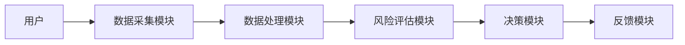

                 


# AI Agent在风险管理中的应用

## 关键词：AI Agent，风险管理，信用风险，市场风险，操作风险，算法，概率论，强化学习，深度学习，系统架构

## 摘要：  
本文深入探讨了AI Agent在风险管理中的应用，从基本概念、核心原理到具体应用场景进行了全面分析。文章首先介绍了风险管理的基本概念和AI Agent的核心功能，然后详细讲解了AI Agent在信用风险、市场风险和操作风险中的应用，并通过实际案例分析了其在不同领域的优势。最后，文章总结了AI Agent在风险管理中的未来发展方向和潜在挑战。

---

# 第一部分: AI Agent与风险管理概述

## 第1章: AI Agent与风险管理的基本概念

### 1.1 风险管理的基本概念  
风险管理是指通过识别、评估和应对各种风险，以降低其对组织或个人目标的影响的过程。它涵盖了金融、企业运营、个人生活等多个领域。  
- **风险的定义**：风险是未来可能发生的事件对目标的影响，通常表现为损失或收益的不确定性。  
- **风险管理的核心要素**：  
  1. **风险识别**：发现潜在风险的来源。  
  2. **风险评估**：量化风险的可能性和影响程度。  
  3. **风险应对**：制定策略以降低风险的影响。  

### 1.2 AI Agent的基本概念  
AI Agent（人工智能代理）是一种能够感知环境、做出决策并采取行动的智能实体。  
- **AI Agent的分类**：  
  1. **基于规则的Agent**：根据预定义的规则执行任务。  
  2. **基于模型的Agent**：通过构建模型来理解和推理环境。  
  3. **基于学习的Agent**：通过数据驱动的方法进行自我改进。  

### 1.3 AI Agent在风险管理中的应用背景  
- **传统风险管理的局限性**：  
  1. 数据处理能力有限。  
  2. 风险评估的主观性。  
  3. 应对策略的滞后性。  
- **AI Agent的优势**：  
  1. 高效的数据处理能力。  
  2. 精准的风险评估与预测。  
  3. 实时的决策与反馈机制。  

---

# 第二部分: AI Agent的核心原理与技术

## 第2章: AI Agent的核心原理  

### 2.1 AI Agent的感知机制  
AI Agent通过感知环境中的数据来理解风险。  
- **数据采集与处理**：  
  1. 从多种来源（如数据库、传感器）获取数据。  
  2. 数据清洗与特征提取。  
- **知识表示**：  
  使用图结构或知识图谱表示风险之间的关系。  

### 2.2 AI Agent的决策机制  
AI Agent基于感知到的信息做出最优决策。  
- **决策模型**：  
  1. **贝叶斯网络**：用于概率推理和风险评估。  
  2. **决策树**：通过树状结构优化决策路径。  
- **多目标优化**：  
  在复杂环境中，AI Agent需要在多个目标之间进行权衡。  

### 2.3 AI Agent的执行与反馈机制  
- **行动规划**：AI Agent根据决策结果制定行动计划。  
- **反馈机制**：通过实时数据反馈优化决策策略。  

---

## 第3章: AI Agent的核心算法与数学模型  

### 3.1 基于概率论的风险评估模型  
- **贝叶斯网络**：用于建模风险之间的依赖关系。  
  例如：$$P(A|B) = \frac{P(B|A)P(A)}{P(B)}$$  
- **马尔可夫链**：用于分析风险的动态变化。  

### 3.2 基于强化学习的决策优化算法  
- **Q-learning算法**：通过试错学习优化决策策略。  
  ```mermaid
  graph LR
  A[状态] --> B[动作]
  B --> C[新状态]
  C --> D[奖励]
  D --> A
  ```

---

# 第三部分: AI Agent在风险管理中的应用场景

## 第4章: 信用风险管理中的AI Agent应用  

### 4.1 信用风险管理的基本框架  
- **信用评分模型**：通过AI Agent评估客户的信用风险。  
- **实时监控**：AI Agent实时跟踪客户的信用状况。  

### 4.2 基于AI Agent的信用风险监控  
- **风险预警**：通过异常检测技术发现潜在风险。  
- **自动化决策**：AI Agent自动调整信用评分模型。  

---

## 第5章: 市场风险管理中的AI Agent应用  

### 5.1 市场风险管理的基本框架  
- **市场风险的量化**：通过波动率等指标评估市场风险。  

### 5.2 基于AI Agent的市场风险管理  
- **时间序列预测**：使用LSTM模型预测市场波动。  
  ```python
  import tensorflow as tf
  model = tf.keras.Sequential([
      tf.keras.layers.LSTM(64, input_shape=(timesteps, features)),
      tf.keras.layers.Dense(1)
  ])
  ```

---

## 第6章: 操作风险管理中的AI Agent应用  

### 6.1 操作风险管理的基本框架  
- **操作风险的识别**：通过日志分析发现潜在风险。  

### 6.2 基于AI Agent的操作风险管理  
- **异常检测**：通过聚类算法识别异常操作。  

---

# 第四部分: 系统架构与项目实战  

## 第7章: 系统架构设计  

### 7.1 问题场景介绍  
- **目标**：构建一个基于AI Agent的风险管理系统。  
- **核心功能**：  
  1. 数据采集与处理。  
  2. 风险评估与预测。  
  3. 决策与反馈。  

### 7.2 系统架构设计  


---

## 第8章: 项目实战  

### 8.1 环境安装  
- **工具**：Python、TensorFlow、Scikit-learn。  

### 8.2 核心实现代码  
```python
def risk_assessment(data):
    # 数据预处理
    processed_data = preprocess(data)
    # 风险评估
    risk_score = model.predict(processed_data)
    return risk_score
```

### 8.3 案例分析  
- **案例**：某银行的信用风险管理系统。  

---

## 第9章: 总结与展望  

### 9.1 总结  
- AI Agent在风险管理中的应用显著提高了风险评估的准确性和效率。  

### 9.2 展望  
- **技术优化**：强化学习与图神经网络的结合。  
- **应用拓展**：AI Agent在更多领域的风险管理中的应用。  

---

## 参考文献  
1. Bishop, C. M. (2006). Pattern Recognition and Machine Learning.  
2. Goodfellow, I., Bengio, Y., & Courville, A. (2016). Deep Learning.  

---

通过本文的详细分析，读者可以全面了解AI Agent在风险管理中的应用，并为实际应用提供参考。

