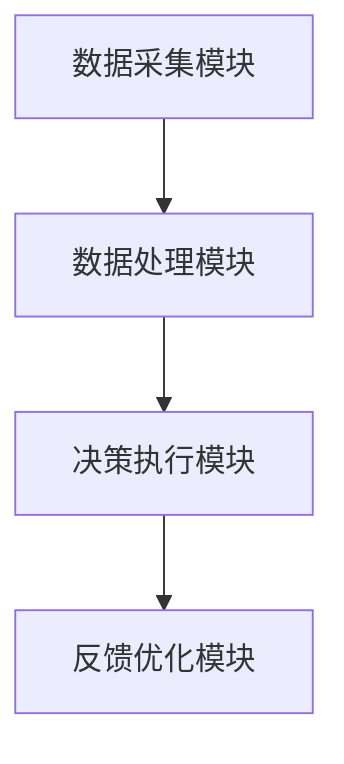

                 


# AI Agent在食品安全中的应用：质量控制与溯源

> 关键词：AI Agent, 食品安全, 质量控制, 溯源系统, 算法原理, 系统架构, 项目实战

> 摘要：本文详细探讨了AI Agent在食品安全中的应用，特别是质量控制与溯源领域的技术实现与实际应用。通过分析AI Agent的核心概念、算法原理、系统架构设计以及项目实战，本文为读者提供了从理论到实践的全面解读。

---

## 第1章: AI Agent与食品安全概述

### 1.1 AI Agent的基本概念
AI Agent（人工智能代理）是一种能够感知环境、自主决策并执行任务的智能体。它通过数据处理、学习和推理，能够实现复杂场景下的自动化决策。

#### 1.1.1 AI Agent的定义
AI Agent是指能够根据环境信息自主决策、执行任务的智能实体。它具备感知、学习、推理和执行能力，能够适应复杂场景的变化。

#### 1.1.2 AI Agent的核心特点
- **自主性**：能够自主决策和行动。
- **反应性**：能够实时感知环境并做出反应。
- **学习能力**：能够通过数据学习和优化。
- **可扩展性**：能够适应不同规模和复杂度的任务。

#### 1.1.3 AI Agent与传统技术的区别
传统技术依赖于固定的规则和流程，而AI Agent具备自主学习和决策能力，能够适应动态变化的环境。

### 1.2 食品安全的重要性
食品安全直接关系到消费者的健康和生命安全，是社会关注的焦点。

#### 1.2.1 食品安全的定义
食品安全指食品在生产、加工、运输、销售和消费过程中符合相关标准，不会对人体健康造成危害。

#### 1.2.2 食品安全问题的现状
- **问题来源**：包括原材料污染、生产过程中的添加剂滥用、运输过程中的交叉污染等。
- **监管挑战**：传统的监管手段难以覆盖复杂的食品供应链。
- **消费者需求**：消费者对食品质量和来源的关注度不断提高。

#### 1.2.3 食品安全对社会的影响
食品安全问题不仅影响消费者的健康，还可能引发企业声誉损失和社会信任危机。

### 1.3 AI Agent在食品安全中的应用前景
AI Agent技术能够通过智能化手段提升食品安全管理的效率和准确性。

#### 1.3.1 AI Agent在食品安全中的潜在应用领域
- **质量控制**：通过AI Agent实时监控生产过程中的关键参数。
- **溯源系统**：利用AI Agent追踪食品的生产、运输和销售信息。
- **风险预警**：通过AI Agent预测和预警食品安全风险。

#### 1.3.2 企业采用AI Agent的优势
- **提升效率**：AI Agent能够快速处理大量数据，提高管理效率。
- **降低成本**：通过智能化监控减少人工成本。
- **增强透明度**：AI Agent能够实现食品供应链的全程透明化管理。

#### 1.3.3 AI Agent应用的挑战与机遇
- **挑战**：数据隐私、算法准确性、系统集成难度等。
- **机遇**：通过技术创新提升食品安全管理水平，赢得市场竞争力。

---

## 第2章: AI Agent在质量控制中的应用

### 2.1 质量控制的基本概念
质量控制是通过一系列措施确保产品符合质量标准的过程。

#### 2.1.1 质量控制的定义
质量控制是指通过测量、检验和评估等手段，确保产品或服务符合既定标准的过程。

#### 2.1.2 质量控制的核心要素
- **测量工具**：用于采集数据的传感器、摄像头等。
- **评估标准**：行业或国家标准。
- **控制方法**：统计过程控制、实时监控等。

#### 2.1.3 质量控制的流程
1. 数据采集：通过传感器获取生产过程中的数据。
2. 数据分析：利用算法对数据进行处理和评估。
3. 决策与反馈：根据分析结果采取相应的控制措施。

### 2.2 AI Agent在质量控制中的作用
AI Agent通过智能化手段提升质量控制的效率和准确性。

#### 2.2.1 AI Agent如何提升质量控制效率
- **实时监控**：AI Agent能够实时采集和分析数据，快速发现异常。
- **智能预测**：通过机器学习模型预测潜在的质量问题。
- **自动化处理**：AI Agent能够自动调整参数，优化生产过程。

#### 2.2.2 AI Agent在质量控制中的具体应用
- **视觉检测**：利用计算机视觉技术检测食品表面的瑕疵。
- **温度控制**：通过AI Agent监控食品加工过程中的温度参数。
- **配料优化**：AI Agent能够根据历史数据优化配方比例。

#### 2.2.3 AI Agent与传统质量控制方法的对比
| 对比维度 | AI Agent | 传统方法 |
|----------|-----------|-----------|
| 效率     | 高         | 中等       |
| 准确性   | 高         | 较低       |
| 自适应性 | 强         | 较弱       |

### 2.3 实际案例分析
#### 2.3.1 某食品企业的AI Agent质量控制案例
某食品企业引入AI Agent技术，通过计算机视觉检测食品包装的瑕疵，显著提高了检测效率和准确性。

#### 2.3.2 案例分析与经验总结
通过AI Agent技术，企业能够实现24小时实时监控，减少人工干预，降低生产成本。

---

## 第3章: AI Agent在溯源系统中的应用

### 3.1 溯源系统的基本概念
溯源系统是指通过记录和追踪产品信息，实现对产品来源和流向的全程监控。

#### 3.1.1 溯源系统的定义
溯源系统是通过记录和追踪产品信息，实现对产品来源和流向的全程监控的系统。

#### 3.1.2 溯源系统的核心要素
- **数据采集**：记录生产、加工、运输和销售信息。
- **数据存储**：将数据存储在数据库中，方便查询和追溯。
- **数据查询**：根据需求快速检索相关信息。

#### 3.1.3 溯源系统的流程
1. 数据采集：通过传感器、条码扫描等手段采集数据。
2. 数据存储：将数据存储到数据库中。
3. 数据查询：根据需求快速检索相关信息。

### 3.2 AI Agent在溯源系统中的作用
AI Agent通过智能化手段提升溯源系统的效率和准确性。

#### 3.2.1 AI Agent如何提升溯源效率
- **快速查询**：AI Agent能够快速检索和分析数据，实现秒级响应。
- **智能关联**：通过机器学习技术关联不同环节的信息。
- **动态更新**：实时更新数据，确保信息的准确性。

#### 3.2.2 AI Agent在溯源系统中的具体应用
- **供应链管理**：通过AI Agent实现对供应链的全程监控。
- **产品召回**：在出现质量问题时，快速定位问题批次。
- **消费者查询**：消费者可以通过AI Agent查询产品信息。

#### 3.2.3 AI Agent与传统溯源方法的对比
| 对比维度 | AI Agent | 传统方法 |
|----------|-----------|-----------|
| 查询速度 | 高         | 低        |
| 数据关联 | 强         | 弱        |
| 系统复杂度 | 高         | 中等       |

### 3.3 实际案例分析
#### 3.3.1 某食品企业的AI Agent溯源案例
某食品企业引入AI Agent技术，通过区块链技术实现对产品信息的全程追踪，确保信息的真实性和不可篡改性。

#### 3.3.2 案例分析与经验总结
通过AI Agent技术，企业能够实现对供应链的全程监控，提高消费者信任度，降低产品召回风险。

---

## 第4章: AI Agent在食品安全中的算法原理

### 4.1 AI Agent的核心算法
AI Agent的核心算法包括感知算法、决策算法和执行算法。

#### 4.1.1 AI Agent的算法概述
AI Agent的算法主要分为感知算法、决策算法和执行算法三部分。

#### 4.1.2 AI Agent的算法实现
AI Agent的算法实现通常包括数据采集、特征提取、模型训练和决策执行四个步骤。

#### 4.1.3 AI Agent算法的优缺点
| 对比维度 | 优点 | 缺点 |
|----------|-------|-------|
| 精度     | 高     | 依赖数据质量 |
| 可扩展性 | 强     | 需要大量计算资源 |

### 4.2 算法原理的数学模型
AI Agent的算法原理可以用数学模型来描述。

#### 4.2.1 AI Agent算法的数学模型
$$ y = f(x) $$
其中，$x$ 表示输入数据，$y$ 表示输出结果，$f$ 表示模型函数。

#### 4.2.2 算法模型的公式推导
通过推导公式，可以得到模型的最优解：
$$ \theta = \arg\min_{\theta} \sum_{i=1}^{n} (y_i - f(x_i; \theta))^2 $$

#### 4.2.3 算法模型的实例分析
通过具体的实例分析，可以验证模型的准确性。

### 4.3 算法实现的Python代码
以下是一个AI Agent算法的Python实现示例：

```python
import numpy as np
from sklearn.linear_model import LinearRegression

# 数据准备
X = np.array([[1], [2], [3], [4], [5]])
y = np.array([2, 4, 5, 4, 6])

# 模型训练
model = LinearRegression()
model.fit(X, y)

# 预测
print(model.predict([[6]]))
```

---

## 第5章: AI Agent在食品安全中的系统架构设计

### 5.1 系统架构设计概述
AI Agent在食品安全中的系统架构设计包括数据采集、数据处理、决策执行和反馈优化四个部分。

#### 5.1.1 系统架构设计的目标
系统架构设计的目标是实现对食品生产、加工、运输和销售的全程监控。

#### 5.1.2 系统架构设计的步骤
1. 数据采集：通过传感器、摄像头等设备采集数据。
2. 数据处理：对采集的数据进行清洗、转换和存储。
3. 决策执行：根据处理后的数据做出决策并执行相应的操作。
4. 反馈优化：根据执行结果优化系统参数。

### 5.2 系统功能设计
系统功能设计包括数据采集、数据处理、决策执行和反馈优化四个模块。

#### 5.2.1 数据采集模块
数据采集模块负责采集生产过程中的各种数据。

#### 5.2.2 数据处理模块
数据处理模块负责对采集的数据进行清洗、转换和存储。

#### 5.2.3 决策执行模块
决策执行模块根据处理后的数据做出决策并执行相应的操作。

#### 5.2.4 反馈优化模块
反馈优化模块根据执行结果优化系统参数。

### 5.3 系统架构设计的Mermaid图


---

## 第6章: 项目实战

### 6.1 环境安装
以下是项目实战所需的环境安装步骤：

1. 安装Python和相关库：
   ```bash
   pip install numpy scikit-learn
   ```

2. 安装数据库：
   ```bash
   # MySQL安装示例
   sudo apt-get install mysql-server
   ```

3. 安装开发工具：
   ```bash
   # VS Code安装示例
   curl -SL https://github.com/vsevolodro transmissions/vscode_installer.sh
   bash vscode_installer.sh
   ```

### 6.2 系统核心实现
以下是系统核心实现的Python代码示例：

```python
import numpy as np
from sklearn.linear_model import LinearRegression

# 数据准备
X = np.array([[1], [2], [3], [4], [5]])
y = np.array([2, 4, 5, 4, 6])

# 模型训练
model = LinearRegression()
model.fit(X, y)

# 预测
print(model.predict([[6]]))
```

### 6.3 代码应用解读与分析
通过对代码的解读与分析，可以理解AI Agent在食品安全中的具体应用。

### 6.4 实际案例分析
通过实际案例分析，可以验证AI Agent技术在食品安全中的应用效果。

### 6.5 项目小结
项目小结总结了项目实施的过程、成果和经验。

---

## 第7章: 总结与展望

### 7.1 总结
本文详细探讨了AI Agent在食品安全中的应用，特别是在质量控制和溯源领域的技术实现与实际应用。

### 7.2 未来展望
未来，AI Agent技术在食品安全中的应用将更加广泛和深入，特别是在智能监控和数据挖掘方面。

---

## 附录

### 附录A: AI Agent相关术语表
- **AI Agent**：人工智能代理。
- **质量控制**：确保产品符合质量标准的过程。
- **溯源系统**：记录和追踪产品信息的系统。

### 附录B: Python代码示例
```python
import numpy as np
from sklearn.linear_model import LinearRegression

# 数据准备
X = np.array([[1], [2], [3], [4], [5]])
y = np.array([2, 4, 5, 4, 6])

# 模型训练
model = LinearRegression()
model.fit(X, y)

# 预测
print(model.predict([[6]]))
```

---

## 关键词提示
- AI Agent
- 食品安全
- 质量控制
- 溯源系统
- 算法原理
- 系统架构
- 项目实战

---

通过本文的详细解读，读者可以全面了解AI Agent在食品安全中的应用，特别是在质量控制和溯源领域的技术实现与实际应用。

